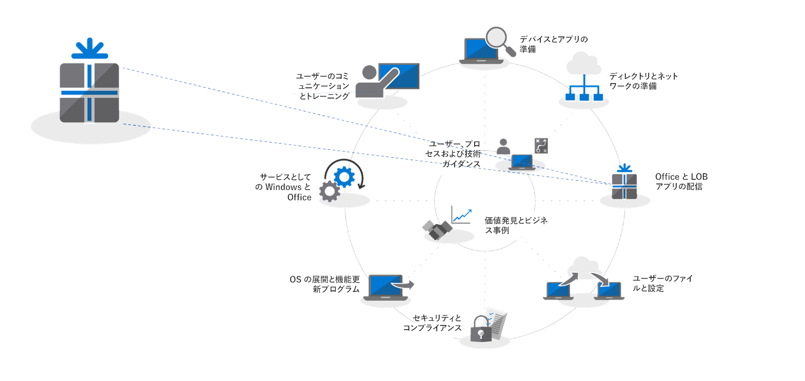
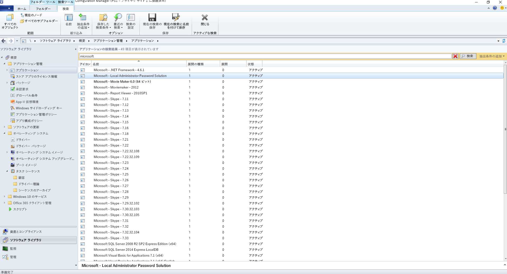
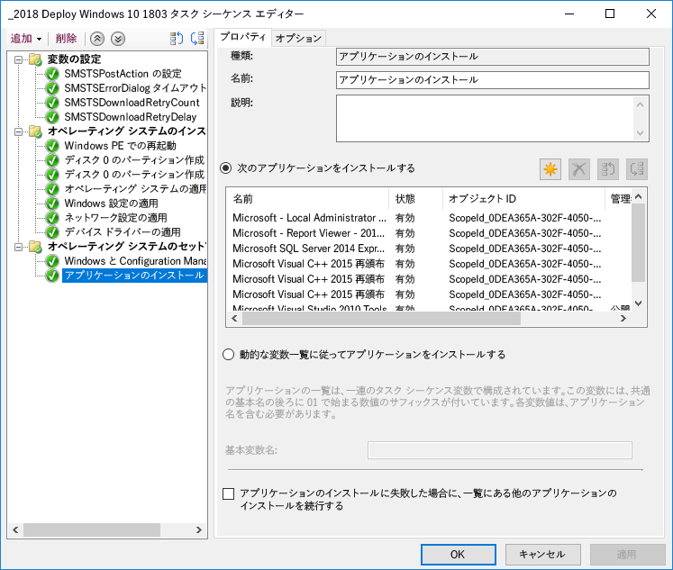
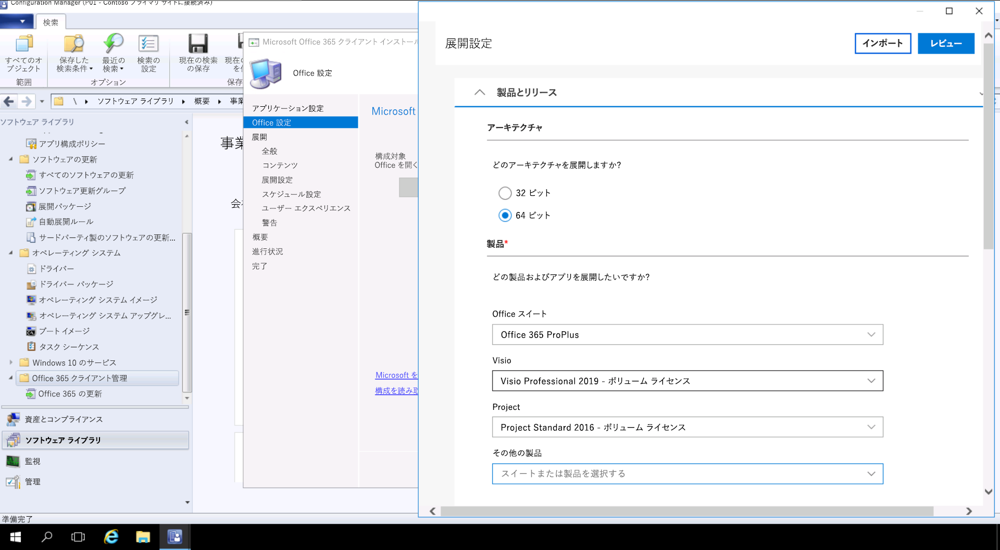

# 手順 3: Office および LOB アプリの配信Step 3: Office and LOB App Delivery

<table>
<thead>
<td></td>
<td>
<strong>手順 3: Office および LOB アプリの配信</strong><strong>Step 3: Office and LOB App Delivery</strong>

目的のアプリがパッケージ化されていて、自動インストールの準備が整っていることを確認してください。Office 365 ProPlus のクイック実行パッケージが、Office アプリケーションの構成、配信および最新状態の維持のための新しいオプションをどのように提供するかについて説明します。Ensure your apps are packaged and ready for automated installation. Learn how Click-to-Run packaging with Office 365 ProPlus gives you new options to configure, deliver and keep your Office apps up-to-date.
</td>
<td></td>
</thead>
</table>

>[!NOTE]
>Office および LOB アプリの配信は、推奨される展開プロセスの輪における 3 番目の手順であり、Office と LOB をインストールおよび管理するためのオプションもこの手順に含まれます。Office and LOB App Delivery is the third step in our recommended deployment process wheel covering the options to install and manage Office and LOB. 展開を正常に行うために、最初の 2 つの手順は必ず実施する必要があります。For successful deployment do not skip the first two steps.  デスクトップ展開プロセス全体を確認するには、「[デスクトップ展開センター](https://aka.ms/HowToShift)」を参照してください。To see the full desktop deployment process, visit the [Desktop Deployment Center](https://aka.ms/HowToShift).
>

この時点で、Office および基幹業務アプリを配信する準備は整っています。そのための方法はいくつかありますが、その中には優れた新しいオプションが含まれています。You are now ready to deliver Office and your Line of Business Apps and there are a number of ways to do this, including some exciting new options. 一部のアプリケーションは 32 ビットまたは 64 ビットのどちらかでコンパイルされたバージョンとしてのみの使用となりますが、それ以外の Office 365 ProPlus などのアプリケーションは 32 ビットおよび 64 ビットでネイティブにコンパイル済みのコードとして使用できるため、展開するバージョンを決めることがとても重要になります。While some applications are only available as either a 32-bit or 64-bit compiled version, others such as Office 365 ProPlus, offer both as 32-bit and 64-bit native compiled code, and one of biggest decisions you will make is which version to deploy. 新しいデバイスで追加の計算能力と RAM を活用するには、32 ビットの依存関係がない場合は 64 ビット バージョンを使用することをお勧めします。To take advantage of additional compute power and RAM on new devices Microsoft recommends using the 64-bit version when there are no 32-bit dependencies. アドインやファイルに関連する互換性の問題を特定するには、先に進む前に「手順 1: デバイスとアプリの準備」を再度確認するようにしてください。To determine any add-in or file-related compatibility challenges you may have it is recommended to revisit Step 1 Device and App Readiness before you continue.

障害になるものがない場合は、Microsoft Office を含めてすべてのアプリの 64 ビット バージョンを展開することをお勧めします。64 ビット ネイティブでコンパイルされたアプリは、最高のパフォーマンスを発揮する、最も将来性のある選択になります。If nothing is blocking you, we recommend you deploy 64-bit versions of all apps, including Microsoft Office. 64-bit native compiled apps offer the best performance and is the most future-proof choice.

Windows にアプリをインストールするための方法とモデルは多数あります。次に、選択可能な配信のオプションについて説明します。There are many methods and models for installing apps on Windows, so let’s look at your delivery options.

[Windows 10 アプリケーションの管理Windows 10 application management](https://docs.microsoft.com/windows/application-management/)

## MSI ベースの展開MSI-based Deployments

基幹業務アプリについては、MSI ベースのパッケージまたは実行可能ファイルを使用して、OS 展開のタスク シーケンスの一部としてアプリをインストールすることになるでしょう。For your line of business apps, you’ll probably use MSI-based packages or executable  and install apps as part of an OS deployment task sequence. そうしたパッケージは、Windows 10 でも引き続き動作します。Windows 10 continues to work with these packages.

Microsoft Endpoint Configuration Manager や Microsoft Intune などのソフトウェア展開ツールも、MSI パッケージ型のアプリを配信するように最適化されています。Windows 10 でアプリを検証していれば、アプリの配信に Microsoft Endpoint Configuration Manager (Current Branch) を使用できます。Microsoft Intune の「ポータル サイト」を使用している場合は、IT 部門によって承認された組織が利用できるアプリの選択を拡張して、最新のアプリケーションを含めるようにすると、ユーザーは必要なものを自分で選択できます。Software deployment tools like System Center Configuration Manager and Microsoft Intune are also optimized to deliver MSI-packaged apps. Once you have validated your apps on Windows 10, you can use System Center Configuration Manager (current branch) for app delivery. If you use the Company Portal in Microsoft Intune you can extend the choice of IT sanctioned apps available to your organization to include the latest applications, and users to self-select what they need.

## PC のイメージングPC Imaging

もう 1 つの一般的なアプリの配信方法は、PC のイメージングです。Another popular method of app delivery is PC imaging. この場合、タスク シーケンスまたは手動のどちらかでサンプル PC にアプリケーションをインストールし、必要なアプリケーションがプレインストールされた状態のシステム イメージをキャプチャします。In this case, applications are either installed via task sequence or manually on a sample PC, then a system image is captured with the required applications pre-installed. ビルドとキャプチャのためのイメージングは、新しい PC のプロビジョニング時に時間を節約することができますが、そのイメージ内のオペレーティング システムとアプリはすぐに古いものになってしまいます。The imaging approach to build and capture can save time when provisioning new PCs but remember operating systems and apps within the image can become stale quickly. Windows 10 および Office 365 ProPlus の累積的な更新プログラム モデルでこの問題に対処することはできますが、完全に解決することはできません。The Cumulative Update model in Windows 10 and Office 365 ProPlus help with this problem, but doesn’t eliminate it completely. そのため、展開時にアプリケーションをイメージの外側からインストールする thin イメージのアプローチをお勧めします。This is why we recommend a thin image approach, where your applications are installed from outside the image at deploy time.

イメージに Office 365 ProPlus を含める必要がある場合は、ユーザー ベースのライセンス認証を使用することになります。システム管理者が事前にライセンス認証することはできません。Office 展開ツールを使用して、イメージングするデバイスに Office をプレインストールして、ユーザー サインインをスキップします。If you do want to include Office 365 ProPlus in your image, remember that this uses a user-based activation; it cannot be pre-activated by the system admin. Use the Office Deployment Tool to pre-install Office on the device you are imaging and skip the user sign-in. イメージが展開されれば、エンドユーザーは自分の Office 365 の資格情報でサインインし、Office 365 ProPlus をアクティブ化することができます。Once the image is deployed end users can sign-in using their Office 365 credentials and activate Office 365 ProPlus.

[オペレーティング システムをインストールするタスク シーケンスの作成Create a Task Sequence to Install an Operating System](https://docs.microsoft.com/configmgr/osd/deploy-use/create-a-task-sequence-to-install-an-operating-system)

[オペレーティング システム イメージの一部としての Office 365 ProPlus の展開Deploy Office 365 ProPlus as part of an operating system image](https://docs.microsoft.com/deployoffice/deploy-office-365-proplus-as-part-of-an-operating-system-image)

## Office クイック実行Office Click-to-Run 

Office 365 ProPlus はクイック実行を使用してインストールします。今後リリースされる Windows の Office 2019 リリースのすべてのバージョンでは、MSI ベースのパッケージではなくクイック実行になります。Office 365 ProPlus is installed using Click-to-Run, and Click-to-Run replaces MSI-based packaging in every version of the upcoming Office 2019 release for Windows. クイック実行には、より速いインストール、より速くて効率的な更新、アンインストールの円滑な実行などの多くの利点があります。It brings with it a number of advantages, including faster installations, faster and more efficient updating, and cleaner uninstallation. 

クイック実行によって配信されたプログラムは、コンピューター上の仮想アプリケーション環境で実行されるため、競合することなく他のアプリケーションと共存することができます。使用するディスク領域は、MSI ベースのパッケージの約半分のみとなります。Programs delivered via Click-to-Run execute in a virtual application environment on your computer and so co-exist with other applications without conflict; they also take about half the disk space they would as an MSI-based package. Office アプリケーションの配信および管理は、Office アプリのダウンロード、構成、カスタマイズに必要な Office セットアップ エンジンである[Office 展開ツール](https://www.microsoft.com/download/details.aspx?id=49117)で行います。Office applications are delivered and managed via the [Office Deployment Tool](https://www.microsoft.com/download/details.aspx?id=49117) which is the Office setup engine needed to download, configure, and customize your Office apps. Office 展開ツールは、Office インストールの構成およびカスタマイズの方法に関するメタデータの処理手順を提供する構成 XML ファイルを読み取ります。The Office Deployment Tool reads a configuration XML file which provides the metadata instructions on how to configure and customization your Office installation.

Microsoft では、展開の設定をカスタマイズして構成 XML ファイルを作成するには、[Office カスタマイズ ツール](https://config.office.com/)を使用することをお勧めします。Microsoft recommends using the [Office Customization Tool](https://config.office.com/) to customize your deployment settings and create your configuration XML file. Office カスタマイズ ツールを使用して、インストールするアプリケーションと言語、アプリケーションの更新方法、アプリケーションの設定、インストール操作を決めることができます。Through the Office Customization Tool you can set which applications and languages will be installed, how the applications will be updated, application preferences, and installation expereince settings.

Configuration Manager は、引き続き Office 365 ProPlus の広範囲の展開に使用できます。Configuration Manager (Current Branch) には、最新版 Office カスタマイズ ツールのネイティブ サポート、インストール時のクイック実行に対応するパッケージのカスタマイズ、およびインストール後のソフトウェア更新管理のネイティブ サポートがあります。If you use System Center Configuration Manager, you can still use it for broad deployment of Office 365 ProPlus. System Center Configuration Manager (current branch) has native support for the updated Office Customization Tool, package customization for Click-to-Run at install time, and native support for software update management post installation.

[Office 365 ProPlus の展開ガイドDeployment Guide for Office 365 ProPlus](https://docs.microsoft.com/deployoffice/deployment-guide-for-office-365-proplus)

[Office 365 ProPlus にアップグレードする際に Office の既存の MSI バージョンを削除するRemove existing MSI versions of Office when upgrading to Office 365 ProPlus](https://docs.microsoft.com/deployoffice/upgrade-from-msi-version)

[Configuration Manager を使用した Office 365 ProPlus の管理Manage Office 365 ProPlus with Configuration Manager](https://docs.microsoft.com/configmgr/sum/deploy-use/manage-office-365-proplus-updates)

[Microsoft Intune で Windows 10 デバイスに Office 365 アプリを割り当てるAssign Office 365 apps to Windows 10 devices with Microsoft Intune](https://docs.microsoft.com/intune/apps-add-office365)

## ブラウザー ベースのアプリBrowser-based Apps

ブラウザー ベースのアプリケーションが引き続き期待どおりに動作するようにするには、いくつかの考慮すべき事項があります。Microsoft Edge との互換性に問題がある特定の Web サイトとアプリがある場合は、エンタープライズ モード サイト一覧を使用することで、その Web サイトが自動的に Internet Explorer 11 で開かれるようになります。There are a few things to consider in order to make sure that your browser-based applications continue to work as expected. If you have specific web sites and apps that you know have compatibility problems with Microsoft Edge, you can use the Enterprise Mode site list so that the web sites will automatically open using Internet Explorer 11.

さらに、イントラネット サイトが Microsoft Edge では正常に動作しなくなることがわかっている場合は、すべてのイントラネット サイトが自動的に Internet Explorer 11 で開かれるように設定することもできます。このプロセスでは、それぞれのサイトに IE11 を使用するかどうかを制御するために XML ファイルを使用します (設定の適用にはグループ ポリシーを使用します)。Additionally, if you know that your intranet sites aren't going to work properly with Microsoft Edge, you can set all intranet sites to open using Internet Explorer 11 automatically. This process uses an XML file to govern whether IE11 is used for each site, using Group Policy to enforce settings.

[エンタープライズ モードとはWhat is Enterprise Mode](https://docs.microsoft.com/internet-explorer/ie11-deploy-guide/what-is-enterprise-mode#what-is-enterprise-mode)

ここまでは、よく知られている展開方法を見てきました。So far, we have covered well known deployment methods. これら以外にも、アプリの新しい展開方法が 2 つありますので、ぜひ検討してみてください。But there are two new approaches to app deployment you may wish to consider.

## ビジネス向け Microsoft StoreMicrosoft Store for Business 

ビジネス向け Microsoft Store には、無料および有料アプリの検索、取得、管理、および Windows 10 デバイスへの配布に関する方法が幅広く用意されています。Microsoft Store for Business provides a flexible way discover, acquire, manage, and distribute free and paid apps to Windows 10 devices at scale. IT 管理者は、必要に応じてライセンスを割り当てて再利用しながら、選択した Microsoft Store アプリを独自のカスタム アプリと共に自分のプライベート ストアに公開できます。As an IT admin, you can publish selected Microsoft Store apps, along with your custom own apps, to your own private store while assigning and re-using licenses as needed. ユーザーはこのストアにのみアクセスすることができ、検索してインストールできるのは承認されたアプリのみとなります。Your users are directed to this store only, and so can only find and install approved apps.

Store アプリは、UWP アプリとしてネイティブにビルドすることも、デスクトップ ブリッジを使用して Store の既存のアプリを再パッケージ化して、Windows 10 の最新のエクスペリエンスを追加することもできます。Windows 10 のエクスペリエンスを際立たせるために使用するコードを除いて、アプリは未変更のまま引き続き完全信頼のユーザー モードで実行されます。Store apps can be natively built as UWP apps or you can use the Desktop Bridge to repackage your existing apps for the Store and add modern experiences for Windows 10. Aside from the code that you use to light up Windows 10 experiences, your app remains unchanged and continues to run in full-trust user mode.

## MSIX コンテナー化MSIX Containerization

アプリケーション パッケージの新しいオプションが MSIX です。A new option for application packaging is MSIX. MSIX では、Windows で利用可能なコンテナー化のテクノロジが駆使されます。MSIX は、クイック実行、UWP、MSI パッケージの強みを持ち合わせています。MSIX uses the containerization technology available in Windows, bringing together the best aspects of Click-to-Run, UWP and MSI packaging. EXE、MSI、APPV、APPX などの既存のインストーラーを MSIX に直接移行するツールを使用すれば、MSIX コンテナー化が、今日使用されている多くのインストール手法が統合されたものであることが分かるはずです。With tools to migrate existing installers like EXE, MSI, APPV and APPX directly to MSIX we see MSIX Containerization provides a unifed path for the many installation technologies in use today. MSIX は、現在のバージョンの Windows でサポートされています。Windows 10 RS5 以降を実行しているデバイスには、MSIX パッケージ アプリのインストールと実行に必要なすべてのものが含まれています。MSIX support is included in current versions of Windows: any device running Windows 10 RS5 or newer includes everything you need to install and run MSIX packaged apps. Windows 10 は、受け入れた MSIX コンテナーを動的に統合しますが、アプリケーションはオペレーティング システムから分離されたままの状態となります。Windows 10 dynamically integrates MSIX containers it receives, while keeping the applications separate from the operating system.

コンテナー化によって、パッケージのアンインストールと削除がクリーンなものになります。これは、システムにアイテムを残してしまうことがある、現在の多くの MSI および EXE ベースのパッケージとは異なります。また、アプリケーションのインストールには標準ユーザーの資格情報のみが必要になります。MSIX コンテナーのインストールには管理者の資格情報は必要ありません。MSIX コンテナーによって、更新も効率的になります。更新プログラムが公開されたときに、ブロック レベルの差分を使用することで、正味の新しいバイナリのみが適用されます。これにより、更新プログラムのペイロードが小さくなり、ネットワーク帯域幅の使用量が減って展開が高速化されます。Containerization means clean uninstall and removal of packages, unlike a lot of MSI and EXE-based packages today that may leave items on the system. It also means only needing Standard User credentials to install applications – you do not have to have Administrator credentials to install MSIX containers. MSIX containers are more efficient to update too. When an update is published, use of block level differentials means only net new binaries are applied, reducing the update payload, for faster deployments consuming less network bandwidth.

MSIX の詳細については、「[MSIX 技術コミュニティ サイト](https://techcommunity.microsoft.com/t5/MSIX/ct-p/MSIX)」を参照してください。You can find more information on MSIX via the [MSIX Tech Community site](https://techcommunity.microsoft.com/t5/MSIX/ct-p/MSIX)

## 次の手順Next Step

## [手順 4: ユーザーのファイルと設定Step 4: User Files and Settings](https://aka.ms/mdd4)

## 前の手順Previous Step

## [手順 2: ディレクトリとネットワークの準備Step 2: Directory and Network Readiness](https://aka.ms/mdd2) 