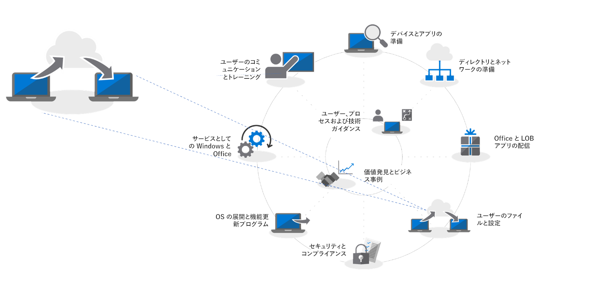

# 手順 4: ユーザーのファイルと設定の移行

ユーザーのファイルと設定を新しい PC や更新した PC に移動することは、重要なプロセスであり、失敗するという選択肢はありません。それぞれの PC を手動で移行することも、複数のプロセスを自動化する方法から 1 つを選択することもできます。どの移行方法を選択したとしても、ユーザーのファイルおよび設定の転送と、Windows 10 の [スタート] およびタスクバーのレイアウトの移行といった 3 つの項目を取り扱うことになります。

<table>
<thead>
<td></td>
<td>
<strong>手順 4: ユーザーのファイルと設定</strong>

PC の更新時または交換時には、ユーザー状態のバックアップと復元を自動化することで時間を節約します。クラウド ファイルの同期に関する新しいオプションを使用すると、ユーザーごとの [デスクトップ]、[ドキュメント] および [ピクチャ] フォルダーの OneDrive への同期が強制実施され、新しい Windows インストールからのシームレスなファイル アクセスが可能になります。
</td>
<td></td>
</thead>
</table>

>[!NOTE]
>これまでに使用していた移行プロセスは引き続き使用できますが、Office 365 ProPlus への移行には OneDrive の「Known Folder Move」(下記参照) の使用をお勧めします。完全なデスクトップ展開プロセスについては、「[モダン デスクトップ展開センター](https://aka.ms/HowToShift)」を参照してください。
>

大規模な展開で、最も扱いにくい、ほとんどが手動によることが多いタスクの 1 は、ユーザーのファイルと設定の転送です。この記事では、新しい PC、更新した PC および再イメージ化した PC にユーザーを移行する際に選択可能なオプションについて説明します。

## 手動による移行

新しい PC や Windows の新しいバージョンに移行するときに、何を保持しておくかについて決定する際に、すべてを保持しておくことを望むユーザーもいれば、ドライブをクリーンアップする機会を得たいと考えるユーザーもいます。このため、一部の IT 部門はユーザー ファイルの移行を手動で処理することに決めて、サポート チームをユーザーの元に派遣したり、ユーザーが自分の PC をサポート チームに引き渡すためのサポート センターを開設したりします。どちらにしても、転送するものと破棄するものの決定にユーザーが関与できます。

これが組織の選択肢の 1 つになるかどうかは、計画している移行の規模によって決まります。明らかなことは、ユーザーと直接作業して、そのニーズを理解し、新しい PC や更新された PC にファイルをコピーするための時間と物には限度があることです。

手動による移行を選択する場合は、そのためのタスクが Windows 7 のサポートが終了する 2020 年 1 月までに完了するかどうかを判断する必要があります。その確信がない場合は、次に示す自動化オプションの 1 つを調べるか、支援のための増員を求めてください。

## USMT を使用した移行の自動化 

大規模な展開の場合は、System Center Configuration Manager や Microsoft Deployment Toolkit (MDT) など、タスク シーケンス ベースの展開自動化ツールを使用することで、プロセスの大部分を自動化できます。どちらのソリューションも、エンドツーエンドの展開プロセスの一部として「ユーザー状態移行ツール (USMT)」を利用します。USMT は [Windows ADK (Windows Assessment and Deployment Kit)](https://docs.microsoft.com/ja-JP/windows-hardware/get-started/adk-install) に含まれています。

USMT は、ユーザー アカウント、オペレーティング システムの設定、およびアプリケーションの設定を取り込んで、新しい Windows インストールに移行します。また、IT 管理者は、移行する内容を正確に制御することも、オプションとして不要なファイルの種類 (オーディオやビデオのファイル、実行可能ファイルなど) を除外することもできます。

移行プロセスでは、一時的な移行ストアとして機能するための十分なサーバー記憶域容量が必要になります。ここで、USMT は 2 つの重要な機能を提供します。1 つ目は、PC ごとに必要になる記憶域の容量の見積もりを出します。2 つ目は、移行ストアを暗号化して、データがファイル サーバーに格納されている間に侵害されるリスクを軽減します。

PC の更新を実行するときにプライマリ Windows パーティションを再フォーマットしない場合は、USMT にハードリンク移行ストアを使用するというオプションも選択できます。このプロセスでは、PC のユーザー状態は保持されますが、古いオペレーティング システムとアプリケーションは削除され更新されます。同じローカル パーティションからの復元プロセスを使用することで、このオプションは、パフォーマンスの大幅な向上と、ネットワーク トラフィックの削減を実現します。

[ユーザー状態移行ツール (USMT) の概要](https://docs.microsoft.com/ja-JP/windows/deployment/usmt/usmt-overview)

## OneDrive の Known Folder Move

ユーザーが OneDrive ユーザーの場合や、今回の展開の一環として OneDrive を追加する場合は、新しいオプションを選択できます。ユーザーのファイルの同期にクラウドを使用することで、OneDrive の「Known Folder Move (既知のフォルダーの移動)」機能は、ローカル ネットワーク ベースのオプションでは不可能なレベルの柔軟性を提供します。この機能を移行前に有効にしておくと、新しい PC または更新した PC に安全にアクセスできるようになります。また、自分のサーバーに一時的な移行ストアを作成する必要もなくなります。さらに、ユーザーにとって完全に透過的になる潜在力もあります。

[Windows の既知のフォルダーを OneDrive にリダイレクトして移動する](https://docs.microsoft.com/ja-JP/onedrive/redirect-known-folders)

既に OneDrive を使用している場合は、ユーザーが OneDrive または SharePoint から自分のデバイスに同期するフォルダーと場所を選択できることがわかるようになりますが、実際には、そのような設定作業がエンド ユーザーに負担をかけることになります。Known Folder Move では、ユーザー プロファイル内の [ドキュメント]、[デスクトップ] および [ピクチャ] フォルダーを対象にして、そのすべてを OneDrive で保護できます。この操作はユーザーが自分で実行することもできますが、このシナリオにとって重要なのは、[グループ ポリシー設定を使用して強制適用](https://docs.microsoft.com/en-us/onedrive/use-group-policy?redirectSourcePath=%252fen-us%252farticle%252fUse-Group-Policy-to-control-OneDrive-sync-client-settings-0ecb2cf5-8882-42b3-a6e9-be6bda30899c)することもできるということです。

Known Folder Move では、ユーザーは自分のワークフローを変更することはありません。OneDrive との同期前、同期中、同期の完了後のいずれの時点でも、まったく変化を感じません。グループ ポリシーを使用することで、ユーザーの [ドキュメント]、[ピクチャ] および [デスクトップ] が OneDrive で保護されていることを、そのユーザーに通知するかどうかも選択できます。通知しないことを選択すると、ダイアログなどの表示なしにバックグラウンドで実行されます。ユーザーは、新しい PC の納品時または PC の更新時にのみ意識することになります。ユーザーが自分の OneDrive アカウントにサインインするとすぐに、該当するファイルが再び使用できるようになり、ユーザーの新しい PC に復元されます。当然のことながら、OneDrive を使用することで、電話などのデバイスからのファイルの安全性をいつでも維持できます。

セキュリティのさらなる強化のために、Azure Active Directory を利用した OneDrive の認証は、簡単に多要素認証の使用を有効化できます。また、ネットワーク アクティビティを制限するために、OneDrive で使用するアップロードおよびダウンロードの帯域幅を制御するポリシーを設定できます。

すべてのユーザーを同時に移行する必要はありません。グループ ポリシー設定のロールアウトを段階化するか、[ドメインに参加している PC にファイルの同期を制限する](https://docs.microsoft.com/en-us/powershell/module/sharepoint-online/Set-SPOTenantSyncClientRestriction?view=sharepoint-ps)ことが必要になる場合があります。

## [スタート] メニューとタスク バーのカスタマイズ

OneDrive は、ファイルとフォルダーを同期して保護することを目的としてます。アプリケーションや Windows の設定を同期するものではありません。そのために、これまではプロファイルをコピーする方法を使用して、ユーザーの [スタート] メニューとタスクバー設定の標準レイアウトを構成していました。Windows 10 Pro、Enterprise、および Education では、グループ ポリシー、MDM、PowerShell またはプロビジョニング パッケージを使用して、[カスタマイズされた [スタート] とタスクバーのレイアウト](https://docs.microsoft.com/ja-JP/windows/configuration/windows-10-start-layout-options-and-policies)を展開できます。再イメージングは不要です。また、レイアウトは、そのレイアウトを含んでいる .xml ファイルを上書きすることで簡単に更新できます。

新しいレイアウトを簡単に作成するには、サンプルのシステムを構成して、PowerShell の [Export-StartLayout](https://docs.microsoft.com/en-us/powershell/module/startlayout/export-startlayout?view=win10-ps) コマンドレットを使用して XML ファイルを生成します。このファイルをネットワーク共有に配置するか、展開シーケンスの一環としてローカルにキャッシュします。つまり、ユーザーがサインインした後で、読み取り専用ファイルとしてアクセスできることのみが必要ということです。その後で、ポリシーまたは [Import-StartLayout](https://docs.microsoft.com/en-us/powershell/module/startlayout/import-startlayout?view=win10-ps) コマンドレットを使用すると、このファイルを参照できます。

## 不要な付属アプリの削除

Windows 10 には、標準インストールの一部として多数の便利な組み込みアプリが含まれていますが、これらの一部は管理対象の PC から削除できます。さらに、そうしたアプリ (XBOX や Zune Music など) が元に戻せなくなるようにインストールを構成することもできます。そのようなアプリの一覧は、[PowerShell Get-AppxPackage](https://technet.microsoft.com/ja-JP/library/hh856044.aspx) コマンドを使用して取得できます。それらのうちの不要なものは、[Remove-AppxPackage](https://technet.microsoft.com/ja-JP/library/hh856038.aspx) コマンドを使用して削除できます。また、展開前に Windows イメージ (.img) ファイルをオフラインでマウントし、[Deployment Image Servicing and Management (DISM)](https://docs.microsoft.com/ja-JP/windows-hardware/manufacture/desktop/what-is-dism) コマンド ライン ツールと [Remove-AppxProvisionedPackage](https://docs.microsoft.com/en-us/powershell/module/dism/remove-appxprovisionedpackage?view=win10-ps) コマンドを使用して、不要なパッケージを抜き取っておくこともできます。

## 次の手順

## [手順 5: セキュリティとコンプライアンスに関する考慮事項](https://aka.ms/mdd5)

## 前の手順

## [手順 3: Office および LOB アプリの配信](https://aka.ms/mdd3)