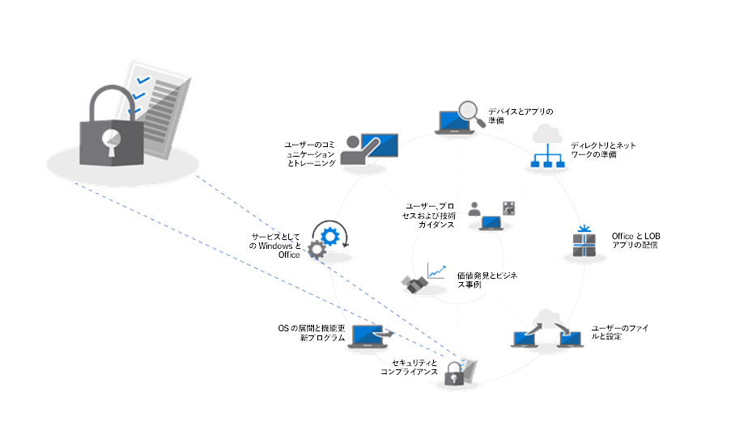
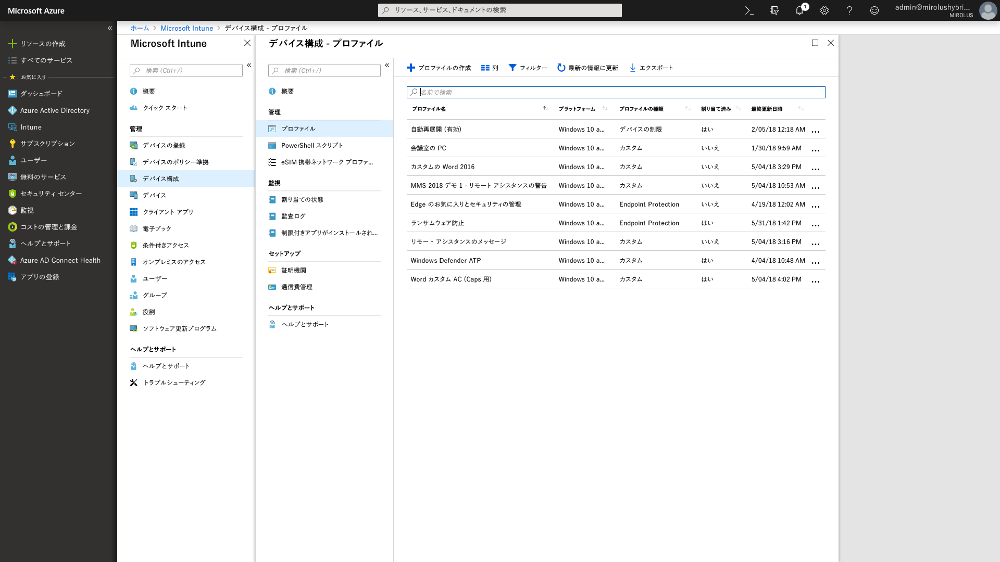

# 手順 5: セキュリティとコンプライアンスに関する考慮事項Step 5: Security and Compliance Considerations

<table>
<thead>
<td></td>
<td>
<strong>手順 5: セキュリティとコンプライアンスに関する考慮事項</strong><strong>Step 5: Security and Compliance Considerations</strong>

Windows 10 と Office 365 ProPlus には、データ、デバイスおよびユーザーを保護し、素早く脅威を検出して対応するための新しい方法が用意されています。Windows 10 への移行時のディスクの暗号化、マルウェア対策のアプリとポリシーに関連する共通の問題に対処する方法についても説明します。Windows 10 and Office 365 ProPlus provide new ways to protect your data, devices and users and quickly detect and respond to threats. Also, learn how to deal with common problems associated with disk encryption, anti-malware apps and policies when moving to Windows 10.
</td>
<td></td>
</thead>
</table>

>[!NOTE]
>セキュリティとコンプライアンスは、推奨される展開プロセスの輪における 5 番目の手順であり、Windows 10 および Office 365 ProPlus のセキュリティとコンプライアンスに関する考慮事項をカバーします。Security and Compliance is the fifth step in our recommended deployment process wheel covering Windows 10 and Office 365 ProPlus security and compliance considerations. デスクトップ展開プロセス全体を確認するには、[デスクトップ展開センター](https://aka.ms/HowToShift)を参照してください。To see the full desktop deployment process, visit the [Desktop Deployment Center](https://aka.ms/HowToShift).
>

Windows 10 および Office 365 ProPlus 展開の一環として、新しいセキュリティ機能とコンプライアンス機能を対象とするオプションと共に、以前のバージョンの Windows と Office から移行する際の考慮事項と共通の阻害要因について再確認します。Now it's time to review options for targeting new security and compliance capabilities as part of your Windows 10 and Office 365 ProPlus deployment, along with the considerations and common blockers when moving from previous versions of Windows and Office. Windows 10 単独のセキュリティ関連機能の多くが、新しいプラットフォームへの移行を促しています。Many of the security-related capabilities in Windows 10 alone are driving the shift to the newer platform. また、Office 365 のクラウドサービスと Azure Active Directory を使用したアイデンティティ オプションとの統合により、データ、デバイス、およびユーザーに対する新しい継続的に更新される保護が利用できるようになります。Also, integration with cloud services in Office 365 and identity options using Azure Active Directory brings access to new and continually updated protections for your data, devices and users.

## セキュリティに関連する潜在的な展開の阻害要因の解消Overcoming Potential Security-Related Deployment Blockers

Windows 10 および Office 365 ProPlus に移行する際に追加できる新しい機能を説明して、それらのエクスペリエンスをクラウドに結び付ける前に、しばしば展開の進行を中断させることがある、いくつかの傾向について説明するところから始めましょう。Before explaining new capabilities that you can add as you move to Windows 10 and Office 365 ProPlus and connect those experiences to the cloud, let’s start with a few trends we’re seeing that can often interrupt deployment progress.

### ディスク暗号化Disk Encryption

初期に発生する課題として最初に挙げられるものは、ハード ディスクの暗号化です。ハード ディスクの暗号化に関する多数のソリューションは、前のバージョンの Windows から新しいバージョンの Windows に簡単にはアップグレードできません。First one of the initial challenges you might encounter is hard disk encryption. Many solutions for hard disk encryption cannot easily be upgraded from a previous version of Windows to a newer version of Windows.

一部のディスク暗号化ソリューションは、そのプラットフォームの特定のバージョンに対する Windows セットアップに '/reflectdrivers' オプションを使用するとアップグレードを実行できます。ただし、その他の多くのものは、展開に先立ってディスクの暗号化を解除して、Windows 10 のインストール後に再び暗号化することを求めます。また、一部のソリューションでは、従来の BIOS を使用するマスター ブート レコード (MBR) から UEFI に必要な GUID パーティション テーブル (GPT) への移行ができません。これが重要になる理由は、Windows 10 の新しい仮想化ベースのセキュリティ機能には UEFI を使用した 64 ビット バージョンの Windows 10 が必要になるためです。これらの機能については、この後で説明します。Some disk encryption solutions allow you to perform the upgrades when using the ‘/reflectdrivers’ option with Windows Setup on certain versions of their platforms, but others may require you to unencrypt the drive prior to deployment, then re-encrypt after Windows 10 is installed. Some solutions also do not allow you to move from Master Boot Record (MBR), using legacy BIOS, to GUID Partition Table (GPT), required for UEFI. This is important because a 64-bit version of Windows 10 with UEFI is required for the new virtualization-based security capabilities in Windows 10 and those are explained below.

こうした問題を解決するための 1 つのオプションが、Windows 10 の BitLocker を使用することです。これは、Windows 10 Pro 以上のエディションに含まれています。BitLocker を使用すると、プロセスの一環として、OS アップグレードと機能更新プログラムに対する保護を一時停止できます。One option to resolve these issues is using BitLocker in Windows 10, which is included in Windows 10 Pro and higher editions. BitLocker allows you to suspend protection for OS upgrades and Feature Updates as part of the process.

  [Bitlocker の基本的な展開](https://docs.microsoft.com/ja-JP/windows/security/information-protection/bitlocker/bitlocker-basic-deployment)[Bitlocker basic deployment](https://docs.microsoft.com/en-us/windows/security/information-protection/bitlocker/bitlocker-basic-deployment)

### ウイルス対策およびマルウェア対策アプリケーションの互換性Antivirus and Antimalware Application Compatibility

2 番目に、Windows 7 と Windows 10 の間で [99% 以上の Windows アプリケーションに互換性がある](https://www.microsoft.com/en-us/microsoft-365/blog/2018/09/06/helping-customers-shift-to-a-modern-desktop/)ことがわかっていますが、多くの場合、その例外になるものがウイルス対策 (AV) アプリや仮想プライベート ネットワーク (VPN) クライアントです。こうしたアプリケーションの多くが標準以外の開発プラクティスと API を実装していて、多くの場合、ドキュメント化されていない方法を使用してシステムを保護したり、ネットワーク リソースに接続したりしています。Second, while we’ve seen that more than [99% of Windows applications are compatible](https://www.microsoft.com/en-us/microsoft-365/blog/2018/09/06/helping-customers-shift-to-a-modern-desktop/) between Windows 7 and Windows 10, the exceptions are often anti-virus (AV) apps or Virtual Private Network (VPN) clients. These applications often implement non-standard development practices and APIs, using often undocumented ways to protect your system or connect you to network resources.

結果として、こうしたアプリケーションは、本質的に新しいバージョンの Windows に移行するときの変化に弱くなります。通常、AV や VPN ソフトウェアが Windows 10 で動作しない場合やアップグレード後には、使用中のアプリが修正プログラムによって Windows 10 でサポートされていてテスト済みのものに置き換えられます。As a result, these apps by nature can be fragile to changes when shifting to a new version of Windows. If your AV or VPN software doesn’t work in Windows 10 or after upgrading, the fix is typically to replace the app you’re using with something supported and tested on Windows 10.

### セキュリティ ポリシーSecurity Policies

以前のバージョンの Windows と Office に使用されていた Active Directory グループ ポリシーの設定は、Windows 10 と Office 365 ProPlus に直接変換できないことがあり、新しいセキュリティ機能とコンプライアンス機能には、古いものとは異なる考慮事項があります。現行バージョンの Windows と Office に対応するセキュリティ ポリシーのベースラインを取得するために、Microsoft Security Compliance Toolkit の使用をお勧めします。さらに、Microsoft Intune の一部としてモバイル デバイス管理ポリシーを検討してみることもお勧めします。Your Active Directory Group Policy settings used for older versions of Windows and Office may not translate directly to Windows 10 and Office 365 ProPlus, and there are different considerations with newer security and compliance capabilities. It’s a good idea to use the Microsoft Security Compliance Toolkit to get a baseline of the security policies for current versions of Windows and Office. Additionally, it’s worth looking into Mobile Device Management policies as part of Microsoft Intune.

## 

## Microsoft 365 の新しいセキュリティ機能とコンプライアンス機能New Security and Compliance Capabilities in Microsoft 365

ここまでは、現在の保護を新しいものに移行する際の考慮事項と、移行前に注意が必要になる事項についての説明でした。ここからは、EMS 以降から Windows 10、Office 365 ProPlus およびクラウド ベースのオプションに移行したときに活用できる新しい機能について説明します。Now, those were considerations for moving your current protections forward and things to be aware of before your shift. Now let’s take a look at new capabilities that you can take advantage of when moving to Windows 10, Office 365 ProPlus and cloud-based options from EMS and beyond.

### ID およびアクセス管理Identity and Access Management

ID およびアクセス管理の説明から始めます。Azure Active Directory は、アプリ、デバイスおよびクラウド サービスの ID 制御プレーンであり、Office 365 などのクラウド サービスに接続するための最新の方法です。条件付きアクセスを使用すると、ログイン元、使用しているデバイス、異常な動作などに基づいて、さまざまな認証要件を定義できます。Starting with identity and access management. Azure Active Directory is the identity control plane for apps, devices and Cloud services and is the modern way to connect to Office 365 and other Cloud services. Conditional access allows you to define different authentication requirements based on where you are logging in from, which device you're using, as well as things like anomalous behaviors.

デバイス レベルでは、生体認証は、パスワードを排除するという目標に向かって進んでいるときに、デバイスやアプリへのよりシンプルで安全なアクセスのための固有の ID を提供できます。Windows Hello では、デバイス ベースの多要素認証を使用できます。これは、デバイス自体、PIN、または固有の生体認証 ID (顔や指紋など) に依存し、ポリシーによって強制実施できます。At the device level, biometrics can provide unique identifiers for simpler and more secure access to your devices and apps - as you move toward the goal of eliminating passwords. Windows Hello offers device-based, multi-factor authentication. It relies on the device itself, your PIN, or unique biometric identifier such as your face or fingerprint, which you can enforce via policy.

  [Azure ID 管理の基礎](https://docs.microsoft.com/ja-JP/azure/active-directory/fundamentals/identity-fundamentals)[Fundamentals of Azure identity management](https://docs.microsoft.com/en-us/azure/active-directory/fundamentals/identity-fundamentals)

  [Azure ID ソリューションについて](https://docs.microsoft.com/ja-JP/azure/active-directory/fundamentals/understand-azure-identity-solutions)[Understand Azure identity solutions](https://docs.microsoft.com/en-us/azure/active-directory/fundamentals/understand-azure-identity-solutions)

  [Azure Active Directory の条件付きアクセスとは](https://docs.microsoft.com/ja-JP/azure/active-directory/conditional-access/overview)[Azure Active Directory Conditional Access](https://docs.microsoft.com/en-us/azure/active-directory/conditional-access/overview)

  [Windows Hello for Business](https://docs.microsoft.com/ja-JP/windows/security/identity-protection/hello-for-business/hello-identity-verification)[Windows Hello for Business](https://docs.microsoft.com/en-us/windows/security/identity-protection/hello-for-business/hello-identity-verification)

### 仮想化ベースのセキュリティVirtualization-based security

現在では ID 以上に、既知の脅威と未知の脅威の両方に対応する継続的な保護を使用することもできます。そのために、Windows 10 では、セキュア ブートを使用してブート整合性とコード整合性を保証するためのコア部分に仮想化ベースのセキュリティを使用します。また、ユーザーのシークレットを Windows から切り離して維持することは、Credential Guard による資格情報の盗難防止にも役立ちます。さらに、Application Guard では、隔離されたコンテナー内でブラウザーを実行することで、ブラウザー ベースの脅威を分離および緩和できます。こうしたテクノロジのすべては、Windows 10 の仮想化ベースのセキュリティを使用します。これは、Windows 7 システムでは再現できない根本的な変更です。こうしたテクノロジには、UEFI、64 ビット Windows および SLAT による仮想化拡張機能 (ハードウェア レベル) が必要になる点に注意してください。Now beyond identity, you can also enable continuous protection against both known and unknown threats and to do this Windows 10 uses virtualization-based security at the core to ensure boot integrity and code integrity using Secure Boot. We can help also stop credential theft with Credential Guard by maintaining user secrets in isolation from Windows. And, Application Guard can isolate and mitigate browser-based threats by running the browser in an isolated container. All of these technologies use virtualization-based security in Windows 10 and are foundational changes that cannot be replicated on a Windows 7 system – note that these also require UEFI, 64-bit Windows and virtualization extension support with SLAT – at the hardware level.

  [仮想化ベースのセキュリティの詳細](https://docs.microsoft.com/ja-JP/windows-hardware/design/device-experiences/oem-vbs)[More on Virtualization-based Security](https://docs.microsoft.com/en-us/windows-hardware/design/device-experiences/oem-vbs)

### クラウド サービスからのセキュリティの強化Security enhancements from cloud services

クラウド サービスは、Windows と Office のセキュリティが向上する、もう 1 つのオプションの保護層を提供します。これにより、新しい攻撃と攻撃の種類をただちに検出し、抵抗して対応できる新しいレベルのほぼリアルタイムの制御が可能になります。これは、対応と更新の展開時間が本質的に遅くなる従来のソフトウェア更新および AV シグネチャ ファイルと比較したときに顕著になります。Cloud services provide another layer of optional protection to improve Windows and Office security. These can give you a new level of often real-time control that can instantly detect, resist and respond to new attacks and attack types – especially compared to traditional software updating and AV signature files – where response and update deployment times are inherently slower.

Microsoft インテリジェント セキュリティ グラフとの併用によって、新たな脅威の情報と保護策の両方に素早くアクセスできます。ここでは、いくつかの利用できるものの例を示します。まず、Office から始めます。Along with the Microsoft Intelligent Security Graph, you have faster access to both information and protections from emerging threats. Here are a few examples of what you can take advantage of, starting with Office.

  **
  [データ損失防止](https://docs.microsoft.com/ja-JP/office365/securitycompliance/data-loss-prevention-policies)\*\* は、Office 365 ProPlus に組み込まれています。これは、クレジット カードや個人識別番号のようなリスクの高いコンテンツが検出されたときにセキュリティ ポリシーをユーザーに通知する場合に役立ちます。ポリシーによって、ユーザーに通知することも、通知後に送信や共有をブロックすることもできます。**[Data Loss Prevention](https://docs.microsoft.com/en-us/office365/securitycompliance/data-loss-prevention-policies)** built into Office 365 ProPlus, helps inform users of security policies when high risk content like credit card or identification numbers are detected. Policies can inform or block sending and sharing after notifying users.

  **
  [Azure Information Protection](https://docs.microsoft.com/ja-JP/azure/information-protection/rms-client/client-admin-guide)\*\* は、Office で使用できる補完的なサービスであり、ユーザーは簡単に Office ファイルを分類してラベルを付けることができます。これにより、ラベル付きファイルに対する自動アクション (暗号化や共有のロック ダウンなど) をトリガすることができます。**[Azure Information Protection](https://docs.microsoft.com/en-us/azure/information-protection/rms-client/client-admin-guide)** is a complementary service that can be used with Office, allowing users to easily classify and label their Office files. It can trigger automatic action on labeled files, such as encryption or locking down sharing.

また、既知の悪意のある Web サイトの動的なリストと照合してユーザーを保護するために、Office アプリケーション全体にわたる**[安全なリンク](https://docs.microsoft.com/ja-JP/office365/securitycompliance/atp-safe-links)** 保護も導入されています。We've also introduced **[Safe Links](https://docs.microsoft.com/en-us/office365/securitycompliance/atp-safe-links)** protection across Office apps to protect you against a dynamic list of known malicious websites.

さらに、Outlook および Exchange Online の**[安全な添付ファイル](https://docs.microsoft.com/ja-JP/office365/securitycompliance/atp-safe-attachments)** は、電子メールのフィルタリングの範囲を超えて添付ファイルを検査します。リスクの高い添付ファイルが識別されると、「安全な添付ファイル」は既知の悪意のある添付ファイルについてユーザーに通知し、電子メールから削除します。Additionally, **[Safe Attachments](https://docs.microsoft.com/en-us/office365/securitycompliance/atp-safe-attachments)** in Outlook and as part of Exchange Online goes beyond email filtering to inspect attachments. If a high-risk attachment is identified, Safe Attachments will inform the user of known malicious attachments and remove them from email.

  **
  [Office 365 Message Encryption](https://docs.microsoft.com/ja-JP/office365/securitycompliance/encryption)\*\* (OME) も、送信された電子メールと添付ファイルの保護に使用できます。これにより、意図した受信者のみが電子メールの内容を表示できるようになります。OME は、Google、Yahoo、および Microsoft のコンシューマ アカウント認証とシームレスに連動します。また、ワンタイム パスコードにより、その他の電子メール サービスのユーザーも安全に電子メールを受信できます。**[Office 365 Message Encryption](https://docs.microsoft.com/en-us/office365/securitycompliance/encryption)** (OME) can also be used to safeguard email and attachments sent, ensuring only intended recipients can view email content. OME works seamlessly with Google, Yahoo, and Microsoft consumer account authentication, and one-time passcodes allow users of other email services to securely receive email as well.

#### その他の Windows 10 の保護機能Additional Windows 10 protections

  **
  [Windows Defender アプリケーション制御](https://docs.microsoft.com/ja-JP/windows/security/threat-protection/windows-defender-application-control/windows-defender-application-control)\*\* (Windows 10) は、Microsoft が安全性について確認したアプリケーションの承認済みの許可リストと拒否リストによって動作します。そのすべては、Microsoft Intune を使用するエンドポイント保護ポリシーによって管理されます。**[Windows Defender Application Control](https://docs.microsoft.com/en-us/windows/security/threat-protection/windows-defender-application-control/windows-defender-application-control)** in Windows 10 operates off an approved allow and deny list of applications that Microsoft has checked for safety and all that is managed by endpoint protection policies using Microsoft Intune.

  **
  [Windows Defender Advanced Threat Protection](https://docs.microsoft.com/ja-JP/windows/security/threat-protection/windows-defender-atp/overview)\*\* は、予防的な保護、侵害後の検出、自動調査、および対応のための統一されたプラットフォームです。これにより、エンドポイントがサイバー脅威から保護されます。高度な攻撃とデータ侵害を検出し、セキュリティ インシデントを自動化して、セキュリティ体制を強化します。**[Windows Defender Advanced Threat Protection](https://docs.microsoft.com/en-us/windows/security/threat-protection/windows-defender-atp/overview)** is a unified platform for preventative protection, post-breach detection, automated investigation, and response. It protects endpoints from cyber threats; detects advanced attacks and data breaches, automates security incidents and improves security posture.

  **
  [Exploit Guard](https://docs.microsoft.com/ja-JP/windows/security/threat-protection/windows-defender-exploit-guard/windows-defender-exploit-guard)\*\* は、Windows へのマルウェアの侵入を阻止し、信頼されていないプロセスによる保護されたフォルダーへのアクセスを禁止することで、実行中のアプリケーションの攻撃対象になる部分を減らすために役立ちます。**[Exploit Guard](https://docs.microsoft.com/en-us/windows/security/threat-protection/windows-defender-exploit-guard/windows-defender-exploit-guard)** helps reduce the attack surface for running applications by preventing malware from getting into Windows and blocking untrusted processes from accessing protected folders.

#### Microsoft IntuneMicrosoft Intune

  [Microsoft Intune](https://docs.microsoft.com/ja-JP/intune/introduction-intune) は、IOS、Android および Windows デバイスを含むモバイル シナリオに対応するクラウドベースの管理サービスとして機能します。System Center Configuration Manager によって管理される特定のワークロードに対する制御を補完および拡張するための共同管理に向けた構成が可能になりました。その利点の 1 つは、保護されたリソースにアクセスするデバイスは、管理対象ではないデバイス、ドメインに参加していないデバイスまたは Azure AD に参加していないデバイスであったとしても、デバイス管理への登録を要件にできることです。また、オペレーティング システムおよびアプリケーション レベルで、詳細な構成とコンプライアンス ポリシーの強制適用を利用することもできます。アプリケーションのポリシーと設定は、Microsoft Intune を使用することで一元的に構成して Windows 10 の Office 365 ProPlus と Store アプリに強制適用できます。[Microsoft Intune](https://docs.microsoft.com/en-us/intune/introduction-intune) serves as a Cloud based management service for mobile scenarios, including IOS, Android and Windows devices, and can now be configured for co-management to complement and extend controls for specific workloads managed by System Center Configuration Manager. One advantage here is that, devices accessing protected resources can be required to enroll into device management – even non-managed, non-domain joined or non-Azure AD joined devices. You can also take advantage of granular configuration and compliance policy enforcement at the operating system and application level. Application policies and settings can be configured centrally and enforced for Office 365 ProPlus and Store apps in Windows 10 using Microsoft Intune.

## 次の手順Next Step

## [手順 6: OS の展開と機能更新プログラムStep 6: OS Deployment and Feature Updates](https://aka.ms/mdd6)

## 前の手順Previous Step 

## [手順 4: ユーザーのファイルと設定Step 4: User Files and Settings](https://aka.ms/mdd4)
