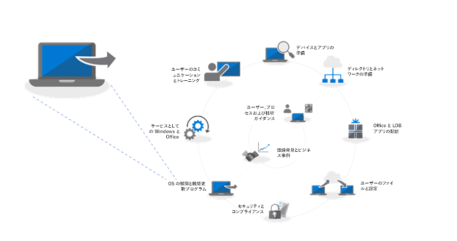
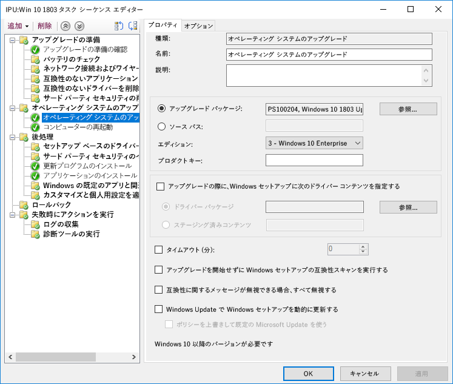
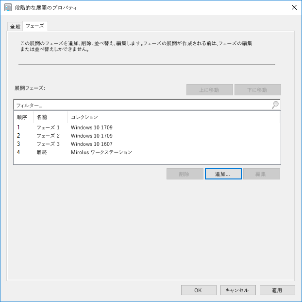

# 手順 6: OS の展開と機能更新プログラムStep 6: OS Deployment and Feature Updates

<table>
<thead>
<td></td>
<td>
<strong>手順 6: OS の展開と機能更新プログラム</strong><strong>Step 6: OS Deployment and Feature Updates</strong>

タスク シーケンスベースの展開は、ベア メタル インストール、PC の更新および PC の交換の際に、大規模な段階化された展開を自動化するために使用します。アップグレードのタスク シーケンスも、半年ごとの主要な更新プログラムで最新状態を維持するために役立ちます。また、Windows Autopilot は新しい PC の取得プロセスを最新化する最近追加された機能です。Task sequence-based deployment is used to automate large scale, phased deployment for bare metal installs, PC refresh and PC replacement. Upgrade task sequences will also help you stay current with major semi-annual updates. And Windows Autopilot is a recent addition that modernizes the new PC acquisition process.
</td>
<td></td>
</thead>
</table>

>[!NOTE]
>OSの展開と機能の更新は、Windows 10 OSの展開、アップグレード、機能の更新を統括する、推奨展開プロセスの6番目のステップです。OS Deployment and Feature Updates is the sixth step in our recommended deployment process wheel covering Windows 10 OS deployment, upgrades and Feature Updates. 完全なデスクトップ展開プロセスを確認するには、[デスクトップ展開センター](https://aka.ms/HowToShift)にアクセスしてください。To see the full desktop deployment process, visit the [Desktop Deployment Center](https://aka.ms/HowToShift).
>

ここまでの展開プロセスの輪に従っていれば、デバイスとアプリの準備、インフラストラクチャの準備、アプリ パッケージの構成と収集が少なくとも部分的には完了していて、ユーザー ファイルの移行と既定の設定の構成のため実施計画があり、既存のセキュリティ制御の保持と新しいセキュリティ制御の展開 (必要な場合) の計画もあるはずです。If you’ve been following the deployment process wheel till now, you’ve at least partially completed the steps for device and app readiness, prepared your infrastructure, configured and collected app packages, have a plan in place for migrating user files and configuring default settings as well as have plans for retaining your existing security controls and perhaps deploying new ones.

これらすべての断片を 1 つにまとめて、Windows 10 と Office 365 ProPlus、およびドライバーやアプリなどの必要なもののインストールを可能な限り自動化するという段階に達しました。Now we’ve arrived at the stage where you’re putting all these pieces together to automate as much as you can to install Windows 10 and Office 365 ProPlus, along with the necessary drivers, apps and whatever else is needed.

結局のところ、OS 展開の成功についての最適な評価基準は、ユーザーの期待を満たしていることと、ユーザーの作業を中断しないことです。この手順では、段階的な展開の一部として、パイロット ユーザーを対象としたテストと展開を開始します。ここでのヒントは、展開の範囲を広げる前に、展開プロセスの輪の手順 8「[ユーザーのコミュニケーションとトレーニング](https://aka.ms/mdd8)」までスキップして、ユーザーが通知を受けていること、変更に対するユーザー自身の準備が整っていること、および「段階的な展開」を使用した継続的な検証によってロールアウトのペースを測定できることを確認します。Ultimately, the best measure of success with an OS deployment is meeting user expectations and avoiding disruptions in their work. And in this step, you’ll start testing and deploying to pilot users as part of a phased deployment. And one tip here, before you broaden deployment, you’ll need to skip ahead to step 8 on our deployment process wheel – [User Communications and Training](https://aka.ms/mdd8) to make sure users are informed and prepared for changes coming their way and that you can measure your roll-out pace with continuous validation using Phased Deployment.

## Windows イメージング プロセスWindows Imaging Process

ほとんどの組織は、PC イメージングのプロセスを使用して、Windows のクローンを構成してキャプチャします。これには、いくつかの標準インストール済みアプリの基本セットを含めることもありますが、アプリケーションのランタイムと更新プログラムのみを含むシン イメージにすることもあります。これを実行するための最適な方法は、予期しないドライバ関連の互換性問題を避けるために、このプロセスと自動化を目的とした仮想マシンを使用することです。Most organizations use the process of PC imaging to configure and capture a clone of Windows, including a base set of a few standard apps installed, or an even a thinner image with only application runtimes and updates. The best way to do this is using a virtual machine for this process to avoid any unexpected driver-related compatibility issues and for automation purposes.

イメージ キャプチャのルートを進める場合は、最高品質のイメージと繰り返し可能なプロセスを確実なものにするために、作業を可能な限り自動化することをお勧めします。ほとんどの展開について、キャプチャ前の Windows イメージに含まれるカスタマイズと事前インストール済アプリは、できるだけ少なくすることをお勧めします。これは、「シン イメージ」と呼ばれるアプローチで、イメージ内のアプリの数を削減することでネットワーク全体の帯域幅を節約できます。シン ベース イメージから始めることで、ユーザーの要求に応じて必要になるアプリ、言語および構成を動的に積み重ねることができます。If going the image capture route, it’s best to automate as much as possible to ensure the best quality image and a repeatable process. For most deployments, it is also recommended to put as little customization and pre-installed apps as possible in the Windows image prior to capturing. This is what is called a ‘thin image’ approach, which can save overall bandwidth on the network by eliminating the number of apps within the image. By starting with a thin base image, you can layer on required apps, languages and configurations dynamically tailored to users.

ビルドおよびキャプチャ プロセスでは、Windows 10 インストールをイメージとしてキャプチャする前に、System Center Configuration Manager (Current Branch) や Microsoft Deployment Toolkit などのツールでは「一般化」コマンドとシステム準備ツール (Sysprep) を使用して、イメージを再シールします。During the build and capture process, tools like System Center Configuration Manager and the Microsoft Deployment Toolkit use the System Preparation Tool – or Sysprep – along with the “Generalize” command to reseal your image before they capture the Windows 10 installation as an image.

キャプチャされたイメージは、標準の Windows インストール メディアのような Windows イメージ (WIM) 形式になります。カスタムの WIM ファイルがあれば、OS 展開の一環として別のタスク シーケンスを使用して、System Center Configuration Manager または Microsoft Deployment Toolkit で展開関連のタスクを実行することや、イメージを適用することや、Windows イメージの適用前後にタスクを実行することができます。The captured image will have the Windows image – or WIM – format like standard Windows installation media. Once you have your custom WIM file, you can use another task sequence as part of your OS deployment in System Center Configuration Manager or Microsoft Deployment Toolkit to perform deployment-related tasks, to apply the image and run tasks before and after your Windows image is applied.

  [Windows 10 参照イメージの作成](https://docs.microsoft.com/ja-JP/windows/deployment/deploy-windows-mdt/create-a-windows-10-reference-image)[Create a Windows 10 Reference Image](https://docs.microsoft.com/en-us/windows/deployment/deploy-windows-mdt/create-a-windows-10-reference-image)

  [オペレーティング システムをインストールするタスク シーケンスの作成](https://docs.microsoft.com/ja-JP/sccm/osd/deploy-use/create-a-task-sequence-to-install-an-operating-system)[Create a Task Sequence to Install an Operating System](https://docs.microsoft.com/en-us/sccm/osd/deploy-use/create-a-task-sequence-to-install-an-operating-system)

### 展開の種類Deployment Types

カスタム イメージの準備が整っている場合、インストールまたは移行の種類は次の 3 つのカテゴリに分類されます。With your custom image ready, the installation or migration type will fall into the following categories:

  - 1 つ目は、**ベア メタル展開**です。これは、クリーンなディスクにイメージを展開する場合や、ディスク上のデータを保持しておくつもりのないコンピューターを再イメージ化する場合に使用するシナリオです。First, **bare metal deployment**. This is the scenario used to deploy an image to a clean disk, or to reimage a computer where you don’t intend to keep any of the data on the disk

  - 2 つ目は、**コンピューター更新**です。これは、ベア メタルに似ていますが、ユーザー状態がディスクに維持される\*、またはインストール完了後に復元されるいう主な違いがあります。And second, similar to bare metal, is **Computer Refresh,** with the key difference that user state remains on the disk\* or will be restored after the install is complete

  - 最後は、**コンピューターの交換**です。その名前が示すように、PC を別の PC に交換します。通常、この場合は、最初の PC のユーザー ファイルを集中管理される場所にバックアップしておいて、そのファイルを 2 番目の PC に復元します。And last is **Computer Replacement**. Here as the name implies, you are replacing a PC with another PC. In this case, there is often a backup of user files from the first PC to a central location, then a restore of those files to the second PC.

上記の 3 つのシナリオすべてに共通点があります。これらは、タスク シーケンスを使用して実行し、カスタム イメージを毎回適用できます。All three of these scenarios have something in common, they use a task sequence to run, and a custom image can be applied each time.

  [Windows 10 展開シナリオ](https://docs.microsoft.com/ja-JP/windows/deployment/windows-10-deployment-scenarios)[More About Windows 10 Deployment Scenarios](https://docs.microsoft.com/en-us/windows/deployment/windows-10-deployment-scenarios)

### タスク シーケンスの自動化を使用した一括アップグレードIn-place Upgrade using Task Sequence Automation

前述の展開の種類に加えて、Windows 10 では System Center Configuration Manager (Current Branch) のタスク シーケンスとして使用できるようになった新しいオプションとアップグレード タスク シーケンスを使用した一括アップグレードがあります。In addition to these deployment types, there is a new option available now as a System Center Configuration Manager Task Sequence with Windows 10 – and in-place upgrade using the Upgrade Task Sequence.

タスクシーケンスは、以前のバージョンの Windows からの一括アップグレードには必要ありませんが、エンタープライズ規模で展開する場合には推奨されるアプローチです。一括アップグレードでは、アプリケーションにカスタムイメージを適用することはできませんが、オフライン サービスを使用することで既定の install.wim を更新できます。たとえば、アップグレードの実行前に、最新の Windows 更新プログラムが適用されているようにすることができます。In-place upgrades from a previous version of Windows do not require a task sequence, but it is a recommended approach when deploying at enterprise scale. An in-place upgrade does not allow you to apply a custom image with applications, but you can update the default install.wim using offline servicing. For example, you can to make sure it has the latest Windows updates applied prior to performing upgrades.

一括アップグレードには、Windows セットアップが使用されます。このセットアップ エンジンは、複数の小さなインストール前チェックを実行して、既知の互換性問題を調べます。また、ユーザー状態とアプリケーションを維持して、インストールする Windows 10 のバージョンと互換性がないものだけを削除します。このオプションでは、以前にインストールしていたアプリケーションとユーザー状態が維持されます。さらに、一括アップグレードを使用すると、トラブルシューティングのために必要になる場合は、前にインストールされていた OS にロールバックすることもできます。In-place upgrade uses windows setup. The setup engine runs several small pre-installation checks looking for known compatibility issues. It also preserves the user state and applications and only removes what isn’t compatible with the version of Windows 10 being installed. With this option, previously installed applications and user state are preserved. In-place upgrade also allows you to roll-back to the previous OS installed if needed for troubleshooting purposes.

[setup.exe を使用した Windows 10 のアップグレード前検証Windows 10 Pre-Upgrade Validation Using setup.exe](https://blogs.technet.microsoft.com/mniehaus/2015/08/23/windows-10-pre-upgrade-validation-using-setup-exe/)

一括アップグレード シナリオは、前バージョンの Windows 10 からのアップグレードだけでなく、レガシ バージョンの Windows から Windows 10 への移行にも使用できます。Windows セットアップによるアップグレードの完了後、タスク シーケンスは実行を継続して、Office などのアプリケーションをアップグレードし、ドライバーを置き換えて、個人用設定を適用できます。同様に、アップグレード タスク シーケンスを使用して、インストール前タスクや、アップグレードの実施前チェックを実行できます。The in-place upgrade scenario can be used to migrate to Windows 10 from legacy versions of Windows, as well as upgrade from previous versions of Windows 10. After Windows Setup completes the upgrade, your task sequence can continue to run and upgrade applications like Office, replace drivers, and apply personalization settings. Likewise, you can use the Upgrade Task Sequence to perform pre-installation tasks or checks prior to carrying out the upgrade.

  [Configuration Manager を使用して Windows 10 への一括アップグレードを実行する](https://docs.microsoft.com/ja-JP/windows/deployment/upgrade/upgrade-to-windows-10-with-system-center-configuraton-manager)[Perform an in-place upgrade to Windows 10 using Configuration Manager](https://docs.microsoft.com/en-us/windows/deployment/upgrade/upgrade-to-windows-10-with-system-center-configuraton-manager)

  [Configuration Manager で OS をアップグレードするタスク シーケンスを作成する](https://docs.microsoft.com/ja-JP/sccm/osd/deploy-use/create-a-task-sequence-to-upgrade-an-operating-system)[Create a task sequence to upgrade an OS in Configuration Manager](https://docs.microsoft.com/en-us/sccm/osd/deploy-use/create-a-task-sequence-to-upgrade-an-operating-system)

### 段階的な展開Phased Deployment

展開を計画しているときには、ベア メタル、更新、交換およびアップグレードのパスをターゲットにしていることでしょう。この場合に推奨されるアプローチは、同様のマシンのコレクションに段階的な展開を使用することです。この方法により、展開の規模を拡大する前に、互換性、配信と自動化、ユーザー受け入れ、ネットワーク帯域幅の使用量などの要因を検証できます。As you're planning your deployment, you'll be targeting computers for bare metal, refresh, replace and upgrade paths. The recommended approach in this case is to use phased deployment to collections of similar machines. This way, you can validate compatibility, delivery and automation, user acceptance, network bandwidth consumption, and other factors before increasing the scale of your deployment.

### 推奨されるツール: System Center Configuration Manager (Current Branch) および Microsoft Deployment ToolkitRecommended Tools: System Center Configuration Manager and the Microsoft Deployment Toolkit

どの展開の種類を選択したかに関係なく、予測可能性と再現性をできるだけ自動化する必要があります。Microsoft は、自動化されたタスク シーケンスを使用して OS の展開を自動化するためのソリューションを 2 つ用意しています。Regardless of the deployment type you choose, you’ll want to make sure it’s as automated as possible for predictability and repeatability. Microsoft offers two solutions to automate OS deployment using automated task sequences:

  - 
  **
  [System Center Configuration Manager](https://docs.microsoft.com/ja-JP/sccm/core/understand/introduction)\*\* (ConfigMgr) には、ソフトウェア配布とソフトウェア更新の管理機能を補完する組み込みのオペレーティング システム展開機能が用意されています。ConfigMgr は、あらゆる規模の組織で広く使用されていて、4 つの Windows の展開の種類をすべてサポートしています。ConfigMgr は、必要に応じて Microsoft Intune と統合できます。これにより、展開とデバイス管理に関する追加の機能が加わります。**[System Center Configuration Manager](https://docs.microsoft.com/en-us/sccm/core/understand/introduction)** (ConfigMgr) provides built-in operating system deployment capabilities to complement its capabilities for software distribution and software update management. ConfigMgr is widely used by organizations of all sizes and supports all four Windows deployment types. Optionally, you can integrate ConfigMgr with Microsoft Intune to add additional capabilities for deployment and device management.

  - もう 1 つの一般的な展開オプションは、無料の **[Microsoft Deployment Toolkit](https://docs.microsoft.com/ja-JP/windows/deployment/deploy-windows-mdt/get-started-with-the-microsoft-deployment-toolkit)** (MDT) です。通常、このツールキットは、中小規模の組織が OS の展開に使用します。インフラストラクチャは、ほとんど必要とされません。MDT は、ネットワーク ブートのために Windows 展開サービスと統合されます。4 つの展開の種類をすべてサポートし、アプリケーション、ドライバー、および設定のインストールもサポートしています。当然のことながら、MDT は Configuration Manager とも統合できます。And one other popular deployment option is the free **[Microsoft Deployment Toolkit](https://docs.microsoft.com/en-us/windows/deployment/deploy-windows-mdt/get-started-with-the-microsoft-deployment-toolkit)** (MDT) which is typically used by small and medium sized organizations for OS deployment. This requires very little infrastructure. MDT integrates with Windows Deployment Services (WDS) for network boot. It supports all four deployment types as well as installation of applications, drivers, and settings. And of course, MDT can even be integrated with Configuration Manager.

### Windows AutopilotWindows Autopilot

Windows 10の新しいオプションとして、Windows Autopilotを使用してハードウェアの更新サイクルの一部として新しいPCを構成することができるようになります。A new option with Windows 10 is to configure new PCs as part of your hardware refresh cycle using Windows Autopilot. ここでは、サポート契約を結んでいるハードウェア会社と同期して、規定のWindowsセットアップ環境をカスタマイズすることができます。たとえば、ライセンス契約や診断データ設定など、ユーザーに提示されるオプションを排除することができます。Here you can work with supporting hardware vendors to customize the default Windows setup experience – for example by eliminating options presented to users, like Licensing Agreements or diagnostic data settings.

その後で、ユーザーがセットアップ時に Azure AD 資格情報を使用して PC にサインインすると、デバイスは Microsoft Intune に登録されます。展開プロセスは、これが引き継いで、アプリケーション、ソフトウェアの更新プログラム、構成およびコンプライアンス ポリシーを適用します。Windows Autopilot は、必要に応じて、プロビジョニングが完了するまで、ユーザーが最初のセッションにアクセスできないようにすることもできます。Then, when a user signs in to the PC during setup using their Azure AD credentials, the device enrolls into Microsoft Intune, which can then take over the deployment process and apply applications, software updates configurations and compliance policies. Windows Autopilot can also optionally prevent the user from accessing the first session until provisioning is complete.

  [Windows Autopilot の概要](https://docs.microsoft.com/ja-JP/windows/deployment/windows-autopilot/windows-10-autopilot)[Overview of Windows Autopilot](https://docs.microsoft.com/en-us/windows/deployment/windows-autopilot/windows-10-autopilot)

  [Windows Autopilot Prerequisites](https://docs.microsoft.com/ja-JP/windows/deployment/windows-autopilot/windows-10-autopilot#prerequisites)[Windows Autopilot Prerequisites](https://docs.microsoft.com/en-us/windows/deployment/windows-autopilot/windows-10-autopilot#prerequisites)

## 機能更新のためのWindows Update for BusinessWindows Update for Business for Feature Updates

Windows Update for Businessは、ITの専門化がデバイスをWindows Updateサービスに直接接続することによって、Windows 10デバイスを常に最新の状態に保つことを可能にする無料サービスです。Windows Update for Business is a free service that enables IT Pros to keep Windows 10 devices always up to date by directly connecting the devices to the Windows Update service. Windows Update for Businessは、グループポリシーまたはMicrosoft IntuneなどのMDMソリューションを介して構成でき、ITの専門化は新しいビルドを検証するために[展開リング](https://docs.microsoft.com/ja-JP/windows/deployment/update/waas-deployment-rings-windows-10-updates)を作成することができます。Windows Update for Business can be configured via Group Policy or through MDM solutions such as Microsoft Intune and allows IT Pros to create [deployment rings](https://docs.microsoft.com/en-us/windows/deployment/update/waas-deployment-rings-windows-10-updates) to validate new builds. これはWindows Server Update Services（WSUS）、System Center Configuration Manager (Current Branch)、および Microsoft Intune などの既存の管理ツールに統合されています。It is integrated into existing management tools such as Windows Server Update Services (WSUS), System Center Configuration Manager (current branch), and Microsoft Intune. さらに、Windows Update for Businessはピアツーピア配信をサポートし、帯域幅効率を最適化し、ネットワークの輻輳を軽減します。Additionally, Windows Update for Business supports peer-to-peer delivery to help optimize bandwidth efficiency and reduce network congestion.

Windows Update for Businessの詳細については、以下の資料を参照してください。For more detailed information on Windows Update for Business please review the following documentation:

- 
  [Windows Update for Businessで更新を展開する](https://docs.microsoft.com/ja-JP/windows/deployment/update/waas-manage-updates-wufb)[Deploy Updates Using Windows Update for Business](https://docs.microsoft.com/en-us/windows/deployment/update/waas-manage-updates-wufb)
- 
  [Windows Update for Businessを構成する](https://docs.microsoft.com/ja-JP/windows/deployment/update/waas-configure-wufb)[Configure Windows Update for Business](https://docs.microsoft.com/en-us/windows/deployment/update/waas-configure-wufb)
- 
  [Windows Update for Businessを既存の管理ツールと統合する](https://docs.microsoft.com/ja-JP/windows/deployment/update/waas-integrate-wufb)[Integrate Windows Update for Business with Existing Management Tools](https://docs.microsoft.com/en-us/windows/deployment/update/waas-integrate-wufb)
- 
  [グループポリシーを使用してWindows Update for Businessを構成する](https://docs.microsoft.com/ja-JP/windows/deployment/update/waas-wufb-group-policy)[Use Group Policy to configure Windows Update for Business](https://docs.microsoft.com/en-us/windows/deployment/update/waas-wufb-group-policy)
- 
  [Microsoft Intuneを使用してWindows Update for Businessを構成する](https://docs.microsoft.com/ja-JP/intune/windows-update-for-business-configure)[Use Microsoft Intune to configure Windows Update for Business](https://docs.microsoft.com/en-us/intune/windows-update-for-business-configure)

## 次の手順Next Step 

## [ステップ7：WindowsとOfficeのサービスStep 7: Windows and Office Servicing](https://aka.ms/mdd7)

## 前の手順Previous Step

## [手順 5: セキュリティとコンプライアンスに関する考慮事項Step 5: Security and Compliance Considerations](https://aka.ms/mdd5)