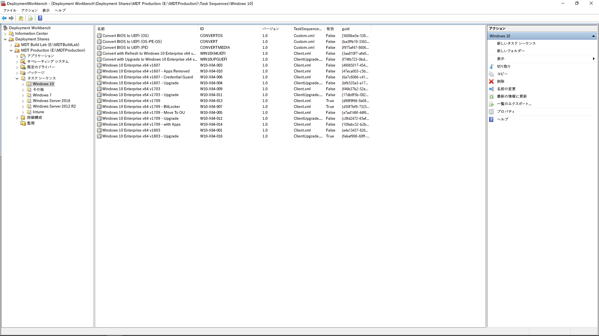

# 手順 6: OS の展開と機能更新プログラム

<table>
<thead>
<td></td>
<td>
<strong>手順 6: OS の展開と機能更新プログラム</strong>

タスク シーケンスベースの展開は、ベア メタル インストール、PC の更新および PC の交換の際に、大規模な段階化された展開を自動化するために使用します。アップグレードのタスク シーケンスも、半年ごとの主要な更新プログラムで最新状態を維持するために役立ちます。また、Windows Autopilot は新しい PC の取得プロセスを最新化する最近追加された機能です。
</td>
<td></td>
</thead>
</table>

>[!NOTE]
>OSの展開と機能の更新は、Windows 10 OSの展開、アップグレード、機能の更新を統括する、推奨展開プロセスの6番目のステップです。 完全なデスクトップ展開プロセスを確認するには、[デスクトップ展開センター](https://aka.ms/HowToShift)にアクセスしてください。
>

ここまでの展開プロセスの輪に従っていれば、デバイスとアプリの準備、インフラストラクチャの準備、アプリ パッケージの構成と収集が少なくとも部分的には完了していて、ユーザー ファイルの移行と既定の設定の構成のため実施計画があり、既存のセキュリティ制御の保持と新しいセキュリティ制御の展開 (必要な場合) の計画もあるはずです。

これらすべての断片を 1 つにまとめて、Windows 10 と Office 365 ProPlus、およびドライバーやアプリなどの必要なもののインストールを可能な限り自動化するという段階に達しました。

結局のところ、OS 展開の成功についての最適な評価基準は、ユーザーの期待を満たしていることと、ユーザーの作業を中断しないことです。この手順では、段階的な展開の一部として、パイロット ユーザーを対象としたテストと展開を開始します。ここでのヒントは、展開の範囲を広げる前に、展開プロセスの輪の手順 8「[ユーザーのコミュニケーションとトレーニング](https://aka.ms/mdd8)」までスキップして、ユーザーが通知を受けていること、変更に対するユーザー自身の準備が整っていること、および「段階的な展開」を使用した継続的な検証によってロールアウトのペースを測定できることを確認します。

## Windows イメージング プロセス

ほとんどの組織は、PC イメージングのプロセスを使用して、Windows のクローンを構成してキャプチャします。これには、いくつかの標準インストール済みアプリの基本セットを含めることもありますが、アプリケーションのランタイムと更新プログラムのみを含むシン イメージにすることもあります。これを実行するための最適な方法は、予期しないドライバ関連の互換性問題を避けるために、このプロセスと自動化を目的とした仮想マシンを使用することです。

イメージ キャプチャのルートを進める場合は、最高品質のイメージと繰り返し可能なプロセスを確実なものにするために、作業を可能な限り自動化することをお勧めします。ほとんどの展開について、キャプチャ前の Windows イメージに含まれるカスタマイズと事前インストール済アプリは、できるだけ少なくすることをお勧めします。これは、「シン イメージ」と呼ばれるアプローチで、イメージ内のアプリの数を削減することでネットワーク全体の帯域幅を節約できます。シン ベース イメージから始めることで、ユーザーの要求に応じて必要になるアプリ、言語および構成を動的に積み重ねることができます。

ビルドおよびキャプチャ プロセスでは、Windows 10 インストールをイメージとしてキャプチャする前に、Microsoft Endpoint Configuration Manager (Current Branch) や Microsoft Deployment Toolkit などのツールでは「一般化」コマンドとシステム準備ツール (Sysprep) を使用して、イメージを再シールします。

キャプチャされたイメージは、標準の Windows インストール メディアのような Windows イメージ (WIM) 形式になります。カスタムの WIM ファイルがあれば、OS 展開の一環として別のタスク シーケンスを使用して、Configuration Manager または Microsoft Deployment Toolkit で展開関連のタスクを実行することや、イメージを適用することや、Windows イメージの適用前後にタスクを実行することができます。

[Windows 10 参照イメージの作成](https://docs.microsoft.com/windows/deployment/deploy-windows-mdt/create-a-windows-10-reference-image)

[オペレーティング システムをインストールするタスク シーケンスの作成](https://docs.microsoft.com/configmgr/osd/deploy-use/create-a-task-sequence-to-install-an-operating-system)

### 展開の種類

カスタム イメージの準備が整っている場合、インストールまたは移行の種類は次の 3 つのカテゴリに分類されます。

  - 1 つ目は、**ベア メタル展開**です。これは、クリーンなディスクにイメージを展開する場合や、ディスク上のデータを保持しておくつもりのないコンピューターを再イメージ化する場合に使用するシナリオです。

  - 2 つ目は、**コンピューター更新**です。これは、ベア メタルに似ていますが、ユーザー状態がディスクに維持される\*、またはインストール完了後に復元されるいう主な違いがあります。

  - 最後は、**コンピューターの交換**です。その名前が示すように、PC を別の PC に交換します。通常、この場合は、最初の PC のユーザー ファイルを集中管理される場所にバックアップしておいて、そのファイルを 2 番目の PC に復元します。

上記の 3 つのシナリオすべてに共通点があります。これらは、タスク シーケンスを使用して実行し、カスタム イメージを毎回適用できます。

[Windows 10 展開シナリオ](https://docs.microsoft.com/windows/deployment/windows-10-deployment-scenarios)

### タスク シーケンスの自動化を使用した一括アップグレード

前述の展開の種類に加えて、Windows 10 では Microsoft Endpoint Configuration Manager (Current Branch) のタスク シーケンスとして使用できるようになった新しいオプションとアップグレード タスク シーケンスを使用した一括アップグレードがあります。

タスクシーケンスは、以前のバージョンの Windows からの一括アップグレードには必要ありませんが、エンタープライズ規模で展開する場合には推奨されるアプローチです。一括アップグレードでは、アプリケーションにカスタムイメージを適用することはできませんが、オフライン サービスを使用することで既定の install.wim を更新できます。たとえば、アップグレードの実行前に、最新の Windows 更新プログラムが適用されているようにすることができます。

一括アップグレードには、Windows セットアップが使用されます。このセットアップ エンジンは、複数の小さなインストール前チェックを実行して、既知の互換性問題を調べます。また、ユーザー状態とアプリケーションを維持して、インストールする Windows 10 のバージョンと互換性がないものだけを削除します。このオプションでは、以前にインストールしていたアプリケーションとユーザー状態が維持されます。さらに、一括アップグレードを使用すると、トラブルシューティングのために必要になる場合は、前にインストールされていた OS にロールバックすることもできます。

[setup.exe を使用した Windows 10 のアップグレード前検証](https://blogs.technet.microsoft.com/mniehaus/2015/08/23/windows-10-pre-upgrade-validation-using-setup-exe/)

一括アップグレード シナリオは、前バージョンの Windows 10 からのアップグレードだけでなく、レガシ バージョンの Windows から Windows 10 への移行にも使用できます。Windows セットアップによるアップグレードの完了後、タスク シーケンスは実行を継続して、Office などのアプリケーションをアップグレードし、ドライバーを置き換えて、個人用設定を適用できます。同様に、アップグレード タスク シーケンスを使用して、インストール前タスクや、アップグレードの実施前チェックを実行できます。

[Configuration Manager を使用して Windows 10 への一括アップグレードを実行する](https://docs.microsoft.com/windows/deployment/upgrade/upgrade-to-windows-10-with-system-center-configuraton-manager)

[Configuration Manager で OS をアップグレードするタスク シーケンスを作成する](https://docs.microsoft.com/configmgr/osd/deploy-use/create-a-task-sequence-to-upgrade-an-operating-system)

### 段階的な展開

展開を計画しているときには、ベア メタル、更新、交換およびアップグレードのパスをターゲットにしていることでしょう。この場合に推奨されるアプローチは、同様のマシンのコレクションに段階的な展開を使用することです。この方法により、展開の規模を拡大する前に、互換性、配信と自動化、ユーザー受け入れ、ネットワーク帯域幅の使用量などの要因を検証できます。

### 推奨されるツール: Microsoft Endpoint Configuration Manager (Current Branch) および Microsoft Deployment Toolkit

どの展開の種類を選択したかに関係なく、予測可能性と再現性をできるだけ自動化する必要があります。Microsoft は、自動化されたタスク シーケンスを使用して OS の展開を自動化するためのソリューションを 2 つ用意しています。

  - **[Microsoft Endpoint Configuration Manager](https://docs.microsoft.com/configmgr/core/understand/introduction)** (ConfigMgr) には、ソフトウェア配布とソフトウェア更新の管理機能を補完する組み込みのオペレーティング システム展開機能が用意されています。ConfigMgr は、あらゆる規模の組織で広く使用されていて、4 つの Windows の展開の種類をすべてサポートしています。ConfigMgr は、必要に応じて Microsoft Intune と統合できます。これにより、展開とデバイス管理に関する追加の機能が加わります。

  - もう 1 つの一般的な展開オプションは、無料の **[Microsoft Deployment Toolkit](https://docs.microsoft.com/windows/deployment/deploy-windows-mdt/get-started-with-the-microsoft-deployment-toolkit)** (MDT) です。通常、このツールキットは、中小規模の組織が OS の展開に使用します。インフラストラクチャは、ほとんど必要とされません。MDT は、ネットワーク ブートのために Windows 展開サービスと統合されます。4 つの展開の種類をすべてサポートし、アプリケーション、ドライバー、および設定のインストールもサポートしています。当然のことながら、MDT は Configuration Manager とも統合できます。

### Windows Autopilot

Windows 10の新しいオプションとして、Windows Autopilotを使用してハードウェアの更新サイクルの一部として新しいPCを構成することができるようになります。 ここでは、サポート契約を結んでいるハードウェア会社と同期して、規定のWindowsセットアップ環境をカスタマイズすることができます。たとえば、ライセンス契約や診断データ設定など、ユーザーに提示されるオプションを排除することができます。

その後で、ユーザーがセットアップ時に Azure AD 資格情報を使用して PC にサインインすると、デバイスは Microsoft Intune に登録されます。展開プロセスは、これが引き継いで、アプリケーション、ソフトウェアの更新プログラム、構成およびコンプライアンス ポリシーを適用します。Windows Autopilot は、必要に応じて、プロビジョニングが完了するまで、ユーザーが最初のセッションにアクセスできないようにすることもできます。

[Windows Autopilot の概要](https://docs.microsoft.com/windows/deployment/windows-autopilot/windows-10-autopilot)

[Windows Autopilot Prerequisites](https://docs.microsoft.com/windows/deployment/windows-autopilot/windows-10-autopilot#prerequisites)

## 機能更新のためのWindows Update for Business

Windows Update for Businessは、ITの専門化がデバイスをWindows Updateサービスに直接接続することによって、Windows 10デバイスを常に最新の状態に保つことを可能にする無料サービスです。 Windows Update for Businessは、グループポリシーまたはMicrosoft IntuneなどのMDMソリューションを介して構成でき、ITの専門化は新しいビルドを検証するために[展開リング](https://docs.microsoft.com/windows/deployment/update/waas-deployment-rings-windows-10-updates)を作成することができます。 これはWindows Server Update Services（WSUS）、Microsoft Endpoint Configuration Manager (Current Branch)、および Microsoft Intune などの既存の管理ツールに統合されています。 さらに、Windows Update for Businessはピアツーピア配信をサポートし、帯域幅効率を最適化し、ネットワークの輻輳を軽減します。

Windows Update for Businessの詳細については、以下の資料を参照してください。

- [Windows Update for Businessで更新を展開する](https://docs.microsoft.com/windows/deployment/update/waas-manage-updates-wufb)
- [Windows Update for Businessを構成する](https://docs.microsoft.com/windows/deployment/update/waas-configure-wufb)
- [Windows Update for Businessを既存の管理ツールと統合する](https://docs.microsoft.com/windows/deployment/update/waas-integrate-wufb)
- [グループポリシーを使用してWindows Update for Businessを構成する](https://docs.microsoft.com/windows/deployment/update/waas-wufb-group-policy)
- [Microsoft Intuneを使用してWindows Update for Businessを構成する](https://docs.microsoft.com/intune/windows-update-for-business-configure)

## 次の手順 

## [ステップ7：WindowsとOfficeのサービス](https://aka.ms/mdd7)

## 前の手順

## [手順 5: セキュリティとコンプライアンスに関する考慮事項](https://aka.ms/mdd5)
