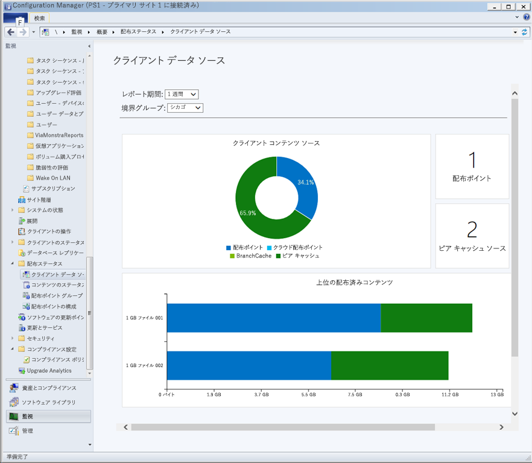
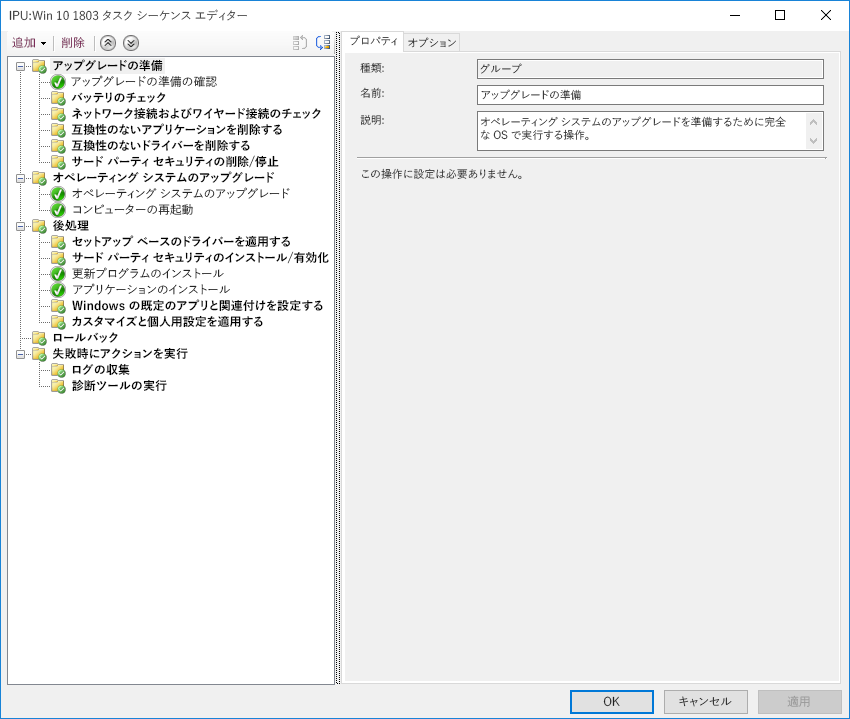

# ステップ7： WindowsとOfficeのサービス

<table>
<thead>
<td></td>
<td>
<strong>ステップ7：WindowsとOfficeのサービス</strong>

Both Windows 10 and Microsoft 365 Apps for enterprise continually add new capabilities to keep bringing user experiences and security forward with the latest innovations. Learn how to stay current with semi-annual and monthly updates, how the new servicing model works and the tools and options you have.
</td>
<td></td>
</thead>
</table>

>[!NOTE]
>WindowsおよびOfficeサービスは、半年ごとの機能更新に備えるための計画サイクルを統括する、推奨展開プロセスの第7段階です。 デスクトップ展開プロセス全体を確認するには、[デスクトップ展開センター](https://aka.ms/HowToShift)を参照してください。
>

Windows 10 と Microsoft 365 Apps for enterprise の両方で、新しいサービス オプション、サポート モデル、および更新プログラムのタイムラインが導入されました。 これらの変更により、常に最新機能を導入しておくプロセスを単純化することができます。 これらの更新に加えて、ご自身に合ったサービスプランを有効にするための新しい設定オプションがあります。 Microsoft Endpoint Configuration Manager (Current Branch) の新機能を活用しながら、Windows 10 および Microsoft 365 Apps for enterprise の新機能を提供する半期チャンネルの更新を準備する方法について説明します。

[Windows 10 および Microsoft 365 Apps for enterprise へ移行するには](https://www.microsoft.com/microsoft-365/blog/2018/09/06/helping-customers-shift-to-a-modern-desktop/)

## 更新プログラムの種類

アップデートには2つの主なカテゴリがあり、機能のアップデート、そして累積されたセキュリティ、信頼性、そしてバグ修正を含んだ品質とセキュリティのアップデートに分けられます。 更新頻度では、WindowsとOffice双方で年2回、3月と9月に新機能を提供する半期ごとのチャンネルを渡しており、品質とセキュリティの更新は毎月行われます。 また、Office 365アプリケーションのみ、更新プログラムに新しい機能と品質更新プログラムの両方が含まれる完全サポート型の現在のチャネル オプションを用意しています。

デスクトップ OS の更新プログラムとアプリの更新プログラムの長いサイクルをご存知であれば、以下のような疑問点が出てくるかと思います。

  - 更新プログラムに互換性はあるのか

  - ユーザーの再トレーニングは必要なのか

  - どんなリスクがあるか

上記疑問の解消につながるよう、以下に新しい機能を頻繁に提供する理由とその利点をいくつか挙げています

### 機能の更新の利点

First, we’ve moved away from the model of the past that would introduce huge waves of change around every three years to now incremental smaller changes with feature updates twice per year. Why? With technology trends moving so fast in addition to rapidly evolving security threats, this keeps experiences and protections current. Some of the security related updates for example can’t just be delivered by monthly security updates or antivirus signature files; they may be low-level changes platform, like virtualization-based security.

[サービスとしての Windows のクイック ガイド](https://docs.microsoft.com/windows/deployment/update/waas-quick-start)

[Windows 10 のセキュリティ機能を使用して脅威を軽減する](https://docs.microsoft.com/windows/security/threat-protection/overview-of-threat-mitigations-in-windows-10%20%20)

### 累積的な更新モデルの利点

Second delivering quality and security updates as a cumulative update package corrects many of the issues of the past. It used to be that you might pick and choose sometimes from a dozen updates or more each month for both Windows and Office. As you can imagine, this creates a nearly impossible set of test matrices for support. Also, if you install a version of Windows or Office that is a year or more old, it might take hours or sometimes days to apply all updates delivered since that version was released.

With the cumulative model, you’re always one update away from being current and in doing so the number of monthly updates that you need to deploy is reduced. Each update builds upon updates from previous months and contains all of the fixes that you need to get current. Cumulative updates are especially helpful when PCs has been turned off for several months because they are in storage waiting to be reassigned to a different user.

### 更新プログラムの検証の範囲が拡大

もう1つの利点は、広範環境への更新を展開する前に、まず[Office](https://products.office.com/office-insider?tab=Windows-Desktop)および[Windows ](https://insider.windows.com/)用のInsiderプログラムを介してビルドを配信します。これにより、広くアップデートを配信する前に、私達が統計データやフィードバックを集計することが可能になります。 Insiderプログラムはどなたにも開かれており、アップデートを先立って確認することができます。 アップデートを配信するときには、何百万もの設定から統計データを受け取ることになるので、実際のアップデートを展開時には、より本質的に品質が予測しやすくなります。

もう 1 つの点として、Microsoft 365 Apps for enterprise の Insider ビルドに月次チャネルの更新が反映されるため、Windows に準じて、Office に半期チャネルを適用して機能の更新プログラムを年に 2 回配信している場合は、半期エンタープライズ チャネル (プレビュー版) リリースによる検証を早期に行うことができます。

### 管理ツールをサポート

We've also thought through how to make the deployment of updates seamless to you. Configuration Manager (Current Branch) is updated frequently to support the roll-out of these updates to Windows and Office and any new capabilities.

[Configuration Manager を使用した Windows 10 更新プログラムの展開](https://docs.microsoft.com/windows/deployment/update/waas-manage-updates-configuration-manager)

[Configuration Manager を使用して Microsoft 365 Apps for enterprise を管理する](https://docs.microsoft.com/mem/configmgr/sum/deploy-use/manage-office-365-proplus-updates)

## WindowsとOfficeチャンネルの概要

Windows 10は3つのサービスチャンネルを提供します。

- [** Windows Insiderプログラム**](https://docs.microsoft.com/windows/deployment/update/waas-overview#windows-insider)、組織が次回の機能アップデートで出荷される機能についてテスト、フィードバックを行えるようにする
- **Semi-Annualチャンネル**、Feature Updateの配信で年2回、新機能を提供
- **長期保守チャネル**、長期保守オプションを必要とする専用機に特化して設計

Microsoft 365 は 4 つのサービスチャンネルを提供します。

- [**Office Insiderプログラム**](https://products.office.com/office-insider)、開発中の最新のOffice性能および機能についてテストし、フィードバックを行えるようにする
- **現在のチャネル**: 利用可能になり次第、ユーザーに最新の Office 機能を提供
- **半期エンタープライズ チャネル**: 年2回限定で、新しい機能の実装を提供
- **半期エンタープライズ チャネル (プレビュー版)**: パイロット ユーザーとアプリケーション互換性テスト担当者が次回の半期エンタープライズ チャネルをテスト、検証できる、完全にサポートされた Office ビルド

WindowsとOfficeのサービスチャネルの詳細については、以下のドキュメントを参照してください。

- [サービスとしてのWindowsの概要](https://docs.microsoft.com/windows/deployment/update/waas-overview#servicing-channels)
- [Microsoft 365 Apps 用更新プログラム チャネルの概要](https://docs.microsoft.com/DeployOffice/overview-update-channels#BKMK_SAC)

## 更新プログラムの段階的な展開

Now let’s shift gears to how you will roll out these updates. For any release, we recommend at least three deployment phases for IT – validation, piloting and broad production deployment. Once you’re up and running on Windows 10 and Microsoft 365 Apps for enterprise, you'll use monthly servicing to stay current with critical security and quality updates, then you’ll move to semi-annual servicing for new features.

### 毎月の更新

The service model is designed so you can choose to limit the roll-out of new features to twice per year, and if needed you can even skip a semi-annual update and continue receiving quality and security updates. As mentioned, the cumulative nature of monthly updates means each will increase in size per month.

#### 簡易更新プログラム

Using a technology called "Express Updates" in Windows and Binary Delta Compression in Office, we can reduce the download size significantly. In both approaches, the update engines compare what’s on the PC and finds only the differentials needed to update what’s there.

[Windows 10 の品質の更新プログラムの説明と、差分更新プログラムの終了](https://techcommunity.microsoft.com/t5/Windows-IT-Pro-Blog/Windows-10-quality-updates-explained-amp-the-end-of-delta/ba-p/214426)

Windows Update for Business および Windows Server Update Services では簡易更新プログラムを長期間サポートしてきましたが、Microsoft Endpoint Configuration Manager (Current Branch) でも簡易更新プログラムを利用できるようにサポートを拡張しました。

#### バイナリ差分圧縮は

Office のバイナリ差分圧縮は、Microsoft 365 Apps for enterprise の最新バージョンから更新する場合にのみ使用します。このアプローチを使用するには、以前のビルドから更新する必要があり、更新のスキップはできません。

Windows and Office update channels can be managed via Configuration Manager using the standard approval and targeting process. Additionally, you can use policy settings in Office and Windows to enforce update channels used, as well as related settings.

### 半期の更新プログラム

月次更新について考慮しているなら、この機会に、より規模の大きな半期の更新プログラムに移行しましょう。

デバイスとアプリの準備で網羅したように、展開プロセス全体の手順 1 でセットアップしたのと同じ準備ツールを使用して、この大規模な更新プログラムの準備を開始します。

As for tooling, you can use policy settings with Windows Update for Business, software update management via Microsoft Endpoint Configuration Manager (Current Branch), Windows Server Update Services (WSUS), or update policies set by Microsoft Intune. If you are concerned about network bandwidth, see Step 2: Directory and Network Readiness, to learn about your options to reduce network traffic via Delivery Optimization and other peer to peer caching technologies.

[Windows の半期チャネル](https://docs.microsoft.com/windows/deployment/update/waas-overview#semi-annual-channel)

[Microsoft 365 Apps for enterprise 半期エンタープライズ チャネル](https://docs.microsoft.com/DeployOffice/overview-update-channels#BKMK_SAC)

#### タスク シーケンスのアップグレード

標準レベルのソフトウェア更新管理のルーチンによる大きな機能の更新プログラムのインストールもサポートされていますが、多くの組織では Microsoft Endpoint Configuration Manager (Current Branch) でのアップグレードのタスク シーケンス、または Microsoft Deployment Toolkit を使用することを選びます。

タスク シーケンスを使用すると、機能の更新プログラムをインストールする前にカスタム チェックやタスクを作成でき、更新プログラムのインストール自体が完了した後にカスタム タスクを実行できます。更新、ドライバーのインストールと置き換え、アプリケーションのアップグレード、タスクバーおよび Windows 10 のスタート画面の個人用設定などで、必要に応じてサービスを一時停止することも、更新後のタスクに含まれます。

If you’re already using task sequences to migrate your Windows 7 machines to Windows 10 and are well-versed with those tools, this is a great place to start and provides ultimate control. While you can use a single task sequence for the entire upgrade, it is quite common that organizations use two task sequences. One task sequence for making sure the machines are ready for the upgrade, that silently pre-stages all the required setup files on target computers, and one to do the actual upgrade. This approach ensures that your user productivity is less impacted.

[Configuration Manager で OS をアップグレードするタスク シーケンスを作成する](https://docs.microsoft.com/mem/configmgr/osd/deploy-use/create-a-task-sequence-to-upgrade-an-operating-system)

#### 機能の更新プログラム向けの半期チャネルのサポート

[2018 年 9 月の発表](https://www.microsoft.com/microsoft-365/blog/2018/09/06/helping-customers-shift-to-a-modern-desktop/)にもあるように、半期チャネルの更新プログラムでサポートされているタイムラインには、次のモデルが使用されます。

  - Windows 10 Enterprise および Windows 10 Education でサポートされている機能のすべての更新プログラムは、バージョン 1607 以降、元のリリース日から 30 か月間サポート。

  - 更新を 9 月に予定している 1809 以降の今後のすべての機能更新プログラムは、リリース日から 30 か月間サポート。

  - 更新を 3 月に予定している機能更新プログラムで、1903 以降のものは、引き続きリリース日から 18 か月間サポート。

  - Microsoft 365 Apps for enterprise 半期チャネル の半期の更新プログラムは、引き続き 18 か月間サポート

#### 他のセットアップの自動オプション (タスク シーケンス以外)

アップグレード タスク シーケンスを使用しない場合、現在はカスタム アクションの実行やドライバー ファイルの適用ができます。この操作は、プレインストールでの機能の更新中 (セットアップによる互換性のチェック前)、またはコミット前の段階 (アップグレードの適用前) に実施します。

[Windows 10 のセットアップの新機能 (バージョン 1803)](https://docs.microsoft.com/windows/whats-new/whats-new-windows-10-version-1803%23windows-setup)

## 次の手順 

## [手順 8: ユーザーのコミュニケーションとトレーニング](https://aka.ms/mdd8)

## 前の手順 

## [手順 6: OS の展開と機能の更新](https://aka.ms/mdd6)
