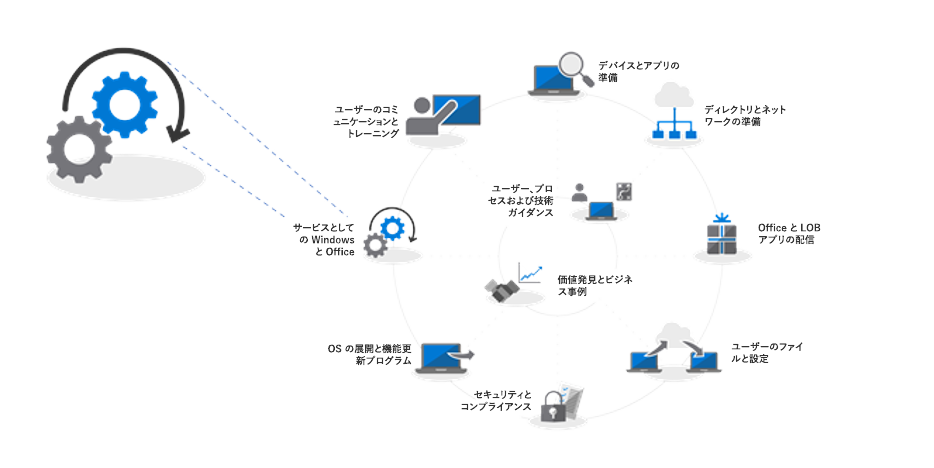
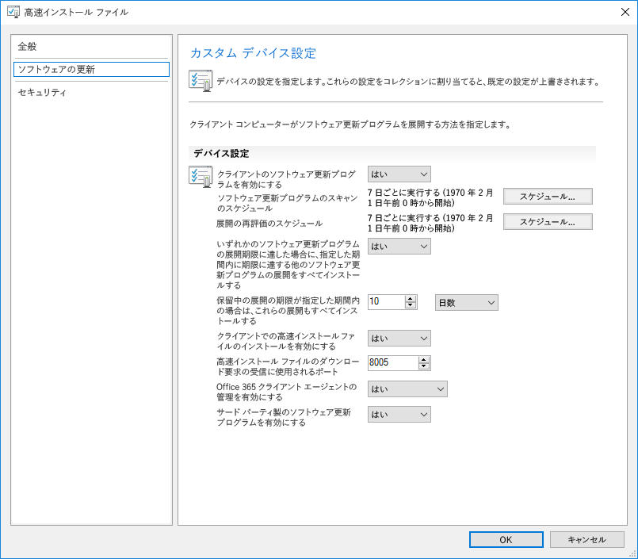
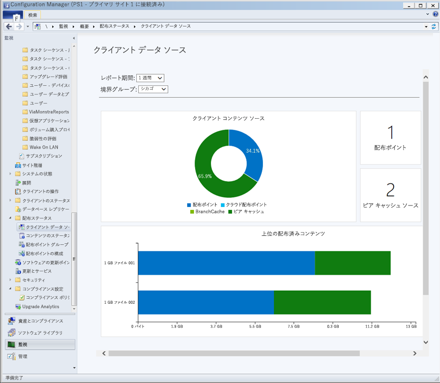
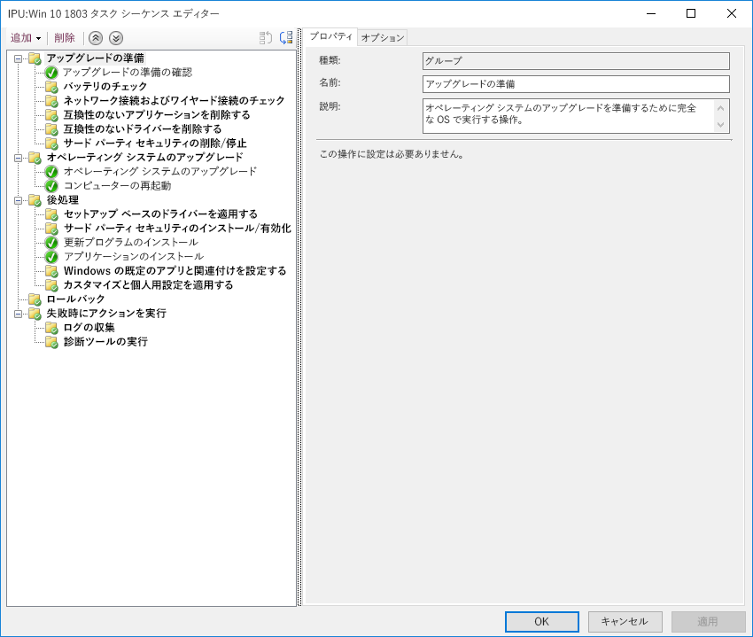

# ステップ7： WindowsとOfficeのサービス

<table>
<thead>
<td></td>
<td>
<strong>ステップ7：WindowsとOfficeのサービス</strong>

Windows 10 と Office 365 ProPlus には、最新の技術革新によりユーザー エクスペリエンスとセキュリティを継続的に維持するための新しい機能が継続的に追加されます。更新プログラムを半期ごと、および毎月適用して最新の状態を維持する方法について説明します。また、新しいサービス モデルがどのように機能し、どういったツールやオプションを利用できるのかについても紹介します。
</td>
<td></td>
</thead>
</table>

>[!NOTE]
>WindowsおよびOfficeサービスは、半年ごとの機能更新に備えるための計画サイクルを統括する、推奨展開プロセスの第7段階です。 完全なデスクトップ展開プロセスを確認するには、[デスクトップ展開センター](https://aka.ms/HowToShift)にアクセスしてください。
>

Windows 10とOffice 365 ProPlusの両方で、新しいサービスオプション、サポートモデル、および更新スケジュールが導入されました。 これらの変更により、常に最新機能を導入しておくプロセスを単純化することができます。 これらの更新に加えて、ご自身に合ったサービスプランを有効にするための新しい設定オプションがあります。 System Center Configuration Manager Current Branchの新機能を活用しながら、Windows 10およびOffice 365 ProPlusの新機能を提供する半期ごとのチャンネル更新の準備方法を学びましょう。

[Windows 10およびOffice 365 ProPlusへの移行を支援します](https://www.microsoft.com/ja-JP/microsoft-365/blog/2018/09/06/helping-customers-shift-to-a-modern-desktop/)

## 更新プログラムの種類

アップデートには2つの主なカテゴリがあり、機能のアップデート、そして累積されたセキュリティ、信頼性、そしてバグ修正を含んだ品質とセキュリティのアップデートに分けられます。 更新頻度では、WindowsとOffice双方で年2回、3月と9月に新機能を提供する半期ごとのチャンネルを渡しており、品質とセキュリティの更新は毎月行われます。 また、Office 365アプリケーションのみ、更新プログラムに新しい機能と品質更新プログラムの両方が含まれる、月ごとの完全サポートチャンネルオプションを提供します。

デスクトップ OS の更新プログラムとアプリの更新プログラムの長いサイクルをご存知であれば、以下のような疑問点が出てくるかと思います。

  - 更新プログラムに互換性はあるのか

  - ユーザーの再トレーニングは必要なのか

  - どんなリスクがあるか

上記疑問の解消につながるよう、以下に新しい機能を頻繁に提供する理由とその利点をいくつか挙げています

### 機能の更新の利点

まず、3 年ごとに大規模な変更を加える過去のモデルから、年に 2 回の機能更新を行う小規模な変化へと移行しました。テクノロジの動向は急速に変化し、セキュリティ上の脅威も増え続けており、頻繁な機能更新を行えばエクスペリエンスと保護を最新の状態に保てるというのが主な理由です。たとえば、セキュリティに関連する更新プログラムの一部は、毎月のセキュリティ更新プログラムやウイルス対策シグネチャ ファイルだけでは配信できません。仮想化ベースのセキュリティのような低レベルの変更のプラットフォームなどがこの例に該当します。

[サービスとしての Windows のクイック ガイド](https://docs.microsoft.com/ja-JP/windows/deployment/update/waas-quick-start)

[Windows 10 のセキュリティ機能を使用して脅威を軽減する](https://docs.microsoft.com/ja-JP/windows/security/threat-protection/overview-of-threat-mitigations-in-windows-10%20%20)

### 累積的な更新モデルの利点

また、累積的な更新プログラムのパッケージとして品質およびセキュリティの更新プログラムを提供することは、過去の多くの問題を修正します。これまでは、Windows と Office の両方について、毎月 12 個以上の更新プログラムを選択しなければならない場合がありました。その場合、サポートがほぼ不可能な一連のテスト行列が作成されてしまいます。また、1 年以上経過した Windows または Office のバージョンをインストールする場合、そのバージョンのリリース後に配信されたすべての更新プログラムの適用には、数時間または数日かかる場合があります。

累積モデルでは、常に最新のものから 1 つの更新が行われます。そのため、導入する必要がある毎月の更新プログラムの数が減ります。それぞれの更新プログラムは、過去数か月の更新に基づいて構成されており、最新の状態に保つために必要なすべての修正プログラムが含まれています。特に、数か月間 PC の電源が切られている場合は、PC が別のユーザーに再割り当てされるのを待機している保存状態にあるため、累積的な更新プログラムが特に役立ちます。

### 更新プログラムの検証の範囲が拡大

もう1つの利点は、広範環境への更新を展開する前に、まず[Office](https://products.office.com/en-us/office-insider?tab=Windows-Desktop)および[Windows ](https://insider.windows.com/ja-JP/)用のInsiderプログラムを介してビルドを配信します。これにより、広くアップデートを配信する前に、私達が統計データやフィードバックを集計することが可能になります。 Insiderプログラムはどなたにも開かれており、アップデートを先立って確認することができます。 アップデートを配信するときには、何百万もの設定から統計データを受け取ることになるので、実際のアップデートを展開時には、より本質的に品質が予測しやすくなります。

もう 1 つの点として、Office 365 ProPlus の Insider ビルドに月次チャネルの更新が反映されるため、Windows に準じて、Office に半期チャネルを適用して機能の更新プログラムを年に 2 回配信する場合は、半期チャネル対象のリリースによる半期ごとの検証を早期に行うことができます。

### 管理ツールをサポート

更新プログラムの展開をどのようにシームレスに行うかについても検討を重ねました。Windows、Office、その他の新しい機能に対する更新プログラムの公開をサポートするために、System Center Configuration Manager の Current Branch は頻繁に更新されています。

[System Center Configuration Manager を使用した Windows 10 更新プログラムの展開](https://docs.microsoft.com/ja-JP/windows/deployment/update/waas-manage-updates-configuration-manager)

[Configuration Manager を使用した Office 365 ProPlus の管理](https://docs.microsoft.com/ja-JP/sccm/sum/deploy-use/manage-office-365-proplus-updates)

## WindowsとOfficeチャンネルの概要

Windows 10は3つのサービスチャンネルを提供します。

- [** Windows Insiderプログラム**](https://docs.microsoft.com/ja-JP/windows/deployment/update/waas-overview#windows-insider)、組織が次回の機能アップデートで出荷される機能についてテスト、フィードバックを行えるようにする
- **Semi-Annualチャンネル**、Feature Updateの配信で年2回、新機能を提供
- **長期保守チャネル**、長期保守オプションを必要とする専用機に特化して設計

Office 365は3つのサービスチャンネルを提供します。

- [**Office Insiderプログラム**](https://support.office.com/ja-JP/article/What-is-Office-Insider-f4208185-b63a-4b68-9c7a-9a32d2411c16)、開発中の最新のOffice性能および機能についてテストし、フィードバックを行えるようにする
- **マンスリーチャンネル**、利用可能になり次第、ユーザーに最新のOffice機能を提供する
- **Semi-Annualチャンネル**、年2回限定で、新しい機能の実装を提供
- **Semi-Annualチャンネル（特定）**、パイロットユーザーとアプリケーション互換性テスト担当者が次回のSemi-Annualチャンネルをテスト、検証できる、完全にサポートされたOfficeビルド

WindowsとOfficeのサービスチャネルの詳細については、以下のドキュメントを参照してください。

- [サービスとしてのWindowsの概要](https://docs.microsoft.com/ja-JP/windows/deployment/update/waas-overview#servicing-channels)
- [ Office 365 ProPlusの更新チャンネルの概要](https://docs.microsoft.com/ja-JP/DeployOffice/overview-of-update-channels-for-office-365-proplus#BKMK_SAC)

## 更新プログラムの段階的な展開

ここで、これらの更新プログラムの公開の方法について説明します。いずれのリリースについても、IT の少なくとも 3 つの導入フェーズ (検証、パイロット、幅広い製品展開) を取り入れることを推奨します。Windows 10 および Office 365 ProPlus を起動し実行してからは、毎月のサービスを使用し、セキュリティと品質に関する重要な更新プログラムを適用して最新の状態に保ちます。その後、新しい機能向けに半期のサービスに移行します。

### 毎月の更新

サービス モデルは、新機能の公開を年 2 回に制限するように設計されており、必要に応じて半期の更新をスキップして、品質とセキュリティの更新プログラムを引き続き受信することもできます。前述のように、毎月の累積的な更新プログラムは、月ごとにサイズが増加していきます。

#### 簡易更新プログラム

Windows の「簡易更新プログラム」と、Office のバイナリ差分圧縮と呼ばれる技術を使用して、ダウンロード サイズを大幅に削減することができます。どちらのアプローチでも、更新プログラムのエンジンは PC に何があるかを比較し、その PC 上で更新する必要な差分のみを検出します。

[Windows 10 の品質の更新プログラムの説明と、差分更新プログラムの終了](https://techcommunity.microsoft.com/t5/Windows-IT-Pro-Blog/Windows-10-quality-updates-explained-amp-the-end-of-delta/ba-p/214426)

Windows Update for Business および Windows Server Update Services では簡易更新プログラムを長期間サポートしてきましたが、System Center Configuration Manager でも簡易更新プログラムを利用できるようにサポートを拡張しました。

#### バイナリ差分圧縮

Office のバイナリ差分圧縮は、Office 365 ProPlus の最新バージョンから更新する場合にのみ使用します。このアプローチを使用するには、以前のビルドから更新する必要があり、更新のスキップはできません。

Windows および Office の更新プログラム チャネルは、標準レベルの承認およびターゲット プロセスを使用して Configuration Manager で管理できます。さらに、Office および Windows のポリシー設定で、使用中の更新プログラム チャネルと関連する設定を適用することができます。

### 半期の更新プログラム

月次更新について考慮しているなら、この機会に、より規模の大きな半期の更新プログラムに移行しましょう。

デバイスとアプリの準備で網羅したように、展開プロセス全体の手順 1 でセットアップしたのと同じ準備ツールを使用して、この大規模な更新プログラムの準備を開始します。

ツールに関しては、Windows Update for Business でのポリシー設定、System Center Configuration Manager によるソフトウェアの更新管理、Windows Server Update Services (WSUS)、または Microsoft Intune で設定された更新ポリシーを使用できます。ネットワーク帯域幅に関して懸念がある場合は、「手順 2: ディレクトリとネットワークの準備」を参照してください。配信の最適化や他のピアツーピアのキャッシング技術によるネットワーク トラフィック削減に関するオプションの詳細を確認できます。

[Windows の半期チャネル](https://docs.microsoft.com/ja-JP/windows/deployment/update/waas-overview#semi-annual-channel)

[Office 365 ProPlus の半期チャネル](https://docs.microsoft.com/ja-JP/DeployOffice/overview-of-update-channels-for-office-365-proplus#BKMK_SAC)

#### タスク シーケンスのアップグレード

標準レベルのソフトウェア更新管理のルーチンによる大きな機能の更新プログラムのインストールもサポートされていますが、多くの組織では System Center Configuration Manager でのアップグレードのタスク シーケンス、または Microsoft Deployment Toolkit を使用することを選びます。

タスク シーケンスを使用すると、機能の更新プログラムをインストールする前にカスタム チェックやタスクを作成でき、更新プログラムのインストール自体が完了した後にカスタム タスクを実行できます。更新、ドライバーのインストールと置き換え、アプリケーションのアップグレード、タスクバーおよび Windows 10 のスタート画面の個人用設定などで、必要に応じてサービスを一時停止することも、更新後のタスクに含まれます。

Windows 7 のコンピューターを Windows 10 に移行するために既にタスク シーケンスを使用していて、それらのツールに精通している場合は、移行を開始することをお勧めします。移行後は操作性も格段に向上します。アップグレード全体で 1 つのみのタスク シーケンスを使用することはできますが、組織では 2 つのタスク シーケンスを使用するのが一般的です。1 つのタスク シーケンスは、コンピューターがアップグレードの準備ができていることを確認し、対象のコンピューター上に必要なセットアップ ファイルすべてを、ダイアログを表示せずに事前にステージングします。もう 1 つのタスク シーケンスは実際のアップグレードを行います。このアプローチにより、ユーザーの生産性の低下を防ぐことができます。

[Configuration Manager で OS をアップグレードするタスク シーケンスを作成する](https://docs.microsoft.com/ja-JP/sccm/osd/deploy-use/create-a-task-sequence-to-upgrade-an-operating-system)

#### 機能の更新プログラム向けの半期チャネルのサポート

[2018 年 9 月の発表](https://www.microsoft.com/ja-JP/microsoft-365/blog/2018/09/06/helping-customers-shift-to-a-modern-desktop/)にもあるように、半期チャネルの更新プログラムでサポートされているタイムラインには、次のモデルが使用されます。

  - Windows 10 Enterprise および Windows 10 Education でサポートされている機能のすべての更新プログラムは、バージョン 1607 以降、元のリリース日から 30 か月間サポート。

  - 更新を 9 月に予定している 1809 以降の今後のすべての機能更新プログラムは、リリース日から 30 か月間サポート。

  - 更新を 3 月に予定している機能更新プログラムで、1903 以降のものは、引き続きリリース日から 18 か月間サポート。

  - Office 365 ProPlus の半期の更新プログラムは、引き続き 18 か月間サポート

#### 他のセットアップの自動オプション (タスク シーケンス以外)

アップグレード タスク シーケンスを使用しない場合、現在はカスタム アクションの実行やドライバー ファイルの適用ができます。この操作は、プレインストールでの機能の更新中 (セットアップによる互換性のチェック前)、またはコミット前の段階 (アップグレードの適用前) に実施します。

[Windows 10 のセットアップの新機能 (バージョン 1803)](https://docs.microsoft.com/ja-JP/windows/whats-new/whats-new-windows-10-version-1803%23windows-setup)

## 次の手順 

## [手順 8: ユーザーのコミュニケーションとトレーニング](https://aka.ms/mdd8)

## 前の手順 

## [手順 6: OS の展開と機能の更新](https://aka.ms/mdd6)