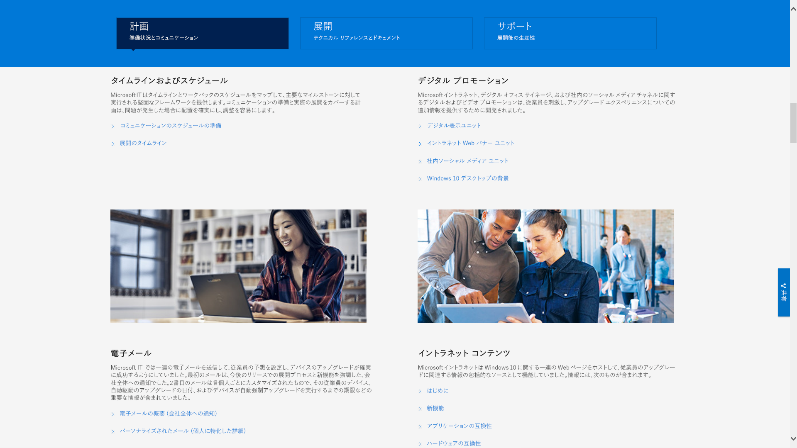

# 手順 8: ユーザーのコミュニケーションとトレーニング

<table>
<thead>
<td></td>
<td>
<strong>手順 8: ユーザーのコミュニケーションとトレーニング</strong>

PC を Windows 10 や Microsoft 365 Apps for enterprise に移行するにあたり、新しい作業環境と作業方法について、ユーザーに通知してください。Microsoft FastTrack の採用のユーザーへの支援方法、トレーニング資料やコミュニケーション テンプレートの利用方法、ユーザー受け入れや利用を監視する新しい方法について説明します。
</td>
<td></td>
</thead>
</table>

>[!NOTE]
>ユーザーのコミュニケーションとトレーニングは、推奨の展開プロセスの 8 番目の手順であり、ユーザーへの通知と準備のためのヒントと推奨事項をカバーしています。 デスクトップ展開プロセス全体を確認するには、[デスクトップ展開センター](https://aka.ms/HowToShift)を参照してください。
>

Office 365、Windows 10、Azure Active Directory での新しいセキュリティとコンプライアンス コントロールなどの最新の作業環境について、ユーザーに通知し、準備することが、導入を推進するために不可欠です。 ここでは、生産性の低下やワークフローの変更、あるいは新しいことを学ばなければならないといったことに不安を覚えている一部のユーザーに、更新プログラムを紹介する方法のヒントについて説明します。

幸いなことに、Windows 7 と Office 2010 または Office 2013 から移行する場合、個人のデバイスで Windows 10 および Office の新しいバージョンが普及しているため、変更による影響はそれほど大きくありません。

## 新しい操作環境の準備を整える

まず Office についてですが、初めて Microsoft 365 Apps for enterprise を展開する場合、Office アプリにサインインし、ファイルを OneDrive または SharePoint に保存すると、共有が簡単にでき、ファイルの分岐を抑え、リアルタイムの共同編集を実現できるという利点について説明できます。

これらおよびその他のロカール アプリ、Teams や Planner などのブラウザー ベースのアプリについては、詳細なコミュニケーションとトレーニングのテンプレートが利用可能です。

また、Outlook での OneDrive にリンクしたファイルの添付、Morph スライドの遷移機能や PowerPoint の Designer 機能など、新しいアプリ内の機能を初めて使う方のためにガイダンスが用意されています。

Windows 10 の場合、生体認証を使用して安全にログインするための Windows Hello、Windows 作業環境をパーソナライズするための Start アップデート、それまでの作業内容に簡単に戻ることのできる Timeline、Cortana など、オプションおよび既定の機能をユーザーが理解できるように支援します。

また、ユーザーが Enterprise Mobility + Security に公開できるセキュリティやコンプライアンス コントロールもあります。Azure AD と Microsoft Intune で構成される Enterprise Mobility + Security は、デスクトップ アップグレードの対象になる Windows 10 および Office 365 に追加機能を統合します。

[Microsoft Enterprise Mobility + Security](https://www.microsoft.com/cloud-platform/enterprise-mobility-security)

たとえば多要素認証を有効にした場合などに、これは Azure AD を使用し、携帯電話アプリや PIN などを利用してユーザーのリソースへのサインインを保護し、サービスに安全にアクセスできるようにします。また、Azure Information Protection により、ユーザーはドキュメントを簡単に分類し、ラベル付けすることができます。

[ユーザーの多要素認証を設定する](https://docs.microsoft.com/microsoft-365/admin/security-and-compliance/set-up-multi-factor-authentication)

ユーザーにとっては新しい機能がいくつかありますが、その中には、肯定的にしろ、そうでないにしろ、意外なものと捉えられるものがあります。こういった意外性によって、特に通常の業務フローを変更しなければならない場合には、開発者やヘルプデスクへの電話やチケットが増加することがあります。

## 事前の準備とロールアウトの計測

ユーザー エクスペリエンスの変更に関連するリスクを最小限に抑えるために、2 つの補完的なアプローチをお勧めします。

  - ユーザーへの事前通知による、想定される動作の周知

  - 展開リングによる展開の速度の制御

### 段階的な展開

展開リングを使用した段階的な展開とは、少人数のグループから始め、その展開スケールを時間の経過とともに広げていくという概念です。通常、コミュニケーションとトレーニング計画が策定されるまでに、このリングとそれぞれのメンバーを形成しておきます。このようにして潜在的なリスクを削減し、展開を拡大していく中でアプローチを検証し、たとえばヘルプデスクへの電話が予想より多くなった時点で、必要に応じてアクティビティを一時停止することができます。

各部署とそれぞれのマネージャーの連携により、最適な展開リングが作成されます。展開や変更を避けたい重要な日時などは、把握しておかなければなりません。計画や関係者からの購入は、綿密に行わないと、ユーザーにとっては、開始が困難になったり、これから生じる何らかの変更を快適に行ったりすることができなくなります。

### フェーズ 1: IT チームと早期に導入する内部関係者 

通常、展開は IT チーム、および早期アクセスを志願する積極的な早期導入者から始めることをお勧めします。このような「内部関係者」とともに、コミュニケーションや変更による影響、コミュニケーションとトレーニングの効果をテストすることができます。このフェーズ中、IT は小規模のパイロットで稼働させ、さらに展開フェーズを拡大したときのためのトラブルシューティングと自動化の手法を学習します。

最初のパイロット フェーズでは、メンバーの取り組みが重要であり、観察点とプロセスへのフィードバックを必ず文書化します。また、新しい機能を有機的に、口コミで拡大するような IT チーム以外のメンバーも必要です。このようなメンバーは、後のフェーズでユーザーが支援を必要としたときの最初のサポート ラインにもなります。

### フェーズ 2: パイロット 

最初のフェーズで満足できたら、2 番目のパイロット フェーズとしてさらにユーザー数を拡大します。これはユーザーの役割、各種デバイス、各種 Windows アプリや Office アドインなどの代表的な組み合わせで構成されます。このようなグループから返されるデータは、さらに展開を拡大するフェーズ 3 の第一弾のために Analytics で使用されます。

これ以降のフェーズでは、すべての PC は Analytics サービスにログインするため、デバイスとアプリの正常性、配信の最適化による帯域幅の節約、および Windows Hello ログインの使用に関する診断データを収集することができます。

このフェーズでは、特に変更についてコミュニケーションをとり、新しい機能をユーザーが利用できるように支援することが重要です。ユーザーは IT から送信されるメールやその他の通知を最優先とはみなさず、無視する場合もあります。そのため、経営層とミーティングを実施し、新しいツールやテクノロジへの変更や導入についてコミュニケーションをとれるように支援する必要があります。

また、タイムフレームへの入力の必要性をなくし、ユーザーの作業中断を最小限に抑えることができます。たとえば、財務チームであれば期末、製品開発チームであれば製品発売時には特に神経をすり減らします。

デバイス、ユーザー、部門、タイミングの計画と並行して、コミュニケーションとトレーニングの計画策定を開始し、コンテンツ編集、またはユーザーのトレーニングを支援する外部リソースを確保することができます。

#### Microsoft FastTrack 

トレーニング用コンテンツを充実させるために、Microsoft FastTrack 生産性向上ライブラリには、動画ベースのトレーニングを段階的なガイドを付けてまとめた一連の短いビデオが用意されています。

[Microsoft FastTrack 生産性向上ライブラリ](https://www.microsoft.com/microsoft-365/success/?rtc=2)

組織が必要とするものに応じて、説得力のあるコンテンツの作成、サイトとコンテンツの共有、チームワークの変革、最新のデバイスによる生産性の向上など、数百ものトピックが用意されています。

また、Microsoft 365 または Office 365 を使用している場合は、Microsoft FastTrack サービスを使用して、ユーザーによる導入の推進を支援できるようになる機会があります。Microsoft 365 (Windows、Office、および EMS) のロールアウト プロセスを介して、担当者がベスト プラクティスの採用を支援します。

#### Microsoft IT ショーケース 

Microsoft の IT ショーケース シリーズも、Windows 10 の展開に関連するコンテンツの重要なリソースであり、タイムラインとスケジュール、デジタル プロモーション テンプレート、電子メール テンプレートおよびイントラネットのコンテンツが含まれています。これらは Windows 10 の Microsoft 独自の展開に使用される材料に基づいており、使用する組織用に修正されています。

[Windows 10 をシームレスに展開するための組織の準備](https://www.microsoft.com/itshowcase/windows10deployment)

これらのコンポーネントとサービスは、パイロット フェーズでまとめて微調整することができます。また、トレーニング側で何がユーザーに影響しているか、どのデバイスを対象として Analytics を使用するか、どのデバイスまたはユーザー グループを回避または遅延させるかを把握することから始めると、そのデータとエクスペリエンス主体のアプローチによって、後のフェーズで展開を拡大できるようになります。

パイロットが拡大するにつれ、よく寄せられる質問とセルフサービス コンテンツを文書化して公開し、サポート チケットとヘルプデスクへの問い合わせを削減できるよう、事前に対処できます。

### フェーズ 3 以降: さまざまな運用環境への展開 

拡大展開フェーズに達するまでには、プロセス、コミュニケーション、トレーニング、セルフサービス ツールの微調整が完了しています。 この時点で、収集した診断データを使用して、さらに多くの PC を対象にできます。

IT 部門、ヘルプデスク、ユーザー、およびネットワークの容量で管理できる速さで展開します。展開プロセスのサイクルでは、いつでも手順 2 に戻り、展開に関連するデータの高速転送が促進されるように、さらにピア ツー ピア キャッシュ、LEDBAT、その他の展開関連データの移送の高速化を容易にする手法を使用して、ネットワークを最適化することができます。

分析ツールを使用して監視する診断データに加えて、管理センターのワークロードや Power BI 経由の管理ダッシュボードによる詳しい使用状況レポートを使用して、Office 365 と Microsoft 365 サービスの使用状況を詳細に監視することもできます。 これらは、Microsoft Teams などの共同作業の新しいツールや、OneDrive などのファイル共有の新しい方法をロールアウトする場合に、目標の設定と追跡を支援する優れたツールです。

新しいテクノロジの受け入れと採用は、組織内のすべての PC に Windows 10 と Microsoft 365 Apps for enterprise がインストールされた後も続きます。また、ユーザーは、業務遂行の方法を必ずしも変更する必要はなく、新しい機能の周知とトレーニングに時間をかける必要もありません。つまり、Windows で半期、Office で 1 か月 (オプション) を予定する、新機能を提供するための新しいサービス提供モデルによって、継続的にコミュニケーションがとられます。

## 前の手順 

## [手順 7: Windows と Office サービス](https://aka.ms/mdd7)
