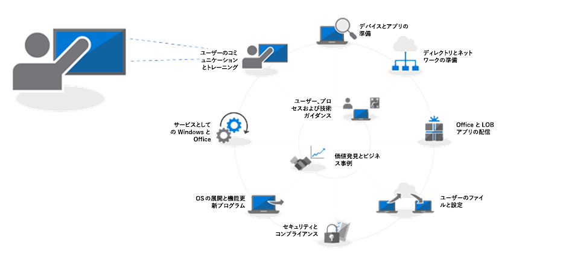
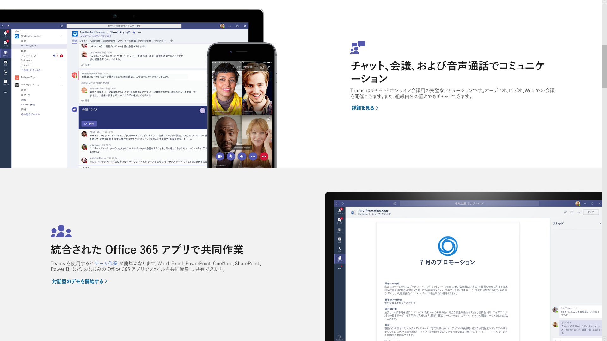
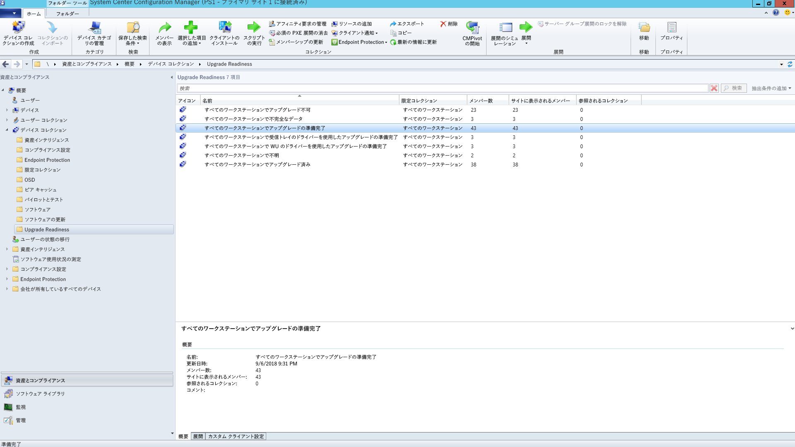
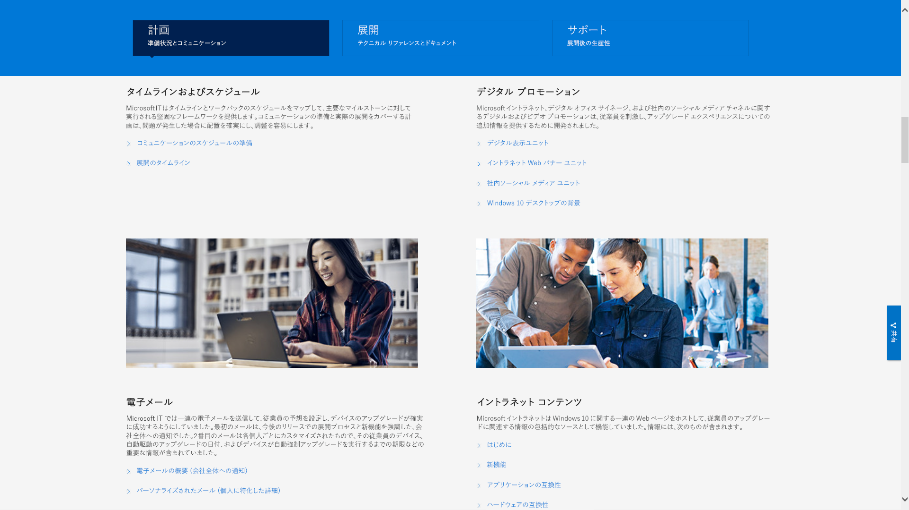

# 手順 8: ユーザーのコミュニケーションとトレーニングStep 8: User Communications and Training

<table>
<thead>
<td></td>
<td>
<strong>手順 8: ユーザーのコミュニケーションとトレーニング</strong><strong>Step 8: User Communication and Training</strong>

PC を Windows 10 や Office 365 ProPlus に移行するにあたり、新しい作業環境と作業方法について、ユーザーに通知してください。Microsoft FastTrack によるユーザー採用支援、トレーニング資料とコミュニケーション テンプレートの利用方法、ならびに、ユーザー受け入れや使用状況を監視する新しい方法について説明します。Make sure your users are informed about new experiences and new ways of working as you shift your PCs to Windows 10 and Office 365 ProPlus. Learn how to take advantage of user adoption assistance with Microsoft FastTrack, training materials and communication templates, as well as new ways to monitor user acceptance and usage.
</td>
<td></td>
</thead>
</table>

>[!NOTE]
>ユーザーのコミュニケーションとトレーニングは、推奨の展開プロセスの 8 番目の手順であり、ユーザーへの通知と準備のためのヒントと推奨事項をカバーしています。User Communications and Training is the eighth step in our recommended deployment process wheel by covering tips and recommendations to inform and prepare users. デスクトップ展開プロセス全体を確認するには、[デスクトップ展開センター](https://aka.ms/HowToShift)を参照してください。To see the full desktop deployment process, visit the [Desktop Deployment Center](https://aka.ms/HowToShift).
>

Office 365、Windows 10、Azure Active Directory での新しいセキュリティとコンプライアンス コントロールなどの最新の作業環境について、ユーザーに通知し、準備することが、導入を推進するために不可欠です。Informing and preparing your users for modern workplace experiences spanning Office 365, Windows 10, and new security and compliance controls with Azure Active Directory is critical to driving adoption. ここでは、生産性の低下やワークフローの変更、あるいは新しいことを学ばなければならないといったことに不安を覚えている一部のユーザーに、更新プログラムを紹介する方法のヒントについて説明します。The trick here is to figure out how to introduce updates -- when some users may fear disruptions to their productivity or changes in their workflow, or if they have to learn new things.

幸いなことに、Windows 7 と Office 2010 または Office 2013 から移行する場合、個人のデバイスで Windows 10 および Office の新しいバージョンが普及しているため、変更による影響はそれほど大きくありません。The good news is if you are moving from Windows 7 and Office 2010 or Office 2013, there will be a lot of people familiar with Windows 10 and newer versions of Office running on their personal devices, and all this will help reduce the impact of change.

## 新しい操作環境の準備を整えるGetting ready for new experiences

まず Office についてですが、初めて Office 365 ProPlus を展開する場合、Office アプリにサインインし、ファイルを OneDrive または SharePoint に保存すると、共有が簡単にでき、ファイルの分岐を抑え、リアルタイムの共同編集を実現できるという利点について説明できます。Starting with Office, if you’re deploying Office 365 ProPlus for the first time, this is when you can communicate the benefits of signing in to Office apps and saving files to OneDrive or SharePoint locations to enable easier sharing, reduce file branching and enable real-time co-authoring.

これらおよびその他のロカール アプリ、Teams や Planner などのブラウザー ベースのアプリについては、詳細なコミュニケーションとトレーニングのテンプレートが利用可能です。Detailed communication and training templates are available for these and other local or browser-based apps, like Teams and Planner.

また、Outlook での OneDrive にリンクしたファイルの添付、Morph スライドの遷移機能や PowerPoint の Designer 機能など、新しいアプリ内の機能を初めて使う方のためにガイダンスが用意されています。We also give guidance for new in-app capabilities like attaching OneDrive linked files in Outlook or using the new Morph slide transitions and Designer features in PowerPoint.

Windows 10 の場合、生体認証を使用して安全にログインするための Windows Hello、Windows 作業環境をパーソナライズするための Start アップデート、それまでの作業内容に簡単に戻ることのできる Timeline、Cortana など、オプションおよび既定の機能をユーザーが理解できるように支援します。For Windows 10, we help you to familiarize your users with optional and default capabilities like Windows Hello to log in securely using biometrics, Start updates to personalize your Windows experience, Timeline to easily get back to what you were working on, Cortana and more.

また、ユーザーが Enterprise Mobility + Security に公開できるセキュリティやコンプライアンス コントロールもあります。Azure AD と Microsoft Intune で構成される Enterprise Mobility + Security は、デスクトップ アップグレードの対象になる Windows 10 および Office 365 に追加機能を統合します。There are also visible security and compliance controls that your users may be exposed to. Enterprise Mobility + Security which comprises Azure AD and Microsoft Intune, integrates additional capabilities with Windows 10 and Office 365 that you can target for your desktop upgrade.

[Microsoft Enterprise Mobility + SecurityMicrosoft Enterprise Mobility + Security](https://www.microsoft.com/en-us/cloud-platform/enterprise-mobility-security)

たとえば多要素認証を有効にした場合などに、これは Azure AD を使用し、携帯電話アプリや PIN などを利用してユーザーのリソースへのサインインを保護し、サービスに安全にアクセスできるようにします。また、Azure Information Protection により、ユーザーはドキュメントを簡単に分類し、ラベル付けすることができます。For example, if you've enabled Multi-factor Authentication, this uses Azure AD --and protects user sign-in to resources by leveraging a phone app or PIN to securely access services. And Azure Information Protection makes it easy for users to classify and label documents.

  [Office 365 の多要素認証を設定する](https://support.office.com/ja-JP/article/set-up-multi-factor-authentication-for-office-365-users-8f0454b2-f51a-4d9c-bcde-2c48e41621c6)[Set up multi-factor authentication for Office 365 users](https://support.office.com/en-us/article/set-up-multi-factor-authentication-for-office-365-users-8f0454b2-f51a-4d9c-bcde-2c48e41621c6)

ユーザーにとっては新しい機能がいくつかありますが、その中には、肯定的にしろ、そうでないにしろ、意外なものと捉えられるものがあります。こういった意外性によって、特に通常の業務フローを変更しなければならない場合には、開発者やヘルプデスクへの電話やチケットが増加することがあります。These are just a handful of new capabilities that will be experienced by your users and some may catch them by surprise – either in a positive or less positive way. And these surprises – especially if they alter the normal work flow – can result in more calls and tickets for you or your helpdesk.

## 事前の準備とロールアウトの計測Proactive Preparation and Measured Roll-outs

ユーザー エクスペリエンスの変更に関連するリスクを最小限に抑えるために、2 つの補完的なアプローチをお勧めします。To help minimize the risk associated with changes in the user experience, we recommend two complementary approaches:

  - ユーザーへの事前通知による、想定される動作の周知Proactive communication to your users so they know what to expect

  - 展開リングによる展開の速度の制御Use of deployment rings to control the rate of deployment

### 段階的な展開Phased Deployment

展開リングを使用した段階的な展開とは、少人数のグループから始め、その展開スケールを時間の経過とともに広げていくという概念です。通常、コミュニケーションとトレーニング計画が策定されるまでに、このリングとそれぞれのメンバーを形成しておきます。このようにして潜在的なリスクを削減し、展開を拡大していく中でアプローチを検証し、たとえばヘルプデスクへの電話が予想より多くなった時点で、必要に応じてアクティビティを一時停止することができます。Phased deployment using deployment rings is the concept of starting with small groups then broadened deployment scale in a measured way over time. Normally by the time a communication and training plan is drafted, these rings and their members should be formed. This way, you can reduce potential risk and validate your approach as you continually open the deployment valve, or pause activities if needed, for example, when you see more helpdesk calls come in than expected.

各部署とそれぞれのマネージャーの連携により、最適な展開リングが作成されます。展開や変更を避けたい重要な日時などは、把握しておかなければなりません。計画や関係者からの購入は、綿密に行わないと、ユーザーにとっては、開始が困難になったり、これから生じる何らかの変更を快適に行ったりすることができなくなります。Deployment rings are best created in cooperation with business units and their managers. You’ll want an understanding of critical dates and times to avoid when deploying or making changes. Without careful planning and buy-in from stakeholders, it will be difficult to get users on-board and comfortable with any changes coming their way.

### フェーズ 1: IT チームと早期に導入する内部関係者Phase 1: The IT Team and Early Adopter Insiders 

通常、展開は IT チーム、および早期アクセスを志願する積極的な早期導入者から始めることをお勧めします。このような「内部関係者」とともに、コミュニケーションや変更による影響、コミュニケーションとトレーニングの効果をテストすることができます。このフェーズ中、IT は小規模のパイロットで稼働させ、さらに展開フェーズを拡大したときのためのトラブルシューティングと自動化の手法を学習します。It’s usually best to begin your deployment with the IT team and enthusiastic early adopters, who volunteer for early access. With these “insiders” you can test your communications, the impacts of change and the effectiveness of your communications and training. During this phase, IT runs small pilots, learns troubleshooting and automation techniques to help during broader deployment phases.

最初のパイロット フェーズでは、メンバーの取り組みが重要であり、観察点とプロセスへのフィードバックを必ず文書化します。また、新しい機能を有機的に、口コミで拡大するような IT チーム以外のメンバーも必要です。このようなメンバーは、後のフェーズでユーザーが支援を必要としたときの最初のサポート ラインにもなります。It’s important to have engaged members in the initial pilot phase, to make sure they are documenting their observations and feeding back to the process. Also, it’s good to have champions outside the IT team that help extend organic, word-of-mouth communication of new capabilities, and they’ll often be first line of support when users in later phases need help.

### フェーズ 2: パイロットPhase 2: Pilot 

最初のフェーズで満足できたら、2 番目のパイロット フェーズとしてさらにユーザー数を拡大します。これはユーザーの役割、各種デバイス、各種 Windows アプリや Office アドインなどの代表的な組み合わせで構成されます。このようなグループから返されるデータは、さらに展開を拡大するフェーズ 3 の第一弾のために Analytics で使用されます。Once you feel good about the first phase, you can target a larger set of users for your second, pilot phase. This should comprise a representative mix of user roles, device types, Windows apps and Office add-ins. The data returning from these groups will be used via Analytics to target the initial waves for phase 3, the broader deployment.

これ以降のフェーズでは、すべての PC は Analytics サービスにログインするため、デバイスとアプリの正常性、配信の最適化による帯域幅の節約、および Windows Hello ログインの使用に関する診断データを収集することができます。Remember, all PCs in this phase and future phases should be logging up to the Analytics service, so you can collect diagnostic data about device and app health as well as bandwidth savings from Delivery Optimization and use of Windows Hello login.

このフェーズでは、特に変更についてコミュニケーションをとり、新しい機能をユーザーが利用できるように支援することが重要です。ユーザーは IT から送信されるメールやその他の通知を最優先とはみなさず、無視する場合もあります。そのため、経営層とミーティングを実施し、新しいツールやテクノロジへの変更や導入についてコミュニケーションをとれるように支援する必要があります。For this phase it is especially important to communicate changes and help users take advantage of new capabilities. Users can often de-prioritize or ignore email or other communications coming from IT – so it helps to meet with management to get their help in communicating change and drive adoption of new tools and technology.

また、タイムフレームへの入力の必要性をなくし、ユーザーの作業中断を最小限に抑えることができます。たとえば、財務チームであれば期末、製品開発チームであれば製品発売時には特に神経をすり減らします。You’ll also need their input on timeframes to avoid, so you can minimize user disruption – for example the finance team may be particularly sensitive at the end of fiscal quarters or product development teams during a product launch.

デバイス、ユーザー、部門、タイミングの計画と並行して、コミュニケーションとトレーニングの計画策定を開始し、コンテンツ編集、またはユーザーのトレーニングを支援する外部リソースを確保することができます。In parallel to planning for devices, users, departments and timing, you can start to build your communication and training plans, as well as begin compiling content or engaging outside resources to help train users.

#### Microsoft FastTrackMicrosoft FastTrack 

トレーニング用コンテンツを充実させるために、Microsoft FastTrack 生産性向上ライブラリには、動画ベースのトレーニングを段階的なガイドを付けてまとめた一連の短いビデオが用意されています。To help your effort in pulling together training content, you can access a comprehensive set of short, video-based training with step-by-step instructional guidance on the Microsoft FastTrack Productivity Library.

[Microsoft FastTrack 生産性向上ライブラリMicrosoft FastTrack Productivity Library](https://www.microsoft.com/en-us/microsoft-365/success/?rtc=2)

組織が必要とするものに応じて、説得力のあるコンテンツの作成、サイトとコンテンツの共有、チームワークの変革、最新のデバイスによる生産性の向上など、数百ものトピックが用意されています。There are hundreds of topics, based on what’s important to your organization, including: creating more impactful content, sharing sites and content, transforming teamwork and unlocking productivity with modern devices.

また、Microsoft 365 または Office 365 を使用している場合は、Microsoft FastTrack サービスを使用して、ユーザーによる導入の推進を支援できるようになる機会があります。Microsoft 365 (Windows、Office、および EMS) のロールアウト プロセスを介して、担当者がベスト プラクティスの採用を支援します。Also, if you are using Microsoft 365 or Office 365, there is good chance that you’re eligible for help with driving user adoption via Microsoft’s FastTrack service. Representatives guide you through adoption best practices as you go through the Microsoft 365 – Windows, Office and EMS – rollout process.

#### Microsoft IT ショーケースMicrosoft IT Showcase 

Microsoft の IT ショーケース シリーズも、Windows 10 の展開に関連するコンテンツの重要なリソースであり、タイムラインとスケジュール、デジタル プロモーション テンプレート、電子メール テンプレートおよびイントラネットのコンテンツが含まれています。これらは Windows 10 の Microsoft 独自の展開に使用される材料に基づいており、使用する組織用に修正されています。Microsoft’s IT Showcase series is another great resource for Windows 10 deployment-related content. It includes timelines and schedules, digital promotion templates, email templates and Intranet content. These are based on materials used for Microsoft’s own deployment of Windows 10 and has been modified for any organization to use.

[Windows 10 をシームレスに展開するための組織の準備Preparing your organization for a seamless Windows 10 deployment](https://www.microsoft.com/itshowcase/windows10deployment)

これらのコンポーネントとサービスは、パイロット フェーズでまとめて微調整することができます。また、トレーニング側で何がユーザーに影響しているか、どのデバイスを対象として Analytics を使用するか、どのデバイスまたはユーザー グループを回避または遅延させるかを把握することから始めると、そのデータとエクスペリエンス主体のアプローチによって、後のフェーズで展開を拡大できるようになります。These components and services together can be fine-tuned during the pilot phase. And as you start to realize what’s resonating with users on the training side of things, which devices to target and via Analytics and which devices or user groups to avoid or delay, you can begin to broaden your deployment in later phases using a data- and experience-driven approach.

パイロットが拡大するにつれ、よく寄せられる質問とセルフサービス コンテンツを文書化して公開し、サポート チケットとヘルプデスクへの問い合わせを削減できるよう、事前に対処できます。As your pilot expands, you’ll want to document and publish frequently asked questions and self-service content to help proactively reduce support tickets and helpdesk activities.

### フェーズ 3 以降: さまざまな運用環境への展開Phase 3 and beyond: Broad Production deployment 

拡大展開フェーズに達するまでには、プロセス、コミュニケーション、トレーニング、セルフサービス ツールの微調整が完了しています。By the time you reach broad deployment phases, you’ll have refined your processes, communication, training and self-service tools. この時点で、収集した診断データを使用して、さらに多くの PC を対象にできます。Now you can use the diagnostic data collected to target more and more PCs.

IT 部門、ヘルプデスク、ユーザー、およびネットワークの容量で管理できる速さで展開します。展開プロセスのサイクルでは、いつでも手順 2 に戻り、展開に関連するデータの高速転送が促進されるように、さらにピア ツー ピア キャッシュ、LEDBAT、その他の展開関連データの移送の高速化を容易にする手法を使用して、ネットワークを最適化することができます。Deploy at a rate that is manageable to your IT department, help desk, users and network capacity. You can always go back to Step 2 in the deployment process wheel to optimize your network even further using peer to peer cache, LEDBAT and other techniques to facilitate faster transfer of deployment-related data.

分析ツールを使用して監視する診断データに加えて、管理センターのワークロードや Power BI 経由の管理ダッシュボードによる詳しい使用状況レポートを使用して、Office 365 と Microsoft 365 サービスの使用状況を詳細に監視することもできます。In addition to the diagnostic data that you monitor via the analytics tools, you can also monitor Office 365 and Microsoft 365 service usage in a granular way with detailed usage reports in by workload in the admin center and using the admin dashboards via Power BI. これらは、Microsoft Teams などの共同作業の新しいツールや、OneDrive などのファイル共有の新しい方法をロールアウトする場合に、目標の設定と追跡を支援する優れたツールです。These are great tools to help set and track goals as you roll-out new tools for working together – like Microsoft Teams – or new ways to share files – like OneDrive.

新しいテクノロジの受け入れと採用は、組織内のすべての PC に Windows 10 と Office 365 ProPlus がインストールされた後も続きます。また、ユーザーは、業務遂行の方法を必ずしも変更する必要はなく、新しい機能の周知とトレーニングに時間をかける必要もありません。つまり、Windows で半期、Office で 1 か月 (オプション) を予定する、新機能を提供するための新しいサービス提供モデルによって、継続的にコミュニケーションがとられます。New technology acceptance and adoption will go on long after every PC in your organization has Windows 10 and Office 365 ProPlus installed. And users won’t necessarily change how they work – without taking the time to inform and train them of new capabilities. Finally, with the new servicing models providing new capabilities on an ongoing semi-annual schedule for Windows and optionally a monthly schedule for Office, communication will be continual.

## 前の手順Previous Step 

## [手順 7: Windows と Office サービスStep 7: Windows and Office Servicing](https://aka.ms/mdd7)