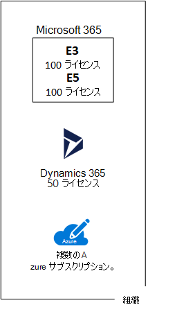

# マイクロソフトのクラウド プランのサブスクリプション、ライセンス、アカウント、およびテナント

Microsoft は、クラウド プラン全体で ID の使用と課金の一貫性を維持するために、組織、サブスクリプション、ライセンス、ユーザー アカウントなどの階層を提供しています。
  
- Microsoft 365 および Microsoft Office 365
- Microsoft Azure
- Microsoft Dynamics 365

## 階層の要素

階層の要素を以下に示します。
  
### 組織

組織は、Microsoft クラウド製品を使用しているビジネス エンティティを表します。通常は、1 つ以上のパブリック ドメイン ネーム システム (DNS) のドメイン名 (例: contoso.com) で識別されます。組織は、サブスクリプションのコンテナーになります。
  
### サブスクリプション

サブスクリプションとは、1 つ以上の Microsoft クラウドのプラットフォームやサービスを使用するための Microsoft との契約のことです。この契約では、ユーザー単位のライセンス料またはクラウドベースのリソース消費量に基づいて請求されます。 

- サービス (SaaS) ベースのクラウドプラン (Office 365および Dynamics 365)としてのMicrosoft ソフトウェアは、ユーザーごとにライセンス料金を請求します。 
- Microsoft のサービスとしてのプラットフォーム (PaaS) およびサービスとしてのインフラストラクチャ (IaaS) のクラウド サービス (Azure) では、クラウド リソースの消費量に基づいて請求されます。
 
試用版サブスクリプションを使用することもできます。ただし、このサブスクリプションは、特定の期間を過ぎるか、特定の消費料金を超えると失効します。試用版サブスクリプションは、有料サブスクリプションに変更できます。
  
組織は、Microsoft のクラウド商品の複数のサブスクリプションを所有できます。図 1 は、複数の Microsoft 365 サブスクリプション、1 つの Dynamics 365 サブスクリプション、複数の Azure サブスクリプションを持つ 1 つの組織を示しています。

**図 1: 1 つの組織に複数のサブスクリプションの例**

  
### ライセンス

Microsoft の SaaS クラウド プランの場合、1 つのライセンスで、1 つの特定のユーザー アカウントがクラウド プランのサービスを使用できるようになります。サブスクリプションの一環として、月間の固定料金が課金されます。管理者は、サブスクリプション内で個別のユーザー アカウントにライセンスを割り当てます。図 2 の例では、Contoso Corporation は 100 ライセンスの Microsoft 365 E5 サブスクリプションを所有しています。このサブスクリプションにより、最大 100 件の個別のユーザー アカウントが Microsoft 365 E5 の機能とサービスを使用できるようになります。
  
**図 2:1 つの組織の SaaS ベースのサブスクリプションに含まれるライセンス**

>[!Note]
>セキュリティのベスト プラクティスは、特定の管理機能の役割が割り当てられた個別のユーザー アカウントを使用することです。 これらの専用の管理者アカウントには、管理するクラウド サービスのライセンスを割り当てる必要はありません。 たとえば、SharePoint 管理者アカウントに Microsoft 365 ライセンスを割り当てる必要はありません。
>

Azure PaaS ベースのクラウド サービスの場合、サービス料金にソフトウェア ライセンスが組み込まれています。  
  
Azure IaaS ベースの仮想マシン場合、仮想マシン イメージにインストールしたソフトウェアまたはアプリケーションを使用するために、追加ライセンスが必要になることがあります。一部の仮想マシン イメージにはライセンス付きバージョンのソフトウェアがインストールされていて、サーバーに対する分単位の料金が費用に含まれます。その例として、SQL Server 2014 および SQL Server 2016 の仮想マシン イメージが挙げられます。 
  
一部の仮想マシン イメージには、アプリケーションの試用版がインストールされていて、試用期間の経過後も使用する場合は追加のソフトウェア アプリケーション ライセンスが必要になります。たとえば、SharePoint Server 2016 試用版仮想マシン イメージには、プレインストールされた試用版の SharePoint Server 2016 が含まれています。試用期間後に SharePoint Server 2016 の使用を続けるには、SharePoint Server 2016 のライセンスとクライアントのライセンスを Microsoft から購入する必要があります。こうした課金は Azure サブスクリプションとは別であり、仮想マシンを実行する分単位の料金がそのまま適用されます。
  
### ユーザー アカウント

すべての Microsoft のクラウド プランのユーザー アカウントは、Azure Active Directory (Azure AD) テナントに保存されます。これには、ユーザー アカウントとグループが含まれます。Azure AD テナントは、Windows サーバーベースのサービスである Azure AD Connect を使用して、既存の Active Directory Domain Services (AD DS) アカウントと同期できます。これは、ディレクトリ同期 (DirSync) と呼ばれます。
  
図 3 は、共通の Azure AD テナントを使用する組織の複数サブスクリプションの例を示しています。このテナントに組織のアカウントが格納されています。
  
**図 3:同じ Azure AD テナントを使用する組織の複数のサブスクリプション**

  
### テナント

SaaS クラウド商品の場合、テナントとはクラウド サービスを提供しているサーバーが収容された地域の場所のことです。たとえば、Contoso Corporation は、パリ本社の 15,000 人の従業員用の Microsoft 365、EMS、および Dynamics 365 サブスクリプションのホストに欧州地域を選択しています。
  
Azure PaaS サービスと、Azure IaaS でホストされる仮想マシン ベースのワークロードは、世界中の Azure データセンターのテナントを持つことができます。場所と呼ばれる Azure データセンターは、Azure PaaS のアプリやサービスまたは IaaS ワークロードの要素を作成するときに、ユーザーが指定します。
  
Azure AD テナントは、アカウントおよびグループを収容する Azure AD の特定のインスタンスです。Microsoft 365、または Dynamics 365 の有料または試用版サブスクリプションには、無料の Azure AD テナントが含まれています。この Azure AD テナントには、その他の Azure サービスは含まれていません。これは、Azure の試用版または有料のサブスクリプションと同じものではありません。
  
### 階層の概要

ここに、簡単なまとめを示します。
  
- 1 つの組織には複数のサブスクリプションを含めることができる
    
  - 1 つのサブスクリプションには複数のライセンスを含めることができる
    
  - ライセンスは個別のユーザー アカウントに割り当てできる
    
  - ユーザー アカウントは Azure AD テナントに保存できる
    
組織、サブスクリプション、ライセンス、ユーザー アカウントの関係の例を示します。
  
- パブリック ドメイン名によって識別される組織。
    
  - ユーザーライセンスのある Microsoft 365 E3 サブスクリプション。
    
    ユーザーライセンスのある Microsoft 365 E5 サブスクリプション。
    
    ユーザー ライセンスがある Dynamics 365 サブスクリプション。
    
    複数の Azure サブスクリプション。
    
  - 共通の Azure AD テナントにある組織のユーザー アカウント。
    
複数の Microsoft クラウド プランのサブスクリプションは、同じ Azure AD テナントを使用できます。このテナントは、共通 ID プロバイダーとして機能します。オンプレミスの AD DS の同期されたアカウントを収容する中央 Azure AD テナントを使用すると、クラウドをベースとしたサービスとしての ID (IDaaS) が組織に提供されます。 
  
**図 4: 同期されたオンプレミスのアカウントと組織の IDaaS**

  
図 4 は、Microsoft の SaaS クラウド プラン、Azure PaaS アプリ、Azure AD Domain Services を使用する Azure IaaS の仮想マシンにより、共通の Azure AD テナントがどのように使用されるかを示します。Azure AD Connect は、オンプレミスの AD DS フォレストを Azure AD テナントと同期します。
  
## 複数の Microsoft クラウド プランのサブスクリプションの組み合わせ

次の表では、既に所有している 1 つの種類のクラウド商品のサブスクリプション (最初の列に列挙したラベル) と、追加する別の種類のクラウド商品のサブスクリプション (列間を横切る) に基づいた、複数の Microsoft クラウド商品の可能な組み合わせ方法について説明しています。
  
||**Microsoft 365**|**Azure**|**Dynamics 365**|
|:-----|:-----|:-----|:-----|:-----|
|**Microsoft 365**   |該当なし    |Azure ポータルから Azure のサブスクリプションを組織に追加します。    |Microsoft 365 管理センターから Dynamics 365 のサブスクリプションを組織に追加します。    |
|**Azure**   |Microsoft 365 サブスクリプションを組織に追加します。    |該当なし    |Dynamics 365 サブスクリプションを組織に追加します。    |
|**Dynamics 365**   |Microsoft 365 サブスクリプションを組織に追加します。    |Azure ポータルから Azure のサブスクリプションを組織に追加します。    |該当なし    |
   
Microsoft SaaS ベース サービスの場合は、管理センターを使用すると、組織にサブスクリプションを簡単に追加できます。
  
1. **ユーザー管理者** または **グローバル管理者** アカウントを使用して、Microsoft 365 管理センター ([https://admin.microsoft.com](https://admin.microsoft.com)) にサインインします。
    
2. **管理センター** のホームページ左側にあるナビゲーションで、**[課金]**、**[サービスを購入する]** の順にクリックします。
    
3. **[サービスを購入する]** ページで、新しいサブスクリプションを購入します。
    
管理センターは、Microsoft 365 サブスクリプションの組織と Azure AD テナントを SaaS ベースのクラウドプランの新しいサブスクリプションに割り当てます。
  
Microsoft 365 サブスクリプションと同じ組織および Azure AD テナントの Azure サブスクリプションを追加する方法
  
1. Microsoft 365 **Azure AD DC 管理者** または **グローバル管理者** アカウントを使用して、Azure ポータル ([https://portal.azure.com](https://portal.azure.com)) にサインインします。
    
2. 左側のナビゲーションで、**[サブスクリプション]**、**[追加]** の順にクリックします。
    
3. **[サブスクリプションの追加]** ページでプランを選択し、支払情報を記入して契約します。
    
Azure と Microsoft 365 のサブスクリプションを個別に購入済みで、Azure サブスクリプションから Microsoft 365 の Azure AD テナントへのアクセスを希望する場合は、「[既存の Azure サブスクリプションを Azure Active Directory テナントに追加する](/azure/active-directory/fundamentals/active-directory-how-subscriptions-associated-directory)」の説明を参照してください。
 
## 関連項目

[エンタープライズ アーキテクト向け Microsoft クラウドのイラスト](../solutions/cloud-architecture-models.md)
  
[SharePoint、Exchange、Skype for Business、Lync のアーキテクチャ モデル](architectural-models-for-sharepoint-exchange-skype-for-business-and-lync.md)
  
[ハイブリッド ソリューション](hybrid-solutions.md)

## 次の手順

[Microsoft 365 ネットワーク接続の評価](assessing-network-connectivity.md)
