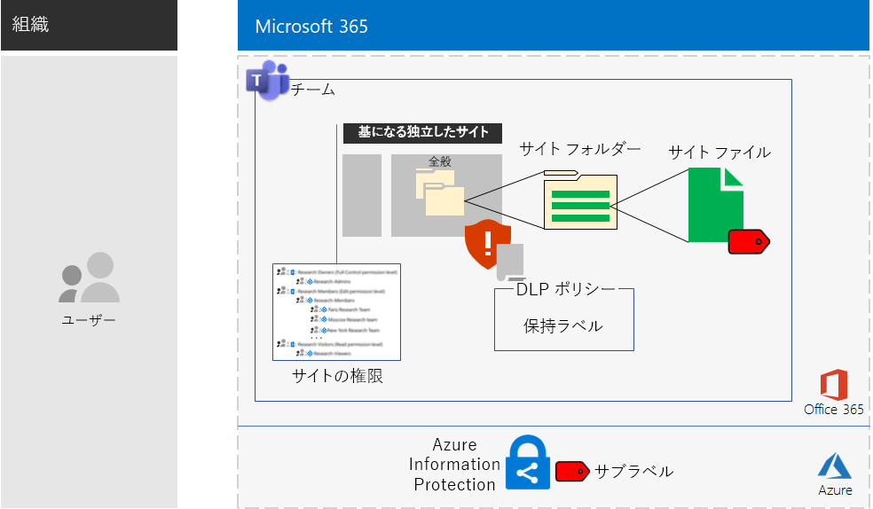

# Microsoft Teams および SharePoint Online サイトで高度な規制データを扱うにはMicrosoft Teams and SharePoint Online sites for highly regulated data

*このシナリオは、Microsoft 365 Enterprise の E3 および E5 の両バージョンに適用されます**This scenario applies to both the E3 and E5 versions of Microsoft 365 Enterprise*

Microsoft 365 Enterprise には、高度な規制データを作成、保存、保護する一連のクラウドベースのサービスが用意されており、次のようなデータを扱います。Microsoft 365 Enterprise includes a full suite of cloud-based services so that you can create, store, and secure your highly regulated data. This includes data that is:

- 地域の規制を遵守しているデータ。Subject to regional regulations.
- 企業秘密、財務情報、人事情報、組織戦略など、組織にとって最も重要なデータ。The most valuable data for your organization, such as trade secrets, financial or human resources information, and organization strategy.

上記のビジネス ニーズを満たす Microsoft 365 Enterprise のクラウドベースのシナリオは次のとおりです:A Microsoft 365 Enterprise cloud-based solution that meets this business need requires that you:

- SharePoint Online チーム サイトまたは Microsoft Teams のチームの **[ファイル]** タブの、デジタル資産 (ドキュメント、スライド セット、スプレッドシートなど) を保存する。Store digital assets (documents, slide decks, spreadsheets, etc.) in a SharePoint Online team site or in the **Files** tab of a Microsoft Teams team.
- サイトまたはチームをロックダウンし、以下を防止する。Lock down the site or team to prevent:
   - グループ メンバーシップ (これには、だれが SharePoint Online チームサイトにどんなアクセス許可のレベルでアクセスできるか、また、だれがそのアクセス許可を管理できるかが含まれる) によるユーザー アカウントの特定のセットのみへのアクセス。Access to only a specific set of user accounts through group membership, which includes those who can access the SharePoint Online team site and at what level of permission, and those who can administer it.
   - サイトのメンバーから他のユーザーへのアクセス許可の付与。Members of the site from granting access to others.
   - サイトのメンバーでないユーザーからサイトへのアクセス要求。Non-members of the site from requesting access to the site.
- サイトまたはチーム内のドキュメントに保持ポリシーを定義する既定の方法として、SharePoint Online サイトやチーム用 Office 365 保持ラベルを構成します。Configure an Office 365 retention label for your SharePoint Online sites or teams as a default way to define retention policies on the documents in the site or team.
- ユーザーがファイルを組織の外部に送信できないようにします。Block users from sending files outside the organization.
- サイトやチームの最も機密性の高いデジタル資産を暗号化する。Encrypt the most sensitive digital assets of the site or team.
- 最も機密性の高いデジタル資産がサイト外で共有されて、その資産を開く場合にも、アクセス許可のあるユーザー アカウントの有効な資格情報が必要となるように、デジタル資産にアクセス許可を追加する。Add permissions to the most sensitive digital assets so that if even if they get shared outside of the site, opening the asset still requires the valid credentials of a user account that has permission.

次の表は、上記のシナリオの要件を Microsoft 365 Enterprise の機能に関連付けたものです。The following table maps the requirements of this solution to a feature of Microsoft 365 Enterprise.

|||
|:-------|:-----|
| **要件****Requirement** | **Microsoft 365 Enterprise の機能****Microsoft 365 Enterprise feature** |
| デジタル資産の保存Store digital assets | SharePoint Online チーム サイトと Office 365 のチームSharePoint Online team sites and teams in Office 365 |
| サイトのロックダウンLock down the site | Azure AD グループおよび SharePoint Online チーム サイトのアクセス許可Azure AD groups and SharePoint Online team site permissions |
| サイトのデジタル資産のラベル付けLabel the digital assets of the site | Office 365 保持ラベルOffice 365 retention labels |
| ユーザーがファイルを組織外に送信できないようにするBlock users when sending files outside the organization | Office 365 のデータ損失防止 (DLP) ポリシーData Loss Prevention (DLP) policies in Office 365 |
| サイトのすべてのデジタル資産の暗号化Encrypt all of the digital assets of the site | Enterprise Mobility + Security (EMS) での Azure Information Protection サブラベルAzure Information Protection sub-labels in Enterprise Mobility + Security (EMS) |
| サイトのデジタル資産へのアクセス許可の追加Add permissions to the digital assets of the site | 手順 3: EMS での Azure Information Protection サブラベルAzure Information Protection sub-labels in EMS |
|||

次に、SharePoint Online サイトの構成を示します。Here is the configuration for a SharePoint Online site.

このシナリオでは、以下のものを既に展開している必要があります。This solution requires that you have already deployed:

- 基盤インフラストラクチャの [ID](identity-infrastructure.md) フェーズ、および[情報保護](infoprotect-infrastructure.md)フェーズの手順 1 と 2。The [Identity](identity-infrastructure.md) phase and steps 1 and 2 of the [Information protection](infoprotect-infrastructure.md) phase of the foundation infrastructure. 
- [SharePoint Online](sharepoint-online-onedrive-workload.md) (SharePoint Online チームサイトで高度な規制データを扱う場合)。For highly regulated data in SharePoint Online team sites, [SharePoint Online](sharepoint-online-onedrive-workload.md).
- [Microsoft Teams](teams-workload.md) (Microsoft Teams のチームで高度な規制データを扱う場合)。For highly regulated data in Microsoft Teams teams, [Microsoft Teams](teams-workload.md).

以下のフェーズでは、高度な規制データを扱う SharePoint Online サイトおよびチームの設計、構成、導入方法について、順を追って説明します。The following phases step you through the design, configuration, and driving adoption for SharePoint Online sites and teams for highly regulated data.

架空の多国籍組織を表す Contoso 社が研究チーム向けに SharePoint Online サイトを設計した方法について確認するには、こちらの[構成例](contoso-sharepoint-online-site-for-highly-confidential-assets.md)をご覧ください。To see how the Contoso Corporation, a fictional but representative multi-national organization, designed a SharePoint Online site for its research teams, see this [example configuration](contoso-sharepoint-online-site-for-highly-confidential-assets.md).

チームで高度な規制データを扱う場合、高度な規制データを扱う SharePoint Online チーム サイトを最初に作成する必要があります。次に、SharePoint Online チーム サイトの Office 365 グループを使用する新しいチームを作成します。詳細については、フェーズ 2 の手順 4 を参照してください。A team for highly regulated data requires that you first create a SharePoint Online team site for highly regulated data. You then create a new team that uses the Office 365 group of the SharePoint Online team site. See Phase 2, Step 4 for more information.

チームの構成を次に示します。Here is the configuration for a team.

## ID とデバイスのアクセスの前提条件Identity and device access prerequisites

チームまたは SharePoint Online サイトへのアクセスを保護するには、[ID とデバイスのアクセス ポリシー](identity-access-policies.md)と、[推奨される SharePoint Online アクセス ポリシー](sharepoint-file-access-policies.md)を構成していることを確認する必要があります。To protect access to the team or SharePoint Online site, ensure that you have configured [identity and device access policies](identity-access-policies.md) and the [recommended SharePoint Online access policies](sharepoint-file-access-policies.md).

## フェーズ 1: 設計Phase 1: Design

高度な規制データを扱う SharePoint Online サイトまたはチームを作成するには、まずその目的を特定する必要があります。たとえば、製造組織の研究開発部門では、既存製品の現在の設計仕様を保存し新製品の共同作業を行う場所として、SharePoint Online サイトが必要になります。この場合、研究開発部門のメンバーと、選択されている役員のみがサイトにアクセスすることができます。To create a SharePoint Online site or team for highly regulated data, you must first identify its purpose. For example, the research and development department of a manufacturing organization needs a SharePoint Online site to store current design specifications for existing products and a place to collaborate on new products. Only members of the Research & Development department and selected executives will be allowed to access the site.

目的に基づいて、以下のような必須の構成項目を決定します。That purpose will drive the determination of essential configuration items such as:

- SharePoint Online のアクセス許可一式と SharePoint グループのセットThe set of SharePoint Online permission sets and SharePoint groups
- アクセス グループ一式 (SharePoint グループに追加する Azure AD セキュリティ グループとそのグループのメンバー)The set of access groups, the Azure AD security groups and their members to add to the SharePoint groups
- サイトに割り当てる Office 365 保持ラベルと、そのラベル用の一連の DLP ポリシーThe Office 365 retention label to assign to the site and the set of DLP policies for the label
- サイトに保存されている機密性の高いデジタル資産にユーザーが適用する Azure Information Protection サブラベルの設定The settings of an Azure Information Protection sub-label that users apply to highly sensitive digital assets stored in the site

上記の項目を決定したら、それらの設定に基づき、フェーズ 2 でサイトを構成します。Once determined, you use these settings to configure the site in Phase 2. 

### 手順 1: 独立した SharePoint Online サイトStep 1: An isolated SharePoint Online site

ロックダウンされたバージョンの SharePoint Online チーム サイトは、独立したサイトとして知られています。プライベート チーム サイトの既定の設定とは異なり、独立サイトは、以下ことを防ぐように構成されます。The locked-down version of a SharePoint Online team site is known as an isolated site. Unlike the default settings of private team sites, isolated sites are configured to prevent:

- 指定したグループのメンバーではないユーザーへのアクセス。Access to those who are not members of specified groups.
- アクセスの要求。The requesting of access.
- 指定されたグループの現在のメンバーによる、無許可のアクセス付与。The unauthorized granting of access by current members of specified groups.
- アクセス グループのメンバーによるサイトの管理。Administration of the site by access group members.

高度に規制された資産が含まれる SharePoint Online チーム サイトのセキュリティは、サイトの SharePoint 管理者のみが変更できます。The security of SharePoint Online team sites that contain highly regulated assets do not change unless done by a SharePoint administrator for the site.

一連のアクセス許可レベル、SharePoint グループ、アクセス グループ、グループ メンバーのセットの決定方法の詳細については、「[独立した SharePoint Online チーム サイトの設計](https://docs.microsoft.com/office365/enterprise/design-an-isolated-sharepoint-online-team-site)」を参照してください。See [Design an isolated SharePoint Online team site](https://docs.microsoft.com/office365/enterprise/design-an-isolated-sharepoint-online-team-site) for the details to determine the set of permission levels, SharePoint groups, access groups, and group members.

### 手順 2: Office 365 保持ラベルと DLP ポリシーStep 2: Office 365 retention labels and DLP policies

SharePoint Online チーム サイトに適用されると、Office 365 保持ラベルは、サイトに保存されているすべてのデジタル資産を分類する既定のメソッドを提供します。When applied to a SharePoint Online team site, Office 365 retention labels provide a default method of classifying all digital assets stored on the site.
 
SharePoint Online サイトで高度な規制データを扱う場合は、どの Office 365 保持ラベルを使用するかを決定する必要があります。For SharePoint Online sites for highly regulated data, you need to determine which Office 365 retention label to use.

Office 365 ラベルの設計の考慮事項については、「[Office 365 の分類とラベル](https://docs.microsoft.com/office365/securitycompliance/secure-sharepoint-online-sites-and-files#office-365-retention-labels)」を参照してください。For the design considerations of Office 365 labels, see [Office 365 classification and labels](https://docs.microsoft.com/office365/securitycompliance/secure-sharepoint-online-sites-and-files#office-365-retention-labels).

機密性の高い情報を保護し、偶発的または意図的な開示を防止するためには、DLP ポリシーを使用します。詳細については、DLP ポリシーの[概要](https://docs.microsoft.com/office365/securitycompliance/data-loss-prevention-policies)を参照してください。To protect sensitive information and prevent its accidental or intentional disclosure, you use DLP policies. For more information, see this [overview](https://docs.microsoft.com/office365/securitycompliance/data-loss-prevention-policies).

SharePoint Online サイトで高度な規制データを扱うには、デジタル資産を外部のユーザーと共有しようとするユーザーをブロックするために、サイトに割り当てられた Office 365 保持ラベルの DLP ポリシーを構成する必要があります。For SharePoint Online sites for highly regulated data, you must configure a DLP policy for the Office 365 retention label assigned to the site to block users when they attempt to share digital assets with external users. 

### 手順 3: Azure Information Protection サブラベルStep 3: Your Azure Information Protection sub-label

最も機密性の高いデジタル資産を暗号化し、一連のアクセス許可を付与する場合、ユーザーは、Azure Information Protection クライアントを使用して Azure Information Protection のラベルを適用する必要があります。SharePoint Online サイトの Azure Information Protection のラベルを使用して高度な規制データを扱うには、スコープ指定されたポリシーに Azure Information Protection サブラベルを構成する必要があります。To provide encryption and a set of permissions to your most sensitive digital assets, users must apply an Azure Information Protection label using the Azure Information Protection client. To use Azure Information Protection labels for SharePoint Online sites for highly regulated data, you must configure an Azure Information Protection sub-label in a scoped policy. 

サブラベルは既存のラベルに含まれます。たとえば、機密性の高いラベルに含まれるラベルとして、研究開発のサブラベルを作成することができます。スコープ指定されたポリシーは、ユーザーのサブセットにのみ適用されるポリシーです。SharePoint Online サイトで高度な規制データを扱う場合、スコープは、サイトのアクセス グループのメンバーである一連のユーザーになります。A sub-label exists under an existing label. For example, you can create a Research & Development sub-label under the Highly Confidential label. A scoped policy is one that applies only to a subset of users. For SharePoint Online sites for highly regulated data, the scope is the set of users that are members of the access groups for the site.

適用したサブラベルの設定が行われると、サブラベルは資産と共に移動します。サブラベルをダウンロードしてサイト外で共有しても、アクセス許可を持つ認証済みのユーザー アカウントしか、サブラベルを開くことはできません。The settings of the applied sub-label travel with the asset. Even if it is downloaded and shared outside the site, only authenticated user accounts that have permissions can open it.

### 設計の結果Design results

以下を決定しました。You have determined the following:

- SharePoint グループとアクセス許可レベルのセットThe set of SharePoint groups and permission levels
- アクセス グループと、そのグループのメンバーそれぞれのアクセス許可レベルのセットThe set of access groups and their members for each permission level
- 適切な Office 365 保持ラベルと、そのラベルに関連付けられている DLP ポリシーThe appropriate Office 365 retention label and the DLP policy that is associated with the label
- 暗号化とアクセス許可を含む Azure Information Protection サブラベルの設定The settings of the Azure Information Protection sub-label that include encryption and permissions

## フェーズ 2: 構成Phase 2: Configure

このフェーズでは、フェーズ 1 で決定した設定を実装し、高度な規制データを扱う SharePoint Online サイトを作成します。In this phase, you take the settings determined in Phase 1 and implement them to create a SharePoint Online site for highly regulated data.

### 手順 1: 独立した SharePoint Online チーム サイトを作成し構成するStep 1: Create and configure an isolated SharePoint Online team site

「[独立した SharePoint Online チーム サイトの展開](https://docs.microsoft.com/office365/enterprise/deploy-an-isolated-sharepoint-online-team-site)」の手順を参照しながら、以下を実行します。Use the instructions in [Deploy an isolated SharePoint Online team site](https://docs.microsoft.com/office365/enterprise/deploy-an-isolated-sharepoint-online-team-site) to:

- サイトで使用する SharePoint のアクセス許可レベルそれぞれのアクセス グループを作成してデータを設定する。Create and populate the access groups for each SharePoint permission level used on the site.
- 独立したチーム サイトを作成して構成する。Create and configure the isolated team site.

### 手順 2: Office 365 保持ラベルの DLP ポリシー向けにサイトを構成するStep 2: Configure the site for an Office 365 retention label DLP policy

「[Office 365 ラベルと DLP による SharePoint Online ファイルの保護](https://docs.microsoft.com/office365/enterprise/protect-sharepoint-online-files-with-office-365-labels-and-dlp)」の手順を参照しながら、以下を実行します。Use the instructions in [Protect SharePoint Online files with Office 365 labels and DLP](https://docs.microsoft.com/office365/enterprise/protect-sharepoint-online-files-with-office-365-labels-and-dlp) to:

- Office 365 保持ラベルを特定または作成し、独立した SharePoint Online サイトに適用する。Identify or create the Office 365 retention label and apply it to your isolated SharePoint Online site.
- ユーザーが組織外の SharePoint Online サイトでデジタル資産を共有しようとする場合にユーザーをブロックする DLP ポリシーを作成して構成する。Create and configure the DLP policy that blocks users when they attempt to share a digital asset on your SharePoint Online site outside the organization.

### 手順 3: サイト用の Azure Information Protection サブレベルを作成するStep 3: Create an Azure Information Protection sub-label for the site

「[Azure Information Protection で SharePoint Online ファイルを保護する](https://docs.microsoft.com/office365/enterprise/protect-sharepoint-online-files-with-azure-information-protection)」の手順を参照しながら、以下を実行します。Use the instructions in [Protect SharePoint Online files with Azure Information Protection](https://docs.microsoft.com/office365/enterprise/protect-sharepoint-online-files-with-azure-information-protection) to: 

- スコープ指定されたポリシーに Azure Information Protection サブラベルを作成して構成する。Create and configure an Azure Information Protection sub-label in a scoped policy.
- Azure Information Protection クライアントをユーザーのコンピューターに展開する。Deploy the Azure Information Protection client to user computers.

### 手順 4 (省略可能): 高度な規制データを扱うチームを作成するStep 4 (optional): Create a team for the highly regulated data

高度な規制データを扱うチームが必要な場合は、まず高度な規制データを扱う SharePoint Online サイトを作成します。最初のプライベートの SharePoint Online チーム サイトを作成するときに、Office 365 グループ名を指定します。If you want a team for highly regulated data, you first create a SharePoint Online site for highly regulated data. When you create the initial private SharePoint Online team site, you specify an Office 365 group name.

高度な規制データを扱う SharePoint Online サイトが完全に構成されたら、次の手順を実行して、高度な規制データを扱うチームに変換します。After the SharePoint Online site for highly regulated data is fully configured, use these steps to convert it into a team for highly regulated data:

1. Office 365 にサインインします。Sign in to Office 365.
2. **[Microsoft Office Home]** タブで、**[チーム]** をクリックします。From the **Microsoft Office Home** tab, click **Teams**.
3. **[チームに参加またはチームを作成する]** ウィンドウの **[Microsoft Teams]** タブで、**[チームを作成する]** をクリックします。From the **Microsoft Teams** tab, in the **Join or create a team** pane, click **Create team**.
4. **[チームを作成する]** ウィンドウで **[既存の Office 365 グループからチームを作成する]** をクリックします。In the **Create your team** pane, click **Create a team from an existing Office 365 group**.
5. Office 365 グループの一覧から、高度な規制データを扱う SharePoint Online サイトに対応する Office 365 グループの名前を選択し、**[チームを選択する]** をクリックします。In the list of Office 365 groups, select the name of the Office 365 group corresponding to the SharePoint Online site for highly regulated data, and then click **Choose team**.

新しいチームの **[ファイル]** タブには、対応する SharePoint Online サイトの**ドキュメント**領域の**一般**フォルダーの内容が一覧表示されます。チームの SharePoint Online サイトの残りのリソースを表示するには、省略記号をクリックし、**[SharePoint で開く]** をクリックします。The **Files** tab of the new team lists the contents of the **General** folder of the **Documents** area of the corresponding SharePoint Online site. To see the rest of the resources of the SharePoint Online site for the team, click the ellipsis, and then click **Open in SharePoint**.

### 構成の結果Configuration results

以下を構成しました。You have configured the following:

- SharePoint Online の独立したサイトA SharePoint Online isolated site
- 独立した SharePoint Online サイトに割り当てられている Office 365 保持ラベルAn Office 365 retention label assigned to the SharePoint Online isolated site
- Office 365 保持ラベルの DLP ポリシーA DLP policy for the Office 365 retention label
- スコープ指定されたポリシーの Azure Information Protection サブラベル。スコープ指定されたポリシーは、ユーザーがサイトに保存されている最も機密性の高いデジタル資産に適用できるポリシーで、保存先のサイトでは資産の暗号化とアクセス許可の付与が行われるAn Azure Information Protection sub-label of a scoped policy that users can apply to the most sensitive digital assets stored in the site that encrypts the asset and enforces permissions
- SharePoint Online サイトをベースとした高度な規制データを扱うチーム (必要な場合に作成)If needed, a team for highly regulated data based on the SharePoint Online site

## フェーズ 3: ユーザーによる採用を主導するPhase 3: Drive user adoption

SharePoint Online サイトまたはチームが高度な規制データを保護できるのは、機密性の高いデジタル資産の保存とその資産へのアクセスのために、それがコンスタントに使用される場合だけです。このフェーズは、ユーザーのやり方の変更に依存する最も難しいフェーズとなります。A SharePoint Online site or team for highly regulated data can only protect that data if it is consistently used for storage and access of sensitive digital assets. This is the hardest phase because it relies on users changing their ways. 

たとえば、役員が機密ファイルを USB ドライブや個人のクラウドベースのストレージ ソリューションに保存していた場合、その役員は、高度な規制データを扱う SharePoint Online サイトまたはチームだけに機密ファイルを保存するようになる必要があります。For example, executives that are used to storing sensitive files on USB drives or on personal cloud-based storage solutions will now have to store them exclusively in a SharePoint Online site or team for highly regulated data.

### 手順 1: ユーザーをトレーニングするStep 1: Train your users

構成が完了したら、サイトのアクセス グループのメンバーである一連のユーザーを以下の面でトレーニングします。After completing your configuration, train the set of users who are members of the site access groups:

- 貴重な資産を保護するために新しいサイトやチームを使用することの重要性と、高度な規制データのリークによって生じる事態 (法的影響、規制上の罰金、ランサムウェア、競争力の低下など)。On the importance of using the new site or team to protect valuable assets and the consequences of a highly regulated data leak, such as legal ramifications, regulatory fines, ransomware, or loss of competitive advantage.
- サイトとその資産へのアクセス方法。How to access the site and its assets.
- サイトに新しいファイルを作成し、ローカルに保存された新しいファイルをアップロードする方法。How to create new files on the site and upload new files stored locally.
- DLP ポリシーを使用して、外部からのファイルの共有をできないようにする方法。How the DLP policy blocks them from sharing files externally.
- Azure Information Protection クライアントを使用して、構成したサブラベルで最も機密性の高いデジタル資産にラベル付けをする方法。How to use the Azure Information Protection client to label the most sensitive digital assets with the configured sub-label.
- サイトやチームから資産がリークした場合でも、Azure Information Protection サブラベルによって資産を保護する方法。How the Azure Information Protection sub-label protects an asset even when it is leaked off the site or team.

このトレーニングには、ユーザーが上記の操作とその結果を体感できるように、実践的な演習を組み込む必要があります。This training should include hands-on exercises so that the users can experience these operations and their results.

### 手順 2: 使用状況とファイルの定期的なレビューの実施Step 2: Conduct periodic reviews of usage and files

トレーニングの数週間後、SharePoint Online サイトまたはチームの SharePoint 管理者は次のことができます。In the weeks after training, the SharePoint administrator for the SharePoint Online site or team can:

- サイトまたはチームの使用状況を分析し、それが期待された使用法と一致しているかを比較する。Analyze usage for the site or team and compare it with usage expectations.
- 機密性の高いファイルに Azure Information Protection サブラベルが正しくラベル付けされていることを確認する。Verify that highly sensitive files have been properly labeled with the Azure Information Protection sub-label.

必要に応じて、ユーザーの再トレーニングを行います。Retrain your users as needed.

### ユーザーによる採用の結果User adoption results

機密性の高いデジタル資産は、高度な規制データを扱う SharePoint Online サイトまたはチームだけに保存され、最も機密性の高い資産には Azure Information Protection サブラベルが適用されます。Sensitive digital assets are stored exclusively on SharePoint Online sites or teams for highly regulated data and that the most sensitive assets have the configured Azure Information Protection sub-label applied.

## Contoso Corporation の Microsoft 365 Enterprise 展開方法How the Contoso Corporation deployed Microsoft 365 Enterprise

架空の企業、Contoso Corporation は、フランスのパリに本社を置く、代表的な世界規模の製造業の複合企業です。The Contoso Corporation is a fictional but representative global manufacturing conglomerate with its headquarters in Paris, France. Contoso 社が、パリ、モスクワ、ニューヨーク、北京、およびバンガロールの研究チーム向けに[セキュアな SharePoint Online](contoso-sharepoint-online-site-for-highly-confidential-assets.md)の設計、構成、および導入の推進を行った方法をご覧ください。See how Contoso designed, configured, and then drove the adoption of a [secure SharePoint Online site](contoso-sharepoint-online-site-for-highly-confidential-assets.md) for their research teams in Paris, Moscow, New York, Beijing, and Bangalore. 

## 関連項目See also

[展開ガイドDeployment guide](deploy-microsoft-365-enterprise.md)

[テスト ラボ ガイドTest lab guides](m365-enterprise-test-lab-guides.md)

[開発/テスト環境の SharePoint Online サイトをセキュリティで保護するSecure SharePoint Online sites in a dev/test environment](https://docs.microsoft.com/office365/enterprise/secure-sharepoint-online-sites-in-a-dev-test-environment)
