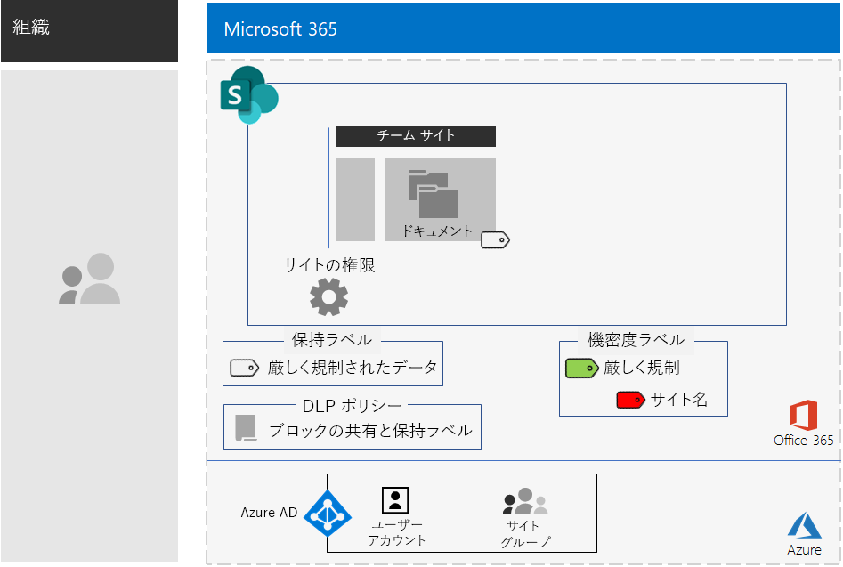
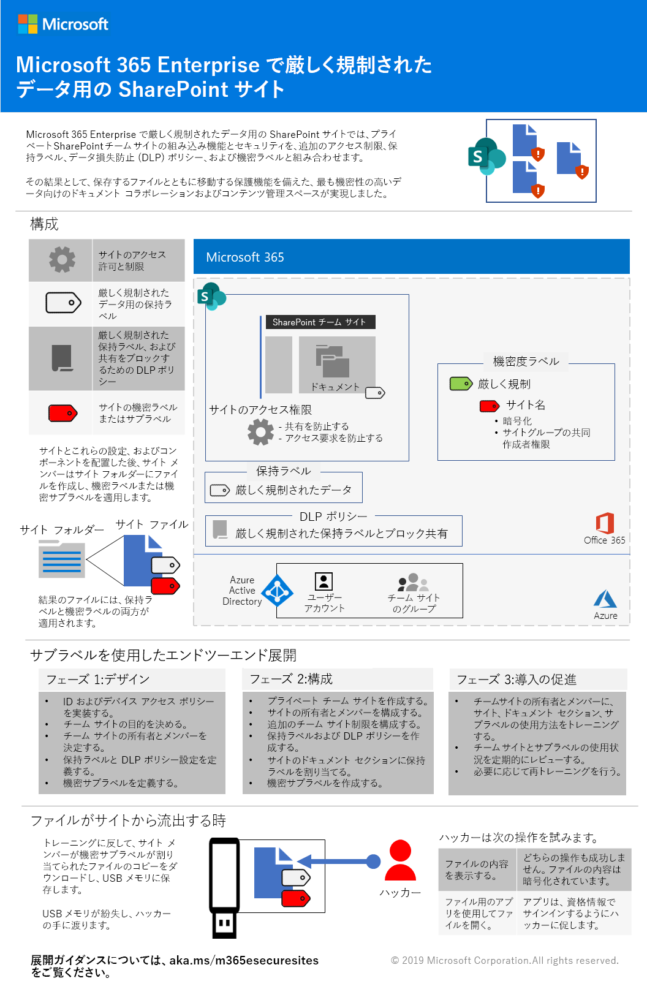
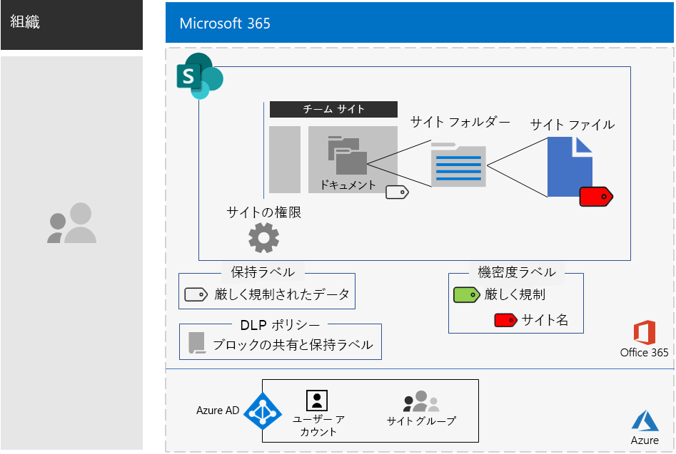

# 厳しく規制されたデータ用の SharePoint サイト

*このシナリオは、Microsoft 365 Enterprise の E3 および E5 の両バージョンに適用されます*

Microsoft 365 Enterprise には、一連のクラウドベースのサービスが含まれており、ファイルに保存された厳しく規制されたデータを作成、保存、保護、管理できます。これには次のようなデータが含まれます。

- 地域の規制を遵守しているデータ。
- 企業秘密、財務情報、人事情報、組織戦略など、組織にとって最も重要なデータ。

>[!Note]
> Microsoft Teams を使用する場合の同じシナリオは、[こちら](secure-teams-highly-regulated-data-scenario.md)です。
>

上記のビジネス ニーズを満たす Microsoft 365 Enterprise のクラウドベースのシナリオは次のとおりです:

- SharePoint チーム サイトにファイル (ドキュメント、スライド セット、スプレッドシートなど) を保存します。
- サイトをロックダウンし、以下を防止します。
  - サイトの Office 365 グループのメンバーではないユーザーへのアクセス。
  - サイトのメンバーから他のユーザーへのアクセス許可の付与。
  - サイトのメンバーでないユーザーからサイトへのアクセス要求。
- ユーザーが組織外のファイルを送信するのをブロックする既定の方法として、SharePoint サイトの Office 365 保持ラベルを構成します。
- ファイルと共に移動する暗号化を使用して、サイトの最高機密ファイルを暗号化します。
- 最高機密ファイルがサイト外で共有された場合でも、そのファイルを開くのにアクセス許可のあるユーザー アカウントの有効な資格情報が必要となるように、最高機密ファイルにアクセス許可を追加します。

次の表は、上記のシナリオの要件を Microsoft 365 Enterprise の機能に関連付けたものです。

|||
|:-------|:-----|
| **要件** | **Microsoft 365 Enterprise の機能** |
| ファイルを保存します | SharePoint チーム サイト |
| サイトのロックダウン | Office 365 グループおよび SharePoint チーム サイトのアクセス許可 |
| サイトのファイルにラベルを付ける | Office 365 保持ラベル |
| ユーザーがファイルを組織外に送信できないようにする | Office 365 のデータ損失防止 (DLP) ポリシー |
| サイトのすべてのファイルを暗号化する | Office 365 の機密度ラベルまたはサブラベル |
| サイトのファイルへのアクセス許可の追加 | Office 365 の機密度ラベルまたはサブラベル |
|||

次に、セキュリティで保護された SharePoint サイトの構成例を示します。

このシナリオでは、以下のものを既に展開している必要があります。

- 基盤インフラストラクチャの [ID](identity-infrastructure.md) フェーズ、および[情報保護](infoprotect-infrastructure.md)フェーズの手順 1 と 2。 
- [SharePoint](sharepoint-online-onedrive-workload.md)。

以下のフェーズでは、厳しく規制されたデータを扱う SharePoint サイトの設計、構成、導入方法について、順を追って説明します。

 このシナリオを 1 ページにまとめた概要については、「[厳しく規制されたデータ用の SharePoint サイトのポスター](../media/teams-sharepoint-online-sites-highly-regulated-data/SharePointSitesHighlyRegulatedData.pdf)」を参照してください。

このポスターを [PDF](https://github.com/MicrosoftDocs/microsoft-365-docs/raw/public/microsoft-365/media/teams-sharepoint-online-sites-highly-regulated-data/SharePointSitesHighlyRegulatedData.pdf) または [PowerPoint](https://github.com/MicrosoftDocs/microsoft-365-docs/raw/public/microsoft-365/media/teams-sharepoint-online-sites-highly-regulated-data/SharePoint-Sites-Highly-Regulated-Data.pptx) 形式でダウンロードして、レター、リーガル、タブロイド (11 x 17) のサイズの紙に印刷することもできます。

## ID とデバイス アクセスの前提条件

SharePoint サイトへのアクセスを保護するには、[ID とデバイス アクセス ポリシー](identity-access-policies.md) と [推奨される SharePoint アクセス ポリシー](sharepoint-file-access-policies.md) を構成していることを確認します。

## フェーズ 1: 設計

厳しく規制されたデータ用に SharePoint サイトを作成するには、最初にその目的を特定する必要があります。 たとえば、製造組織の研究開発部門では、SharePoint サイトを使用して、既存の製品の現在の設計仕様と新製品を共同作業するための場所を保存する必要があります。 研究開発部門のメンバーと選ばれた役職者だけがサイトにアクセスできます。

目的に基づいて、以下のような必須の構成項目を決定します。

- サイトのドキュメント部分に割り当てる Office 365 保持ラベルと、そのラベル用の一連の DLP ポリシー
- サイトに保存されている高機密ファイルに、ユーザーが適用する Office 365 秘密度サブラベルの設定

上記の項目を決定したら、それらの設定に基づき、フェーズ 2 でサイトを構成します。 

### 手順 1: Office 365 保持ラベルと DLP ポリシー

SharePoint チーム サイトのドキュメント部分に適用されると、Office 365 保持ラベルは、サイトに保存されているすべてのファイルを分類する既定のメソッドを提供します。
 
SharePoint サイトで厳しく規制されたデータを扱う場合は、どの Office 365 保持ラベルを使用するかを決定する必要があります。

Office 365 ラベルの設計の考慮事項については、「[Office 365 の分類とラベル](https://docs.microsoft.com/office365/securitycompliance/secure-sharepoint-online-sites-and-files#office-365-retention-labels)」を参照してください。

機密性の高い情報を保護し、偶発的または意図的な開示を防止するためには、DLP ポリシーを使用します。詳細については、DLP ポリシーの[概要](https://docs.microsoft.com/office365/securitycompliance/data-loss-prevention-policies)を参照してください。

SharePoint サイトで高度な規制データを扱うには、ファイルを外部のユーザーと共有しようとするユーザーをブロックするために、サイトに割り当てられた Office 365 保持ラベルの DLP ポリシーを構成する必要があります。 

### 手順 2: Office 365 秘密度サブラベル

暗号化と最高機密ファイルへの一連のアクセス許可を提供するには、ユーザーが Office 365 秘密度ラベルまたはサブラベルを適用する必要があります。 既存のラベルの下にサブラベルが存在します。 

全体での使用と個別のプライベート チームのいずれにおいても必要なラベルの数が少ない場合は、秘密度ラベルを使用します。 ラベルを多数使用している場合、または安全なサイト用のラベルを厳しく規制されたラベルの下でまとめる場合は、秘密度サブラベルを使用します。 

適用されたラベルまたはサブラベルの設定はファイルと共に移動します。 サイト外にリークした場合でも、アクセス許可を持つ認証済みのユーザー アカウントのみが開くことができます。

### 設計の結果

以下を決定しました。

- 適切な Office 365 保持ラベルと、そのラベルに関連付けられている DLP ポリシー
- 暗号化とアクセス許可を含む Office 365 秘密度サブラベルの設定

## フェーズ 2: 構成

このフェーズでは、フェーズ 1 で決定した設定を実装し、厳しく規制されたデータを扱う SharePoint サイトを作成します。

### 手順 1: 対応する Office 365 グループの所有者およびメンバーと、SharePoint チーム サイトを作成

[以下の手順]( https://support.office.com/article/create-a-site-in-sharepoint-online-4d1e11bf-8ddc-499d-b889-2b48d10b1ce8) に従って、プライベート SharePoint チーム サイトを作成します。

### 手順 2: SharePoint チーム サイトの追加のアクセス許可の設定を構成

SharePoint サイトから、これらのアクセス許可の設定を構成します。

1. ツールバーで、設定アイコンをクリックしてから、**[サイトの権限]** をクリックします。
2. [**サイトの権限**] ウィンドウで、[**共有の設定**] の [**共有設定を変更します**] をクリックします。
3. [**共有アクセス許可**] で、[**ファイル、フォルダー、およびサイトを共有できるのはサイトの所有者だけです**] を選択します。
4. [**アクセス要求の許可**] をオフにし、[**保存**] をクリックします。

これらの設定を使用すると、サイト グループのメンバーがサイトを他のメンバーと共有したり、メンバー以外がサイトへのアクセスを要求したりすることができなくなります。

### 手順 3: Office 365 保持ラベル向けにサイトを構成

「[Office 365 ラベルと DLP による SharePoint ファイルの保護](https://docs.microsoft.com/office365/enterprise/protect-sharepoint-online-files-with-office-365-labels-and-dlp)」の手順を参照しながら、以下を実行します。

1. 必要な場合には、厳しく規制されたデータの保持ラベルを作成して公開します。
2. 手順 1 で作成した保持ラベルのサイトを構成します。
3. 手順 2 で作成した保持ラベルを使用する厳しく規制されたデータの DLP ポリシーを作成し、ユーザーが組織外にファイルを送信するのをブロックします。

#### 手順 4: サイトの Office 365 秘密度サブラベルを作成

すべてのユーザーが任意のファイルに適用できる、厳しく規制されたデータの秘密度ラベルとは異なり、セキュリティで保護されたサイトは独自のサブラベルが必要となります。サブラベルが割り当てられたファイルは、

- 暗号化され、暗号化はファイルと共に移動します。
- カスタムのアクセス許可が含まれ、サイト グループのメンバーのみが開くことができます。

このサイトに保存されているファイルに対して追加のセキュリティ レベルを設定するには、厳しく規制されたファイルの一般的なラベルの新しい機密ラベルまたは一般ラベルのサブラベルを構成する必要があります。 厳しく規制されたラベルのサブラベルのリストには、サイトのグループ メンバーのみが表示されます。

[この](https://docs.microsoft.com/microsoft-365/compliance/encryption-sensitivity-labels) 指示を参照しながら次の設定を行い、厳しく規制されたファイルに使用しているラベルのラベルまたはサブラベルを構成します。

- ラベルまたはサブラベルの名前には、ラベルまたはサブラベルをファイルに割り当てるときに簡単に関連付けるためのサイト名が含まれます。
- 暗号化が有効です。
- サイト グループには、共同編集のアクセス許可があります。

### 構成の結果

以下を構成しました。

- SharePoint サイトのアクセス許可の設定の制限
- SharePoint サイトのドキュメント部分に割り当てられている Office 365 保持ラベル
- Office 365 保持ラベルの DLP ポリシー
- ユーザーは、Office 365 秘密度ラベルまたはサブラベルをファイルを暗号化しているサイトに保存された最高機密ファイルに適用できます。共同編集のアクセスが許可されるのは、サイト グループのメンバーのみです。 

これは、厳しく規制されたラベルのサブラベルを使用した結果の構成です。

サイトに保存されているファイルにサブラベルを適用したユーザーの例を次に示します。

## フェーズ 3: ユーザーによる導入を主導

厳しく規制されたデータを扱う SharePoint サイトは、機密ファイルのストレージとアクセスが継続的に使用されている場合にのみ、そのデータを保護できます。 これは、ユーザーが習慣や嗜好を変更することに依存するため、最も困難なフェーズです。 

たとえば、従業員が機密ファイルを USB ドライブや個人のクラウド ベースのストレージ ソリューションに保存していた場合、その従業員は、厳しく規制されたデータを扱う SharePoint サイトのみに機密ファイルを保存しなければならなくなります。

### 手順 1: ユーザーをトレーニングする

構成が完了したら、サイトのメンバーである一連のユーザーを以下の面でトレーニングします。

- 重要なファイルを保護するために新しいサイトを使用することの重要性と、厳しく規制されたデータのリークによって生じる事態 (法的影響、規制上の罰金、ランサムウェア、競争力の低下など)。
- サイトとそのファイルへのアクセス方法。
- サイトに新しいファイルを作成し、ローカルに保存された新しいファイルをアップロードする方法。
- DLP ポリシーを使用して、外部からのファイルの共有をできないようにする方法。
- 最高機密ファイルに、サイトのラベルまたはサブラベルを使用してラベルを付ける方法。
- ファイルがサイトからリークされてもラベルまたはサブラベルによって保護されるしくみ。

このトレーニングには、ユーザーが上記の操作とその結果を体感できるように、実践的な演習を組み込む必要があります。

### 手順 2: 使用状況とファイルの定期的なレビューの実施

トレーニングの数週間後、SharePoint サイトの SharePoint 管理者は次のことができます。

- サイトの使用状況を分析し、それが期待された使用法と一致しているかを比較する。
- 高機密ファイルが秘密度ラベルまたはサブラベルを使用して正しくラベル付けされていることを確認する。

  ラベルが割り当てられているファイルがわかるようにするには、SharePoint のフォルダーを表示し、[**列の追加**] で [**列の表示/非表示**] オプションを使用して [**秘密度**] 列を追加します。

必要に応じて、ユーザーの再トレーニングを行います。

### ユーザーによる採用の結果

厳しく規制されたファイルは、厳しく規制されたデータ用の SharePoint サイトにのみ保存されます。また、最も重要なファイルには適用されたサイトの秘密度ラベルまたはサブラベルが付けられます。

## Contoso Corporation が、厳しく規制されたデータ用にどのように SharePoint サイトを運用したか

架空の企業、Contoso Corporation は、代表的な世界規模の製造業の複合企業です。 Contoso 社が、パリ、モスクワ、ニューヨーク、北京、およびバンガロールの研究チーム向けに [SharePoint サイトの保護](contoso-sharepoint-online-site-for-highly-confidential-assets.md) をどのように設計、構成、導入したかをご覧ください。 

## 関連項目

[厳しく規制されたデータ用の Teams](secure-teams-highly-regulated-data-scenario.md)

[Microsoft 365 Enterprise のワークロードとシナリオ](deploy-workloads.md)

[Microsoft 365 生産性向上ライブラリ](https://aka.ms/productivitylibrary) (https://aka.ms/productivitylibrary)

[展開ガイド](deploy-microsoft-365-enterprise.md)
