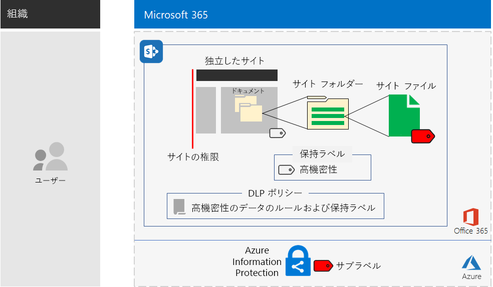
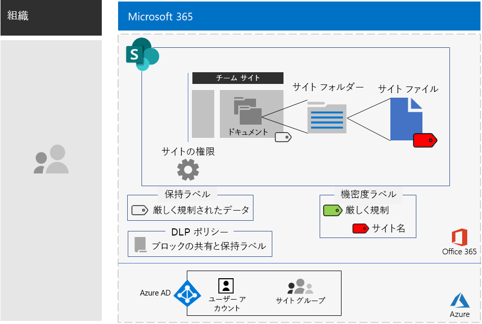

# 厳しく規制されたデータ用の SharePoint サイトSharePoint sites for highly regulated data

*このシナリオは、Microsoft 365 Enterprise の E3 および E5 の両バージョンに適用されます**This scenario applies to both the E3 and E5 versions of Microsoft 365 Enterprise*

Microsoft 365 Enterprise には、一連のクラウドベースのサービスが含まれており、ファイルに保存された厳しく規制されたデータを作成、保存、保護、管理できます。これには次のようなデータが含まれます。Microsoft 365 Enterprise includes a full suite of cloud-based services so that you can create, store, secure, and manage your highly regulated data stored in files. This includes data that is:

- 地域の規制を遵守しているデータ。Subject to regional regulations.
- 企業秘密、財務情報、人事情報、組織戦略など、組織にとって最も重要なデータ。The most valuable data for your organization, such as trade secrets, financial or human resources information, and organization strategy.

>[!Note]
> Microsoft Teams を使用する場合の同じシナリオは、[こちら](secure-teams-highly-regulated-data-scenario.md)です。A similar scenario using Microsoft Teams is in development.
>

上記のビジネス ニーズを満たす Microsoft 365 Enterprise のクラウドベースのシナリオは次のとおりです:A Microsoft 365 Enterprise cloud-based scenario that meets this business need requires that you:

- SharePoint チーム サイトにファイル (ドキュメント、スライド セット、スプレッドシートなど) を保存します。Store files (documents, slide decks, spreadsheets, etc.) in a SharePoint team site.
- サイトをロックダウンし、以下を防止します。Lock down the site to prevent:
  - サイトの Office 365 グループのメンバーではないユーザーへのアクセス。Access to users who are not members of the Office 365 group for the site.
  - サイトのメンバーから他のユーザーへのアクセス許可の付与。Members of the site from granting access to others.
  - サイトのメンバーでないユーザーからサイトへのアクセス要求。Non-members of the site from requesting access to the site.
- ユーザーが組織外のファイルを送信するのをブロックする既定の方法として、SharePoint サイトの Office 365 保持ラベルを構成します。Configure an Office 365 retention label for your SharePoint sites as a default way to block users from sending files outside the organization.
- ファイルと共に移動する暗号化を使用して、サイトの最高機密ファイルを暗号化します。Encrypt the most sensitive files of the site with encryption that travels with the file.
- 最高機密ファイルがサイト外で共有された場合でも、そのファイルを開くのにアクセス許可のあるユーザー アカウントの有効な資格情報が必要となるように、最高機密ファイルにアクセス許可を追加します。Add permissions to the most sensitive files so that if even if they get shared outside of the site, opening the file still requires the valid credentials of a user account that has permission.

次の表は、上記のシナリオの要件を Microsoft 365 Enterprise の機能に関連付けたものです。The following table maps the requirements of this scenario to a feature of Microsoft 365 Enterprise.

|||
|:-------|:-----|
| **要件****Requirement** | **Microsoft 365 Enterprise の機能****Microsoft 365 Enterprise feature** |
| ファイルを保存しますStore files | SharePoint チーム サイトSharePoint team sites |
| サイトのロックダウンLock down the site | Office 365 グループおよび SharePoint チーム サイトのアクセス許可Office 365 groups and SharePoint team site permissions |
| サイトのファイルにラベルを付けるLabel the files of the site | Office 365 保持ラベルOffice 365 retention labels |
| ユーザーがファイルを組織外に送信できないようにするBlock users when sending files outside the organization | Office 365 のデータ損失防止 (DLP) ポリシーData Loss Prevention (DLP) policies in Office 365 |
| サイトのすべてのファイルを暗号化するEncrypt all of the files of the site | Office 365 の機密度ラベルまたはサブラベルOffice 365 sensitivity labels or sublabels |
| サイトのファイルへのアクセス許可の追加Add permissions to the files of the site | Office 365 の機密度ラベルまたはサブラベルOffice 365 sensitivity labels or sublabels |
|||

次に、セキュリティで保護された SharePoint サイトの構成例を示します。Here is the configuration for a secure SharePoint site.

このシナリオでは、以下のものを既に展開している必要があります。This scenario requires that you have already deployed:

- 基盤インフラストラクチャの [ID](identity-infrastructure.md) フェーズ、および[情報保護](infoprotect-infrastructure.md)フェーズの手順 1 と 2。The [Identity](identity-infrastructure.md) phase and steps 1 and 2 of the [Information protection](infoprotect-infrastructure.md) phase of the foundation infrastructure. 
- [SharePoint](sharepoint-online-onedrive-workload.md)。[SharePoint](sharepoint-online-onedrive-workload.md).

以下のフェーズでは、厳しく規制されたデータを扱う SharePoint サイトの設計、構成、導入方法について、順を追って説明します。The following phases step you through designing, configuring, and driving adoption for SharePoint sites for highly regulated data.

架空の多国籍組織を表す Contoso 社が、研究チーム向けに SharePoint サイトを設計した方法について確認するには、[構成例](contoso-sharepoint-online-site-for-highly-confidential-assets.md) をご覧ください。To see how the Contoso Corporation, a fictional but representative multi-national organization, designed a SharePoint site for its research teams, see this [example configuration](contoso-sharepoint-online-site-for-highly-confidential-assets.md).

## ID とデバイス アクセスの前提条件Identity and device access prerequisites

SharePoint サイトへのアクセスを保護するには、[ID とデバイス アクセス ポリシー](identity-access-policies.md) と [推奨される SharePoint アクセス ポリシー](sharepoint-file-access-policies.md) を構成していることを確認します。To protect access to the SharePoint site, ensure that you have configured [identity and device access policies](identity-access-policies.md) and the [recommended SharePoint access policies](sharepoint-file-access-policies.md).

## フェーズ 1: 設計Phase 1: Design

厳しく規制されたデータ用に SharePoint サイトを作成するには、最初にその目的を特定する必要があります。To create a SharePoint site for highly regulated data, you must first identify its purpose. たとえば、製造組織の研究開発部門では、SharePoint サイトを使用して、既存の製品の現在の設計仕様と新製品を共同作業するための場所を保存する必要があります。For example, the research and development department of a manufacturing organization needs a SharePoint site to store current design specifications for existing products and a place to collaborate on new products. 研究開発部門のメンバーと選ばれた役職者だけがサイトにアクセスできます。Only members of the Research & Development department and selected executives will be allowed to access the site.

目的に基づいて、以下のような必須の構成項目を決定します。That purpose will drive the determination of essential configuration items such as:

- サイトのドキュメント部分に割り当てる Office 365 保持ラベルと、そのラベル用の一連の DLP ポリシーThe Office 365 retention label to assign to the Documents portion of the site and DLP policies for the label
- サイトに保存されている高機密ファイルに、ユーザーが適用する Office 365 秘密度サブラベルの設定The settings of an Office 365 sensitivity sublabel that users apply to highly sensitive files stored in the site

上記の項目を決定したら、それらの設定に基づき、フェーズ 2 でサイトを構成します。Once determined, you use these settings to configure the site in Phase 2. 

### 手順 1: Office 365 保持ラベルと DLP ポリシーStep 1 Office 365 retention labels and DLP policies

SharePoint チーム サイトのドキュメント部分に適用されると、Office 365 保持ラベルは、サイトに保存されているすべてのファイルを分類する既定のメソッドを提供します。When applied to the Documents portion of a SharePoint team site, Office 365 retention labels provide a default method of classifying all files stored on the site.
 
SharePoint サイトで厳しく規制されたデータを扱う場合は、どの Office 365 保持ラベルを使用するかを決定する必要があります。For SharePoint sites for highly regulated data, you need to determine which Office 365 retention label to use.

Office 365 ラベルの設計の考慮事項については、「[Office 365 の分類とラベル](https://docs.microsoft.com/office365/securitycompliance/secure-sharepoint-online-sites-and-files#office-365-retention-labels)」を参照してください。For the design considerations of Office 365 labels, see [Office 365 classification and labels](https://docs.microsoft.com/office365/securitycompliance/secure-sharepoint-online-sites-and-files#office-365-retention-labels).

機密性の高い情報を保護し、偶発的または意図的な開示を防止するためには、DLP ポリシーを使用します。詳細については、DLP ポリシーの[概要](https://docs.microsoft.com/office365/securitycompliance/data-loss-prevention-policies)を参照してください。To protect sensitive information and prevent its accidental or intentional disclosure, you use DLP policies. For more information, see this [overview](https://docs.microsoft.com/office365/securitycompliance/data-loss-prevention-policies).

SharePoint サイトで高度な規制データを扱うには、ファイルを外部のユーザーと共有しようとするユーザーをブロックするために、サイトに割り当てられた Office 365 保持ラベルの DLP ポリシーを構成する必要があります。For SharePoint sites, you must configure a DLP policy for the Office 365 retention label assigned to the site to block users when they attempt to share files with external users. 

### 手順 2: Office 365 秘密度サブラベルStep 2: Your Office 365 sensitivity sublabel

暗号化と最高機密ファイルへの一連のアクセス許可を提供するには、ユーザーが Office 365 秘密度ラベルまたはサブラベルを適用する必要があります。To provide encryption and a set of permissions to your most sensitive files, users must apply an Office 365 sensitivity sublabel. 既存のラベルの下にサブラベルが存在します。A sublabel exists under an existing label. 

全体での使用と個別のプライベート チームのいずれにおいても必要なラベルの数が少ない場合は、秘密度ラベルを使用します。Use a sensitivity label when you need is a small number of labels for both global use and individual private teams. ラベルを多数使用している場合、または安全なサイト用のラベルを厳しく規制されたラベルの下でまとめる場合は、秘密度サブラベルを使用します。Use a sensitivity sublabel when you have a large number of labels or want to organize labels for secure sites the under your highly regulated label. 

適用されたラベルまたはサブラベルの設定はファイルと共に移動します。The settings of the applied sublabel travel with the file. サイト外にリークした場合でも、アクセス許可を持つ認証済みのユーザー アカウントのみが開くことができます。Even if it is leaked outside the site, only authenticated user accounts that have permissions can open it.

### 設計の結果Design results

以下を決定しました。You have determined the following:

- 適切な Office 365 保持ラベルと、そのラベルに関連付けられている DLP ポリシーThe appropriate Office 365 retention label and the DLP policy that is associated with the label
- 暗号化とアクセス許可を含む Office 365 秘密度サブラベルの設定The settings of the Office 365 sensitivity sublabel that include encryption and permissions

## フェーズ 2: 構成Phase 2: Configure

このフェーズでは、フェーズ 1 で決定した設定を実装し、厳しく規制されたデータを扱う SharePoint サイトを作成します。In this phase, you take the settings determined in Phase 1 and implement them to create a SharePoint site for highly regulated data.

### 手順 1: 対応する Office 365 グループの所有者およびメンバーと、SharePoint チーム サイトを作成Step 1: Create a private SharePoint team site with owners and members of the corresponding Office 365 group

[以下の手順]( https://support.office.com/article/create-a-site-in-sharepoint-online-4d1e11bf-8ddc-499d-b889-2b48d10b1ce8) に従って、プライベート SharePoint チーム サイトを作成します。Follow [these instructions]( https://support.office.com/article/create-a-site-in-sharepoint-online-4d1e11bf-8ddc-499d-b889-2b48d10b1ce8) to create a private SharePoint team site.

### 手順 2: SharePoint チーム サイトの追加のアクセス許可の設定を構成Step 2: Configure additional permissions settings for the SharePoint team site

SharePoint サイトから、これらのアクセス許可の設定を構成します。From the SharePoint site, configure these permission settings.

1. ツールバーで、設定アイコンをクリックしてから、**[サイトの権限]** をクリックします。In the tool bar, click the settings icon, and then click **Site permissions**.
2. [**サイトの権限**] ウィンドウで、[**共有の設定**] の [**共有設定を変更します**] をクリックします。In the **Site permissions** pane, under **Sharing Settings**, click **Change sharing settings**.
3. [**共有アクセス許可**] で、[**ファイル、フォルダー、およびサイトを共有できるのはサイトの所有者だけです**] を選択します。Under **Sharing permissions**, choose **Only site owners can share files, folders, and the site**.
4. [**アクセス要求の許可**] をオフにし、[**保存**] をクリックします。Turn off **Allow access requests**, and then click **Save**.

これらの設定を使用すると、サイト グループのメンバーがサイトを他のメンバーと共有したり、メンバー以外がサイトへのアクセスを要求したりすることができなくなります。With these settings, the ability for site group members to share the site with other members or for non-members to request access to the site is disabled.

### 手順 3: Office 365 保持ラベル向けにサイトを構成Step 3: Configure the site for an Office 365 retention label

「[Office 365 ラベルと DLP による SharePoint ファイルの保護](https://docs.microsoft.com/office365/enterprise/protect-sharepoint-online-files-with-office-365-labels-and-dlp)」の手順を参照しながら、以下を実行します。Use the instructions in [Protect SharePoint files with Office 365 labels and DLP](https://docs.microsoft.com/office365/enterprise/protect-sharepoint-online-files-with-office-365-labels-and-dlp) to:

1. 必要な場合には、厳しく規制されたデータの保持ラベルを作成して公開します。Create and publish a retention label for highly regulated data (if needed).
2. 手順 1 で作成した保持ラベルのサイトを構成します。Configure the site for the retention label created in step 1.
3. 手順 2 で作成した保持ラベルを使用する厳しく規制されたデータの DLP ポリシーを作成し、ユーザーが組織外にファイルを送信するのをブロックします。Create a DLP policy for highly regulated data that uses the retention label created in step 2 and blocks users from sending files outside the organization

#### 手順 4: サイトの Office 365 秘密度サブラベルを作成Step 4: Create an Office 365 sensitivity sublabel for the site

すべてのユーザーが任意のファイルに適用できる、厳しく規制されたデータの秘密度ラベルとは異なり、セキュリティで保護されたサイトは独自のサブラベルが必要となります。サブラベルが割り当てられたファイルは、Unlike a sensitivity label for highly regulated data that anyone can apply to any file, a secure site needs its own sublabel so that files with the sublabel assigned:

- 暗号化され、暗号化はファイルと共に移動します。Are encrypted and the encryption travels with the file.
- カスタムのアクセス許可が含まれ、サイト グループのメンバーのみが開くことができます。Contain custom permissions so that only members of the site group can open it.

このサイトに保存されているファイルに対して追加のセキュリティ レベルを設定するには、厳しく規制されたファイルの一般的なラベルの新しい機密ラベルまたは一般ラベルのサブラベルを構成する必要があります。To accomplish this additional level of security for files stored in the site, you must configure a new sensitivity label that is a sublabel of the general label for highly regulated files. 厳しく規制されたラベルのサブラベルのリストには、サイトのグループ メンバーのみが表示されます。Only group members for the site will see it in the list of sublabels for the highly regulated label.

[この](https://docs.microsoft.com/microsoft-365/compliance/encryption-sensitivity-labels) 指示を参照しながら次の設定を行い、厳しく規制されたファイルに使用しているラベルのラベルまたはサブラベルを構成します。Use the instructions [here](https://docs.microsoft.com/microsoft-365/compliance/encryption-sensitivity-labels) to configure a sublabel of the label you are using for highly regulated files with the following settings:

- ラベルまたはサブラベルの名前には、ラベルまたはサブラベルをファイルに割り当てるときに簡単に関連付けるためのサイト名が含まれます。The name of the sublabel contains the name of the site for easy association when assign the sublabel to a file.
- 暗号化が有効です。Encryption is enabled.
- サイト グループには、共同編集のアクセス許可があります。The site group has Co-Author permissions.

### 構成の結果Configuration results

以下を構成しました。You have configured the following:

- SharePoint サイトのアクセス許可の設定の制限More restrictive permission settings on the SharePoint site
- SharePoint サイトのドキュメント部分に割り当てられている Office 365 保持ラベルAn Office 365 retention label assigned to the Documents portion of the SharePoint site
- Office 365 保持ラベルの DLP ポリシーA DLP policy for the Office 365 retention label
- ユーザーは、Office 365 秘密度ラベルまたはサブラベルをファイルを暗号化しているサイトに保存された最高機密ファイルに適用できます。共同編集のアクセスが許可されるのは、サイト グループのメンバーのみです。An Office 365 sensitivity sublabel that users can apply to the most sensitive files stored in the site that encrypts the file and only allows Co-Author access for members of the team site group 

これは、厳しく規制されたラベルのサブラベルを使用した結果の構成です。Here is the resulting configuration that uses a sublabel of the Highly regulated label.

サイトに保存されているファイルにサブラベルを適用したユーザーの例を次に示します。Here is an example of a user that has applied the sensitivity sublabel to a file stored in the site.

## フェーズ 3: ユーザーによる導入を主導Phase 3: Drive user adoption

厳しく規制されたデータを扱う SharePoint サイトは、機密ファイルのストレージとアクセスが継続的に使用されている場合にのみ、そのデータを保護できます。A SharePoint site for highly regulated data can only protect that data if it is consistently used for storage and access of sensitive files. これは、ユーザーが習慣や嗜好を変更することに依存するため、最も困難なフェーズです。This is the hardest phase because it relies on users changing their habits and preferences. 

たとえば、従業員が機密ファイルを USB ドライブや個人のクラウド ベースのストレージ ソリューションに保存していた場合、その従業員は、厳しく規制されたデータを扱う SharePoint サイトのみに機密ファイルを保存しなければならなくなります。For example, employees that are used to storing sensitive files on USB drives or on personal cloud-based storage solutions will now have to store them exclusively in a SharePoint site for highly regulated data.

### 手順 1: ユーザーをトレーニングするStep 1: Train your users

構成が完了したら、サイトのメンバーである一連のユーザーを以下の面でトレーニングします。After completing your configuration, train the set of users who are members of the site access groups:

- 重要なファイルを保護するために新しいサイトを使用することの重要性と、厳しく規制されたデータのリークによって生じる事態 (法的影響、規制上の罰金、ランサムウェア、競争力の低下など)。On the importance of using the new site to protect valuable files and the consequences of a highly regulated data leak, such as legal ramifications, regulatory fines, ransomware, or loss of competitive advantage.
- サイトとそのファイルへのアクセス方法。How to access the site and its files.
- サイトに新しいファイルを作成し、ローカルに保存された新しいファイルをアップロードする方法。How to create new files on the site and upload new files stored locally.
- DLP ポリシーを使用して、外部からのファイルの共有をできないようにする方法。How the DLP policy blocks them from sharing files externally.
- 最高機密ファイルに、サイトのラベルまたはサブラベルを使用してラベルを付ける方法。How to label the most sensitive files with the sublabel for the site.
- ファイルがサイトからリークされてもラベルまたはサブラベルによって保護されるしくみ。How the sublabel protects a file even when it is leaked off the site.

このトレーニングには、ユーザーが上記の操作とその結果を体感できるように、実践的な演習を組み込む必要があります。This training should include hands-on exercises so that the users can experience these operations and their results.

### 手順 2: 使用状況とファイルの定期的なレビューの実施Step 2: Conduct periodic reviews of usage and files

トレーニングの数週間後、SharePoint サイトの SharePoint 管理者は次のことができます。In the weeks after training, the SharePoint administrator for the SharePoint site can:

- サイトの使用状況を分析し、それが期待された使用法と一致しているかを比較する。Analyze usage for the site and compare it with usage expectations.
- 高機密ファイルが秘密度ラベルまたはサブラベルを使用して正しくラベル付けされていることを確認する。Verify that highly sensitive files have been properly labeled with the sensitivity sublabel.

  ラベルが割り当てられているファイルがわかるようにするには、SharePoint のフォルダーを表示し、[**列の追加**] で [**列の表示/非表示**] オプションを使用して [**秘密度**] 列を追加します。You can see which files have a label assigned by viewing a folder in SharePoint and adding the **Sensitivity** column through the **Show/hide columns** option of **Add column**.

必要に応じて、ユーザーの再トレーニングを行います。Retrain your users as needed.

### ユーザーによる採用の結果User adoption results

厳しく規制されたファイルは、厳しく規制されたデータ用の SharePoint サイトにのみ保存されます。また、最も重要なファイルには適用されたサイトの秘密度ラベルまたはサブラベルが付けられます。Highly regulated files are stored exclusively on SharePoint sites for highly regulated data and the most sensitive files have the sensitivity sublabel for the site applied.

## Contoso Corporation の Microsoft 365 Enterprise 展開方法How the Contoso Corporation deployed Microsoft 365 Enterprise

架空の企業、Contoso Corporation は、代表的な世界規模の製造業の複合企業です。The Contoso Corporation is a fictional but representative global manufacturing conglomerate with its headquarters in Paris, France. Contoso 社が、パリ、モスクワ、ニューヨーク、北京、およびバンガロールの研究チーム向けに [SharePoint サイトの保護](contoso-sharepoint-online-site-for-highly-confidential-assets.md) をどのように設計、構成、導入したかをご覧ください。See how Contoso designed, configured, and then drove the adoption of a [secure SharePoint site](contoso-sharepoint-online-site-for-highly-confidential-assets.md) for their research teams in Paris, Moscow, New York, Beijing, and Bangalore. 

## 関連項目See also

[厳しく規制されたデータ用の TeamsMicrosoft Teams for highly regulated data](secure-teams-highly-regulated-data-scenario.md)

[Microsoft 365 Enterprise のワークロードとシナリオMicrosoft 365 Enterprise workloads and scenarios](deploy-workloads.md)

[Microsoft 365 生産性向上ライブラリ](https://aka.ms/productivitylibrary) (https://aka.ms/productivitylibrary)[Microsoft 365 Productivity Library](https://aka.ms/productivitylibrary) (https://aka.ms/productivitylibrary)

[展開ガイドDeployment guide](deploy-microsoft-365-enterprise.md)
