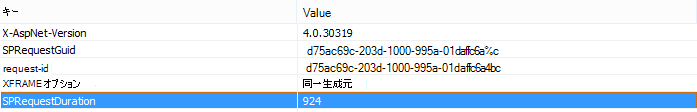

# コンテンツ クエリ Web パーツの代わりにコンテンツ検索 Web パーツを使用して、SharePoint Online のパフォーマンスを向上させる

この記事では、コンテンツ クエリ Web パーツを SharePoint Server 2013 および SharePoint Online のコンテンツ検索 Web パーツに置き換えることで、パフォーマンスを向上させる方法について説明します。
  
SharePoint Server 2013 および SharePoint Online の最も強力な新機能の 1 つは、コンテンツ検索 Web パーツ (CSWP) です。 この Web パーツでは、検索インデックスを使用して、ユーザーに表示される結果をすばやく取得します。 ページ内のコンテンツ クエリ Web パーツ (CQWP) の代わりにコンテンツ検索 Web パーツを使用して、ユーザーのパフォーマンスを向上させます。
  
コンテンツ クエリ Web パーツでコンテンツ検索 Web パーツを使用すると、ほとんどの場合、SharePoint Online でのページ読み込みパフォーマンスが向上します。 適切なクエリを取得するための構成が少し追加されていますが、報酬はパフォーマンスが向上し、ユーザーの満足度が向上します。
  
## コンテンツ クエリ Web パーツの代わりにコンテンツ検索 Web パーツを使用して得られるパフォーマンスの向上を比較する

次の例は、コンテンツ クエリ Web パーツの代わりにコンテンツ検索 Web パーツを使用するときに得る相対的なパフォーマンス向上を示しています。 複雑なサイト構造と広範なコンテンツ クエリでは、効果がより明確になります。
  
このサンプル サイトには、次の特性があります。
  
- 8 レベルのサブサイト。
    
- カスタム "果樹" コンテンツ タイプを使用するリスト。
    
- Web パーツでは、コンテンツ クエリは広範であり、コンテンツ タイプが "fruit" のすべての項目を返します。
    
- この例では、8 つのサイト全体で 50 個のアイテムのみを使用します。 コンテンツが多いサイトでは、効果がさらに顕著になります。
    
コンテンツ クエリ Web パーツの結果のスクリーンショットを次に示します。
  

  
Internet Explorer で、F12 開発者ツールの [ **ネットワーク** ] タブを使用して、応答ヘッダーの詳細を確認します。 次のスクリーンショットでは、このページ読み込みの **SPRequestDuration** の値は 924 ミリ秒です。 
  

  
 **SPRequestDuration** は、ページを準備するためにサーバーで実行される作業量を示します。 Content by Search Web パーツを使用してクエリ Web パーツでコンテンツを切り替えると、ページのレンダリングにかかる時間が大幅に短縮されます。 これに対し、同じ数の結果を返す同等のコンテンツ検索 Web パーツを含むページでは、次のスクリーンショットに示すように **SPRequestDuration** の値は 106 ミリ秒です。 
  

  
## SharePoint Online でのコンテンツ検索 Web パーツの追加

コンテンツ検索 Web パーツの追加は、通常のコンテンツ クエリ Web パーツに似ています。 *「SharePointでコンテンツ検索 Web パーツを* 構成する」の「[コンテンツ検索 Web パーツの](https://support.office.com/article/Configure-a-Content-Search-Web-Part-in-SharePoint-0dc16de1-dbe4-462b-babb-bf8338c36c9a)追加」セクションを参照してください。
  
## コンテンツ検索 Web パーツの適切な検索クエリを作成する

コンテンツ検索 Web パーツを追加したら、検索を絞り込んで目的のアイテムを返すことができます。 これを行う方法の詳細については、「*SharePointでコンテンツ検索 Web パーツを構成する」の「コンテンツ検索 Web パーツで高度なクエリを構成して*[コンテンツを](https://support.office.com/article/Configure-a-Content-Search-Web-Part-in-SharePoint-0dc16de1-dbe4-462b-babb-bf8338c36c9a)表示する」セクションを参照してください。
  
## クエリのビルドとテスト ツール

複雑なクエリをビルドしてテストするツールについては、 [検索クエリ ツール](https://github.com/pnp/PnP-Tools/tree/master/Solutions/SharePoint.Search.QueryTool#download-the-tool)を参照してください。
  

