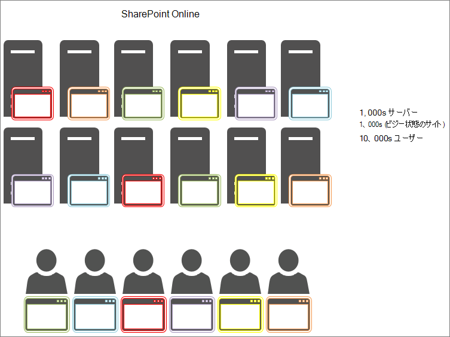

# SharePoint Online でのオブジェクト キャッシュの使用

この記事では、SharePoint Server 2013 オンプレミスと SharePoint Online でのオブジェクト キャッシュの使用の違いについて説明します。
  
SharePoint Online デプロイのオブジェクト キャッシュに依存すると、大きな悪影響が生じます。 SharePoint Online のオブジェクト キャッシュに対する依存関係により、ページの信頼性が低下します。 
  
## SharePoint Online および SharePoint Server 2013 オブジェクト キャッシュのしくみ

SharePoint Server 2013 がオンプレミスでホストされている場合、顧客はオブジェクト キャッシュをホストするプライベート フロントエンド Web サーバーを持ちます。 つまり、キャッシュは 1 人の顧客専用であり、使用可能なメモリの量とオブジェクト キャッシュへの割り当て量によってのみ制限されます。 オンプレミスのシナリオでは 1 人の顧客のみが提供されるため、フロントエンド Web サーバーには通常、同じサイトに対して何度も要求を行うユーザーがいます。 つまり、キャッシュはすばやく完全になり、ユーザーが定期的に要求しているリスト クエリの結果とSharePoint オブジェクトがいっぱいになります。
  

  
その結果、ユーザーが 2 回目にページにアクセスすると、ページの読み込み時間が向上します。 同じページを少なくとも 4 回読み込んだ後、ページはすべてのフロントエンド Web サーバーにキャッシュされます。
  
これに対し、SharePoint Online には、より多くのサーバーが存在しますが、サイトも多数あります。 各ユーザーは、キャッシュが設定されていない別のフロントエンド Web サーバーに接続できます。 または、サーバーに対してキャッシュが設定される場合もありますが、そのフロントエンド Web サーバーの次のユーザーは別のサイトからページを要求します。 または、次のユーザーが以前のアクセス時と同じページを要求した場合でも、そのページをキャッシュに含まない別のフロントエンド Web サーバーに負荷分散されます。 この最後のケースでは、キャッシュはユーザーにはまったく役立ちません。
  
次の図では、各ドットは、ユーザーが要求しているページとキャッシュされた場所を表しています。 色が異なると、SaaS インフラストラクチャを共有して使用している顧客が異なります。
  

  
図からわかるように、特定のユーザーがキャッシュされたバージョンのページでサーバーにアクセスする可能性は薄いです。 また、スループットが大きく、サーバーが多くのサイト間で共有されているため、キャッシュの使用可能な領域が非常に多いため、キャッシュは長続きしません。
  
これらのすべての理由から、キャッシュされたオブジェクトを取得するユーザーに依存することは、SharePoint Online で品質の高いユーザー エクスペリエンスとページ読み込み時間を確保するための効果的な方法ではありません。
  
## SharePoint Online のパフォーマンスを向上させるためにオブジェクト キャッシュに依存できない場合は、代わりに何を使用しますか?

SharePoint Online でのキャッシュに依存しないようにする必要があるため、オブジェクト キャッシュを使用するSharePointカスタマイズの代替設計方法を評価する必要があります。 これは、パフォーマンスの問題に対するアプローチを使用することを意味します。これは、ユーザーに適切な結果を生成するためにオブジェクト キャッシュに依存しません。 これは、このシリーズの他のいくつかの記事で説明され、次のものが含まれます。
  
- [SharePoint Online のナビゲーション オプション](navigation-options-for-sharepoint-online.md)
    
- [SharePoint Online での縮小とバンドル](minification-and-bundling-in-sharepoint-online.md)
    
- [SharePoint Online での Office 365 コンテンツ配信ネットワーク (CDN) の使用](use-microsoft-365-cdn-with-spo.md)
    
- [SharePoint Online での画像の読み込み遅延と JavaScript](delay-loading-images-and-javascript-in-sharepoint-online.md)
    