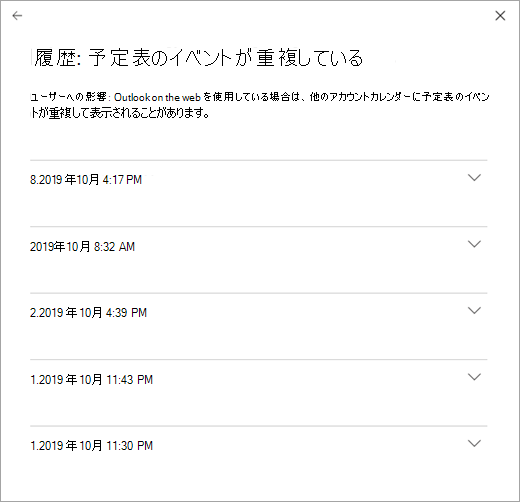

# Microsoft 365 サービス正常性を確認する方法How to check Microsoft 365 service health

[[Microsoft 365 管理センター](https://go.microsoft.com/fwlink/p/?linkid=2024339)] の [**サービス正常性**] ページで、Office on the web、Yammer、Microsoft Dynamics CRM、モバイル デバイス管理クラウド サービスなどの Microsoft サービスの正常性を表示できます。You can view the health of your Microsoft services, including Office on the web, Yammer, Microsoft Dynamics CRM, and mobile device management cloud services, on the **Service health** page in the [Microsoft 365 admin center](https://go.microsoft.com/fwlink/p/?linkid=2024339). クラウド サービスの問題が発生している場合は、サポートに連絡するかトラブルシューティングに時間を費やす前に、サービス正常性を確認することで、解決に向けて取り組み中の既知の問題であるかどうかを判別できます。If you are experiencing problems with a cloud service, you can check the service health to determine whether this is a known issue with a resolution in progress before you call support or spend time troubleshooting.

管理センターにサインインできない場合は、[[サービスの状態] ページ](https://status.office365.com)を使用して、テナントへのログインを妨げている既知の問題を確認できます。If you are unable to sign in to the admin center, you can use the [service status page](https://status.office365.com) to check for known issues preventing you from logging into your tenant.  また、サインアップして Twitter で [@MSFT365status](https://twitter.com/MSFT365Status) をフォローすると、特定のイベントの情報をご覧いただけます。Also sign up to follow us at [@MSFT365status](https://twitter.com/MSFT365Status) on Twitter to see information on certain events.

  
### サービス正常性の確認方法How to check service health

1. [https://admin.microsoft.com](https://go.microsoft.com/fwlink/p/?linkid=2024339) の Microsoft 365 管理センターに移動し、管理者アカウントでサインインします。Go to the Microsoft 365 admin center at [https://admin.microsoft.com](https://go.microsoft.com/fwlink/p/?linkid=2024339), and sign in with an admin account.

    > [!NOTE]
    > 全体管理者またはサービス管理者の役割を割り当てられているユーザーは、サービス正常性を表示できます。People who are assigned the global admin or service administrator role can view service health. Exchange、SharePoint、および Skype for Business の管理者がサービス正常性を表示できるようにする場合も、ユーザーにはサービス管理者の役割が割り当てられている必要があります。To allow Exchange, SharePoint, and Skype for Business admins to view service health, they must also be assigned the Service admin role. サービス正常性を表示できる役割の詳細については、「[管理者の役割について](../admin/add-users/about-admin-roles.md?preserve-view=true&view=o365-worldwide#roles-available-in-the-microsoft-365-admin-center)」を参照してください。For more information about roles that can view service health, see [About admin roles](../admin/add-users/about-admin-roles.md?preserve-view=true&view=o365-worldwide#roles-available-in-the-microsoft-365-admin-center).
  
2. 新しい管理センターを使用していない場合は、[**ホーム**] ページで、右上隅にある [**新しい管理センターを試す**] トグルを選択します。If you are not using the new admin center, on the **Home** page, select the **Try the new admin center** toggle in the upper-right corner.

3. サービス正常性を開くには、管理センターで [**正常性**]  >  [**サービス正常性**] の順に移動するか、[**ホーム ダッシュボード**] の [**サービス正常性**] カードを選択します。To view service health, in the admin center, go to **Health** > **Service health**, or select the **Service health** card on the **Home dashboard**. [ダッシュボード] カードでは、アクティブなサービスの問題があるかどうかが示され、詳細な [**サービス正常性**] ページへのリンクが提供されます。The dashboard card indicates whether there is an active service issue and links to the detailed **Service health** page.
  
4. [**サービス正常性**] ページでは、それぞれのクラウド サービスの正常性の状態は表形式で表示されます。On the **Service health** page, the health state of each cloud service is shown in a table format.

   

[**すべてのサービス**] タブ (既定のビュー) に、すべてのサービスとその現在の正常性の状態が表示されます。The **All services** tab (the default view) shows all services and their current health state. アイコンと [**状態**] 列は、各サービスの状態を示しています。An icon and the **Status** column indicate the state of each service. 

ビューをフィルタリングして、現在インシデントが発生しているサービスに絞り込むには、ページ上部の [**インシデント**] タブを選択します。To filter your view to services currently experiencing an incident, select the **Incidents** tab at the top of the page. [**勧告**] タブを選択すると、現在、勧告が投稿されているサービスのみが表示されます。Selecting the **Advisories** tab will show only services that currently have an advisory posted. 

[**履歴**] タブには、解決されたインシデントおよび勧告の履歴が表示されます。The **History** tab shows the history of incidents and advisories that have been resolved.

Microsoft 365 サービスで問題が発生し、それが [**サービス正常性**] ページに一覧表示されない場合は、[**問題を報告する**] を選択して短いフォームに記入してください。If you're experiencing an issue with a Microsoft 365 service and you don’t see it listed on the **Service health** page, tell us about it by selecting **Report an issue**, and completing the short form. 他の組織からの関連データとレポートを調べて、問題がどの程度広がっているか、およびそれがサービスに起因しているかどうかを確認します。We’ll look at related data and reports from other organizations to see how widespread the issue is, and if it originated with our service. 該当する場合、[**サービス正常性**] ページに新しいインシデントまたは勧告として追加し、その解決を追跡できます。If it did, we’ll add it as a new incident or advisory on the **Service health** page, where you can track its resolution. 約 30 分以内に一覧に表示されない場合は、問題を解決するためにサポートに連絡することを検討してください。If you don’t see it appear on the list within about 30 minutes, consider contacting support to resolve the issue.

ダッシュボードに表示されるサービスの表示をカスタマイズするには、[**環境設定**] > >  [**カスタム表示**] の順に選択し、サービス正常性ダッシュボードの表示から除外したいサービスのチェックボックスをクリアします。To customize your view of which services show up on the dashboard, select **Preferences** > **Custom view**,  and clear the check boxes for the services you want to filter out of your Service health dashboard view. 監視する各サービスのチェックボックスをオンにしていることを確認します。Make sure that the check box is selected for each service that you want to monitor.    

テナントに影響する新しいインシデントや、アクティブなインシデントの状態変更をメールで通知するように登録するには、[**環境設定**] > >  [**メール**] の順に選択し、[**サービス正常性の通知をメールで送る**] をクリックして、指定します。To sign up for email notifications of new incidents that affect your tenant and status changes for an active incident, select **Preferences** > **Email**, click **Send me service heath notifications in email**, and then specify:

- メールアドレスは最大 2 つです。Up to two email addresses.
- インシデントや警告の通知を希望するかどうかWhether you want notifications for incidents or advisories
- 通知を希望するサービスThe services for which you want notification

> [!NOTE]
> 管理者ごとにユーザー設定を行うことができ、上記の 2 つのメールアドレスの制限は管理者アカウントごとに行われます。Each admin can have their Preferences set and the above limit of two email address is per admin account.

> [!TIP]
> モバイル デバイスで [Microsoft Admin アプリ](https://go.microsoft.com/fwlink/p/?linkid=627216)を使って、サービス正常性を表示することもできます。これはプッシュ通知により、常に最新情報を入手する優れた手段です。You can also use the [Microsoft 365 Admin app](https://go.microsoft.com/fwlink/p/?linkid=627216) on your mobile device to view Service health, which is a great way to stay current with push notifications. 
  
### 投稿されたサービス正常性の詳細を表示するView details of posted service health

[**すべてのサービス**] ビューで、[サービスの状態] を選択すると、勧告またはインシデントの概要ビューが開きます。On the **All services** view, selecting the service status will open a summary view of advisories or incidents.
  

勧告またはインシデントの概要では、以下の情報が提供されます。The advisory or incident summary provides the following information:

- **タイトル** - 問題の概要。**Title** - A summary of the problem.
- **サービス** - 影響を受けるサービスの名前。**Service** - The name of the affected service.
- **ID** - 問題の数値識別子。**ID** - A numeric identifier for the problem.
- **状態** - この問題がサービスに与える影響。**Status** - How this problem affects the service.
- **開始時刻** - 問題が始まった時刻。**Start time** - The time when the issue started.
- **最終更新時刻** - サービス正常性メッセージの最後の更新時刻。**Last updated** - The last time that the service health message was updated. 頻繁にメッセージを投稿して、解決策の適用についての進捗状況をお知らせします。We post frequent messages to let you know the progress that we're making in applying a solution.

問題のタイトルを選択すると、[問題の詳細] ページが表示されます。このページには、解決策の取り組み中に投稿されるすべてのメッセージの[履歴](#history)を含む、問題の詳細が表示されます。Select the issue title to see the issue detail page, which shows more information about the issue, including the [history](#history) of all messages posted while we work on a solution.

![[問題の詳細] を表示するスクリーンショット](../media/service-health-advisory-detail.png)

### サービス正常性の詳細を翻訳するTranslate service health details

サービス正常性の説明はリアルタイムで投稿されるため、各国語に自動的には翻訳されず、サービス イベントの詳細は英語のみとなります。説明を翻訳するには、次の手順に従いますBecause service health explanations are posted in real-time, they are not automatically translated to your language and the details of a service event are in English only. To translate the explanation, follow these steps:
  
1. 1.[翻訳ツール](https://www.bing.com/translator/)に移動します。Go to [Translator](https://www.bing.com/translator/).

2. [**サービス正常性**] ページで、インシデントまたは勧告を選択します。[**詳細の表示**] で、問題に関するテキストをコピーします。On the **Service health** page, select an incident or advisory. Under **Show details**, copy the text about the issue.

3. 翻訳ツールで、テキストを貼り付けて、[**翻訳**] を選びます。In Translator, paste the text and choose **Translate**.

### 定義Definitions

ほとんどの場合、サービスは正常として表示され、それ以上の情報は示されません。Most of the time, services will appear as healthy with no further information. サービスに問題がある場合、問題は勧告またはインシデントとして認識され、現在の状態が表示されます。When a service is having a problem, the issue is identified as either an advisory or an incident and shows a current status.
  
> [!TIP]
> 計画済みメンテナンス イベントはサービス正常性には表示されません。Planned maintenance events aren't shown in service health. 常に **メッセージ センター** を確認することで、計画済みメンテナンス イベントを追跡できます。You can track planned maintenance events by staying up to date with the **Message center**. フィルタリングして [変更の計画] として分類されたメッセージに絞り込み、変更が発生する時期、その影響、およびそのための準備方法を確認します。Filter to messages categorized as Plan for change to find out when the change is going to happen, its effect, and how to prepare for it. 詳細については、「[Microsoft 365 のメッセージ センター](https://support.office.com/article/38fb3333-bfcc-4340-a37b-deda509c2093)」を参照してください。See [Message center in Microsoft 365](https://support.office.com/article/38fb3333-bfcc-4340-a37b-deda509c2093) for more details.
  
### インシデントおよび勧告Incidents and advisories

| アイコンIcon | 説明Description |
|:-----|:-----|
||サービスが勧告と示された場合、一部のユーザーに影響する問題が認識されています。ただし、サービスは引き続き使用可能です。勧告では、多くの場合、回避策があり、問題は一時的なものである可能性があるか、または範囲およびユーザーへの影響は限られます。If a service has an advisory shown, we are aware of a problem that is affecting some users, but the service is still available. In an advisory, there is often a workaround to the problem and the problem may be intermittent or is limited in scope and user impact.    |
||サービスがアクティブ インシデントと示された場合、重大な問題であり、サービスまたはサービスの主な機能は使用できません。たとえば、ユーザーはメールの送受信やサインインができない可能性があります。インシデントはユーザーに顕著な影響を与えます。進行中にインシデントが発生した場合は、サービス正常性ダッシュボードで調査、軽減への取り組み、解決策の確認に関する更新プログラムを提供します。If a service has an active incident shown, it's a critical issue and the service or a major function of the service is unavailable. For example, users may be unable to send and receive email or unable to sign-in. Incidents will have noticeable impact to users. When there is an incident in progress, we will provide updates regarding the investigation, mitigation efforts, and confirmation of resolution in the Service health dashboard.    |

### 状態の定義Status definitions

| 状態Status | 定義Definition |
|:-----|:-----|
|**調査中****Investigating** | 潜在的な問題は認識されており、現状と影響範囲に関する詳細情報を収集中です。We're aware of a potential issue and are gathering more information about what's going on and the scope of impact. |
|**サービスの低下****Service degradation** | サービスまたは機能の使用に影響する可能性のある問題があることが確認されています。サービスの実行に通常より長い時間がかかる場合、一時的に中断している場合、機能が動作していない場合などにこの状態が示されることがあります。We've confirmed that there is an issue that may affect use of a service or feature. You might see this status if a service is performing more slowly than usual, there are intermittent interruptions, or if a feature isn't working, for example. |
|**サービスの中断****Service interruption** | 問題がサービスへのアクセスを妨げると判断された場合にこの状態が示されます。この場合、問題は重要なものであり、常に再現できます。You'll see this status if we determine that an issue affects the ability for users to access the service. In this case, the issue is significant and can be reproduced consistently. |
|**サービスの復元****Restoring service** | 問題の原因は特定されており、対応策はわかっています。また、サービスを正常な状態に戻している段階です。The cause of the issue has been identified, we know what corrective action to take, and are in the process of bringing the service back to a healthy state. |
|**拡張復旧****Extended recovery** | この状態は、ほとんどのユーザーに対するサービスを復元するための対応策が進行中ですが、影響を受けるすべてのシステムに適用されるまでは時間がかかることを示します。また、永続的な修正プログラムが適用されるのを待機する間に、一時的な修正プログラムで影響を減らした場合、この状態が表示されることもあります。This status indicates that corrective action is in progress to restore service to most users but will take some time to reach all the affected systems. You might also see this status if we've made a temporary fix to reduce impact while we wait to apply a permanent fix. |
|**調査の中断****Investigation suspended** | 潜在的な問題の詳細な調査で、さらに調査できるようにお客様からの追加情報を要求する場合は、この状態が示されます。お客様にアクションを求める場合は、必要なデータまたはログをお知らせします。If our detailed investigation of a potential issue results in a request for additional information from customers to allow us to investigate further, you'll see this status. If we need you to act, we'll let you know what data or logs we need. |
|**サービスが復元されました****Service restored** | 対応策によって根本的な問題が解決され、サービスが正常な状態に復元されたことが確認されています。原因を確認するには、問題の詳細を表示します。We've confirmed that corrective action has resolved the underlying problem and the service has been restored to a healthy state. To find out what went wrong, view the issue details. |
|**誤検知****False positive** | 詳細な調査の結果、サービスが正常であり、設計どおりに動作していることを確認しました。After a detailed investigation, we’ve confirmed the service is healthy and operating as designed. サービスへの影響が観察されなかったか、インシデントの原因がサービス外に起因するものでした。No impact to the service was observed or the cause of the incident originated outside of the service. |
|**インシデントの事後レポートを発行済み****Post-incident report published** | 根本原因情報および同様の問題が再発しないようにするための次の手順を含む特定の問題についてのインシデントの事後レポートを発行しました。We’ve published a Post Incident Report for a specific issue that includes root cause information and next steps to ensure a similar issue doesn’t reoccur. |

### 履歴History

サービス正常性では現在の正常性の状態を確認し、過去 30 日間のサービスの勧告およびテナントに影響を与えたインシデントの履歴を表示することができます。Service health lets you look at current health status and view the history of any service advisories and incidents that have affected your tenant in the past 30 days. すべてのサービスの過去の正常性を表示するには、[問題の詳細] ページで [**履歴の表示**] を選択します。To view the past health of all services, select **View history** on the issue detail page.
  

  
選択した期間に投稿されたすべての正常性メッセージのリストは、以下のように表示されます。A list of all service health messages posted in the selected timeframe is displayed, as shown below:
  

  
問題の詳細を表示するには、いずれかの行を展開します。Expand any row to view more details about the issue.
  
稼働率への取り組みの詳細については、「[Microsoft 365 による透明性のある運用](/office365/servicedescriptions/office-365-platform-service-description/service-health-and-continuity)」を参照してください。For more information about our commitment to uptime, see [Transparent operations from Microsoft 365](/office365/servicedescriptions/office-365-platform-service-description/service-health-and-continuity).

## 関連項目Related topics

[Microsoft 365 管理センターのアクティビティ レポート](https://support.office.com/article/0d6dfb17-8582-4172-a9a9-aed798150263)
[メッセージ センターのユーザー設定](../admin/manage/message-center.md?preserve-view=true&view=o365-worldwide#preferences11)[Activity Reports in the Microsoft 365 admin center](https://support.office.com/article/0d6dfb17-8582-4172-a9a9-aed798150263)
[Message center Preferences](../admin/manage/message-center.md?preserve-view=true&view=o365-worldwide#preferences11)