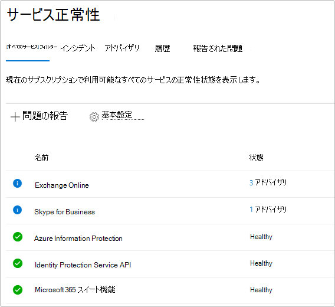
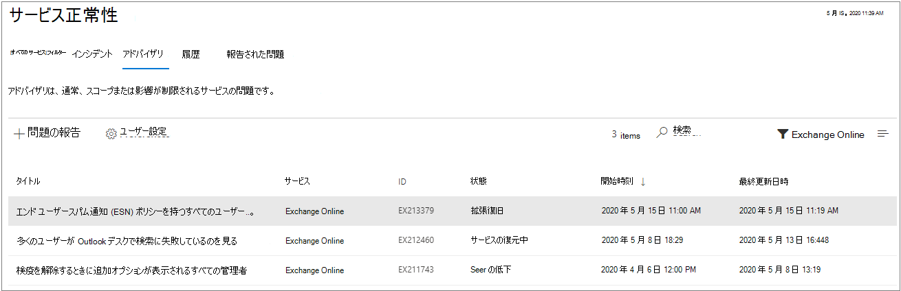

# Microsoft 365 サービス正常性を確認する方法

[[Microsoft 365 管理センター](https://go.microsoft.com/fwlink/p/?linkid=2024339)] の [**サービス正常性**] ページで、Office on the web、Yammer、Microsoft Dynamics CRM、モバイル デバイス管理クラウド サービスなどの Microsoft サービスの正常性を表示できます。 クラウド サービスの問題が発生している場合は、サポートに連絡するかトラブルシューティングに時間を費やす前に、サービス正常性を確認することで、解決に向けて取り組み中の既知の問題であるかどうかを判別できます。

管理センターにサインインできない場合は、[[サービスの状態] ページ](https://status.office365.com)を使用して、テナントへのログインを妨げている既知の問題を確認できます。  また、サインアップして Twitter で [@MSFT365status](https://twitter.com/MSFT365Status) をフォローすると、特定のイベントの情報をご覧いただけます。

## サービス正常性の確認方法

1. [https://admin.microsoft.com](https://go.microsoft.com/fwlink/p/?linkid=2024339) の Microsoft 365 管理センターに移動し、管理者アカウントでサインインします。

    > [!NOTE]
    > グローバル 管理者またはサービス サポート管理者の役割が割り当てられているユーザーは、サービスの状態を表示できます。 Exchange、SharePoint、および Skype for Business の管理者がサービス正常性を表示できるようにする場合も、ユーザーにはサービス管理者の役割が割り当てられている必要があります。 サービス正常性を表示できる役割の詳細については、「[管理者の役割について](../admin/add-users/about-admin-roles.md?preserve-view=true&view=o365-worldwide#commonly-used-microsoft-365-admin-center-roles)」を参照してください。

2. サービス正常性を開くには、管理センターで [**正常性**]  >  [**サービス正常性**] の順に移動するか、[**ホーム ダッシュボード**] の [**サービス正常性**] カードを選択します。 [ダッシュボード] カードでは、アクティブなサービスの問題があるかどうかが示され、詳細な [**サービス正常性**] ページへのリンクが提供されます。

3. [**サービス正常性**] ページでは、それぞれのクラウド サービスの正常性の状態は表形式で表示されます。

   

[**すべてのサービス**] タブ (既定のビュー) に、すべてのサービスとその現在の正常性の状態、およびアクティブなインシデントやアドバイザリが表示されます。 アイコンと [**正常性**] 列の状態は、各サービスの状態を示しています。

あるサービスに有効なインシデントやアドバイザリがある場合、それらはサービス名の下の入れ子の表で直接表示されます。 サービス名の左にある山形アイコンをクリックすると、入れ子の表を折りたたんで、このビューのインシデントやアドバイザリを非表示にすることができます。   

ビューをフィルタリングして、すべてのアクティブなインシデントのみを表示するには、ページ上部の [**インシデント**] タブを選択します。 **アドバイザリ** タブを選択すると、投稿されたアクティブなアドバイザリのみが表示されます。

[**履歴**] タブには、過去 7 日または 30 日以内に解決されたすべてのインシデントおよび勧告の履歴が表示されます。

Microsoft 365 サービスで問題が発生し、それが [**サービス正常性**] ページに一覧表示されない場合は、[**問題を報告する**] を選択して短いフォームに記入してください。 他の組織からの関連データとレポートを調べて、問題がどの程度広がっているか、およびそれがサービスに起因しているかどうかを確認します。 該当する場合、[**サービス正常性**] ページに新しいインシデントまたは勧告として追加し、その解決を追跡できます。 [**報告された問題**] ページには、このフォームでテナントが報告したすべての問題とその状況が表示されます。

ダッシュボードに表示されるサービスの表示をカスタマイズするには、[**環境設定**] > >  [**カスタム表示**] の順に選択し、サービス正常性ダッシュボードの表示から除外したいサービスのチェックボックスをクリアします。 監視する各サービスのチェックボックスをオンにしていることを確認します。

テナントに影響する新しいインシデントや、アクティブなインシデントの状態変更をメールで通知するように登録するには、[**環境設定**] > >  [**メール**] の順に選択し、[**サービス正常性の通知をメールで送る**] をクリックして、指定します。

- メールアドレスは最大 2 つです。
- インシデントや警告の通知を希望するかどうか
- 通知を希望するサービス

また、サービスのすべてのイベントではなく、個々のイベントのメール通知を購読することもできます。 そうするには、メール通知の更新情報を受け取りたいアクティブな問題を選択し、[**この問題の通知を管理**] を選択して指定します。 
- メールアドレスは最大 2 つです。

> [!NOTE]
> 管理者ごとにユーザー設定を行うことができ、上記の 2 つのメールアドレスの制限は管理者アカウントごとに行われます。

> [!TIP]
> モバイル デバイスで [Microsoft Admin アプリ](https://go.microsoft.com/fwlink/p/?linkid=627216)を使って、サービス正常性を表示することもできます。これはプッシュ通知により、常に最新情報を入手する優れた手段です。

### 投稿されたサービス正常性の詳細を表示する

[**すべてのサービス**] ビューで、問題のタイトルを選択すると、[問題の詳細] ページが表示されます。このページには、解決策の取り組み中に投稿されるすべてのメッセージのフィードを含む、問題の詳細が表示されます。 

勧告またはインシデントの概要では、以下の情報が提供されます。

- **タイトル** - 問題の概要。
- **ID** - 問題の数値識別子。
- **サービス** - 影響を受けるサービスの名前。
- **最終更新時刻** - サービス正常性メッセージの最後の更新時刻。
- **予定の開始時刻** - 問題が始まったと推定される時刻。
- **状態** - この問題がサービスに与える影響。
- **ユーザーの影響** - この問題がエンド ユーザーに与える影響についての簡単な説明。
- **すべての更新プログラム** - 頻繁にメッセージを投稿して、解決策の適用についての進捗状況をお知らせします。

![[問題の詳細] を表示するスクリーンショット](../media/service-health-advisory-detail.png)

### サービス正常性の詳細を翻訳する

機械翻訳を利用し、自動的にお客様のご希望の言語でメッセージを表示します。 言語設定する方法の詳細については、[サービス正常性ダッシュボードの言語翻訳](lang-service-health.md) に関する記事を参照してください。

### 定義

ほとんどの場合、サービスは正常として表示され、それ以上の情報は示されません。サービスに問題がある場合、問題は勧告またはインシデントとして認識され、現在の状態が表示されます。

> [!TIP]
> 計画済みメンテナンス イベントはサービス正常性には表示されません。 常に **メッセージ センター** を確認することで、計画済みメンテナンス イベントを追跡できます。 フィルタリングして [変更の計画] として分類されたメッセージに絞り込み、変更が発生する時期、その影響、およびそのための準備方法を確認します。 詳細については、「[Microsoft 365 のメッセージ センター](https://support.office.com/article/38fb3333-bfcc-4340-a37b-deda509c2093)」を参照してください。

### インシデントおよび勧告

| アイコン | 説明 |
|:-----|:-----|
||サービスが勧告と示された場合、一部のユーザーに影響する問題が認識されています。ただし、サービスは引き続き使用可能です。勧告では、多くの場合、回避策があり、問題は一時的なものである可能性があるか、または範囲およびユーザーへの影響は限られます。    |
||サービスがアクティブ インシデントと示された場合、重大な問題であり、サービスまたはサービスの主な機能は使用できません。たとえば、ユーザーはメールの送受信やサインインができない可能性があります。インシデントはユーザーに顕著な影響を与えます。進行中にインシデントが発生した場合は、サービス正常性ダッシュボードで調査、軽減への取り組み、解決策の確認に関する更新プログラムを提供します。    |

### 状態の定義

| 状態 | 定義 |
|:-----|:-----|
|**調査中** | 潜在的な問題は認識されており、現状と影響範囲に関する詳細情報を収集中です。 |
|**サービスの低下** | サービスまたは機能の使用に影響する可能性のある問題があることが確認されています。サービスの実行に通常より長い時間がかかる場合、一時的に中断している場合、機能が動作していない場合などにこの状態が示されることがあります。 |
|**サービスの中断** | 問題がサービスへのアクセスを妨げると判断された場合にこの状態が示されます。この場合、問題は重要なものであり、常に再現できます。 |
|**サービスの復元** | 問題の原因は特定されており、対応策はわかっています。また、サービスを正常な状態に戻している段階です。 |
|**拡張復旧** | この状態は、ほとんどのユーザーに対するサービスを復元するための対応策が進行中ですが、影響を受けるすべてのシステムに適用されるまでは時間がかかることを示します。また、永続的な修正プログラムが適用されるのを待機する間に、一時的な修正プログラムで影響を減らした場合、この状態が表示されることもあります。 |
|**調査の中断** | 潜在的な問題の詳細な調査で、さらに調査できるようにお客様からの追加情報を要求する場合は、この状態が示されます。お客様にアクションを求める場合は、必要なデータまたはログをお知らせします。 |
|**サービスが復元されました** | 対応策によって根本的な問題が解決され、サービスが正常な状態に復元されたことが確認されています。原因を確認するには、問題の詳細を表示します。 |
|**誤検知** | 詳細な調査の結果、サービスが正常であり、設計どおりに動作していることを確認しました。 サービスへの影響が観察されなかったか、インシデントの原因がサービス外に起因するものでした。 |
|**インシデントの事後レポートを発行済み** | 根本原因情報および同様の問題が再発しないようにするための次の手順を含む特定の問題についてのインシデントの事後レポートを発行しました。 |

### メッセージ投稿の種類

| 種類 | 定義 |
|:-----|:-----|
|**簡単な更新** | 広範囲に影響を及ぼすインシデントに対して、短期間で頻繁に増分更新を行い、すべてのお客様に提供します。 |
|**追加の詳細** | これらの追加投稿により、技術的な情報や解決方法の詳細が提供され、インシデントの処理状況がより深く可視化されます。 これは、[Exchange Online 監視](/microsoft-365/enterprise/microsoft-365-exchange-monitoring?view=o365-worldwide#requirements)と同じ要件を満たすテナントで利用可能です。 |

### 履歴

サービス正常性では現在の正常性の状態を確認し、過去 30 日間のサービスの勧告およびテナントに影響を与えたインシデントの履歴を表示することができます。 すべてのサービスの過去の正常性を表示するには、[**履歴**] ビューを選択します。

稼働率への取り組みの詳細については、「[Microsoft 365 による透明性のある運用](/office365/servicedescriptions/office-365-platform-service-description/service-health-and-continuity)」を参照してください。

## 関連項目

[Microsoft 365 管理センターのアクティビティ レポート](https://support.office.com/article/0d6dfb17-8582-4172-a9a9-aed798150263)

[メッセージ センターの基本情報](../admin/manage/message-center.md?preserve-view=true&view=o365-worldwide#preferences)

[管理センターで Windows リリースの状態を確認する方法](/windows/deployment/update/check-release-health)
