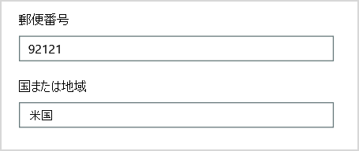
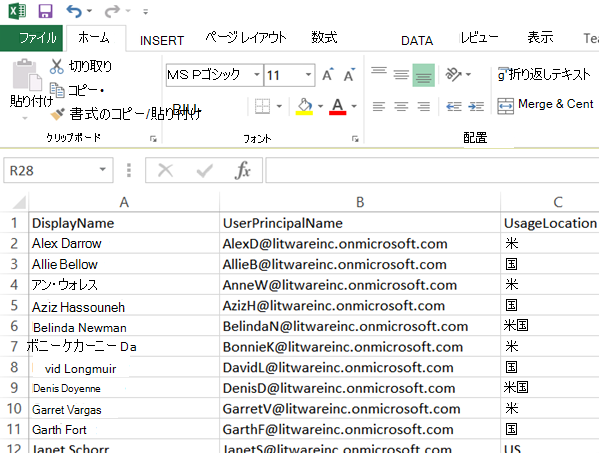

# <a name="why-you-need-to-use-powershell-for-microsoft-365"></a>Microsoft 365 で PowerShell を使用する理由

*この記事は、Microsoft 365 Enterprise および Office 365 Enterprise の両方に適用されます。*

ユーザー アカウントMicrosoft 365 管理センター、ユーザー アカウントとライセンスMicrosoft 365管理できます。 また、オンライン、Microsoft 365、オンラインなどのExchange OnlineサービスTeams管理SharePointできます。 代わりに PowerShell を使用してこれらのサービスを管理する場合は、コマンド ラインとスクリプト言語環境を利用して、速度、自動化、追加機能を利用できます。

この記事では、PowerShell を使用して次の情報を管理するMicrosoft 365示します。

- ページに表示できない追加情報を表示Microsoft 365 管理センター

- PowerShell でのみ可能な機能と設定を構成する

- 一括操作を実行する

- データをフィルター処理する

- データの印刷または保存

- 複数のサービスを管理する

PowerShell for Microsoft 365 は Windows PowerShell の一連のモジュールであり、Windows ベースのサービスとプラットフォームのコマンドライン環境です。 この環境では、追加のモジュールで拡張できるコマンド シェル言語を作成します。 単純なコマンドまたは複雑なコマンドまたはスクリプトを実行する方法を提供します。 たとえば、Microsoft 365 モジュール用の PowerShell をインストールし、Microsoft 365 サブスクリプションに接続した後、次のコマンドを実行して、すべてのユーザー メールボックスを一覧表示Microsoft Exchange Online。

```powershell
Get-Mailbox
```

また、Microsoft 365 管理センター を使用してメールボックスのリストを取得することもできますが、すべての Web アプリのすべてのサイトのすべてのリスト内のアイテムを数えるのは簡単ではありません。

PowerShell for Microsoft 365は、アプリケーションを置き換えるのではなく、Microsoft 365の管理に役立Microsoft 365 管理センター。 管理者は、PowerShell を使用して Microsoft 365 コマンドを実行する場合にのみ実行できる構成手順がいくつかあるため、Microsoft 365 必要があります。 このような場合は、次の方法を知る必要があります。

- PowerShell for Microsoft 365モジュールをインストールします (管理者コンピューターごとに 1 回のみ実行)。

- ConnectサブスクリプションにMicrosoft 365します (PowerShell セッションごとに 1 回)。

- コマンドの実行に必要な PowerShell を実行するために必要なMicrosoft 365します。

- PowerShell を実行して、Microsoft 365コマンドを実行します。

これらの基本的なスキルを習得した後は **、[Get-Mailbox]** コマンドを使用してメールボックス ユーザーを一覧表示する必要がなされません。 また、すべての Web アプリのすべてのサイトのすべてのリストのすべての項目をカウントするために、前に引用したコマンドのような新しいコマンドを作成する方法も理解する必要があります。 Microsoft と管理者のコミュニティは、必要に応じてこのようなタスクを支援できます。

## <a name="powershell-for-microsoft-365-can-reveal-information-that-you-cant-see-with-the-microsoft-365-admin-center"></a>PowerShell for Microsoft 365では、ユーザーが表示できない情報を表示Microsoft 365 管理センター

このページMicrosoft 365 管理センター役立つ情報が多数表示されます。 ただし、ユーザー、ライセンス、メールボックス、およびサイトにMicrosoft 365できる情報はすべて表示されません。 次に、ユーザーとグループ *の* 例を示Microsoft 365 管理センター。


このビューは、多くの場合必要な情報を提供します。 しかし、もっと多くの情報が必要な場合もあります。 たとえば、Microsoft 365 (およびユーザーがMicrosoft 365使用できる機能) は、ユーザーの地理的な場所によって一部異なります。 米国に住むユーザーに拡張できるポリシーと機能は、インドまたはベルギーのユーザーに拡張できるポリシーと機能と同じではない可能性があります。 ユーザーの地理的な場所をMicrosoft 365 管理センターするには、次の手順を実行します。

1. ユーザーの **表示名** をダブルクリックします。

2. ユーザー プロパティの表示ウィンドウで、[詳細] を **選択します**。

3. 詳細表示で、追加の詳細 **を選択します**。

4. [国] または [地域] という見出し **が表示されるまでスクロールします**。

     

5. ユーザーの表示名と場所を紙に書き留めるか、コピーしてメモ帳に貼り付けます。

この手順をユーザーごとに繰り返す必要があります。 ユーザーが多い場合、このプロセスは時間のかかっている可能性があります。 PowerShell for Microsoft 365、次のコマンドを使用して、すべてのユーザーに対してこの情報を表示できます。

```powershell
Get-AzureADUser | Select DisplayName, UsageLocation
```


>[!Note]
>PowerShell Core では、Msol を名前に含Microsoft Azure Active DirectoryモジュールWindows PowerShellコマンドレットのモジュール *モジュールは* サポートされていません。 これらのコマンドレットは、次の手順で実行Windows PowerShell。
>

結果の例を次に示します。

```powershell
DisplayName                               UsageLocation
-----------                               -------------
Bonnie Kearney                            GB
Fabrice Canel                             BR
Brian Johnson (TAILSPIN)                  US
Anne Wallace                              US
Alex Darrow                               US
David Longmuir                            BR
```

この PowerShell コマンドの解釈は、現在の Microsoft 365 サブスクリプション **(Get-AzureADUser)** のすべてのユーザーを取得しますが、各ユーザーの名前と場所のみを表示します (Select **DisplayName, UsageLocation)。**

PowerShell for Microsoft 365コマンド シェル言語をサポートしている場合 **、Get-AzureADUser** コマンドで取得した情報をさらに操作できます。 たとえば、これらのユーザーを場所別に並べ替え、すべてのブラジル人ユーザーをグループ化し、すべての米国ユーザーをまとめてグループ化する場合などです。 コマンドを次に示します。

```powershell
Get-AzureADUser | Select DisplayName, UsageLocation | Sort UsageLocation, DisplayName
```

結果の例を次に示します。

```powershell
DisplayName                                 UsageLocation
-----------                                 -------------
David Longmuir                              BR
Fabrice Canel                               BR
Bonnie Kearney                              GB
Alex Darrow                                 US
Anne Wallace                                US
Brian Johnson (TAILSPIN)                    US
```

この PowerShell コマンドの解釈は、現在の Microsoft 365 サブスクリプションのすべてのユーザーを取得しますが、各ユーザーの名前と場所のみを表示し、最初にユーザーの場所で並べ替え、次に名前 **(Sort UsageLocation,DisplayName)** で並べ替えます。

追加のフィルター処理を使用できます。 たとえば、ブラジル在住のユーザーに関する情報のみを表示する場合には、次のコマンドを使用します。

```powershell
Get-AzureADUser | Where {$_.UsageLocation -eq "BR"} | Select DisplayName, UsageLocation
```

結果の例を次に示します。

```powershell
DisplayName                                           UsageLocation
-----------                                           -------------
David Longmuir                                        BR
Fabrice Canel                                         BR
```

この PowerShell コマンドの解釈は、現在のサブスクリプションのすべてのユーザーを取得しMicrosoft 365場所がブラジル ( Where **{$ \_ ) です。UsageLocation -eq "BR"}**) をクリックし、各ユーザーの名前と場所を表示します。

 **大規模なドメインに関するメモ**

数万人のユーザーを持つ大規模なドメインがある場合は、この記事で示す例の一部を試してみようとすると、調整が発生する可能性があります。 計算能力や利用可能なネットワーク帯域幅のような要因に基づいて、一度に実行しすぎようとしている可能性があります。 大規模な組織では、これらの PowerShell 操作の一部を 2 つのコマンドに分割する必要があります。

たとえば、次のコマンドは、すべてのユーザー アカウントを返し、それぞれの名前と場所を表示します。

```powershell
Get-AzureADUser | Select DisplayName, UsageLocation
```

このコマンドは、規模が小さいドメインには最適に機能します。 ただし、大規模な組織では、その操作を変数にユーザー アカウント情報を格納するコマンドと、必要な情報を表示する 2 つのコマンドに分割できます。 次に例を示します。

```powershell
$x = Get-AzureADUser
$x | Select DisplayName, UsageLocation
```

この一連の PowerShell コマンドの解釈は次の場合です。
1. 現在のサブスクリプション内のすべてのユーザー Microsoft 365取得し、$x ( $x **= Get-AzureADUser)** という名前の変数に情報を格納します。
1.  変数の内容を表示 *$x、各* ユーザーの名前と **場所のみを含$x |[DisplayName, UsageLocation] を選択します**。

## <a name="microsoft-365-has-features-that-you-can-only-configure-with-powershell-for-microsoft-365"></a>Microsoft 365 PowerShell でのみ構成できる機能が含Microsoft 365

このMicrosoft 365 管理センターは、ほとんどの環境に適用される一般的で有用な管理タスクへのアクセスを提供することを目的としています。 つまり、一般的な管理者Microsoft 365 管理センター最も一般的な管理タスクを実行できるよう、このタスクは設計されています。 ただし、管理センターでは実行できないタスクもあります。

たとえば、Skype for Business管理センターには、カスタム会議出席依頼を作成するためのいくつかのオプションがあります。


これらの設定を使用すると、会議出席依頼にパーソナルでプロフェッショナルな風合いを加えることができます。 ただし、会議構成の設定には、単にカスタムの会議出席依頼を作成するよりも多くがあります。 たとえば、既定では会議に関して以下の事柄が許可されています。

- 匿名ユーザーが、各会議に自動的に参加すること。

- 参加者が、会議を記録すること。

- 組織のすべてのユーザーが、会議に参加するときに発表者として指定されること。

これらの設定は、オンライン管理センター Skype for Business使用できません。 PowerShell からこれらのコントロールを制御して、Microsoft 365。 次の 3 つの設定を無効にするコマンドを示します。

```powershell
Set-CsMeetingConfiguration -AdmitAnonymousUsersByDefault $False -AllowConferenceRecording $False -DesignateAsPresenter "None"
```

> [!NOTE]
> このコマンドを実行するには、オンライン[PowerShell モジュールSkype for Businessインストールする必要があります](https://www.microsoft.com/download/details.aspx?id=39366)。

この PowerShell コマンドの解釈は次の場合です。

1. 新しい Skype for Business Online 会議 **(Set-CsMeetingConfiguration)** の設定で、匿名ユーザーが会議への自動入り口を取得できるように無効にします **(-AdmitAnonymousUsersByDefault**$False)。
2.  出席者が会議を記録する機能を無効にします **(-AllowConferenceRecording**$False)。
3. 組織のすべてのユーザーを発表者として指定しない (**-DesignateAsPresenter "None"**)。

これらの既定の設定を復元する (オプションを有効にする) には、次のコマンドを実行します。

```powershell
Set-CsMeetingConfiguration -AdmitAnonymousUsersByDefault $True -AllowConferenceRecording $True -DesignateAsPresenter "Company"
```

他にも同様のシナリオがあります。そのため、管理者は PowerShell を実行してコマンドを実行する方法Microsoft 365があります。

## <a name="powershell-for-microsoft-365-is-great-for-bulk-operations"></a>PowerShell for Microsoft 365一括操作に最適

1 つの操作をMicrosoft 365 管理センター操作を行う場合は、ビジュアル インターフェイスのようなビジュアル インターフェイスが最も重要です。 たとえば、1 つのユーザー アカウントを無効にする必要がある場合は、管理センターを使用して、チェック ボックスをすばやく見つけてクリアできます。 これは、PowerShell で同様の操作を実行するよりも簡単な場合があります。

しかし、他の大きなセットの中で多くの変更や選択した項目を変更する必要がある場合は、Microsoft 365 管理センター最適なツールではない可能性があります。 たとえば、何千もの電話番号のプレフィックスを変更するか、特定のユーザー *Ken Myer* をすべてのオンライン サイトから削除する必要SharePointします。 この方法は、次のMicrosoft 365 管理センター。

最後の例では、数百のオンライン サイトSharePoint、Ken Meyer がメンバーであるかどうかがわかりません。 次の手順を実行するには、Microsoft 365 管理センターから開始し、サイトごとに次の手順を実行する必要があります。

1. サイト **の URL** を選択します。

2. [サイト コレクション **のプロパティ] ボックス** で **、[Web サイト** アドレス] リンクを選択してサイトを開きます。

3. サイトで、[共有] を **選択します**。

4. [共有 **] ダイアログ** ボックスで、サイトへのアクセス許可を持つすべてのユーザーを表示するリンクを選択します。

     

5. [共有する **ユーザー] ダイアログ ボックス** で、[詳細設定] を **選択します**。

6. ユーザーの一覧を下にスクロールし、Ken Myer (サイトへのアクセス許可がある場合) を見つけて選択し、[ユーザーのアクセス許可の削除] **を選択します**。

これは、数百 *のサイト* には長い時間がかかるでしょう。

もう 1 つの方法は、PowerShell で次のコマンドを実行して、Microsoft 365 Ken Myer をすべてのサイトから削除する方法です。

```powershell
Get-SPOSite | ForEach {Remove-SPOUser -Site $_.Url -LoginName "kenmyer@litwareinc.com"}
```

> [!NOTE]
> このコマンドでは、オンライン PowerShell モジュールSharePoint[インストールする必要があります](/powershell/sharepoint/sharepoint-online/connect-sharepoint-online)。

この PowerShell コマンドの解釈は、現在の Microsoft 365 サブスクリプション **(Get-SPOSite)** 内のすべての SharePoint サイトを取得し、各サイトでアクセスできるユーザーの一覧から Ken Meyer を削除することです **(ForEach {Remove-SPOUser -Site $ . \_Url -LoginName "kenmyer \@ litwareinc.com"}**)。

Ken Meyer Microsoft 365アクセス権を持たなかったサイトを含め、すべてのサイトから Ken Meyer を削除する必要があります。 そのため、アクセスできないサイトのエラーが結果に表示されます。 このコマンドで追加の条件を使用して、Ken Meyer をログイン リストに登録しているサイトからのみ削除できます。 しかし、返されるエラーは、サイト自体に害を及ぼしません。 このコマンドは、数百のサイトに対して実行するには数分かかる場合があります。このコマンドは、何時間もの作業時間ではなく、Microsoft 365 管理センター。

別の一括操作の例を次に示します。 次のコマンドを使用して、新しい管理者である *ボ* ニー SharePointを組織内のすべてのサイトに追加します。

```powershell
Get-SPOSite | ForEach {Add-SPOUser -Site $_.Url -LoginName "bkearney@litwareinc.com" -Group "Members"}
```

この PowerShell コマンドの解釈は、現在の Microsoft 365 サブスクリプション内のすべての SharePoint サイトを取得し、各サイトで、サイトの Members グループにログイン名を追加することで、ボニー カーニー アクセスを許可します **(ForEach {Add-SPOUser -Site $ \_ .Url -LoginName "bkearney \@ litwareinc.com" -Group "Members"}**)。

## <a name="powershell-for-microsoft-365-is-great-at-filtering-data"></a>PowerShell for Microsoft 365データのフィルター処理に最適

このMicrosoft 365 管理センターは、データをフィルター処理して、対象となる情報のサブセットを簡単に見つけ出す方法を提供します。 たとえば、Exchange では、ユーザー メールボックスのほとんどすべてのプロパティに対するフィルターを簡単に適用できます。 たとえば、ブルーミントン市に住んでいるすべてのユーザーのメールボックスの一覧を次に示します。


Exchange 管理センターでは、フィルター条件を組み合わせることもできます。 たとえば、ブルーミントンに住み、財務部門で働いているすべてのユーザーのメールボックスを見つけるとします。

ただし、管理センターで実行できる操作にはExchangeがあります。 たとえば、ブルーミントンやサン ディエゴに住むユーザーのメールボックスや、ブルーミントンに住んでいないすべてのユーザーのメールボックスを簡単に見つけられなかったとします。

次の PowerShell を使用して、Microsoft 365またはサンディエゴに住んでいるすべてのユーザーのメールボックスの一覧を取得できます。

```powershell
Get-User | Where {$_.RecipientTypeDetails -eq "UserMailbox&quot; -and ($_.City -eq &quot;San Diego&quot; -or $_.City -eq &quot;Bloomington")} | Select DisplayName, City
```

結果の例を次に示します。

```powershell
DisplayName                              City
-----------                              ----
Alex Darrow                              San Diego
Bonnie Kearney                           San Diego
Julian Isla                              Bloomington
Rob Young                                Bloomington
```

この PowerShell コマンドの解釈は、現在の Microsoft 365 サブスクリプションで、サンディエゴまたはブルーミントン市にメールボックスを持つすべてのユーザーを取得します **(Where {$ \_ .RecipientTypeDetails -eq "UserMailbox" -and ($ \_ .City -eq "San Diego" -or $ \_ .City -eq "Bloomington")}**) をクリックし、それぞれの名前と都市を表示します **([DisplayName, City] を選択します**)。

次に、ブルームトン以外の場所に住むユーザーのすべてのメールボックスを一覧表示するコマンドを示します。

```powershell
Get-User | Where {$_.RecipientTypeDetails -eq "UserMailbox" -and $_.City -ne "Bloomington"} | Select DisplayName, City
```

結果の例を次に示します。

```powershell
DisplayName                               City
-----------                               ----
MOD Administrator                         Redmond
Alex Darrow                               San Diego
Allie Bellew                              Bellevue
Anne Wallace                              Louisville
Aziz Hassouneh                            Cairo
Belinda Newman                            Charlotte
Bonnie Kearney                            San Diego
David Longmuir                            Waukesha
Denis Dehenne                             Birmingham
Garret Vargas                             Seattle
Garth Fort                                Tulsa
Janet Schorr                              Bellevue
```

この PowerShell コマンドの解釈は、現在の Microsoft 365 サブスクリプションのすべてのユーザーを取得し、メールボックスがブルーミントン市にはない ( Where **{$ \_ .RecipientTypeDetails -eq "UserMailbox" -and $ \_ .City -ne "Bloomington"} )** をクリックし、それぞれの名前と都市を表示します。

### <a name="use-wildcards"></a>ワイルドカードを使用する

PowerShell フィルターでワイルドカード文字を使用して、名前の一部と一致することもできます。 たとえば、ユーザー アカウントを探しているとします。 覚えているのは、ユーザーの名が *Anderson* または *Henderson* または *Jorgenson である場合です*。

検索ツールを使用して次の 3 つのMicrosoft 365 管理センターを実行することで、ユーザーを追跡できます。

- *Anderson*  用のもの

- *Henderson*  用のもの

- *Jorgenson*  用のもの

これらの 3 つの名前はすべて "son" で終わるので、名前が "son" で終わるすべてのユーザーを表示する PowerShell に伝えられます。 コマンドを次に示します。

```powershell
Get-User -Filter '{LastName -like "*son"}'
```

この PowerShell コマンドの解釈は、現在の Microsoft 365 サブスクリプションのすべてのユーザーを取得しますが、姓が "son" で終わるユーザーのみを一覧表示するフィルターを使用します **(-Filter '{LastName -like " \* son"})。** この \* 略は、ユーザーの名字の文字である任意の文字セットを表します。

## <a name="powershell-for-microsoft-365-makes-it-easy-to-print-or-save-data"></a>PowerShell for Microsoft 365を使用すると、データの印刷や保存が容易になります

このMicrosoft 365 管理センターデータの一覧を表示できます。 オンライン管理センターでオンラインを有効Skype for Businessユーザーの一覧を表示する例を次にSkype for Businessします。


その情報をファイルに保存するには、ドキュメントまたはワークシートに貼りMicrosoft Excel必要があります。 どちらの場合も、追加の書式設定が必要になる場合があります。 さらに、Microsoft 365 管理センターリストを直接印刷する方法は提供されません。

幸いなことに、PowerShell を使用すると、リストを表示するだけでなく、そのリストをファイルに簡単にインポートできるファイルに保存Excel。 次に、Skype for Business Online ユーザー データをコンマ区切り値 (CSV) ファイルに保存するコマンドの例を示します。このコマンドは、ワークシート内のテーブルExcelできます。

```powershell
Get-CsOnlineUser | Select DisplayName, UserPrincipalName, UsageLocation | Export-Csv -Path "C:\Logs\SfBUsers.csv" -NoTypeInformation
```

結果の例を次に示します。



この PowerShell コマンドの解釈は、現在のサブスクリプション **(Get-CsOnlineUser)** Skype for Business Online ユーザー全員を取得Microsoft 365です。ユーザー名、UPN、および場所のみを取得します **(DisplayName、UserPrincipalName、UsageLocation を選択)。** その情報を C: \\ LogsSfBUsers.csv ( \\ **Export-Csv -Path "C: Logs \\ \\SfBUsers.csv" -NoTypeInformation)** という名前の CSV ファイルに保存します。

オプションを使用して、このリストを XML ファイルまたは HTML ページとして保存することもできます。 実際、追加の PowerShell コマンドを使用すると、必要なカスタム書式を使用して、Excelファイルとして直接保存できます。

また、リストを表示する PowerShell コマンドの出力を、既定のプリンターに直接送信Windows。 コマンドの例を次に示します。

```powershell
Get-CsOnlineUser | Select DisplayName, UserPrincipalName, UsageLocation | Out-Printer
```

印刷されたドキュメントは次のようになります。


この PowerShell コマンドの解釈は、現在のサブスクリプションSkype for Businessオンライン ユーザー全員を取得Microsoft 365です。ユーザー名、UPN、および場所のみを取得します。その情報を既定のプリンター (Windowsプリンター)**に送信します**。

印刷されたドキュメントの書式は、PowerShell コマンド ウィンドウの表示と同じ単純な書式です。 ハード コピーを取得するには、ファイルを追加 **|コマンドの最後** にプリンターを出力します。

## <a name="powershell-for-microsoft-365-lets-you-manage-across-server-products"></a>PowerShell for Microsoft 365サーバー製品間で管理できます

これらのコンポーネントを構成するMicrosoft 365は、一緒に動作するように設計されています。 たとえば、ユーザーに新しいユーザーをMicrosoft 365、ユーザーの部署や電話番号などの情報を指定するとします。 この情報は、Microsoft 365 サービス (Skype for Business Online、Exchange、または SharePoint) でユーザーの情報にアクセスした場合に利用できます。

ただし、これは製品のスイートに共通する一般情報の場合です。 ユーザーのメールボックスに関する情報などの製品固有のExchangeは、通常、スイート全体では使用できません。 たとえば、ユーザーのメールボックスが有効になっているかどうかに関する情報は、管理者センターでのみExchangeできます。

すべてのユーザーに関する次のような情報を示すレポートを作成するとします。

- ユーザーの表示名

- ユーザーがユーザーのライセンスを取得Microsoft 365

- ユーザーの Exchange メールボックスが有効になっているかどうか

- ユーザーが Skype for Business Online に対して有効になっているかどうか

このようなレポートを簡単に作成Microsoft 365 管理センター。 代わりに、別のドキュメントを作成して、ワークシートなどの情報を保存Excelがあります。 次に、Microsoft 365 管理センター からすべてのユーザー名とライセンス情報を取得し、Exchange 管理センターからメールボックス情報を取得し、Skype for Business Online 管理センターから Skype for Business Online 情報を取得し、その情報を組み合わせます。

もう 1 つの方法は、PowerShell スクリプトを使用してレポートをコンパイルする方法です。

次のスクリプト例は、この記事でこれまでに見たコマンドよりも複雑です。 ただし、PowerShell を使用して、それ以外の場合は取得が困難な情報ビューを作成する可能性を示しています。 必要なリストをコンパイルして表示するスクリプトを次に示します。

```powershell
$x = Get-AzureADUser

foreach ($i in $x)
    {
      $y = Get-Mailbox -Identity $i.UserPrincipalName
      $i | Add-Member -MemberType NoteProperty -Name IsMailboxEnabled -Value $y.IsMailboxEnabled

      $y = Get-CsOnlineUser -Identity $i.UserPrincipalName
      $i | Add-Member -MemberType NoteProperty -Name EnabledForSfB -Value $y.Enabled
    }

$x | Select DisplayName, IsLicensed, IsMailboxEnabled, EnabledforSfB
```

結果の例を次に示します。

```powershell
DisplayName             IsLicensed   IsMailboxEnabled   EnabledForSfB
-----------             ----------   ----------------   --------------
Bonnie Kearney          True         True               True
Fabrice Canel           True         True               True
Brian Johnson           False        True               False
Anne Wallace            True         True               True
Alex Darrow             True         True               True
David Longmuir          True         True               True
Katy Jordan             False        True               False
Molly Dempsey           False        True               False
```

この PowerShell スクリプトの解釈は次の場合です。

1. 現在の Microsoft 365 サブスクリプションのすべてのユーザーを取得し、$x *(* $x **= Get-AzureADUser)** という名前の変数に情報を格納します。
1. 変数 $x **(foreach ($i)** 内のすべてのユーザーを$iループを$xします。
1. $y という *名前* の変数を定義し、その中にユーザーのメールボックス情報を格納します **($y = Get-Mailbox-Identity $i.UserPrincipalName)。**
1. *IsMailBoxEnabled* という名前のユーザー情報に新しいプロパティを追加します。 ユーザーのメールボックスの IsMailBoxEnabled プロパティ **($i | Add-Member -MemberType NoteProperty -Name IsMailboxEnabled -Value $y.IsMailboxEnabled)** の値に設定します。
1. *$y という名前* の変数を定義し、ユーザーの Skype for Business Online 情報をその中に格納します **($y = Get-CsOnlineUser -Identity $i.UserPrincipalName)。**
1. EnabledForSfB という名前のユーザー情報に新しい *プロパティを追加します*。 ユーザーの Skype for Business Online 情報 **($i | Add-Member -MemberType NoteProperty -Name EnabledForSfB -Value $y.Enabled)** の Enabled プロパティの値に設定します。
1. ユーザーの一覧を表示しますが、名前、ライセンスを取得するかどうか、およびメールボックスが有効になっているかどうか、およびユーザーが Skype for Business Online ( $x | で有効になっているかどうかを示す 2 つの新しいプロパティのみを **含$x |[DisplayName, IsLicensed, IsMailboxEnabled, EnabledforSfB] を選択します**。

## <a name="see-also"></a>関連項目

[Microsoft 365 用 PowerShell の使用を開始する](getting-started-with-microsoft-365-powershell.md)

[Microsoft 365 ユーザー アカウント、ライセンス、PowerShell を使用したグループを管理する](manage-user-accounts-and-licenses-with-microsoft-365-powershell.md)

[Windows PowerShell を使用して Microsoft 365 でレポートを作成する](use-windows-powershell-to-create-reports-in-microsoft-365.md)