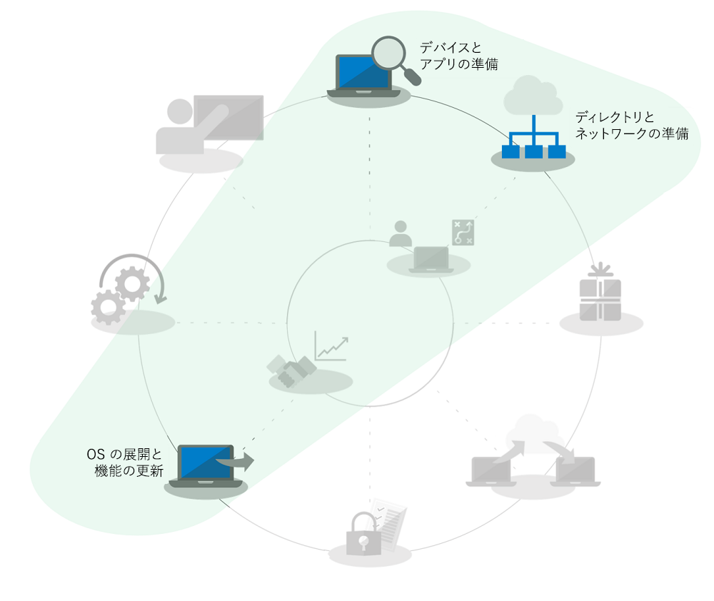

# Windows 7 から Windows 10 に大規模な組織向けの自動インプレース アップグレード

2020 年 1 月 14 日以降 Windows 7 を実行している PC のセキュリティ更新プログラムやサポートは提供されていません。 Windows 7 から Windows 10 へ移行する際に、いくつかの展開オプションがあるため、Windows 7 から Windows 10 に移行するための最も簡単な方法をご説明します。 簡単に移行するには、既存の PC のインプレース アップグレードを行ういます。これにより、デスクトップ展開プロセスのいくつかの問題を減らすことができます。

インプレース アップグレードを使用すると、次に示すようなデスクトップ展開プロセスの範囲が大幅に減少します。

  - **アプリケーションパッケージ** と必要な基幹業務アプリの再配信: これらは Windows 7 環境から転送されます。

  - **ファイルの移行** と基本ユーザーの設定: 同じユーザーがデバイスを保持している場合は、以前のインストールから転送されます。

上記の展開プロセスの車輪グラフィックのグレー表示されたタスクは、完全に無視できるアイテムではありませんが、時間を節約するために、セキュリティ構成を前に移動し、ソフトウェア更新プロセスを展開後に変更します。2012 年にリリースされ家庭用コンピューターとして購入された Windows コンピューターは、Windows 7 があらかじめ組み込まれておらず、また 2015 年に Windows 10 がリリースされてからは、Windows 7 の家庭向けシステムも Windows 10 にアップグレードされるようになるため、家庭向けの Windows コンポーネントのユーザートレーニングは自宅で行われることが多いでしょう。

## インプレース アップグレードの信頼性、保護対策、および規模

インプレース アップグレードは、ファイルの移行やアプリケーションの再インストールをせずに、Windows 7 以降を実行している既存のデバイスを Windows 10 に移行できる信頼できる方法です。 インプレース アップグレードの後も、ユーザーのファイル、設定、使用可能なアプリは、以前の Windows 7 インストールと一致します。 アップグレードは、同じ条件のアーキテクチャ (32 ビットから 32 ビット、または 64 ビットから 64 ビット) から移行する場合や、同じ条件の Windows (Professional から Pro または Enterprise から Enterprise) のエディションから移行する場合にも機能します。

アップグレードプロセスの既定では、以前の Windows のインストールがアップグレードの一部としてバックアップされます。そのため、アップグレードに失敗した場合、またはデバイスやアプリケーションが正常にアップグレード後に機能しない場合は、Windows 7 に戻すことができます。 既定では、アップグレードされた PC は 10 日間の猶予があるため、必要に応じて Windows 7 にロールバックすることができます。

インプレース アップグレードは、 [Microsoft Endpoint Configuration Manager](https://docs.microsoft.com/mem/configmgr/osd/deploy-use/create-a-task-sequence-to-upgrade-an-operating-system) または [Microsoft Deployment Toolkit](https://docs.microsoft.com/windows/deployment/upgrade/upgrade-to-windows-10-with-the-microsoft-deployment-toolkit) などのオペレーティング システム展開ツールを使用して自動化できます。 この記事では、自動化されたアプローチと最適化、およびその他のヘルプの関連リソースへのリンクについて説明します。

## 少数のコンピューターをアップグレードする

1 台または少数のコンピューターの場合は、通常、自動化よりも手動によるアップグレードが最適な方法です。 必要なソフトウェアとライセンスは、[Microsoft ストア](https://go.microsoft.com/fwlink/p/?LinkId=808282) または他のソフトウェア販売店で確認できます。ボリューム ライセンスをお持ちの場合は、[ボリューム ライセンス サービスセンター](https://www.microsoft.com/licensing/servicecenter/default.aspx) で確認できます。 1 台の PC を Windows 10 にアップグレードするには、またアップグレード後の復元オプションを使用するには、[「Windows 7 から Windows 10 への手動アップグレードの手順ガイド ](https://docs.microsoft.com/microsoft-365/enterprise/windows-7-to-windows-10-upgrade)を参照してください。

## 複数のコンピューターをアップグレードする方法

数十、数千のコンピューターを管理する場合、Microsoft Endpoint Configuration Manager または Microsoft Deployment Toolkitを使用して、タスクシーケンスの自動化を使用してインプレース アップグレードを実行することをお勧めします。 ほとんどの場合、このプロセスの信頼性は非常に高いですが、アップグレードする PC の台数によっては、規模を正常にするために必要なテストと制御を行うことをお勧めします。

Azure Active Directory、Office およびビジネスアプリの配送とパッケージ、ユーザーのファイルの移行に関連付けられているタスクをスキップすることができます。これらはアップグレードの一部として保持され、セキュリティは最低限にする必要があります。 これらの領域は、時間の経過とともに改善されます。

アップグレードの展開オプションは [OS の展開と機能の更新プログラム](https://www.aka.ms/mdd6) に含まれていますが、最低限の管理者の介入や、管理者による操作を必要としない自動的な方法で Windows 10 の設定を実行するスクリプト ソリューションを簡単に構築できます。タスク シーケンスでは、より細かい制御が可能です。

  - 展開前のチェックの実行

  - アップグレード前のドライブ暗号化状態を管理する

  - 問題のあるドライバーおよびアップグレード前のアプリをアンインストールする、

  - アップグレード後に追加のドライバーとアプリをインストールする、

  - アップグレード後のドライブ暗号化状態を管理する、

  - PC を以前の状態に復元する: アンインストールされたアプリやドライバーが再インストールされた場合: アップグレードに失敗した場合、

  - それ以外に、ビジネスの準備が整った状態を実現するために構成する必要があるもの

アップグレードが完了しない、またはアップグレードができない最も一般的な理由は、次のとおりです。

  - デバイス ドライバーの失効

  - 第 3 者のディスク暗号化

  - 低レベル コード ソリューション (マルウェア対策、VPN、仮想化など)

[アップグレード タスク シーケンス](https://docs.microsoft.com/mem/configmgr/osd/deploy-use/create-a-task-sequence-to-upgrade-an-operating-system)テンプレートは、Microsoft Endpoint Configuration Manager (Current Branch) に組み込まれており、いくつかのリリースで使用できます。 最近のリリースでは、Configuration Manager のテクノロジーが強化され、プロセスをより効率的にして、デバイスや Office の互換性の評価を行い、ネットワーク トラフィックを削減し、OneDrive バックアップなどの新規オプションの構成を行うことができるようになりました。 Configuration Manager OS の展開に関する最新の更新プログラムの詳細については、[Microsoft の発表](https://youtu.be/CYRnAmCD7ls) をご覧ください。

Microsoft Endpoint Configuration Manager を使用していない場合は、Microsoft 展開ツールキットを使用して、アップグレード展開タスク シーケンスを作成して実行できます。

## キャッシュ前のタスク シーケンスのアップグレード

Configuration Manager 展開タスク シーケンス用の [キャッシュ前オプション](https://docs.microsoft.com/mem/configmgr/osd/deploy-use/create-a-task-sequence-to-upgrade-an-operating-system#configure-pre-cache-content) を使用すると、タスクシーケンスがオペレーティングシステムをアップグレードする前に、関連する OS アップグレードパッケージのコンテンツをダウンロードできます。 以前は、タスク シーケンスを開始すると、パッケージ コンテンツのダウンロードが開始されました。 キャッシュ前のコンテンツでは、適用可能な OS アップグレード パッケージのみをダウンロードするか、展開を受信するとすぐにその他のすべての参照コンテンツのみをダウンロードするかのオプションを、クライアントが設定することもできます。

キャッシュ前のタスク シーケンスと互換性スキャン

パッケージのダウンロード時間を節約するだけでなく、アップグレード パッケージを事前にキャッシュしておくことができます。また、Windows セットアップを使用して、実際の Windows アップグレードを実行する前にインプレース アップグレードが成功するかどうかを評価できます。 次のコマンドライン構文を使用して、非表示の互換性スキャンを実行することができます。また、Windows セットアップがアップグレード準備完了としてデバイスを評価しているかどうかを確認できます。**Setup.EXE /Auto Upgrade /Quiet /NoReboot /Compat ScanOnly**

定義されたサーバーのパスにログが送信され、Windows セットアップがユーザーに表示されなくなり、ユーザーの操作を必要とせず閉じます。

ログの結果は次のようになります。

1.  セットアップが互換性の問題を検出せず、PC がすべての要件を満たしている場合は、MOSETUP\_E\_COMPAT\_SCANONLY (0xC1900210) が返されます。

2.  セットアップが互換性のないアプリなどの問題を検出すると、MOSETUP\_E\_COMPAT\_INSTALLREQ\_BLOCK (0xC1900208) が返されます。

3.  セットアップが PC が Windows 10 の対象ではないことを検出すると、 MOSETUP\_E\_COMPAT\_SYSREQ\_BLOCK (0xC1900200) が返されます。

4.  セットアップが PC のインストールに十分な空き領域がないことが検出すると、MOSETUP\_E\_INSTALLDISKSPACE\_BLOCK (0xC190020E) が返されます。

互換性スキャン機能付きのキャッシュ前のシーケンスをコレクション内の多数の PC に展開したら、デバイス準備状況のログファイルの解析を開始できます。 上記の出力を使用する場合は、\# "展開準備完了" として 1 (0xC1900210) を、および \#ディスク領域を解放することで 4 (0xC190020E) を実行できます。 ここでは、削除する内容について注意する必要がありますが、Windows の更新プログラムのクリーンアップ、ごみ箱、一時ファイルを起動することができます。多くの場合、アップグレードを成功させるために十分な空き領域が用意されます。 PC がインプレース アップグレードの準備ができていることがわかってから、必要に応じて、互換性スキャンを実行できます。 詳細については、「Windows セットアップ コマンドラインのオプション」を参照してください。<https://aka.ms/setupswitches>

## [デスクトップ展開センター](https://aka.ms/howtoshift)
