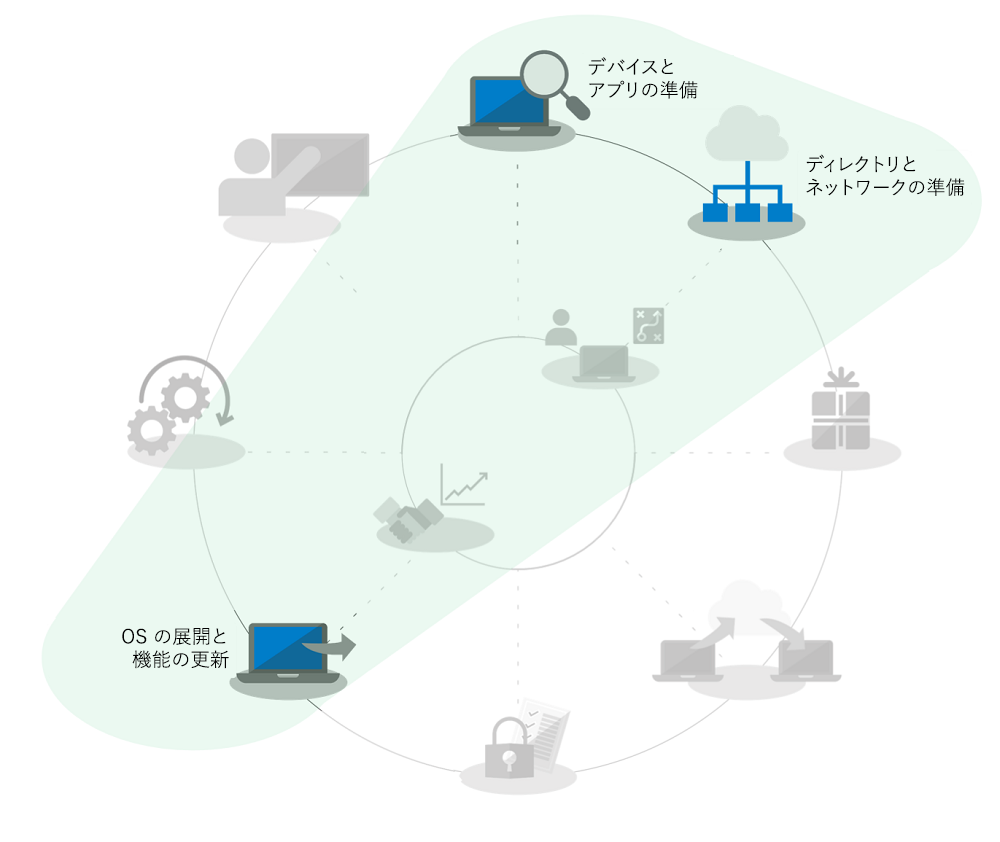
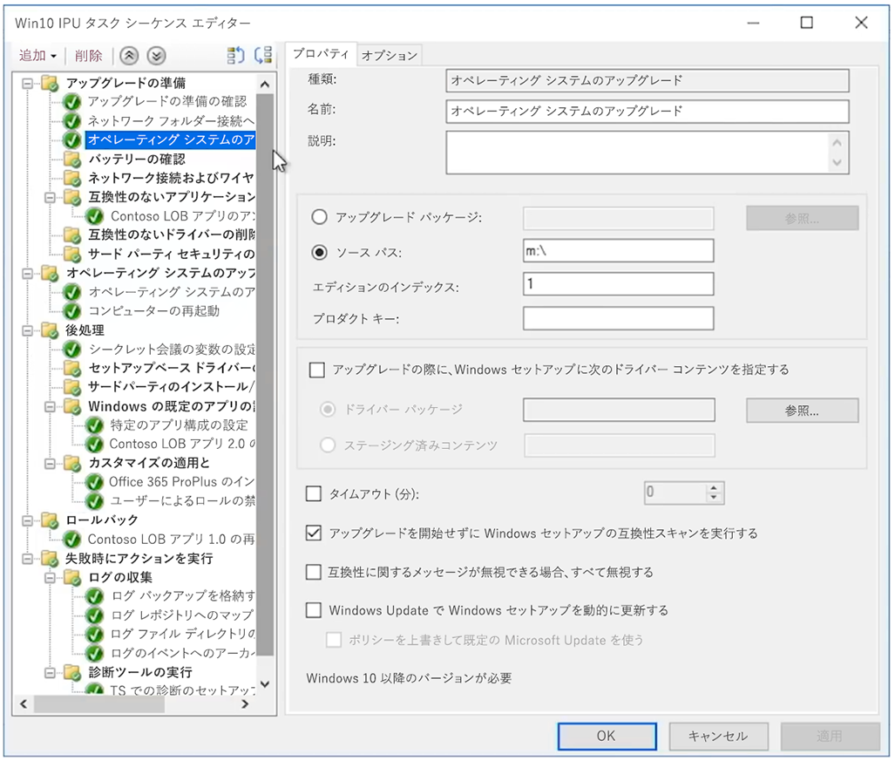

# Windows 7 から Windows 10 に大規模な組織向けの自動インプレース アップグレードWindows 7 to Windows 10 automated in-place upgrades for large organizations

Windows 7 を実行している PC のセキュリティ更新プログラムやサポートは、2020 年 1 月 14 日以降は提供されなくなります。Starting January 14, 2020, security updates or support for PCs running Windows 7 will no longer be provided. 期限前に Windows 7 から Windows 10 へ移行し、複数のオプションを展開するために、Windows 7 から Windows 10 に移行するための最も簡単な方法をご説明します。With just a months left to shift from Windows 7 to Windows 10 and multiple options to deploy, a common question in the IT community is, “What’s the fastest way to move from Windows 7 to Windows 10?” 簡単に移行するには、既存の PC のインプレース アップグレードを行ういます。これにより、デスクトップ展開プロセスのいくつかの問題を減らすことができます。The short answer is to perform in-place upgrades for existing PCs and in doing that you can reduce focus on several aspects of the desktop deployment process.

インプレース アップグレードを使用すると、次に示すようなデスクトップ展開プロセスの範囲が大幅に減少します。Using in-place upgrades, several desktop deployment processes get reduced dramatically in scope, especially:

  - **アプリケーションパッケージ** と必要な基幹業務アプリの再配信: これらは Windows 7 環境から転送されます。**Application packaging** and redelivery of required line-of-business apps – these are simply carried forward from the Windows 7 environment

  - **ファイルの移行** と基本ユーザーの設定: 同じユーザーがデバイスを保持している場合は、以前のインストールから転送されます。**File migration** and basic user settings – these are also carried forward from the previous install when the same user retains the device

上記の展開プロセスの車輪グラフィックのグレー表示されたタスクは、完全に無視できるアイテムではありませんが、時間を節約するために、セキュリティ構成を前に移動し、ソフトウェア更新プロセスを展開後に変更します。2012 年にリリースされ家庭用コンピューターとして購入された Windows コンピューターは、Windows 7 があらかじめ組み込まれておらず、また 2015 年に Windows 10 がリリースされてからは、Windows 7 の家庭向けシステムも Windows 10 にアップグレードされるようになるため、家庭向けの Windows コンポーネントのユーザートレーニングは自宅で行われることが多いでしょう。The grayed-out tasks in the deployment process wheel graphic above are not items that you can completely ignore, but to save time this assumes that you’ll bring forward your security configuration, change software update processes post-deployment, and we’ll assume that your user training for the Windows component has largely happened at home for your users, as privately purchased Windows computers since 2012 for most part have not had Windows 7 pre-loaded and since the release of Windows 10 in 2015, the majority of Windows 7 home systems have also been upgraded to Windows 10.

## インプレース アップグレードの信頼性、保護対策、および規模In-place upgrade reliability, safeguards, and scale

インプレース アップグレードは、ファイルの移行やアプリケーションの再インストールをせずに、Windows 7 以降を実行している既存のデバイスを Windows 10 に移行できる信頼できる方法です。In-place upgrades to Windows 10 are a reliable approach for moving an existing device running Windows 7 or newer to Windows 10, without requiring file migration or application reinstallation. インプレース アップグレードの後も、ユーザーのファイル、設定、使用可能なアプリは、以前の Windows 7 インストールと一致します。After an in-place upgrade, the user’s files, settings and available apps are consistent with their previous Windows 7 installation. この機会に既存のアプリや設定をクリーンアップする場合、Windows 7 のサポート期間が終了する 2020 年 1 月が近づいているため、その他のオプションを実行する時間がありません。While you might want to take this opportunity to clean-up existing apps or settings, realistically as we get closer to the Windows 7 end of support date in January 2020, time is running out to pursue other options. アップグレードは、同じ条件のアーキテクチャ (32 ビットから 32 ビット、または 64 ビットから 64 ビット) から移行する場合や、同じ条件の Windows (Professional から Pro または Enterprise から Enterprise) のエディションから移行する場合にも機能します。Upgrades also work when moving from like-to-like architectures (32-bit to 32-bit or 64-bit to 64-bit) and like-to-like editions of Windows (Professional to Pro or Enterprise to Enterprise).

アップグレードプロセスの既定では、以前の Windows のインストールがアップグレードの一部としてバックアップされます。そのため、アップグレードに失敗した場合、またはデバイスやアプリケーションが正常にアップグレード後に機能しない場合は、Windows 7 に戻すことができます。The upgrade process by default backs-up your previous Windows installation as part of upgrade, so that in the event of an upgrade failure or if a device or application doesn’t function properly post-upgrade, the computer can roll back to Windows 7. 既定では、アップグレードされた PC は 10 日間の猶予があるため、必要に応じて Windows 7 にロールバックすることができます。Upgraded PCs by default have 10 days so you can manually initiate a roll back to Windows 7 if necessary.

インプレース アップグレードは、 [System Center Configuration Manager](https://docs.microsoft.com/ja-JP/sccm/osd/deploy-use/create-a-task-sequence-to-upgrade-an-operating-system) または [Microsoft 展開ツールキット](https://docs.microsoft.com/ja-JP/windows/deployment/upgrade/upgrade-to-windows-10-with-the-microsoft-deployment-toolkit) などのオペレーティング システム展開ツールを使用して自動化できます。In-place upgrades can be automated using operating system deployment tools like [System Center Configuration Manager](https://docs.microsoft.com/ja-JP/sccm/osd/deploy-use/create-a-task-sequence-to-upgrade-an-operating-system) or the [Microsoft Deployment Toolkit](https://docs.microsoft.com/ja-JP/windows/deployment/upgrade/upgrade-to-windows-10-with-the-microsoft-deployment-toolkit). この記事では、自動化されたアプローチと最適化、およびその他のヘルプの関連リソースへのリンクについて説明します。This article highlights the automated approaches and optimizations along with links to related resources for additional help.

## 少数のコンピューターをアップグレードするUpgrading a small number of computers

1 台または少数のコンピューターの場合は、通常、自動化よりも手動によるアップグレードが最適な方法です。For a single computer or a handful of computers, the manual approach to upgrade is usually the best option compared to more automated approaches. 必要なソフトウェアとライセンスは、[Microsoft ストア](http://go.microsoft.com/fwlink/p/?LinkId=808282) または他のソフトウェア販売店で確認できます。ボリューム ライセンスをお持ちの場合は、[ボリューム ライセンス サービスセンター](https://www.microsoft.com/licensing/servicecenter/default.aspx) で確認できます。You can find the necessary software and licenses at the [Microsoft Store](http://go.microsoft.com/fwlink/p/?LinkId=808282), other software retailers, or at the [Volume Licensing Service Center](https://www.microsoft.com/licensing/servicecenter/default.aspx) if you have volume licensing. 1 台の PC を Windows 10 にアップグレードするには、またアップグレード後の復元オプションを使用するには、[「Windows 7 から Windows 10 への手動アップグレードの手順ガイド ](https://docs.microsoft.com/ja-JP/microsoft-365/enterprise/windows-7-to-windows-10-upgrade)を参照してください。For detailed guidance to upgrade a single PC to Windows 10 as well as post-upgrade restore options, see the [Windows 7 to Windows 10 manual upgrade step-by-step guide](https://docs.microsoft.com/ja-JP/microsoft-365/enterprise/windows-7-to-windows-10-upgrade).

## 複数のコンピューターをアップグレードする方法How to upgrade many computers

数十、数千のコンピューターを管理する場合、System Center Configuration Manager または Microsoft 展開ツールキットを使用して、タスクシーケンスの自動化を使用してインプレース アップグレードを実行することをお勧めします。If you manage dozens or thousands of computers, then your best option is to perform in-place upgrades using task sequence automation with System Center Configuration Manager or the Microsoft Deployment Toolkit. ほとんどの場合、このプロセスの信頼性は非常に高いですが、アップグレードする PC の台数によっては、規模を正常にするために必要なテストと制御を行うことをお勧めします。While the process is very reliable in most situations, depending on the number of PCs you are upgrading, it still makes sense to have the necessary testing and controls in place to ensure success at scale.

Azure Active Directory、Office およびビジネスアプリの配送とパッケージ、ユーザーのファイルの移行に関連付けられているタスクをスキップすることができます。これらはアップグレードの一部として保持され、セキュリティは最低限にする必要があります。This means that you may skip directory readiness or tasks associated with Azure Active Directory, Office and line of business app delivery and packaging and user file migration since those aspects are retained as part of upgrade, and security should be at minimum carried forward. これらの領域は、時間の経過とともに改善されます。These areas can all be enhanced over time.

アップグレードの展開オプションは [OS の展開と機能の更新プログラム](http://www.aka.ms/mdd6) に含まれていますが、最低限の管理者の介入や、管理者による操作を必要としない自動的な方法で Windows 10 の設定を実行するスクリプト ソリューションを簡単に構築できます。タスク シーケンスでは、より細かい制御が可能です。The upgrade deployment option is covered in [OS Deployment and Feature Updates](http://www.aka.ms/mdd6) and although you can easily build scripted solutions that will run Windows 10 setup in an automated way with minimal or no admin interaction, a task sequence will give you more granular control to:

  - 展開前のチェックの実行Perform pre-deployment checks,

  - アップグレード前のドライブ暗号化状態を管理するManage drive encryption state pre-upgrade,

  - 問題のあるドライバーおよびアップグレード前のアプリをアンインストールする、Uninstall known problematic drivers and apps pre-upgrade,

  - アップグレード後に追加のドライバーとアプリをインストールする、Install additional drivers and apps post-upgrade,

  - アップグレード後のドライブ暗号化状態を管理する、Manage drive encryption state post-upgrade,

  - PC を以前の状態に復元する: アンインストールされたアプリやドライバーが再インストールされた場合: アップグレードに失敗した場合、Restore a PC to a previous state – where uninstalled apps or drivers are reinstalled – in the event of a failed upgrade,

  - それ以外に、ビジネスの準備が整った状態を実現するために構成する必要があるものAlong with anything else you need to configure to achieve a business ready state

アップグレードが完了しない、またはアップグレードができない最も一般的な理由は、次のとおりです。The most common reasons upgrades may not complete or are not possible include challenges with:

  - デバイス ドライバーの失効Outdated device drivers

  - 第 3 者のディスク暗号化3rd party disk encryption

  - 低レベル コード ソリューション (マルウェア対策、VPN、仮想化など)Low level code solutions, such as anti-malware, VPN or virtualization

[アップグレード タスク シーケンス](https://docs.microsoft.com/ja-JP/sccm/osd/deploy-use/create-a-task-sequence-to-upgrade-an-operating-system)テンプレートは、System Center Configuration Manager の現在のブランチに組み込まれており、いくつかのリリースで使用できます。[Upgrade task sequence](https://docs.microsoft.com/ja-JP/sccm/osd/deploy-use/create-a-task-sequence-to-upgrade-an-operating-system) templates are built into System Center Configuration Manager current branch and have been available for several releases. 最近のリリースでは、System Center Configuration Manager のテクノロジーが強化され、プロセスをより効率的にして、デバイスや Office の互換性の評価を行い、ネットワーク トラフィックを削減し、OneDrive バックアップなどの新規オプションの構成を行うことができるようになりました。In recent releases, there have been significant technology enhancements to System Center Configuration Manager that make the process even more efficient for determining device and Office compatibility readiness, reducing network traffic, and configuring new options such as OneDrive backup. System Center Configuration Manager OS の展開に関する最新の更新プログラムの詳細については、[Microsoft の発表](https://youtu.be/CYRnAmCD7ls) をご覧ください。Watch this [Microsoft Mechanics show](https://youtu.be/CYRnAmCD7ls) to learn more about recent updates to System Center Configuration Manager OS deployment.

System Center Configuration Manager を使用していない場合は、Microsoft 展開ツールキットを使用して、アップグレード展開タスク シーケンスを作成して実行できます。If you do not use System Center Configuration Manager, you can use the Microsoft Deployment Toolkit to build and execute upgrade deployment task sequences.

## キャッシュ前のタスク シーケンスのアップグレードPre-cache task sequence upgrades

Configuration Manager 展開タスク シーケンス用の [キャッシュ前オプション](https://docs.microsoft.com/ja-JP/sccm/osd/deploy-use/create-a-task-sequence-to-upgrade-an-operating-system#configure-pre-cache-content) を使用すると、タスクシーケンスがオペレーティングシステムをアップグレードする前に、関連する OS アップグレードパッケージのコンテンツをダウンロードできます。The [pre-cache option](https://docs.microsoft.com/ja-JP/sccm/osd/deploy-use/create-a-task-sequence-to-upgrade-an-operating-system#configure-pre-cache-content) for Configuration Manager deployment task sequence allows clients to download relevant OS upgrade package content before the task sequence upgrades the operating system. 以前は、タスク シーケンスを開始すると、パッケージ コンテンツのダウンロードが開始されました。Previously, initiating the task sequence would initiate the download of package content. キャッシュ前のコンテンツでは、適用可能な OS アップグレード パッケージのみをダウンロードするか、展開を受信するとすぐにその他のすべての参照コンテンツのみをダウンロードするかのオプションを、クライアントが設定することもできます。Pre-cache content also gives you the option for the client to only download the applicable OS upgrade package and all other referenced content as soon as it receives the deployment.

キャッシュ前のタスク シーケンスと互換性スキャンPre-cache task sequences combined with compatibility scans

パッケージのダウンロード時間を節約するだけでなく、アップグレード パッケージを事前にキャッシュしておくことができます。また、Windows セットアップを使用して、実際の Windows アップグレードを実行する前にインプレース アップグレードが成功するかどうかを評価できます。In addition to saving time for the package download, you can pre-cache the upgrade package and use Windows setup to assess whether the in-place upgrade will succeed prior to executing the actual Windows upgrade. 次のコマンドライン構文を使用して、非表示の互換性スキャンを実行することができます。また、Windows セットアップがアップグレード準備完了としてデバイスを評価しているかどうかを確認できます。The following command line syntax can be used to silently execute a compatibility scan and find out whether or not Windows Setup assesses the device as ready for upgrade.

定義されたサーバーのパスにログが送信され、Windows セットアップがユーザーに表示されなくなり、ユーザーの操作を必要とせず閉じます。Logs will then be sent to your defined server path and Windows Setup will not show itself to the user and close without user interaction.

ログの結果は次のようになります。The results of the logs themselves will be:

1.  セットアップが互換性の問題を検出せず、PC がすべての要件を満たしている場合は、MOSETUP\_E\_COMPAT\_SCANONLY (0xC1900210) が返されます。If Setup does not find any compatibility issue and the PC appears to meet all requirements, it will return MOSETUP\_E\_COMPAT\_SCANONLY (0xC1900210)

2.  セットアップが互換性のないアプリなどの問題を検出すると、MOSETUP\_E\_COMPAT\_INSTALLREQ\_BLOCK (0xC1900208) が返されます。If Setup finds actionable compatibility issues, like apps known incompatible, it will return MOSETUP\_E\_COMPAT\_INSTALLREQ\_BLOCK (0xC1900208)

3.  セットアップが PC が Windows 10 の対象ではないことを検出すると、 MOSETUP\_E\_COMPAT\_SYSREQ\_BLOCK (0xC1900200) が返されます。If Setup finds the PC is not eligible for Windows 10, it will return MOSETUP\_E\_COMPAT\_SYSREQ\_BLOCK (0xC1900200)

4.  セットアップが PC のインストールに十分な空き領域がないことが検出すると、MOSETUP\_E\_INSTALLDISKSPACE\_BLOCK (0xC190020E) が返されます。If Setup finds that PC does not have enough free space to install, it will return MOSETUP\_E\_INSTALLDISKSPACE\_BLOCK (0xC190020E)

互換性スキャン機能付きのキャッシュ前のシーケンスをコレクション内の多数の PC に展開したら、デバイス準備状況のログファイルの解析を開始できます。Once you’ve deployed pre-cache sequences with compatibility scans to a large number of PCs in a collection, you can begin to parse the log files for device readiness. 上記の出力を使用する場合は、\# "展開準備完了" として 1 (0xC1900210) を、および \#ディスク領域を解放することで 4 (0xC190020E) を実行できます。Using the outputs listed above, \#1 (0xC1900210) can be actioned as “ready to deploy” and \#4 (0xC190020E) can be actioned by freeing up disk space. ここでは、削除する内容について注意する必要がありますが、Windows の更新プログラムのクリーンアップ、ごみ箱、一時ファイルを起動することができます。多くの場合、アップグレードを成功させるために十分な空き領域が用意されます。Here, you’ll want to be careful about what to delete, but Windows Update Cleanup, Recycle Bin, and Temporary Files are places to start and many cases will provide enough space for the upgrade to succeed. PC がインプレース アップグレードの準備ができていることがわかってから、必要に応じて、互換性スキャンを実行できます。Can you run the compat scan as often as needed until the PC is found ready for the in-place upgrade. 詳細については、「Windows セットアップ コマンドラインのオプション」を参照してください。<https://aka.ms/setupswitches>You can find more information about Windows Setup command line options at <https://aka.ms/setupswitches>

## [デスクトップ展開センターDesktop Deployment Center](https://aka.ms/howtoshift)
