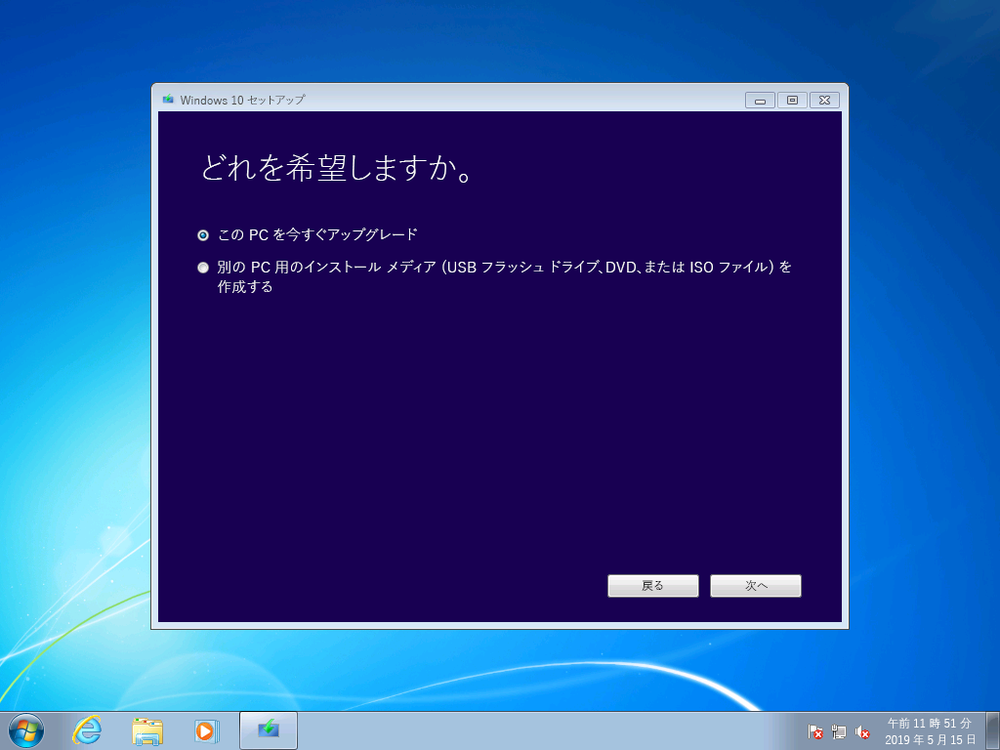
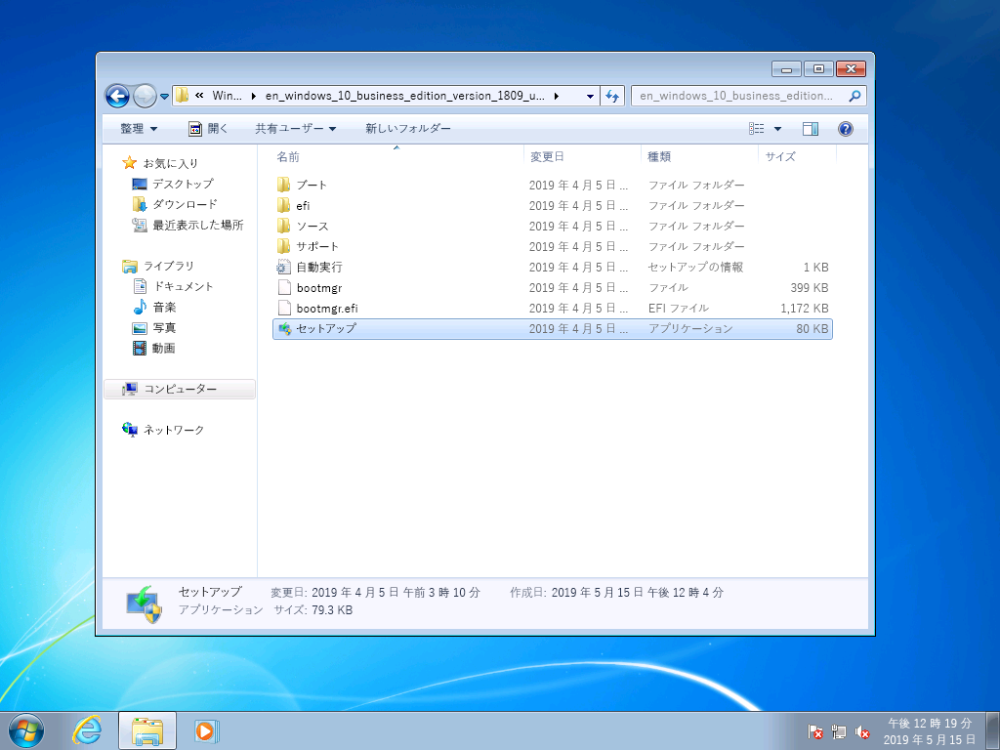
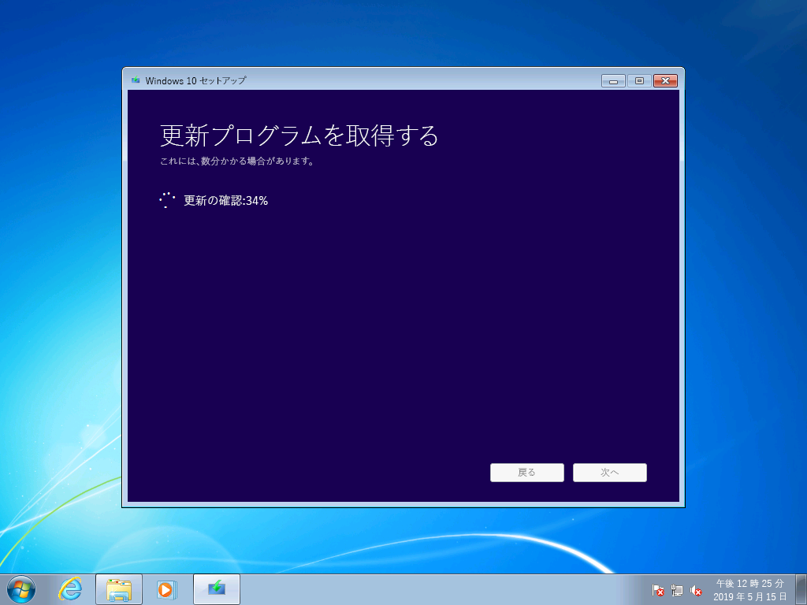
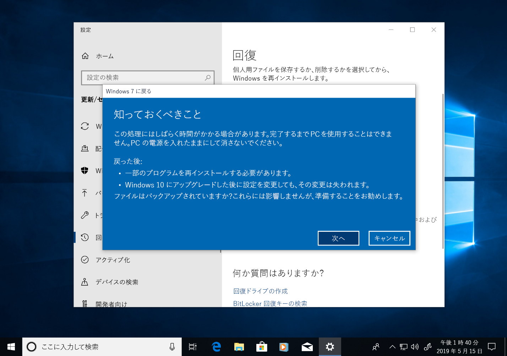

# Windows 7 から Windows 10 への手動アップグレードの手順ガイドWindows 7 to Windows 10 manual upgrade step-by-step guide

この記事では、Windows 7 Enterprise を実行する PC を Windows 10 Enterprise に手動でアップグレードする手順について説明します。This article describes the process to manually upgrade a Windows 7 Enterprise PC to Windows 10 Enterprise. Home や Professional などのその他のエディションの Windows 7 でも手順はほとんど同じですが、メディア作成ツールを使用して直接アップグレードすることもできます。For other Windows 7 editions, such as Home and Professional, the process is very similar, but you also have the option to upgrade directly using the media creation tool. すべてのエディションの Windows 7 から Windows 10 へのアップグレードには、有効なプロダクトキーおよび元のエディションと一致するまたはそれより上級のエディションの Windows が必要です。たとえば、Windows 7 Professional は Windows 10 Pro にアップグレードできますが、Windows 10 Home にアップグレードすることはできません。Upgrades for any edition of Windows 7 to Windows 10 will require a valid product key and matching or higher edition of Windows, for example Windows 7 Professional can upgrade to Windows 10 Pro, but cannot be upgraded to Windows 10 Home. Windows 7 Ultimate の場合、Windows 10 Pro にアップグレードする必要があります。Windows 7 Ultimate will need to be upgraded to Windows 10 Pro.

## メディア作成ツールまたは ISO ファイルを使用した Windows 10 へのアップグレードWindows 10 upgrades using the media creation tool or ISO files

[メディア作成ツール](https://www.microsoft.com/en-us/software-download/windows10ISO)を使用すると、Windows 10 に直接アップグレードすることができます。このツールを使用して Windows 10 を ISO ファイルとしてダウンロードすることもできます。You can upgrade to Windows 10 directly using the [media creation tool](https://www.microsoft.com/en-us/software-download/windows10ISO) or use it to download Windows 10 as an ISO file. 現在のシステムが 32 と 64 ビットのどちらであるか、システムの既定の言語、および Windows 7 のエディション (例: Home、Professional、Enterprise) を確認する必要があります。You’ll need to note whether your current system is 32 or 64-bit, your system’s default language and edition of Windows 7 (e.g. Home, Professional, or Enterprise). Windows 7 の場合、この情報は [コントロールパネル] \> [システムとセキュリティ] \> [システム] にあります。In Windows 7, this information is located in the Control Panel \> System and Security \> System. メディア作成ツールは、アップグレード、インストール メディアの作成、または ISO ファイルのダウンロードについて Windows 10 Enterprise をサポートしていません。The media creation tool does not support Windows 10 Enterprise for upgrades, creating installation media or downloading ISO files. Windows 7 Enterprise からアップグレードする場合は、Windows 10 Enterprise が必要です。Windows 10 Enterprise is required if you are upgrading from Windows 7 Enterprise.

Windows 7 Enterprise から Windows 10 Enterprise にアップグレードする場合は、使用する言語とアーキテクチャ (32 ビットまたは 64 ビット) 用の ISO ファイルを[ボリューム ライセンス サービス センター](https://www.microsoft.com/licensing/servicecenter/default.aspx)からダウンロードする必要があります。When upgrading from Windows 7 Enterprise to Windows 10 Enterprise, you’ll need to download the ISO file for your language and architecture (32-bit or 64-bit) from the [Volume Licensing Service Center](https://www.microsoft.com/licensing/servicecenter/default.aspx).

ISO ファイルを使用してアップグレードを実行する場合は、ISO 内のファイルをローカル ファイル システムまたはリムーバブル ドライブのいずれかに展開する必要があります。また、ISO ファイルを DVD に書き込むこともできます。If you plan to perform the upgrade using an ISO file, you will need to extract the files within the ISO to either your local file system, to a removable drive, or you can burn the ISO file to a DVD. Windows 8 またはそれ以降の PC を使用して ISO 内のインストール ファイルを展開し、これらのファイルをリムーバブル USB ストレージに保存するか、または [7zip](https://www.7-zip.org/) などのアプリケーションを使用して ISO ファイルのコンテンツを Windows 7 内のローカル ドライブ上のフォルダーに展開することができます。You can extract the installation files within the ISO using a Windows 8 or newer PC and save these files to removable USB storage or use an application such as [7zip](https://www.7-zip.org/) to extract the contents of your ISO file to a folder on your local drive within Windows 7.

Windows 7 内でインストール メディアが準備できたら、次に示すように setup.exe を実行して、アップグレードを開始できます。Once you have the install media available in Windows 7, you can initiate the upgrade by running setup.exe as shown below.

**重要なヒント: アプリケーションとデータが Windows 10 に移行されるインプレース アップグレードの場合は、実行中の Windows 7 セッション内からプロセスを開始する必要があります。DVD または USB ドライブからインストール メディアを起動する方法の場合、アプリとファイルを引き継ぐオプションが提供されず、Windows 10 のクリーン インストールが実行されます。****Important tip: For an in-place upgrade where applications and your data are migrated to Window 10, you’ll need to initiate the process from within a running Windows 7 session. Booting to install media from a DVD or USB drive will not give you the option to keep your apps and files, instead it will perform a clean install of Windows 10.**

Windows 10 セットアップでは、手順に沿ってインストールの案内が提供されます。最初の画面では、更新プログラム、ドライバー、およびオプション機能をダウンロードするためのオプションが表示されます。Within Windows 10 Setup, you will be guided through the installation process and the first screen provides an option to download updates, drivers and optional features. アップグレードを正常に完了させるために、実行することをお勧めします。This is recommended to help ensure success with the upgrade

更新プログラムの適用が完了すると、Windows 10 セットアップは次のステップの [画像の選択] に移動します。Once updates have been applied, Windows 10 Setup will move to the next phase, Select Image. この画面では、お使いの Windows のエディションを選択する必要があります。Here, you will need to select your edition of Windows. この場合、PC には Windows 7 Enterprise がインストールされているため、[Windows 10 Enterprise] を選択します。In this case, since the PC has Windows 7 Enterprise installed, you would select Windows 10 Enterprise.

Windows 10 セットアップの次の画面では、該当する通知とライセンス条項が表示されます。In the next screen in Windows 10 Setup, you’re presented with applicable notices and license terms. 通知と条項を読んで理解したら、続行する場合は [同意する] をクリックし、キャンセルする場合は [拒否する] をクリックします。Once you have read and understand the notices and terms, click “Accept” to continue or “Decline” to cancel.

Windows 10 セットアップは、その他の更新プログラムを探します。Now Windows 10 Setup will look for additional updates.

完了すると、Windows 10 セットアップでインストールを開始できる状態になります。既定では、Windows 10 がインストールされ、個人用のファイルとインストール済みのアプリが引き継がれる設定になっています。Once complete, Windows 10 Setup is ready to install and by default is configured to install Windows 10 and keep your personal files and apps installed. これは推奨されるオプションです。This is the recommended option. [引き継ぐものを変更] をクリックすると、追加のオプションが表示されます。By clicking, “Change what to keep,” you’ll find additional options. 変更しない場合は、[インストール] をクリックします。Otherwise, click “Install.”

[引き継ぐものを変更] を選択すると、次のオプションが表示されます。If you select “Change what to keep”, you’ll be presented with these options:

[個人用ファイルのみを引き継ぐ] を選択した場合、インストールされているアプリまたは設定は Windows 7 から Windows 10 に移動されません。“Keep personal files only” will not move your installed apps or settings from Windows 7 to Windows 10. 代わりに、ファイルとユーザー アカウントのみが Windows に移動されます。Instead it will only move your files and user accounts to Windows. このオプションを使用する場合、アプリを後から再インストールする必要があります。Apps will need to be reinstalled later with this option. このオプションは、Windows のインストール後に必要なアプリの再インストールおよび構成を確実に行える場合にのみ選びます。それ以外の場合、既定のオプション [個人用ファイルとアプリを引き継ぐ] を使用するようにします。Only use this option if you are confident you can reinstall and configure the apps you will need after Windows is installed, otherwise stick with the default “Keep personal files and apps” option.

[何もしない] を選択した場合、ファイル、アプリ、および設定は削除され、Windows のクリーン インストールが実行されます。“Nothing” will delete your files, apps and settings and perform a clean install of Windows. このオプションは、保持する必要があるデータを既にバックアップしてあり、アプリを再インストールできる場合にのみ使用します。Use this option only if you have previously backed up the data you want to keep and you are able to reinstall your apps.

Windows 10 セットアップでは、前の画面で選択した内容に基づいて更新プログラムが再びダウンロードされます。Now Windows 10 Setup will get updates again based on what you selected in the previous screen.

Windows 10 のインストールが開始し、完了するまで数分間かかります。個人用ファイルとアプリを引き継ぐオプションを選択した場合、すべてのファイルが以前と同じ場所に保存され、アプリは Windows 10 で利用できるようになります。Now Windows 10 will install for several minutes and if you chose to keep your personal files and apps, everything will be in the same file locations and your apps will now be available in Windows 10.

## 

## Windows 10 の回復Recovery in Windows 10

Windows 10 のインストール後、Windows 10 の回復オプションを使用すると 10 日以内であれば Windows 7 に戻すことができます。After Windows 10 is installed, the Recovery option in Windows 10 gives you up to 10 days to go back to Windows 7. この機能は、システム上のデバイスやアプリが正常に機能しないために以前の Windows 7 のインストールに戻す必要がある場合に役立ちます。This is useful if a device or app on your system does not function properly and you need to go back to your previous Windows 7 installation. 10 日が経過すると、Windows 10 は Windows 7 の回復ファイルがハード ドライブで使用している領域を解放し、以前のインストールからのファイルを削除します。After 10 days, by default Windows 10 will free up the space consumed by your Windows 7 recovery files on your hard drive and delete files from the previous installation. この期間を過ぎると Windows 7 は削除され、Windows 7 に戻すことはできなくなりますが、アプリと個人用ファイルは Windows 10 に残ります。Although Windows 7 after this time is deleted and you won’t be able to revert Windows 7, your apps and personal files will remain in Windows 10.

[Windows 7 に戻す] プロセスを開始するには、[設定]　 \> [更新とセキュリティ] \> [回復] に移動します。To start the Go back to Windows 7 process, navigate to Settings \> Update & Security \> Recovery. [Windows 7 に戻す] の下にある [開始する] を選択します。Under Go back to Windows 7, select “Get started.”

次に、Windows 10 から戻す理由について質問されます。Now, Windows 10 will ask why you are going back. 技術的な理由がある場合はそれを入力していただくと、問題の解決に向けた取り組みへのサポートとなり、お客様の経験を他のユーザーのために生かすことができます。If there is a technical reason, this is useful to fill out in order to help drive resolution and ensure others can benefit from your experience.

多くの場合、使用する Windows 10 のバージョンに対して更新プログラムが発行されており、これにより技術的な問題が解決されている場合があります。In many cases, your version of Windows 10 will have had updates issued, which may resolve technical issues. 更新プログラムをチェックして見つかった場合はインストールし、発生した問題を解決できるかを確認することをお勧めします。It is encouraged that you check for updates and if found and installed, then check if that fixes the problems you have experienced.

更新プログラムを実行しても問題が解決せず、以前の Windows 7 のインストールに戻す必要がある場合は、Windows 10 を実行していた期間にインストールされたアプリなど、一部のアプリの再インストールが必要になる可能性があり、一部の設定も失われる場合があります。If the updates do not resolve issues and you do need to revert to your previous installation of Windows 7, there is a chance that some apps will need to be reinstalled – such as any app that installed during the time you were running Windows 10 – and some settings may be lost. 重要な点ですが、Windows 10 を使用している期間中にローカルに保存したファイルやドキュメントはそのまま保持され、Windows 7 に戻した後もアクセスできます。Importantly, files and docs you’ve saved locally while using Windows 10 will remain and be available for you once you’re back in Windows 7. 

作業を開始する前に、以前の Windows 7 のインストールからのローカルまたはドメイン アカウントとパスワードが手元にあることを確認します。Before you get started, make sure you have a local or domain account and password ready from the previous Windows 7 installation.

Windows 7 に戻すプロセスをこの画面から開始できます。From here you can initiate the process to go back to Windows 7. PC は数分後に Windows 7 で再起動され、Windows 10 にアップグレードする前と同じ環境に戻ります。After a few minutes, your PC will boot back into Windows 7 with the same experience prior to upgrading to Windows 10.

## 新しい PC での Windows 10 への移行Moving to Windows 10 on a new PC

推奨される別の方法として、新しい PC で Windows 10 に移行する方法があります。Another recommended option is to move to Windows 10 on a new PC. この方法を選択する場合は、古いコンピューターからファイルを移動させるのに、[OneDrive](https://support.office.com/article/b5e918be-0fd4-4095-98da-bceed57f8e0c?ocid=MoveToWindows10) のバックアップ、[Windows に組み込みのバックアップと復元機能](https://support.microsoft.com/help/4469209?ocid=MoveToWindows10)、[外部記憶装置](https://support.microsoft.com/ja-JP/help/4465814/windows-7-move-files-off-pc-with-an-external-storage-device?ocid=MoveToWindows10)を使用した手動による移動、または [Laplink の PCmover Express](https://www.microsoft.com/en-us/windows/transfer-your-data) などのツールを使用できます。If this is your preference, you can transfer your files from your old computer using [OneDrive](https://support.office.com/article/b5e918be-0fd4-4095-98da-bceed57f8e0c?ocid=MoveToWindows10) backup, [Backup and Restore built into Windows](https://support.microsoft.com/help/4469209?ocid=MoveToWindows10), manually using an [external storage device](https://support.microsoft.com/en-us/help/4465814/windows-7-move-files-off-pc-with-an-external-storage-device?ocid=MoveToWindows10), or tools like [Laplink’s PCmover Express](https://www.microsoft.com/en-us/windows/transfer-your-data). これらのいずれのオプションを使用した場合でも、Windows 10 に含まれていない必要なアプリケーションを再インストールする必要があります。With any of these options, you will still need to re-install any required applications not included with Windows 10. Windows 7 を実行している既存の PC から Windows 10 を実行する新しい PC に手動で移行するためのオプションの詳細については、「[Windows 10 PC への移行](https://support.microsoft.com/ja-JP/help/4229823?ocid=MoveToWindows10)」を参照してください。To learn more about your options for manually moving from an existing PC running Windows 7 to a new PC with Windows 10, see [Moving to a Windows 10 PC](https://support.microsoft.com/en-us/help/4229823?ocid=MoveToWindows10) in Windows Support.

## [デスクトップ展開センターDesktop Deployment Center](https://aka.ms/howtoshift)