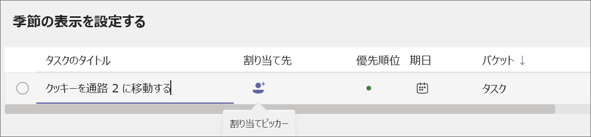
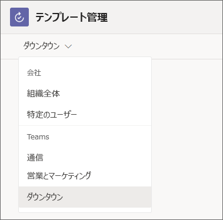

# マネージャー - チームで 現場担当者向けの Microsoft 365 を開始する

現場担当者向けの Microsoft 365 には、チームが最善を尽くすのに役立つさまざまな機能が含まれています。 チームを連携させるためにすぐに作業を開始できるいくつかの点を次に示します。

|パス   |説明   |必要な Teams アプリ |
|----------|-----------|-----------|
|[クイック コミュニケーションを有効にする](#enable-quick-communication) |フロントライン チームが連絡を取り合うのを支援します。 |チャットとトランシーバー |
|[フロントラインのスケジュール、時間、および出席を管理する](#manage-frontline-schedules-time-and-attendance) |Teams で管理できるスケジュールを設定します。 |Shifts |
|[作業項目を管理する](#manage-work-items) |Teams と Microsoft 365 アプリを使用して、作業項目を割り当てて追跡します。 |タスク、リスト、承認、および更新 |
|[接続を促進し、士気を高める](#foster-connections-and-boost-morale-with-praise) |チーム メンバーに感謝の言葉を送り、感謝の言葉を伝えます。 |称賛 |

これらの機能をサポートするアプリは Teams に含まれており、ほとんどのアプリはすぐに使用できます。 一部のユーザーは、使用する準備を整える前に、チームに追加するか、設定する必要があります。 また、これらのアプリのほとんどは既定でピン留めされています。つまり、フロントライン チームのメンバーは既定でアプリ バーに表示されます。これは、Teams モバイル クライアント (iOS と Android) の下部にあるバーであり、Teams デスクトップ クライアントの側に表示されます。 ニーズに基づいてピン留めされていないアプリはいつでも追加できます。 [Teams にアプリを追加する方法について説明します](https://support.microsoft.com/office/add-an-app-to-microsoft-teams-b2217706-f7ed-4e64-8e96-c413afd02f77)。

この記事は、現場担当者向けの Teams を取得し、チームを設定し、チームがこれらの機能を使用するために必要な機能とアプリを構成するのに役立ちます。

## 現場担当者向けの Teams の使用を開始する

まず、Microsoft Teams のタスク アプリ内から[フロントライン試用版エクスペリエンスを開始する](https://support.microsoft.com/office/learn-more-about-the-frontline-trial-in-microsoft-teams-73a429fc-f211-4360-8329-704bc102ba98)必要があります。 現場担当者向けの Microsoft 365 が既にある場合は、この手順をスキップし、この記事の残りの部分に従って、ライセンスを最大限に活用する方法について説明します。

> [!NOTE]
> フロントライン 試用版は、Microsoft 365 F3 ライセンスに基づいています。

## クイック コミュニケーションを有効にする

Microsoft Teams の組み込みのコミュニケーション ツールを使用して、現場のワーカーが連絡を取り合えるようにします。 コミュニケーション アプリを追加設定したり、チームで使用したりする必要はありません。 デスクトップまたはモバイルで Teams を開くと、Teams、チャット、アクティビティのアイコンが常に表示されますが、トランシーバーはモバイルでのみ使用できます。

### Teams

自分とフロントラインのワーカーは、特定のグループが連絡を取り合えるようにチームを作成できます。 たとえば、すべてのレジ担当者が相互に通信し、情報を共有できるように、キャッシャー チームを作成できます。 レジ担当者にのみ適用されるポリシー変更がある場合は、キャッシャー チームに投稿して、表示する必要があるユーザーに届きます。 [スタッフ チームを作成する方法について説明します](https://support.microsoft.com/office/set-up-groups-and-teams-a79afa20-aa01-44a3-b33d-5eaa72f6404f)。

### チャット

Teams チャットを使用すると、現場の従業員のメンバーは、個人用メッセージング アプリを使用しなくてもシームレスに通信できます。 [検索の詳細](https://support.microsoft.com/office/first-things-to-know-about-chats-88ed0a06-6b59-43a3-8cf7-40c01f2f92f2)について参照してください。

### 最新情報

チーム メンバーを @メンションして、会話に注意を向けることができます。 ユーザーに通知を送信 @メンション、チャットでメッセージを見逃した場合でも、アクティビティにメッセージが表示されるようにします。

### トランシーバー

トランシーバーを使用すると、任意の場所で作業者とリアルタイムで会話を行うことができます。 たとえば、従業員が顧客を支援していて、サポートが必要な場合は、トランシーバーを使用して、顧客から離れることなく専門家またはマネージャーに連絡することができます。

トランシーバーは、Google モバイル サービス (GMS) および iOS デバイスを搭載した Android デバイスでサポートされています。

## フロントラインのスケジュール、時間、および出席を管理する

Shifts アプリを使用して、スケジュールを作成および管理できます。 Shifts を使用すると、従業員は休暇を要求したり、オープン シフトのボランティアをしたり、同僚とシフトを入れ替えたりすることができます。 シフトを使用してスケジュールを共有することもできます。これにより、チームの全員が作業しているタイミングを簡単に把握できます。 従業員はシフトを使用して出勤および退勤を行うことができます。Shifts でスケジュールを作成するには:

1. アプリに移動し、**[新しいスケジュールの作成]** を選択します。
2. 次に、**[グループの追加]** を選択して、ジョブの種類または場所に基づいてスケジュールを整理します。 1 つのスケジュールで複数のグループを作成できます。 たとえば、医療組織は、受付のグループと、看護師のためのグループを持つことができます。
3. 省略記号 (**...**)、 **[名前を変更]** の順に選択して、グループに名前を付けます。
4. チーム メンバーのシフトを作成するには、その行を選択し、**[その他 のオプション] > [シフトを追加]** の順に選択します。

シフトでのスケジュールの作成の詳細については、[こちらのビデオ](https://support.microsoft.com/office/create-a-shifts-schedule-2b94ca38-36db-4a1c-8fee-f8f0fec9a984) をご覧ください。

組織がスケジュール設定に既に従業員管理システムを使用している場合、IT チームは Teams と統合して、すべてのスケジュールをシフトに引き込むことができます。 現時点では、Shifts は Blue Yonder および Reflectionis の従業員管理システムと統合できます。 [従業員管理システムの接続の詳細について説明します](shifts-connectors.md)。

## 作業項目を管理する

[タスク、リスト、承認、および更新] アプリを使用して、作業項目を管理および追跡できます。 1 つのアプリのみを使用するか、ニーズに基づいていくつかのアプリを使用するかを選択できます。 だれでも自分とチーム メンバーにタスクを作成して割り当てることができます。

### タスク

タスクは Planner によって提供され、チームの作業項目を作成して割り当てることができます。 タスクでタスクを作成して割り当てるには:

1. タスク アプリを開きます。
2. [**+ 新しいリストまたはプラン**] を選択して、チームのタスク リストを作成します。
3. アプリケーションの名前を入力します。 **[作成場所]** で、タスク プランを適用するチームとチャネルを選択します。 その後、**[作成]** を選択します。

    ![[新しいプラン] ウィンドウのスクリーンショット。](media/flw-manager-tasks.png)

4. 新しいタスクを作成するには、名前を付けます。 次に、プランを作成したチームのメンバーに割り当てます。 期限を選択することもできます。

    

5. タスクを作成して割り当てると、チームのメンバーのタスク アプリに表示されます。 タスクを特定のユーザーに割り当てない場合でも、チームに表示されます。

タスクは Planner によって提供されます。 Planner と Tasks を一緒に使用する方法の詳細については、[こちらのプレイリスト](https://support.microsoft.com/office/organize-your-team-s-tasks-in-microsoft-planner-c931a8a8-0cbb-4410-b66e-ae13233135fb)をご覧ください。

### 承認

[承認] により、チームは Teams 内から承認の要求を送信できます。 たとえば、チーム メンバーの 1 人が大規模な注文に対して割引を提供する場合は、承認要求を送信してアクセス許可を取得できます。

フロントライン チームのテンプレートを作成して、合理化された承認要求を送信できます。

1. [承認] ハブで、**[テンプレートの作成または管理]** を選択します。
2. メニューから、テンプレートを適用するチームを選択します。

    

3. **[新しいテンプレート]** を選択し、テンプレート ストアから既存のテンプレートを選択するか、ニーズに合わせて最初からテンプレートを作成します。
4. テンプレートを適用するユーザーを選択します。 **[チーム全体]** を選択して、手順 2. で選択したチーム内のすべてのユーザーにこのテンプレートを適用します。
5. 一覧からチームを選択します。
6. 基本設定、フォーム デザイン、ワークフローの設定を入力します。 次に、**[プレビュー]** を選択します。
7. テンプレートが適切に表示される場合は、**[発行]** を選択します。
8. チームのメンバーは、作成したテンプレートから承認要求を送信できるようになります。

[承認でチームのテンプレートを作成する方法の詳細については、こちらを参照してください](https://support.microsoft.com/office/discover-templates-in-approvals-c33ecf9f-b745-4287-b104-ac69469745e0)。

### リスト

リスト アプリは、情報を追跡し、作業を整理するのに役立ちます。 お客様とチームは、インベントリ、顧客要求、供給ニーズなどのリストを作成できます。

リスト アプリから [**+新しいリスト**] を選択すると、テンプレートからリストを作成できます。 [使用可能なテンプレートについて説明します](https://support.microsoft.com/office/list-templates-in-microsoft-365-62f0e4cf-d55d-4f89-906f-4a34e036ded1)。

チームと共同作業するスプレッドシートがある場合は、それをリストに変換できます。

1. リスト アプリで[**+新しいリスト**] を選択します。
2. **[Excel から]** を選択し、リストに変換するスプレッドシートをアップロードします。
3. 列の種類が正しいことを確認し、必要に応じて調整します。 [**次へ**] を選択します。
4. リストに名前、色、アイコン、場所を指定します。 次に [ **作成**] を選びます。

> [!NOTE]
> リスト アプリは既定ではピン留めされていませんが、 [Teams アプリ ストアから追加](https://support.microsoft.com/office/add-an-app-to-microsoft-teams-b2217706-f7ed-4e64-8e96-c413afd02f77)できます。

### 更新プログラム

更新では、更新プログラムを作成、送信、および確認できます。 従業員の更新、チェックイン、レポートを 1 か所で簡単に確認し、定期的に行われる定期的なプロセスか、いつでも必要になる可能性のある最新の更新プログラムであるかに関係なく、チームが成功を収めるかどうかを確認できます。

チーム メンバーに更新プログラムを割り当てることができます。 チーム メンバーは、割り当てることなく更新プログラムを送信することもできます。

1. 更新 アプリで、[**テンプレートの作成と管理**] を選択します。
2. 一般的なテンプレートを選択するか、[**その他の表示** ] を選択してすべてのテンプレート オプションを表示します。 テンプレートを選択するか、空白から開始できます。
3. 基本設定とフォーム デザインに入力します。
4. ワークフロー設定で、この更新プログラムを送信するユーザーを選択し、この更新プログラムを表示し、更新プログラムの日時と期限を表示します。
5. 割り当てた提出者は、必要な更新プログラムを表示して送信できるようになります。

> [!NOTE]
> 更新 アプリは既定ではピン留めされませんが、[Teams アプリ ストアから追加](https://support.microsoft.com/office/add-an-app-to-microsoft-teams-b2217706-f7ed-4e64-8e96-c413afd02f77)できます。

## 接続を促進し、賛美を得て士気を高める

Teams の [称賛] アプリは、チームのメンバーに感謝を表すのに役立ちます。 バッジをチーム メンバーに送信して実績を認識し、チーム メンバーは互いにバッジを送信できます。 チャネル会話でバッジを送信して、ユーザーのグループを認識することもできます。 [称賛] では、 **チーム プレイヤー** や **素晴らしい** 選手などの肯定的な品質を呼び出す、既製のバッジが使用されます。

1. Teams チャットまたはチャネルを開きます。 メッセージを書き込む領域の下にある [称賛] アイコンを選択するか、省略記号 (**...**) を選択して見つけます。
    ![チャットの [称賛] アイコンのスクリーンショット](media/praise-icon.png)
2. **[バッジ]** ドロップダウン メニューからバッジを選択します。
3. 賞賛するユーザーの名前と、オプションの説明を追加します。
4. **プレビュー** を選択して確認し、[**送信**] を選択します。

## トレーニング ビデオをユーザーと共有する

これらのトレーニング リソースを使用して、チームが Microsoft 365 の機能を使用して快適で自信を持つよう支援します。 これらの各記事とビデオは、実行に数分しかかかりません。

[Microsoft Teams の使用を開始する](https://support.microsoft.com/office/get-started-with-microsoft-teams-b98d533f-118e-4bae-bf44-3df2470c2b12)

[トランシーバーの使用を開始する](https://support.microsoft.com/office/get-started-with-teams-walkie-talkie-25bdc3d5-bbb2-41b7-89bf-650fae0c8e0c)

[Shifts の使用を開始する](https://support.microsoft.com/office/what-is-shifts-f8efe6e4-ddb3-4d23-b81b-bb812296b821)

シフトには、クロックイン/アウト機能も含まれます。 [Shifts を使用して出退勤する方法について説明します](https://support.microsoft.com/office/clock-in-and-out-with-shifts-ae7b676c-7666-46c7-9f68-85ff54acec8b)

[タスクの概要](https://support.microsoft.com/office/use-the-tasks-app-in-teams-e32639f3-2e07-4b62-9a8c-fd706c12c070)

「[フローの新しい承認](https://support.microsoft.com/office/what-is-approvals-a9a01c95-e0bf-4d20-9ada-f7be3fc283d3)」の詳細もご覧ください。

[リストの詳細](https://support.microsoft.com/office/create-a-list-from-the-lists-app-b5e0b7f8-136f-425f-a108-699586f8e8bd)

[更新モバイル エクスペリエンスについて学習する](https://support.microsoft.com/office/get-started-in-updates-c03a079e-e660-42dc-817b-ca4cfd602e5a#ID0EBF=Mobile)

[[称賛] を送信する方法について説明します](https://support.microsoft.com/office/send-praise-to-people-50f26b47-565f-40fe-8642-5ca2a5ed261e)