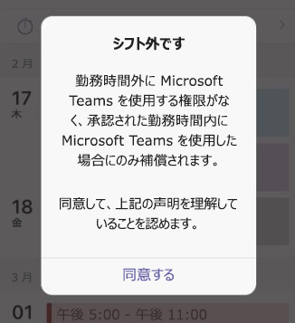

# <a name="manage-shift-based-access-for-frontline-workers-in-teams"></a>Teams で現場担当者のシフトベースのアクセスを管理する

## <a name="overview"></a>概要

[!INCLUDE [preview-feature](includes/preview-feature.md)]

Microsoft Teams のプレゼンスは、ユーザーの現在の可用性と状態を他のユーザーに示します。 現場担当者は、通常、稼働時間が毎日同じではないため、プレゼンスの予測が他のスタッフより難しい場合があります。 管理者は、Teams を構成して、組織内の現場担当者のシフトベースのプレゼンス状態のセットを表示し、シフト中とシフト外のどちらであるかを表示できます。

これらのシフトベースのプレゼンス状態&mdash; **シフト中**、 **シフト外**、 **取り込み中**&mdash; は Teams の [既定のプレゼンス状態のセット](/microsoftteams/presence-admins) とは別です。 この 2 つのプレゼンス状態のセットを使用すると、組織内のユーザーの役割に基づいてさまざまなエクスペリエンスを構成できます。

シフトベースのアクセス権を使用すると、現場担当者がシフト外の場合の Teams へのアクセスを管理できます。 たとえば、Teams を設定すると、現場担当者がスケジュールされたシフトに入っていない場合に、Teams を使用する前に確認する必要があるメッセージを表示させることができます。  

## <a name="scenario"></a>シナリオ

組織でシフトベースのアクセスを管理する方法の例を次に示します。

組織内には、上司がスケジュールして承認したシフトで働く時間に対してのみ支払われるべき現場担当者がいます。 スケジュールされたシフト外の作業に費やされた時間に対しては支払いがあるべきではなく、それには Teams アプリの使用も含まれるはずです。 "シフト内でもシフト外でも Teams の時間は未払い時間にカウントされません"というカスタム メッセージを設定し、現場担当者がシフト外に Teams にアクセスしようとした場合に表示させます。 現場担当者が Teams の使用を選択する場合は、この時点での支払いが行われなくなることを承認して、**[同意する]** をクリックします。

組織内には給与を受け、シフト勤務をしていないインフォメーション ワーカーもいます。 インフォメーション ワーカーには Teams で既定のプレゼンス状態を使用できるように構成し、現場担当者にはシフトベースのプレゼンスを提供します。

## <a name="shift-based-presence-states"></a>シフトベースのプレゼンス状態

シフトベースのプレゼンス状態を次に示します。

|アプリが設定 |ユーザーが設定  |詳細  |
|---------|---------|---------|
| シフト中     |         |シフト開始時に自動的に設定する         |
| シフト外     |         |シフト終了時に自動的に設定する         |
| 多忙      |  多忙         |自動的に設定します。 現場担当者がシフト中に手動で設定することもできます。|

## <a name="off-shift-access-to-teams"></a>Teams へのシフト外アクセス

この機能を使用すると、現場担当者がシフト外の場合の Teams へのアクセスを管理できます。 Teams を設定すると、現場担当者がシフト外に Teams にアクセスした場合、メッセージを表示させることができます。 現場担当者は、**[同意する]** をクリックしてメッセージを確認してから、Teams を使用する必要があります。

既定のメッセージを使用したり、定義済みのメッセージのセットから選択したり、必要なテキストを表示するようにメッセージをカスタマイズしたりすることができます。 既定のメッセージは次のとおりです。



メッセージが表示される頻度を設定したり、最初のシフト開始時、最後のシフト終了時の猶予期間と Teams へのアクセス制限を設定したりすることもできます。

## <a name="manage-shift-based-access"></a>シフトベースのアクセスを管理する

管理者は、ポリシーを使用して、組織内の現場担当者のシフトベースのプレゼンスを制御することができます。 これらのポリシーは、次の PowerShell コマンドレットを使用して管理します。

- [New-CsTeamsShiftsPolicy](/powershell/module/teams/new-csteamsshiftspolicy)
- [Get-CsTeamsShiftsPolicy](/powershell/module/teams/get-csteamsshiftspolicy)
- [Set-CsTeamsShiftsPolicy](/powershell/module/teams/set-csteamsshiftspolicy)
- [Grant-CsTeamsShiftsPolicy](/powershell/module/teams/grant-csteamsshiftspolicy)
- [Remove-CsTeamsShiftsPolicy](/powershell/module/teams/remove-csteamsshiftspolicy)

New-CsTeamsShiftsPolicy コマンドレットを使用して新しいポリシーを作成し、必要なポリシー設定を設定してから、Grant-CsTeamsShiftsPolicy コマンドレットを使用してポリシーをユーザーに割り当てます。

次に例を示します。 選択することができる定義済みのシフト外メッセージのリストなど、各ポリシー設定とパラメーターの詳細については、「[New-CsTeamsShiftsPolicy](/powershell/module/teams/new-csteamsshiftspolicy)」を参照してください。

### <a name="example-1"></a>例 1

この例では、Off Shift Teams Access Default Message という名前の新しいポリシーを作成します。 このポリシーでは、シフトベースのプレゼンスがオンになり、このポリシーが割り当てられているユーザーがシフト外で Teams にアクセスするたびに既定のメッセージが表示されます。 ユーザーがメッセージを受け入れ、さらに最初のシフト開始時、最後のシフト終了時の猶予期間とアクセス制限が 10 分の場合、シフト外で Teams を使用できます。  

```powershell
New-CsTeamsShiftsPolicy -Identity "Off Shift Teams Access Default Message" -EnableShiftPresence $true -ShiftNoticeFrequency always -ShiftNoticeMessageType DefaultMessage -AccessType UnrestrictedAccess_TeamsApp -AccessGracePeriodMinutes 10
```

> [!NOTE]
> **ShiftNoticeMessageType** パラメーターを使用して、表示するメッセージを設定します。 このパラメーターに対して選択することができる定義済みのメッセージのリストについては、「[New-CsTeamsShiftsPolicy](/powershell/module/teams/new-csteamsshiftspolicy)」を参照してください。

### <a name="example-2"></a>例 2 

この例では、Off Shift Teams Access Custom Message という名前の新しいポリシーを作成します。 このポリシーでは、シフトベースのプレゼンスがオンになり、このポリシーが割り当てられているユーザーがシフト外で Teams にアクセスする度にカスタム メッセージが表示されます。 ユーザーがメッセージを受け入れ、さらに最初のシフト開始時、最後のシフト終了時の猶予期間とアクセス制限が 15 分の場合、シフト外で Teams を使用できます。  

```powershell
New-CsTeamsShiftsPolicy -Identity "Off Shift Teams Access Custom Message" -EnableShiftPresence $true -ShiftNoticeFrequency always -ShiftNoticeMessageType CustomMessage -ShiftNoticeMessageCustom "Your time on Teams when on off shift won't count toward payable hours" -AccessType UnrestrictedAccess_TeamsApp -AccessGracePeriodMinutes 15
```

> [!NOTE]
> **ShiftNoticeMessageType** パラメーターを使用して、表示するメッセージを設定します。 詳しくは、「[New-CsTeamsShiftsPolicy](/powershell/module/teams/new-csteamsshiftspolicy)」を参照してください。

### <a name="example-3"></a>例 3

この例では、Off Shift Teams Access Message1 という名前の新しいポリシーを作成します。 このポリシーでは、シフトベースのプレゼンスがオンになり、このポリシーが割り当てられているユーザーがシフト外で Teams にアクセスする度に次の定義済みメッセージが表示されます。

  "雇用主が勤務時間外の非免除従業員または時間単位の従業員によるネットワーク、アプリケーション、システム、またはツールの使用を許可または承認しません。 承諾すると、シフト外の Teams の使用は承認されておらず、補償の対象にならないことに同意したことになります。" 

ユーザーがメッセージを受け入れ、さらに最初のシフト開始時、最後のシフト終了時の猶予期間とアクセス制限が 3 分の場合、シフト外で Teams を使用できます。  

```powershell
New-CsTeamsShiftsPolicy -Identity "Off Shift Teams Access Message1" -EnableShiftPresence $true -ShiftNoticeFrequency always -ShiftNoticeMessageType Message1 -AccessType  UnrestrictedAccess_TeamsApp -AccessGracePeriodMinutes 3
```

> [!NOTE]
> **ShiftNoticeMessageType** パラメーターを使用して、表示するメッセージを設定します。 このパラメーターに対して選択することができる定義済みのメッセージのリストについては、「[New-CsTeamsShiftsPolicy](/powershell/module/teams/new-csteamsshiftspolicy)」を参照してください。

### <a name="example-4"></a>例 4

この例では、Off Shift Teams Access Custom Message という名前のポリシーを、remy@contoso.com という名前のユーザーに割り当てます。

```powershell
Grant-CsTeamsShiftsPolicy -Identity remy@contoso.com -PolicyName "Off Shift Teams Access Custom Message"
```

## <a name="related-topics"></a>関連項目

- [Teams で組織の Shifts アプリを管理する](/microsoftteams/expand-teams-across-your-org/shifts/manage-the-shifts-app-for-your-organization-in-teams?bc=/microsoft-365/frontline/breadcrumb/toc.json&toc=/microsoft-365/frontline/toc.json)
- [Teams での PowerShell の概要](/microsoftteams/teams-powershell-overview)