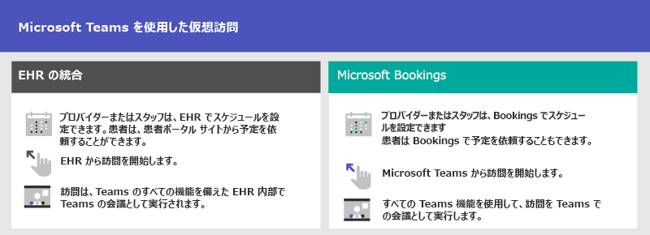
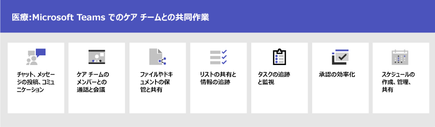

# 医療機関のための Microsoft 365 の使用を開始する

Microsoft 365 および Microsoft Teams では、病院やその他の医療機関で役立つさまざまな遠隔医療機能が提供されています。 現在開発途中の病院支援用の Teams 機能は、以下のとおりです。

- 仮想予定と電子健康記録 (EHR) 統合
- Teams ポリシー パッケージ
- セキュリティで保護されたメッセージング
- Teams テンプレート
- ケア コーディネーションとコラボレーション

> [!NOTE]
> この機能は、Microsoft Cloud for Healthcare の一部でもあります。 Azure、Dynamics 365、Microsoft 365 の機能を統合するこのソリューションの使用の詳細については、「[Microsoft Cloud for Healthcare](/industry/healthcare)」を参照してください。

次のビデオでは、Teams で医療関連機能のコレクションを使って医療チームのコラボレーションを強化する方法を説明しています。

> [!VIDEO https://www.microsoft.com/videoplayer/embed/RE4Hqan]

医療機関が最大限の恩恵を得るには、まず、毎日のアクティビティで Microsoft 365 および Microsoft Teams が役立つシナリオを選択し、それらのシナリオをサポートするための適切な基礎、チーム、アプリを使用して Teams 環境を準備します。

1. 実装する[シナリオを選択](#scenarios-for-healthcare)します。
2. [Microsoft 365 を設定する](flw-setup-microsoft-365.md) - Microsoft 365 のコア要素、Microsoft Teams、および必要なその他のサービスを設定します。
3. [サービスとアプリを構成する](flw-setup-microsoft-365.md#step-5-configure-apps-for-your-scenario) - チーム テンプレートを使用して、ビジネスに必要なチャネルやアプリなど、必要なチームをすばやく設定します。 必要に応じて、シナリオをサポートする Microsoft の他のアプリを追加します。

## 医療機関向けのシナリオ

以下のシナリオが医療機関に提供されています。

| シナリオ | 説明 | 要件 |
| -------- | -------- | -------- |
| [仮想予定と電子健康記録 (EHR) 統合](#virtual-appointments-and-electronic-healthcare-record-ehr-integration) | 患者との仮想予定をスケジュール、管理、実施します。 このシナリオでは、Teams と Cerner または Epic プラットフォームを接続して仮想予定をサポートします。 | Microsoft Cloud for Healthcare のアクティブなサブスクリプション、または Microsoft Teams EHR コネクタのスタンドアロン プランのサブスクリプション。   ユーザーは Teams 会議が含まれている Microsoft 365 または Office 365 の適切なライセンスを所有している必要があります*。   組織には、Cerner バージョン 2018 年 11 月以降または Epic バージョン 2018 年 11 月以降が必要です。  [Cerner EHR](ehr-admin-cerner.md#before-you-begin) と [Epic EHR](ehr-admin-epic.md#before-you-begin) の要件の詳細 |
| [Microsoft Bookingsと Bookings アプリを使用した仮想予定](#virtual-appointments-and-electronic-healthcare-record-ehr-integration) | 患者との仮想予定をスケジュール、管理、実施します。 このシナリオでは、仮想予定をサポートするために Microsoft Bookings を使用します。 | Microsoft Bookings を組織で有効にしている必要があります。   Bookings アプリのすべてのユーザーおよび会議に参加するすべてのスタッフは、Teams 会議のスケジュール設定がサポートされているライセンスを所有している必要があります*。  [Bookings の要件の詳細](/microsoftteams/bookings-app-admin#prerequisites-to-use-the-bookings-app-in-teams?bc=/microsoft-365/frontline/breadcrumb/toc.json&toc=/microsoft-365/frontline/toc.json)|
| [ケア コーディネーションとコラボレーション](#care-coordination-and-collaboration) | 診療担当者とスタッフは、スケジュール、ドキュメント、タスクなどに関する共同作業を院内で行うことができます。| ユーザーは適切なライセンスを所有している必要があります*。 |

*Office 365 A3、A5、E3、E5、F1、F3、Microsoft 365 A3、A5、E3、E5、Business Standard がサポートされています。 Teams ライセンスの全般的な説明については、「[Teams へのユーザー アクセスを管理する](/microsoftteams/user-access)」を参照してください。

または、[企業内コミュニケーション](flw-corp-comms.md)や[ウェルビーイング & エンゲージメント](flw-wellbeing-engagement.md)など、現場担当者向けの Microsoft 365 の他の[シナリオ](flw-choose-scenarios.md)から選択します。

また、医療機関での作業に役立つ Microsoft Teams の次の機能を活用します。

| 機能 | 説明 | 要件 |
| -------- | -------- | -------- |
| [Teams ポリシー パッケージ](#teams-policy-packages)| 医療スタッフ、情報処理担当者、患者室のデバイスに対して、Microsoft Teams の機能への適切なアクセス許可が付与されるようにします。| ユーザーは適切なライセンスを所有している必要があります*。 |
| [セキュリティで保護されたメッセージング](#secure-messaging) | 緊急のメッセージにすばやく気付いてもらえるほか、メッセージが受信および開封されたことを確認できます。 | ユーザーは適切なライセンスを所有している必要があります*。  |
| [Teams テンプレート](#teams-templates-for-healthcare-organizations) | 同じ病棟、ポッド、部門内での連絡と連携または病院内の複数の病棟、ポッド、部門間での連絡と連携のための定義済み設定テンプレート、チャネル、プレインストール済みアプリが備わったチームを作成します。 | ユーザーは適切なライセンスを所有している必要があります*。  |

## 仮想予定と電子健康記録 (EHR) 統合

Teams で提供される充実した会議プラットフォームを使用して、患者の仮想予定をスケジュール、管理、実施します。

- 組織が既に電子健康記録 (EHR とも呼びます) を使用している場合、Teams を統合してよりシームレスなエクスペリエンスを実現できます。 Teams の電子健康記録 (EHR) コネクタを使用すると、臨床医は簡単に EHR システムから直接 Teams で、患者の仮想予定を開始したり、別のプロバイダーと相談したりできます。 詳細については、「[Teams での仮想予定 - Cerner EHR への統合](ehr-admin-cerner.md)」および「[Teams での仮想予定 - Epic EHR への統合](ehr-admin-epic.md)」を参照してください。
- サポートされている EHR を使用していない場合は、Microsoft Bookings および Teams の Bookings アプリを使用できます。 詳細については、「[Teams と Bookings アプリを使用した仮想予定](bookings-virtual-visits.md)」を参照してください。

## Teams ポリシー パッケージ

Teams ポリシー パッケージを適用することで、異なる役割に対して Teams 内で実行できる操作を定義できます。 たとえば、次の役割向けのポリシーを指定できます。

- 医療スタッフ (登録済看護師、病棟担当看護師、医師、ソーシャル ワーカーなど) 向けポリシー。これらの医療スタッフに、チャット、通話、シフト管理、会議へのフル アクセス許可を付与できます。
- 医療機関内の情報処理担当者 (IT 担当者、情報スタッフ、財務担当者、法令遵守責任者など) 向けのポリシー。これらの情報処理担当者にチャット、通話、会議へのフル アクセス許可を付与できます。
- 患者室向けのポリシー。患者室のデバイスの設定を制御できます。

詳細については、「[ヘルスケア向けの Teams ポリシー パッケージ](/microsoftteams/policy-packages-healthcare?bc=/microsoft-365/frontline/breadcrumb/toc.json&toc=/microsoft-365/frontline/toc.json)」を参照してください。

## セキュリティで保護されたメッセージング

セキュリティで保護されたメッセージングは、医療チーム内でのコラボレーションをサポートします。以下の、いくつかの新機能が提供されています。

- メッセージの送信者は特別な優先度を送信メッセージに設定することができ、こうすることで、受信者がメッセージを開封するまで受信者に通知が繰り返されます。
- メッセージの送信者は開封確認メッセージをリクエストできます。送信したメッセージが受信者によって開封されたときに通知を受け取ることができます。

これらの機能を組み合わせて使うことで、緊急のメッセージにすばやく気付いてもらえるほか、メッセージが受信および開封されたことを確認できます。 これらの機能を利用する新しい医療チームを患者ごとに作成できます。 これらの機能はポリシーに基づいた機能で、個別またはすべてのチームに割り当てることができます。

詳細については、「[医療機関向けのセキュリティで保護されたメッセージングの使用を開始する](messaging-policies-hc.md)」を参照してください。

また、セキュリティで保護されたメッセージングには、医療機関によって他のテナントがフェデレーションされる機能も関連しています。これにより、より充実したテナント間通信が実現できます。 (「[Microsoft Teams で外部の会議とチャットを管理する](/microsoftteams/manage-external-access)」を参照してください。)

## 医療機関向けの Teams テンプレート

Teams には、医療機関向けに特別に設計されたテンプレートが含まれており、患者の治療や運用上の必要性に応じてスタッフがコミュニケーションや共同作業を行うチームを簡単に作成できます。 詳細については、「[Teamsの医療テンプレートを使用する](/microsoftteams/expand-teams-across-your-org/healthcare/healthcare-templates-admin-console?bc=/microsoft-365/frontline/breadcrumb/toc.json&toc=/microsoft-365/frontline/toc.json)」を参照してください。

## ケア コーディネーションとコラボレーション

Teams を使用することで、治療における医療チームの連携と共同作業を強化することができます。

Teams を使用すると、医師、臨床医、看護師、およびその他のスタッフは Teams で提供される以下のようなコラボレーション機能を活用して効率的なコラボレーションを実現できます。

- 医療チームと情報処理担当者のためにチームとチャネルを設定する。 作業を整理する方法として、チャネルにタブを追加して使用できます。タブに情報のソースをピン留めしてさらに便利に使うことができます。
- チャット、メッセージの投稿、通信。 注意して見守る必要がある個別の患者ごとに永続的な会話をチーム内で維持できます。
- 医療チームのメンバーとの通話や会議。 個別の会議を作成したりチャネル会議を使用したりして日々の会議を管理できます。いずれのタイプの会議でも、Teams のオーディオ、ビデオ、画面共有、録音、および文字起こしの機能を活用できます。
- ファイルやドキュメントの保管と共有。 医療チームは、Office ドキュメント上の作業や共同作業を行う 1 つの仮想化されたチームの一部です。

また、チームは Teams のアプリを使用して次のことを行えます。

- Lists アプリを使用してリストを共有し、情報を追跡する。
- Tasks アプリを使用してタスクの追跡と監視を行う。
- 承認アプリを使用して承認を効率化する。
- シフト アプリを使用してスケジュールを作成、管理、共有する。

### Lists アプリを使用してリストを共有し、情報を追跡する。

Teams の Lists アプリは、チームが情報を追跡し、作業を整理する上で役立ちます。 このアプリはすべての Teams ユーザーにプリインストールされており、すべてのチームとチャネルにおいてタブとして提供されています。 リストは最初から作成することも、定義済みのテンプレートから作成することもできます。また、データを Excel にインポートして作成することもできます。

医療チームは、リストの作成を開始する場合に患者テンプレートを使用できます。 リストを作成することで、チームは患者のニーズと状態を追跡できます。 Excel スプレッドシート上の既存の患者データを取り込んで、Teams でリストを作成することが可能です。 これらのリストは、回診や治療の連携を目的とした患者の監視などのシナリオで利用できます。

たとえば、病棟担当看護師が、医療チームのすべてのメンバーが含まれているチームで患者リストを作成したとします。 回診中、この医療チームは各自のモバイル デバイスで Teams にアクセスしてリスト上で患者の情報を更新します。この情報はチームの全員が確認できるため、最新情報が共有されます。医療チーム全員が集まる全体ミーティングでは、治療成果の主な指標を議論して評価し、患者が退院に向けて順調に回復していることが確認されます。このときに、チームは Teams を使用してこの情報を大画面で共有できます。 ミーティングに直接参加できない医療チームのメンバーは、リモートで参加できます。

患者の回診用に作成されたリストの例を下に示します。

:::image type="content" source="media/lists-patients-example.png" alt-text="患者回診用リストの例のスクリーンショット。":::

詳細については、「[Teams で組織の Lists アプリを管理する](/microsoftteams/manage-lists-app?bc=/microsoft-365/frontline/breadcrumb/toc.json&toc=/microsoft-365/frontline/toc.json)」を参照してください。

### Tasks アプリを使用してタスクの追跡と監視を行う。

Teams の [Tasks](https://support.microsoft.com/office/use-the-tasks-app-in-teams-e32639f3-2e07-4b62-9a8c-fd706c12c070) を使用すると、医療チーム全体の To Do アイテムを追跡することができます。 医療チームは、Teams を実行しているどのデバイスからでも、タスクの作成、割り当て、タスクのスケジュール設定、タスクの分類、および状態の更新をいつでも行うことができます。 IT プロフェッショナルと IT 管理者は、組織の特定のチームに対してタスクを発行することもできます。 たとえば、病院全体で使用される新しい安全プロトコルや新しい操作手順の一連のタスクを発行することができます。

詳細については、「[Microsoft Teams で組織の Tasks アプリを管理する](/microsoftteams/manage-tasks-app?bc=/microsoft-365/frontline/breadcrumb/toc.json&toc=/microsoft-365/frontline/toc.json)」参照してください。

### 承認アプリを使用して承認を効率化する。

[承認](https://support.microsoft.com/office/what-is-approvals-a9a01c95-e0bf-4d20-9ada-f7be3fc283d3)アプリを使用すると、チームでのリクエストやプロセスを効率化することができます。 承認の作成、管理、共有をハブから直接行うことができるため、チームワークの効率が高まります。 承認フローは、チャットを送信する際の画面、チャネルの会話、または承認アプリ自体から開始できます。 承認の種類を選択し、情報を追加し、ファイルを添付し、承認者を選択します。 リクエストが送信されると、承認者に通知が届きます。承認者はリクエストを確認して対応できます。

組織での承認アプリの使用を許可することで、承認アプリをチームに追加することができます。 詳細については、「[承認アプリを管理する](/microsoftteams/approval-admin?bc=/microsoft-365/frontline/breadcrumb/toc.json&toc=/microsoft-365/frontline/toc.json)」を参照してください。

### 統合されたシフト アプリおよび現場担当者アプリを使用したスケジュールの作成、管理、共有との統合

Teams は、シフト アプリおよび現場担当者アプリと統合されています。これらのアプリを使用すると、スタッフのシフト組み機能などで連携を図ることができます。 たとえば、看護師長は、シフト アプリを使って看護スタッフのスケジュールを設定して調整できます。看護師はそのスケジュールを確認した上でシフトを入れ替えることができます。

詳細については、「[Microsoft Teams で組織のシフト アプリを管理する](/microsoftteams/expand-teams-across-your-org/shifts/manage-the-shifts-app-for-your-organization-in-teams?bc=/microsoft-365/frontline/breadcrumb/toc.json&toc=/microsoft-365/frontline/toc.json)」参照してください。

## 医療スタッフや情報処理担当者が Microsoft Teams を使用できるようにサポートする

組織のユーザーに Microsoft Teams の使用に慣れてもらうために利用できるリソースが多数用意されています。

- 組織で Teams を使い始めたばかりの場合も、Teams を組織のより多くの領域に拡大する場合も、「[Teams Adoption Center](https://adoption.microsoft.com/microsoft-teams/)」(Teams 導入センター) から Teams の展開に関するアドバイスを入手できます。
- カスタマイズされた[学習経路](https://adoption.microsoft.com/microsoft-365-learning-pathways/)を設定し、ご自身の組織のユーザーが必要とする機能や作業のみを取り扱うことを検討してください。
- [Teams のサポート サイト](https://support.microsoft.com/teams)では、[短くまとめられたレーニング ビデオ](https://support.microsoft.com/office/microsoft-teams-video-training-4f108e54-240b-4351-8084-b1089f0d21d7)をはじめとした、Teams の基本タスクの実行方法に関するユーザー向けのサポートとトレーニングにアクセスできます。 このサイトでは、[Lists](https://support.microsoft.com/office/get-started-with-lists-in-teams-c971e46b-b36c-491b-9c35-efeddd0297db)、[Tasks](https://support.microsoft.com/office/use-the-tasks-app-in-teams-e32639f3-2e07-4b62-9a8c-fd706c12c070)、[承認](https://support.microsoft.com/office/what-is-approvals-a9a01c95-e0bf-4d20-9ada-f7be3fc283d3)、[Bookings](https://support.microsoft.com/office/what-is-bookings-42d4e852-8e99-4d8f-9b70-d7fc93973cb5) および[シフト](https://support.microsoft.com/office/what-is-shifts-f8efe6e4-ddb3-4d23-b81b-bb812296b821)を含む、Teams アプリ用のサポートやトレーニングも提供されています。
