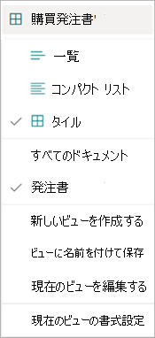

SharePoint ドキュメント ライブラリで情報を表示する方法は複数あります。 ドキュメント ライブラリのビューは、ニーズや設定に合わせて変更できます。

ライブラリ ページでビューを変更するには、ビュードロップダウン メニューを選択してオプションを表示し、使用するビューを選択します。

    

たとえば、一覧から **[タイル** ] を選択すると、次のようにページが表示されます。

    

**タイル** ビューには、最大 8 つのユーザー作成フィールドが表示されます。 システム生成フィールドが 8 個未満の場合は、機密 (使用可能な場合)、保持 (使用可能な場合)、コンテンツ タイプ、変更日、変更日、分類日の 4 つまでが表示されます。

現在のビューを編集するには、ビュードロップダウン メニューで [ **現在のビューの編集]** を選択します。
