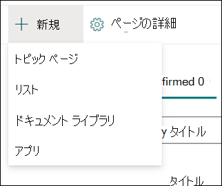
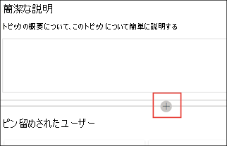

# 新しいトピックを作成する (プレビュー)

> [!Note] 
> この記事の内容は、Project の Private Preview 用です。 [Project Cortexについてもっと理解しよう](https://aka.ms/projectcortex)

トピック エクスペリエンスでは、インデックス作成を通じて検出されていないトピックや、AI テクノロジがトピックとして確立するのに十分な証拠を見つけなかった場合に、新しいトピックを作成できます。

## 要件

新しいトピックを作成するには、次の必要があります。
- トピック エクスペリエンス のライセンスを持っている。
- トピックを作成または編集 [**できるユーザーへのアクセス許可を持っている**](https://docs.microsoft.com/microsoft-365/knowledge/topic-experiences-user-permissions)。 ナレッジ管理者は、ナレッジ ネットワークのトピックのアクセス許可の設定で、ユーザーにこのアクセス許可を付与できます。 

> [!Note] 
> トピック センター (ナレッジ マネージャー) でトピックを管理する権限を持つユーザーには、トピックを作成および編集する権限が既に付与されています。

## 新しいトピックを作成するには:

1. [トピック センター] ページで、[新規] を選択 **し**、[トピック ページ] **を選択します**。 トピック センターで [新規]オプションを表示できない場合は、必要なアクセス許可が付与されていない可能性があります。

    

2. 新しいトピック ページで、新しいトピック テンプレートの情報を入力できます。

    - [この **トピックの名前]** セクションで、新しいトピックの名前を入力します。
    
    - [代替 **名] セクション** で、トピックの参照にも使用される名前または頭字語を入力します。
    
    - [簡単 **な説明]** セクションで、トピックの 1 文または 2 文の説明を入力します。 このテキストは、関連付けられたトピック カードに使用されます。
    
    - [人 **] セクション** で、トピックの対象分野の専門家の名前を入力します。 トピックに手動で追加したユーザーは、トピック ページにピン留めされたユーザー **として表示されます**。
    
    - [ファイル **とページ**] セクションで[追加] を選択し、次のページで関連付けられた OneDrive ファイルまたは SharePoint Online ページを選択できます。
    
    - [サイト] **セクションで** 、[追加] を **選択します**。 表示される  **[サイト** ] ウィンドウで、トピックに関連付けられているサイトを選択します。

    
    
3. テキスト、画像、Web パーツ、リンクなど、他のコンポーネントをページに追加する必要がある場合は、ページの中央にあるキャンバス アイコンを選択して見つけて追加します。

    

4. 完了したら、[発行] を **選択** してトピック ページを発行します。 発行されたトピック ページが [ページ] タブ **に表示** されます。

記事を発行すると、トピック名、代替名、説明、ピン留めされたユーザーが、記事を表示するライセンスを持つすべてのユーザーに表示されます。 ファイル、ページ、およびサイトは、閲覧者がアイテムに対する 365 Officeを持つ場合にのみ、トピック ページに表示されます。 

新しいトピック ページは、ナレッジ ネットワーク対応の Web パーツ *で構成されています*。 つまり、AI がトピックに関するより多くの情報を収集すると、これらの Web パーツ内の情報が更新され、ユーザーにとってより便利なページが作成されます。

## 関連項目

  

