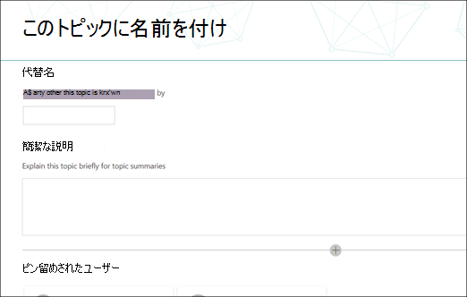
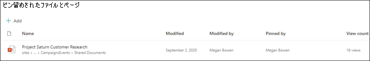
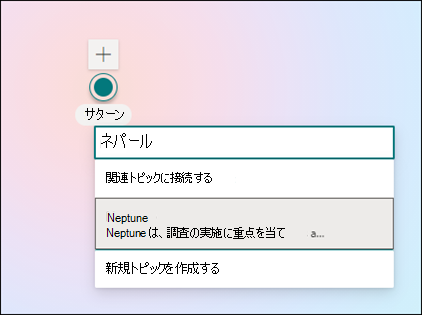

# 新しいトピックを作成Microsoft Viva トピック

ビバ トピックでは、インデックス作成によって検出されない場合や、AI テクノロジがトピックとして確立するのに十分な証拠が見つからなかった場合に、新しいトピックを作成できます。

> [!Note] 
> AI によって収集されるトピックの情報はセキュリティでトリミングされますが、手動で作成したトピックのトピックの説明とユーザー情報は、トピックを表示する権限を持つすべてのユーザーに表示されます。 

## 要件

新しいトピックを作成するには、次の必要があります。
- Viva トピック ライセンスを持っている。
- トピックを作成または編集 [**Whoアクセス許可を持っている**](./topic-experiences-user-permissions.md)。 ナレッジ管理者は、Viva トピックでのトピックに関するアクセス許可の設定でユーザーにこのアクセス許可を付与できます。 

> [!Note] 
> トピック センター (ナレッジ マネージャー) でトピックを管理する権限を持つユーザーには、トピックを作成および編集するためのアクセス許可が既に付与されています。

## トピックを作成するには

次の 2 つの場所から新しいトピックを作成できます。

- トピック センターのホーム ページ: **Who** を持つライセンスを持つユーザーは、[新しい] メニューを選択して [トピック] ページを選択することで、トピック センターから新しいトピックを作成または編集できます。 

      

- [トピックの管理] ページ: **Who** を持つライセンスユーザーは、トピックのアクセス許可 (ナレッジ マネージャー) を管理できます。新しいトピック ページを選択すると、トピック センターの [トピックの管理] ページから新しいトピック **を作成できます**。 

      

### 新しいトピックを作成する方法:

1. [トピックの管理] ページでリボンから新しいトピック ページを作成するオプションを選択します。

2.  **[このトピックに名前を付ける]** セクションで、新しいトピックの名前を入力します。

      

3. **[代替名]** セクションで、トピックで参照される可能性がある他の名前を入力します。 

      

4. [説明 **] セクション** で、トピックについて説明する文を 2 つ入力します。 

    

4. [ピン **留めされた** ユーザー] セクションでは、ユーザーを "ピン留め" して、トピックへの接続 (たとえば、接続されたリソースの所有者) として表示できます。 まず、**新しいユーザーの追加** ボックスに名前またはメール アドレスを入力し、検索結果から追加するユーザーを選択します。 ユーザー カードの [リストから削除] アイコンを選択して、ピン留めを解除することもできます。 ユーザーをリスト内の別の場所にドラッグできます。
 
    

5. **[固定されたファイルおよびページ]** セクションで、トピックに関連付けられているファイルまたは SharePoint サイト ページを追加または "ピン留め" できます。

   
 
    新しいファイルを追加するには、[追加] を選択し、フリークエント サイトまたはフォローサイトから SharePoint サイトを選択し、サイトのドキュメント ライブラリからファイルを選択します。

    **[リンクから]** オプションを使用し、URL を指定して、ファイルまたはページを追加することもできます。 

    > [!Note] 
    > 追加するファイルとページは、同じテナント内Microsoft 365必要があります。 トピックの外部リソースへのリンクを追加する場合は、手順 8 のキャンバス アイコンを使用して追加できます。

6.  **[関連サイト]** セクションには、トピックに関する情報を含むサイトが表示されます。 

    ![[関連サイト] セクション。](../media/knowledge-management/related-sites.png)

    [追加] を選択してからサイトを検索するか、[頻繁なサイト] または [最近使用したサイト] の一覧からサイトを選択して、関連サイトを追加できます。
    
    

7. [ **関連トピック] セクション** には、トピック間に存在する接続が表示されます。 関連するトピック ボタンに **Connect** を選択し、関連するトピックの名前を入力し、検索結果から選択することで、別のトピックに接続を追加できます。 

     

    次に、トピックの関連付け方法について説明し、[更新] を選択 **します**。

    

   追加した関連トピックは、接続されているトピックとして表示されます。

    

   関連するトピックを削除するには、削除するトピックを選択し、[トピックの削除] **アイコンを選択** します。
 
     

   次に、[削除] **を選択します**。

    

8. また、短い説明の下にあるキャンバス アイコンを選択して、静的なアイテム (テキスト、画像、リンクなど) をページに追加することもできます。 選択すると、ページにSharePointするアイテムを選択できる新しいツールボックスが開きます。

    

9. **[公開]** を選択して、変更を保存します。 

ページを公開すると、トピック名、代替名、説明、ピン留めされたユーザーが、トピックを表示するライセンスを取得したユーザーすべてに表示されます。 特定のファイル、ページ、サイトは、閲覧者がそのアイテムに対する Office 365 のアクセス許可を持つ場合にのみ、トピック ページに表示されます。 

## 関連項目

