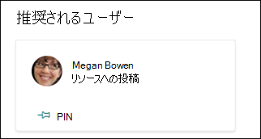
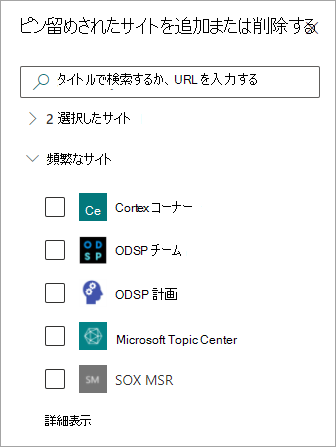

# 既存のトピックを編集Microsoft Viva トピック 

 

> [!VIDEO https://www.microsoft.com/videoplayer/embed/RE4LA4n]  

 

Viva Topics では、既存のトピックを編集できます。 既存のトピック ページに情報を修正または追加する場合は、これを行う必要があります。 

> [!Note] 
> AI によって収集されるトピックの情報はセキュリティによってトリミングされます。既存のトピックを編集するときに手動で追加するトピックの説明とユーザー情報は、トピックを表示する権限を持つすべてのユーザーに表示されます。 

## 要件

既存のトピックを編集するには、次の必要があります。
- Viva トピック ライセンスを持っている。
- トピックを作成または編集 [するためのアクセス許可を持っている](./topic-experiences-user-permissions.md)。 ナレッジ管理者は、Viva トピックでのトピックに関するアクセス許可の設定でユーザーにこのアクセス許可を付与できます。 

> [!Note] 
> トピック センター (ナレッジ マネージャー) でトピックを管理する権限を持つユーザーには、トピックを作成および編集するためのアクセス許可が既に付与されています。

## トピック ページを編集する方法

Who を持つユーザーは *、* トピックの強調表示からトピック ページを開き、トピック ページの右上部にある [編集] ボタンを選択することで、トピックを編集できます。 トピック ページは、トピック センターのホーム ページから開き、接続先のすべてのトピックを検索することもできます。

   ![[編集] ボタンを示すスクリーンショット。](../media/knowledge-management/edit-button.png)   

ナレッジ マネージャーは、トピックを選択し、ツールバーで [編集] を選択して、[トピックの管理] ページから直接 **トピックを編集** することもできます。

   ![[トピックの管理] ページの [編集] トピックを示すスクリーンショット。](../media/knowledge-management/manage-topics-edit.png)

### トピック ページを編集するには

1. トピック ページで、[編集] を **選択します**。 これにより、必要に応じてトピック ページに変更を加えることができます。

   ![トピック ページの [編集] ボタンを示すスクリーンショット。](../media/knowledge-management/topic-page-edit.png)  

2. [代替 **名] セクション** で、トピックが参照される可能性があるその他の名前を入力します。 

    ![[代替名] セクションを示すスクリーンショット。](../media/knowledge-management/alt-names.png)

3. **[説明]** セクションで、トピックについて説明するいくつかの文を入力します。 または、説明がすでに存在する場合は、必要に応じて更新します。

    ![[説明] セクションを示すスクリーンショット。](../media/knowledge-management/description.png) 

4. **[固定されたユーザー]** セクションでは、ユーザーを "固定" して、トピックに接続していることを示すことができます (たとえば、接続されたリソースの所有者)。 まず、[新しいユーザーの追加] ボックスに名前または電子メール アドレスを入力し、検索結果から追加するユーザーを選択します。 ユーザー カードの [リストから削除] アイコンを選択して、ピン留めを解除することもできます。
 
    ![[ピン留めされたユーザーの追加] セクションを示すスクリーンショット。](../media/knowledge-management/pinned-people.png) 

    **[提案されたユーザー]** セクションには、トピックに関するリソースへの接続から、AI がトピックに接続されている可能性があると考えるユーザーが表示されます。 ユーザー カードの固定アイコンを選択すると、状態を [提案済み] から [固定済み] に変更できます。

   

5. **[固定されたファイルおよびページ]** セクションで、トピックに関連付けられているファイルまたは SharePoint サイト ページを追加または "ピン留め" できます。

   ![[ピン留めされたファイルとページ] セクションを示すスクリーンショット。](../media/knowledge-management/pinned-files-and-pages.png)
 
    新しいファイルを追加するには、[追加] を選択し、フリークエント サイトまたはフォローサイトから SharePoint サイトを選択し、サイトのドキュメント ライブラリからファイルを選択します。

    **[リンクから]** オプションを使用し、URL を指定して、ファイルまたはページを追加することもできます。 

   > [!Note] 
   > 追加するファイルとページは、同じテナント内Microsoft 365必要があります。 トピックの外部リソースへのリンクを追加する場合は、手順 9 のキャンバス アイコンを使用して追加できます。

6. [ **推奨されるファイルとページ] セクション** には、AI がトピックに関連付ける必要があるファイルとページが表示されます。

   ![[推奨されるファイルとページ] セクションを示すスクリーンショット。](../media/knowledge-management/suggested-files-and-pages.png)

    固定アイコンを選択すると、提案されたファイルまたはページを固定されたファイルまたはページに変更できます。

7.  [ピン **留めされたサイト** ] セクションでは、トピックに関連付けられているサイトを追加または "ピン留め" できます。 

    ![[ピン留めされたサイト] セクションを示すスクリーンショット。](../media/knowledge-management/pinned-sites-section.png)

    新しいサイトを追加するには、[追加] を選択してからサイトを検索するか、頻繁なサイトまたは最近使用したサイトの一覧からサイトを選択します。
    
    

8. [ **推奨サイト] セクション** には、AI がトピックに関連付けられていることを提案するサイトが表示されます。 

   ![[推奨サイト] セクションのスクリーンショット。](../media/knowledge-management/suggested-sites-section.png)  

    ピン留めされたアイコンを選択すると、候補サイトをピン留めされたサイトに変更できます。

9. また、キャンバス アイコンを選択して、テキスト、画像、リンクなどの静的アイテムをページに追加することもできます。この項目は、簡単な説明の下に表示されます。 選択すると、ページにSharePointするアイテムを選択できる新しいツールボックスが開きます。

   

10. **[発行]** または **[再発行]** を選択して、変更を保存します。 **トピックが以前に** 公開されている場合は、再発行が使用可能なオプションになります。

