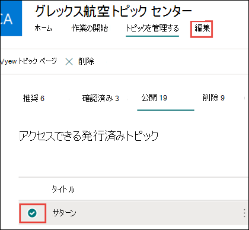

# Microsoft Viva Topics の既存のトピックを編集する 

 

> [!VIDEO https://www.microsoft.com/videoplayer/embed/RE4LA4n]  

 

Viva Topics では、既存のトピックを編集できます。 既存のトピック ページに情報を修正または追加する場合は、この操作が必要な場合があります。 

> [!Note] 
> AI によって収集されるトピックの情報はセキュリティでトリミングされますが、既存のトピックを編集するときに手動で追加するトピックの説明とユーザー情報は、トピックを表示する権限を持つすべてのユーザーに表示されます。 

## 要件

既存のトピックを編集するには、次の必要があります。
- Viva Topics ライセンスを持っている。
- トピックを作成または編集 [**できるユーザーに対するアクセス許可を持つ**](./topic-experiences-user-permissions.md)。 ナレッジ管理者は、ビバ トピックのアクセス許可設定でユーザーにこのアクセス許可を付与できます。 

> [!Note] 
> トピック センター (ナレッジ マネージャー) でトピックを管理する権限を持つユーザーには、トピックを作成および編集するためのアクセス許可が既に付与されています。

## トピック ページを編集する方法

[トピックを作成または編集できるユーザー] 権限を持つユーザーは、トピック の強調表示からトピック ページを開き、トピック<b></b>ページの右上部にある [編集] ボタンを選択して、トピックを編集できます。 トピック ページは、トピック センターのホーム ページから開き、接続先のすべてのトピックを検索することもできます。

   ![[編集] ボタン](../media/knowledge-management/edit-button.png)   

ナレッジ マネージャーは、トピックを選択し、ツールバーで [編集] を選択して、[トピックの管理] ページから直接 <b>トピックを編集</b> することもできます。

      

### トピック ページを編集するには

1. トピック ページで、[編集] を **選択します**。 これにより、必要に応じてトピック ページに変更を加えます。

       

2. [代替 <b>名] セクション</b> で、トピックが参照される可能性があるその他の名前を入力します。 

       
3. [説明 <b>] セクション</b> で、トピックについて説明する文を 2 つ入力します。 または、説明が既に存在する場合は、必要に応じて更新します。

    ![[説明] セクション](../media/knowledge-management/description.png) 

4. [ピン <b>留めされた</b> ユーザー] セクションでは、ユーザーを "ピン留め" して、トピックに接続しているユーザー (たとえば、接続リソースの所有者) として表示できます。 まず、[新しいユーザーの追加] ボックス<b></b>に名前または電子メール アドレスを入力し、検索結果から追加するユーザーを選択します。 ユーザー カードの [リストから削除] アイコン<b></b>を選択して、ピン留めを解除することもできます。
 
     

    [ <b>推奨ユーザー] セクション</b> には、AI がトピックへの接続からトピックに関するリソースに接続されている可能性があるというユーザーが表示されます。 ユーザー カードのピン アイコンを選択すると、その状態を [推奨済み] から [ピン留め] に変更できます。

    

5. [ピン留 <b>めされたファイルとページ</b> ] セクションでは、トピックに関連付けられているファイルまたは SharePoint サイト ページを追加または "ピン留め" できます。

   ![[ピン留めされたファイルとページ] セクション](../media/knowledge-management/pinned-files-and-pages.png) 
 
    新しいファイルを追加するには、[<b></b>追加] を選択し、頻繁またはフォローしているサイトから SharePoint サイトを選択し、サイトのドキュメント ライブラリからファイルを選択します。

    [リンクから] オプション <b>を使用して</b> 、URL を指定してファイルまたはページを追加することもできます。 

   > [!Note] 
   > 追加するファイルとページは、同じ Microsoft 365 テナント内にある必要があります。 トピックの外部リソースへのリンクを追加する場合は、手順 9 のキャンバス アイコンを使用して追加できます。

6. [ <b>推奨されるファイルとページ] セクション</b> には、AI がトピックに関連付ける必要があるファイルとページが表示されます。

   ![[推奨されるファイルとページ] セクション](../media/knowledge-management/suggested-files-and-pages.png) 

    ピン留めされたアイコンを選択すると、候補のファイルまたはページをピン留めされたファイルまたはページに変更できます。

7.  [ <b>関連サイト]</b> セクションには、トピックに関する情報を持つサイトが表示されます。 

    ![[関連サイト] セクション](../media/knowledge-management/related-sites.png) 

    [追加] を選択してからサイトを<b></b>検索するか、[頻繁なサイト] または [最近使用したサイト] の一覧からサイトを選択して、関連サイトを追加できます。 
    
     

8. [ <b>関連トピック] セクション</b> には、トピック間に存在する接続が表示されます。 別のトピックに接続を追加するには、[関連するトピックに<b></b>接続する] ボタンを選択し、関連するトピックの名前を入力し、検索結果から接続を選択します。 

      

    次に、トピックの関連付け方法について説明し、[更新] を選択 <b>します</b>。 

     

   追加した関連トピックは、接続されているトピックとして表示されます。

     

   関連するトピックを削除するには、削除するトピックを選択し、[トピックの削除] <b>アイコンを選択</b> します。 
 
      

   次に、[削除] <b>を選択します</b>。 

     

9. 短い説明の下にあるキャンバス アイコンを選択して、テキスト、画像、リンクなどの静的アイテムをページに追加することもできます。 選択すると SharePoint ツールボックスが開き、そこからページに追加するアイテムを選択できます。

     

10. [ **発行] または** **[再発行] を選択して** 変更を保存します。 **トピックが以前に** 公開されている場合は、再発行が使用可能なオプションになります。

## 関連項目

