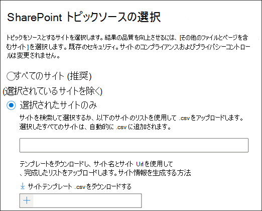
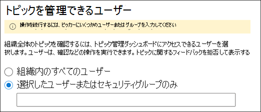
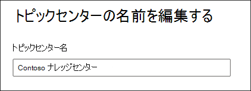

# ナレッジ管理ネットワークを管理する (プレビュー)

> [!Note] 
> この記事の内容は、Project Cortex のプライベートプレビュー用です。 [詳細については、「Project Cortex](https://aka.ms/projectcortex)」を参照してください。

[ナレッジ管理を設定](set-up-knowledge-network.md)した後、管理者が Microsoft 365 管理センターを使用して構成設定を調整できるようになります。

たとえば、次のいずれかの設定を調整しなければならない場合があります。
- 新しい SharePoint ソースを採鉱所のトピックに追加します。
- トピックにアクセスできるユーザーを変更します。
- トピックセンターでタスクを実行するためのアクセス許可を持つユーザーを変更します。
- トピックセンターの名前を変更する

## Requirements 
グローバル管理者または SharePoint 管理者のアクセス許可を持っている必要があります。これを行うには、Microsoft 365 管理センターにアクセスして、組織のナレッジタスクを管理する必要があります。

## ナレッジ管理設定にアクセスするには、次のようにします。

1. Microsoft 365 管理センターで、[**セットアップ**] を選択し、[**組織ナレッジ**] セクションを表示します。
2. [**組織ナレッジ**] セクションで、[**ユーザーをナレッジに接続する**] をクリックします。 

      

3. [**ユーザーをナレッジに接続**] ページで、[**管理**] を選択して [**ナレッジネットワーク設定**] ウィンドウを開きます。 

      

## ナレッジネットワークがトピックを見つける方法を変更する

SharePoint トピックソースの選択肢を更新する場合は、[**トピックの検索**] タブを選択します。 この設定を使用すると、トピックでクロールおよびマイニングされるテナント内の SharePoint サイトを選択できます。

1. [**トピック探索**] タブの [ **SharePoint トピックソースの選択**] で、[**編集**] を選択します。
2. [ **Sharepoint トピックソースの選択**] ページで、検出時にトピックのソースとしてクロールする sharepoint サイトを選択します。 保持されるデータには以下が含まれます。 
    a. **すべてのサイト**: テナント内のすべての SharePoint サイト。 これにより、現在および今後のサイトがキャプチャされます。 
    b. **[すべて]: 選択したサイトを除き、** 除外するサイトの名前を入力します。  また、探索対象から除外するサイトの一覧をアップロードすることもできます。 今後作成されるサイトは、トピック検出のソースとして含まれます。  
    c.  [**選択したサイトのみ**: 含めるサイトの名前を入力します。 サイトのリストをアップロードすることもできます。 今後作成されるサイトは、トピック検出のソースとしては含まれません。  

      
   
    除外するサイトが複数ある場合 (選択した**サイトを除くすべて**を選択した場合)、または (選択した**サイトのみ**を選択した場合)、CSV ファイルをサイト名と url でアップロードすることを選択できます。 CSV テンプレートファイルを使用する場合は、[**サイトテンプレート .csv のダウンロード**] を選択できます。

3. [**保存**] を選択します。

##  組織内のトピックを表示できるユーザーを変更する

組織内の誰が検索結果の検出されたトピックを表示できるかを更新する場合、または SharePoint ページなどのコンテンツでトピックを強調表示している場合は、[ **Topic discovery** ] タブを選択します。

1. [ **Topic discovery** ] タブで、[**ナレッジネットワーク内のトピックを参照できるユーザー**] で、[**編集**] を選択します。
2. [**ナレッジネットワーク内のトピックを参照できるユーザー** ] で、強調表示されたトピック、トピックカード、トピックの回答、トピックページなど、トピックの詳細にアクセスできるユーザーを選択します。 次のものが選択できます。 
    a. **組織内のすべてのユーザー** 
    b. **選択したユーザーまたはセキュリティグループのみ** 
    c.  **だれも** 

       
3. [**保存**] を選択します。  
 
> [!Note] 
> この設定では、組織内のユーザーを選択できますが、ナレッジ管理ライセンスが割り当てられているユーザーのみがトピックを表示できます。

## トピックセンターでタスクを実行する権限を持つユーザーを変更する

[トピックセンター] ページで次の操作を実行する権限を持つユーザーを更新する場合は、[**トピックの権限**] タブを選択します。

- トピックを作成および編集できるユーザー: 検出時に見つからなかった新しいトピックを作成する、または既存のトピックページの詳細を編集する。
- どのユーザーがトピックを管理できるか: 検出されたトピックを確認または拒否します。

トピックを作成および編集する権限を持つユーザーを更新するには、次のようにします。

1. [**トピックの権限**] タブの [**トピックの作成と編集が可能なユーザー**] で、[**編集**] を選択します。 
2. [**トピックの作成と編集が可能なユーザー** ] ページで、次の項目を選択できます。 
    a. **組織内のすべてのユーザー** 
    b. **選択したユーザーまたはセキュリティグループのみ** 

       

3. [**保存**] を選択します。 

トピックを管理する権限を持つユーザーを更新するには、次のようにします。

1. [**トピックの権限**] タブの [**トピックを管理できるユーザー**] で、[**編集**] を選択します。 
2. [**トピックの管理が可能なユーザー** ] ページで、次の項目を選択できます。 
    a. **組織内のすべてのユーザー** 
    b. **選択されたユーザーまたはセキュリティグループ** 

       

3. [**保存**] を選択します。 

##  トピックセンター名を更新する

トピックセンターの名前を更新する場合は、[**トピックセンター** ] タブを選択します。 

1. [**トピックセンター** ] タブの [**トピックセンター名**] で、[**編集**] を選択します。
2. [**トピックセンター名の編集**] ページの [**トピックセンター名**] ボックスに、トピックセンターの新しい名前を入力します。
3. **[保存]** を選びます。

       

## 関連項目

  

