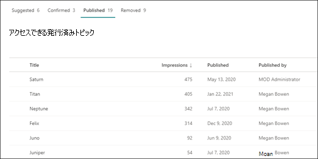
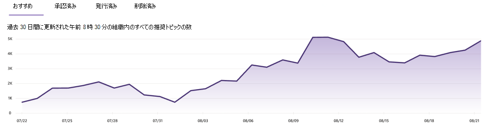

# トピック センターのトピックを管理Microsoft Viva トピック

 

> [!VIDEO https://www.microsoft.com/videoplayer/embed/RE4LxDx]  

 

ビバ トピック センターでは、ナレッジ マネージャーが[トピックの管理] ページを表示して、ナレッジ管理者が指定したソースの場所で特定されたトピックを確認できます。  

     

## トピック ステージ

ナレッジ マネージャーは、さまざまなトピック ライフサイクル ステージ (推奨、確認済み、発行済み、削除済 **み)** を通じて、検出されたトピックをガイド **するのに役立ちます**。

    

- **提案済み**: AI によって特定されたトピックであり、十分な裏付けとなるリソース、コネクション、プロパティを持っています。 (これらは、UI で **推奨トピック** としてマークされます)。

- **確認** 済み: AI によって検出され、検証されたトピック。 トピックの検証は、次のいずれかの場合に発生します。

   - ナレッジ マネージャーがトピックを確認します。 ナレッジ マネージャーは [、[トピックの管理] ページ](manage-topics.md#confirmed-topics) で **トピックを確認** します。

   - 複数のユーザーがトピックを確認します。 トピック カードのフィードバック メカニズムを使用して投票したユーザーから受け取った 2 つの肯定的な投票のネットが必要です。 たとえば、1 人のユーザーが肯定的に投票し、1 人のユーザーが特定のトピックに対して否定的な投票を行った場合でも、そのトピックを確認するには、さらに 2 つの肯定的な投票が必要になります。
 
- **発行** 済み : キュアされたトピック。 品質を向上させるために手動で編集が行われたか、ユーザーによって作成されています。

- **削除**: 拒否され、閲覧者に表示されなくなったトピック。 トピックは、任意の状態 (推奨、確認、または公開) で削除できます。 トピックの削除は、次のいずれかの場合に発生します。

   - ナレッジ マネージャーがトピックを削除します。 ナレッジ マネージャーは、[トピックの管理] ページで **トピックを削除** します。

   - トピック カードのフィードバック メカニズムを使用して、複数のユーザーが否定的な票を投じます。 トピックを削除するには、ユーザーから受け取った 2 つの負の投票の正味が必要です。 たとえば、1 人のユーザーが否定的な投票を行い、1 人のユーザーが特定のトピックに対して正の投票を行った場合でも、そのトピックを削除するには、さらに 2 つの否定的な投票が必要になります。

  発行済みトピックを削除する場合は、トピック センターの Pages ライブラリを使用して、詳細を選択したページを手動で削除する必要があります。

> [!Note] 
> [トピック **の管理]** ページでは、各ナレッジ マネージャーは、トピックに接続されている基になるファイルとページにアクセスできるトピックのみを表示できます。 このアクセス許可のトリミングは、[提案済み]、[確認済み]、[発行済み]、および [削除済み] タブに表示されるトピックの一覧に **反映** されます。  ただし、このトピックでは、アクセス許可に関係なく、組織内の合計カウントが表示されます。

## 要件

トピック センターでトピックを管理するには、次の必要があります。
- Viva トピック ライセンスを持っている。

- トピックのWho [**を管理する権限を持**](./topic-experiences-user-permissions.md)つ。 ナレッジ管理者は、Viva トピックでのトピックに関するアクセス許可の設定でユーザーにこのアクセス許可を付与できます。 

トピックを管理できるユーザー権限がない限り、トピック センターの [トピックの管理]**ページWho表示** することはできません。

トピック センターでは、ナレッジ マネージャーは、指定したソースの場所で特定されたトピックを確認し、確認または削除できます。 ナレッジ マネージャーは、トピックの検出で新しいトピック ページが見つからない場合は新しいトピック ページを作成して発行したり、更新する必要がある場合は既存のトピック ページを編集することもできます。

## 推奨されるトピック

[トピック **の管理]** ページで、指定したソースの場所でSharePointされたトピックが [提案] タブ **に表示** されます。必要に応じて、ナレッジ マネージャーは未確認のトピックを確認し、確認または削除を選択できます。

    

提案されたトピックを確認するには、次の方法を使用します。

1. [トピックの **管理]** ページで、[提案] タブ **を** 選択し、トピックを選択してトピック ページを開きます。

2. トピック ページで、トピック ページを確認し、ページに変更を加える必要がある場合は [編集] を選択します。 編集内容を公開すると、このトピックは [発行済み] タブ **に移動** されます。

3. トピックを確認した後、[トピックの管理] **ページに戻** ります。 選択したトピックについて、次のことができます。

   - チェック マークを選択してトピックを承認します。
    
   - トピックを **削除する** 場合は、x を選択します。

    確認済みトピックは提案リスト **から削除** され、確認済みリストに **表示** されます。

    削除されたトピックは提案リスト **から削除** され、[削除] タブに **表示** されます。

### 品質スコア

[提案されたトピック] ページに表示 **される各** トピックには、品質スコアが割り当てられます。 品質スコアは、平均的なユーザーがトピックに関する情報に対して表示する情報の量を反映しています。各ユーザーは、トピック内の情報に対するアクセス許可または権限が付与されていない可能性があるという理由で、多かれ少なかれ情報を表示する可能性があります。 

品質スコアは、最も多くの情報を含むトピックに関する洞察を得るのに役立ち、手動で編集する必要があるトピックを見つけるのに役立ちます。 たとえば、品質スコアが低いトピックは、一部のユーザーがトピックに含まれているファイルまたはサイトに関連する SharePoint アクセス許可を持たない場合です。 投稿者はトピックを編集して情報を含めることができ (適切な場合)、その後そのトピックを閲覧可能なすべてのユーザーがトピックを閲覧できるようになります。

### インプレッション

[ **インプレッション数]** 列には、トピックがエンド ユーザーに表示された回数が表示されます。 これには、検索のトピック回答カードやトピックのハイライトを通じたビューが含まれます。 これらのトピックのクリックスルーは反映されませんが、トピックが表示されています。 [**トピックの管理]** ページの [提案済み] タブ、[確認済み] タブ、[**発行** 済み] タブ、および [削除済み] タブにトピックの [インプレッション数]**列が表示** されます。

## 承認済みトピック

[トピックの管理] ページで、指定した SharePoint ソースの場所で検出され、2 人以上のネットで確認されたナレッジ マネージャーまたは "クラウドソース" によって確認されたトピック (負のユーザー投票と肯定的なユーザー投票のバランスを取る) が、カード フィードバック メカニズムを通じて [確認済み] タブに一覧表示されます。必要に応じて、トピックを管理する権限を持つユーザーは、確認済みトピックを確認し、拒否することができます。

承認済みトピックを確認するには:

1. **[承認済み]** タブで、トピックを選択してトピック ページを開きます。

2. トピック ページで、トピック ページを確認し、ページに変更を加える必要がある場合は [編集] を選択します。

確認済みトピックを拒否することを選択できます。 これを行うには、[確認済み] タブで選択したトピックに移動し、トピックを拒否する場合は **x** を選択します。

## 公開済みトピック

[トピック **の管理]** ページで、指定したソースの場所でSharePointされたトピックが [発行済み] タブに **表示** されます。公開されたトピックは編集され、特定の情報がページに遭遇したユーザーに常に表示されます。 手動で作成したトピックもこちらに一覧表示されます。

   

## 削除されたトピック

[トピックの **管理]** ページで、指定したソースの場所でSharePointされたトピックが [削除] タブに **表示** されます。トピック センターのトピック カードに関するエンド ユーザーの投票に基づいて、いくつかの推奨トピックがここに表示されます。

削除されたトピックは、必要に応じて表示可能なトピックとして後で追加できます。 削除したトピックを表示可能なトピックとして追加する場合は、次のようにします。

1. [削除] **タブ** で、トピックを選択します。

2. [レビュー **と発行] を選択します**。

   ![[レビューと発行] オプションを示す [削除] タブのスクリーンショット。](../media/knowledge-management/review-and-publish-removed-topic.png)

## トピック数ダッシュボード

ダッシュボード ビューのこのグラフでは、Viva Topics トピック センターのトピック数を確認できます。 このグラフには、トピックライフサイクルステージごとのトピック数が表示され、トピック数が時間の流れによってどのように推移したのかも示されています。 ナレッジ マネージャーは、AI によって新しいトピックが検出される速度と、ナレッジ マネージャーまたはユーザー アクションによってトピックが確認または公開される速度を視覚的に監視できます。

ナレッジ マネージャーは、[トピックの管理] ページのトピックの一覧で表されるトピックの数がダッシュボードに表示される数とは異なる場合があります。 これは、ナレッジ マネージャーがすべてのトピックにアクセスできない可能性があるためです。 ダッシュボード ビューに表示されるカウントは、アクセス許可トリミングを適用する前に行います。 

   
