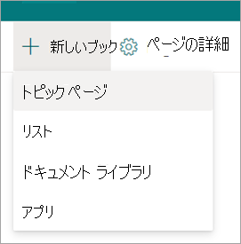
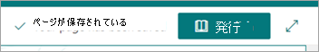
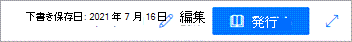

# トピックを下書きとして保存Microsoft Viva トピック

新しいトピックまたは修正されたトピックの下書きとして保存できますが、まだ公開する準備ができていません。

## 新しいトピックを下書きとして保存する

1. トピック センターで、[新しいトピック ページ **]**  >  **を選択します**。
 
   

2. 新しいトピックを編集すると、下書きが自動的に保存されます。
  
   

3. 現在の編集が完了したが、公開する準備ができていない場合は、[下書きとして保存] を選択して変更を保存します。 公開するまで、ページに編集内容は表示されます。 トピックに対する編集権限を持つユーザーだけが下書きを表示できます。 

   

4. **[公開]** を選択して、変更を保存します。 ページを発行すると、トピック名、代替名の説明、ピン留めされたユーザーが、トピックを表示できるユーザーに表示されます。 特定のファイル、ページ、およびサイトは、閲覧者がトピックに対するアクセス許可を持つ場合にのみトピック ページに表示されます。
 
## 改訂されたトピックを下書きとして保存する

1. トピック ページを開き、編集します。

2. トピック ページを編集すると、下書きが自動的に保存されます。
  
   

3. 現在の編集が完了したが、公開する準備ができていない場合は、[下書きとして保存] を選択して変更を保存し、編集モードを閉じます。

   

4. ユーザーが変更を確認する準備ができたら、[発行] または [再発行]  **ボタンが表示** されます。 

    - **発行** は、トピックに AI が検出されたコンテンツのみを含み、初めて編集する場合に使用できます。 公開すると、トピック名、代替名、説明、またはピン留めされたユーザーに対して行った編集内容が、トピックを表示できるユーザーに表示されます。 特定のファイル、ページ、サイト、AI で検出された代替名、およびユーザーは、それらのリソースへのアクセス許可を持つユーザーにのみ表示されます。

    - **再発行とは** 、以前に公開されたトピックを編集しているという意味です。
 
## 下書きページのライフサイクル
 
1. トピックを下書きとして保存してページを閉じると、トピックはマイナー バージョンとしてチェックインされ、"共有" 下書きになります。 つまり、編集権限を持つユーザー (またはサイト所有者) が下書きを表示して編集できます。

2. 下書きは編集時に自動的に保存されます。

3.  編集権限を持つユーザー (またはサイト所有者) は、下書き状態のトピック ページを開いた際に、保存された下書きに直接移動されます。 これが下書きページであり、最後の下書きが保存された時点を示すメッセージが表示されます。
  
    

4.  編集モードを閉じると、トピック ページに戻って下書きに戻ります。
    - ユーザーの場合:
         - トピック Web **パーツの [確認済み** トピック] セクションから
         - トピックを検索し、トピックの回答から開く

    - ナレッジ マネージャーの場合:
         - [トピックの **管理] ページから**
         - サイト ページ ライブラリ内
         - トピック ページへの直接リンクから
 
## 1 人のユーザーが一度に編集する

下書きに関係なく、2 人のユーザーが同じページを同時に編集できない。 1 人のユーザーが編集用にページを開いて、別のユーザーがページを編集しようとすると、そのページが他のユーザーによって編集されているというメッセージが表示されます。
  
   
 
ページを開いて編集を行うユーザーに対して、変更の保存と終了、変更の破棄、発行を行って、ページを "リリース" するように求めできます。 ただし、ページに 5 分間アクティビティがない場合、編集セッションは自動的にタイムアウトし、5 分以内にブラウザーを閉じない限り、ページは "ロック解除" されます。

