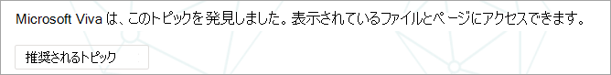

# トピックを大規模に管理Microsoft Viva トピック

サイトまたは組織全体SharePointビバ トピックにインデックスを作成すると、多くのトピックが生成される場合があります。 このような状況が発生し、[トピックの管理] ページに何千もの推奨トピックが表示される場合は、開始する場所を知るのが困難な場合があります。 この記事では、多数のトピックを持つ大規模な組織でも、情報を検索しているユーザーに表示されるトピックと情報を最適化する方法について説明します。

最初に、トピックの [4 つの段階を思い出します](manage-topics.md#topic-stages)。

- **提案済み**: AI によって特定されたトピックであり、十分な裏付けとなるリソース、コネクション、プロパティを持っています。 (これらは、UI で **推奨トピック** としてマークされます)。

- **確認** 済み: AI によって検出され、検証されたトピック。 トピックの検証は、次のいずれかの場合に発生します。

   - ナレッジ マネージャーがトピックを確認します。 ナレッジ マネージャーは [、[トピックの管理] ページ](manage-topics.md#confirmed-topics) で **トピックを確認** します。

   - 複数のユーザーがトピックを確認します。 トピック カードのフィードバック メカニズムを使用して投票したユーザーから受け取った 2 つの肯定的な投票のネットが必要です。 たとえば、1 人のユーザーが肯定的に投票し、1 人のユーザーが特定のトピックに対して否定的な投票を行った場合でも、そのトピックを確認するには、さらに 2 つの肯定的な投票が必要になります。
 
- **発行** 済み : キュアされたトピック。 品質を向上させるために手動で編集が行われたか、ユーザーによって作成されています。

- **削除**: 拒否され、閲覧者に表示されなくなったトピック。 トピックは、任意の状態 (推奨、確認、または公開) で削除できます。 トピックの削除は、次のいずれかの場合に発生します。

   - ナレッジ マネージャーがトピックを削除します。 ナレッジ マネージャーは、[トピックの管理] ページで **トピックを削除** します。

   - トピック カードのフィードバック メカニズムを使用して、複数のユーザーが否定的な票を投じます。 トピックを削除するには、ユーザーから受け取った 2 つの負の投票の正味が必要です。 たとえば、1 人のユーザーが否定的な投票を行い、1 人のユーザーが特定のトピックに対して正の投票を行った場合でも、そのトピックを削除するには、さらに 2 つの否定的な投票が必要になります。

  発行済みトピックを削除すると、キュアされた詳細を含むページは、トピック センターのページ ライブラリを使用して手動で削除する必要があります。

## ナレッジ マネージャーの役割 

Viva Topics を構成すると、アクセス許可が付与されたユーザーのグループを追加して、トピック センターの [トピックの管理] **ページを** 表示します。 トピックのプライマリ キュレーションの役割を持つユーザーにのみ表示されます。 トピックに関するデータにアクセスし、レビューとキュレートにアクセスできるすべてのトピックのリストを表示できます。

この役割の従業員には、さまざまなトピックを表示するための広範なアクセス許可が必要です。 または、アクセス許可がセグメント化されている場合は、ビジネスの異なる領域を表し、独自の領域を管理できるユーザーのグループを選択できます。

トピック センターで最初にトピックを確認する場合、推奨されるトピックは純粋に AI で定義されます。 ナレッジ マネージャーは、幅広いユーザー コミュニティにビバ トピックを展開する前に、それぞれを確認する必要があります。 大規模に作業する場合、何千ものトピックのために、このアプローチが実用的になることはほとんどありません。

推奨される方法は、最初の一連のユーザーに最も関連するトピックまたは重要なトピックのバランスを見つけ、Viva Topics のロールアウト前にそれらのトピックのキュレーションに焦点を当てる方法です。 まず、ユーザーからのフィードバックを収集し、クラウドソーシングがユーザーの利用状況と投稿パターンを判断して、この記事で提案されている戦略を知らせるのを許可します。

システムがすべてのユーザーに対して、AI が推奨するトピックと人間による公開トピックの両方を識別して表示することを認識することが重要です。 ただし、すべての推奨トピックがすべてのエンド ユーザーに表示されるわけではありません。 セキュリティ設定は、コンテンツ自体に設定されているアクセス許可に基づいて、各従業員がアクセスできるトピックのみを表示します。

[トピックの管理] ページを表示するアクセス許可を持つナレッジ マネージャーとして、組織内の役割とアクセスレベルに応じて、独自の昇格されたアクセス許可のために、はるかに多くのトピックが表示される場合があります。 また、ハイライトや検索を使用してトピックにアクセスするのではなく、1 つの場所にリストされているトピックを表示できるビューにアクセスできます。

さらに、ほとんどのユーザーが表示するトピックの割合が少なく、アクセス許可が原因で表示されるトピックの数が多いほど多い可能性があります。 その結果、組織にとって最も重要であり、より広く見られる可能性が最も高いトピックにキュレーション タスクを最初に集中することが良い方法です。

この記事では、キュレーションのいくつかの戦略について説明します。 これらの戦略は、頻度が低い、またはあまり一般的ではないトピックが知識管理者によって完全にキュイデントされない可能性があります。 ただし、これらの推奨されるトピックは引き続き有用であり、洞察や人へのポインターを提供できます。これは、開始点を探す従業員の時間を節約できます。 トピックに対するクラウドソース更新を許可すると有益であり、あまり一般的なトピックに対してより多くのコンテンツと範囲が提供されます。

この記事では、トピックの管理とキュレーションにアプローチするためのガイダンスとベスト プラクティスについて説明します。

## 推奨されるトピックについて

トピックが AI によって検出された場合は、[トピックの管理] ページとユーザーに提示されるトピック カードの両方で、推奨トピックとしてマークされます。 削除済みとしてマークされていないトピックは、ユーザーに表示されます 。これには、確認済み、公開済み、推奨されるトピックが含まれます。 3 つの状態のトピックはすべて、エンド ユーザーが利用できます。

トピック カードまたはページ内では、さまざまなキューを使用して、AI が情報を生成した方法を示します。 システムは、さまざまな証拠を使用して、主にコンテンツ自体を介してリソースを追加します。

- ラベルは、トピックが提案され、ビバ トピックによって検出されたことを示します。  

   

- ソースを指定して、定義の送信元を示すカードの状態に関する情報。

- 提案されたユーザーは、トピック証拠を使用してドキュメントを作成または編集したユーザーを集計することで派生します。 ユーザーがタイトルにトピック名を持つドキュメントを書き込み、そのドキュメントに多数のビューがある場合、そのユーザーを関連付けとして確立するために必要なドキュメントは 1 つのみです。 ただし、多くの場合、より多くの証拠が優れたものであり、一覧に記載されているユーザーは複数のドキュメントで作業しています。  

   

- 表示されるファイルとページでは、このトピックがドキュメントで言及された回数が識別されますが、特定の種類 (プロジェクトやチームなど) のトピックへの参照を識別する特定のコンテキストでもこのトピックを説明する必要があります。 これは、AI の証拠としてカウントされます。 また、ドキュメントのタイトル、ドキュメントの種類、その他の分析機能 (ビューなど) でのトピック名の発生も考慮されます。

   

   ![[提案されたトピック] と [このページの編集] というバナーの画像を使用して、このトピックへの関与を説明します。](../media/knowledge-management/scale-topics-suggested-describe-your-involvement.png)

   ![[提案されたトピック] と [このページを編集する] というバナーの画像 (トピックに接続されているユーザーを追加できる場合)。](../media/knowledge-management/scale-topics-suggested-add-people.png)

これらの属性は、コンテンツが AI によって追加され、AI がどのように決定を下したのかを示しています。

### コミュニケーション

ビバ トピックについてユーザーとコミュニケーションを取る場合は、AI が推奨するトピックとコンテンツと、それらの推奨される同等のトピックの違いを明確にすることが重要です。

読者として、より重要な目で提案されたトピックを表示する必要があります。 組織の真実の権限を持つ情報源として認識されるべきではない。 むしろ、アクセス権を持つコンテンツを通じて提示される暗黙の知識にアクセスするための方法検索ツールです。 AI はトピックを発見し、それを示す十分な証拠を持っていますが、その価値は人によって確認されていません。

### 群集のコントロール

提案されたトピックは、ページのキュレーションとトピックに関するクラウドソースフィードバックを通じて改善できます。

ユーザーが提案されたトピックを操作すると、UI で簡単な質問を受け取る場合があります。 たとえば、この *トピックはページに関連していますか?* *このユーザーはトピックに関連していますか?* *この定義は正確でしたか?* このような質問に対するフィードバックを使用すると、名前の付いた個人がページをキュレートする必要なく、トピックの精度が向上します。

トピック センターのホーム ページは、提案されたトピックに関するフィードバックが収集される別の場所です。 トピック センターでは、ユーザーは関連付けられているトピックを確認し、この関連付けを確認するか、削除するオプションが与えられる。

   

トピックの広範なクラウドソーシングを許可する場合は、次の要素を考慮する必要があります。

-   ユーザーはトピック ページに **[編集**] オプションを表示し、他のモダン ページと同じエクスペリエンスでページSharePointできます。

-   一 **部の推奨トピック** Web パーツは削除できません。 トピック名、代替名、定義、推奨ユーザー、推奨リソースは削除できません。

-   発行された推奨トピックまたは確認済みトピックが [トピックの管理] ページの [発行済み] リストに移動するには、時間 **がかかる場合** があります。

    -   トピックが検索、強調表示、ハッシュタグ、または注釈に表示される推定時間は 2 時間です。

    -   [管理トピック] ページの [発行済み]リストにトピックが表示される推定時間は、ほとんどの場合 24 時間以内です。 2 時間以内に表示されますが、24 時間ごとに完全な同期が行なうので、待ち時間は 24 時間を超えてはならない。

-   ユーザーが発行済みトピックをチェックアウトまたは編集状態のままにする可能性があります。 ナレッジ マネージャーは、トピック センターのページ ライブラリでこれらを確認し、ユーザーの変更を破棄してトピックを再発行するか、そのユーザーに問い合わせ、トピックのチェックインを要求できます。

### トピックの表示とコンテンツは、ユーザーのアクセス許可に基づく

提案されたトピックの一覧をナレッジ マネージャーとして確認する場合は、提案されたトピックの内容がアクセス許可に基づいて動的に行なうので、ご確認ください。 提案されたコンテンツと、表示されるユーザーは、ユーザーまたは他のナレッジ マネージャーに提示されたコンテンツと同じではない可能性があります。

トピックに関連付けられているコンテンツを表示するアクセス許可に基づいて、各ユーザーに、提案されるリソース、人、代替名、定義の異なるセットが表示される場合があります。

## キュレーションのトピックに優先順位を付ける

次の戦略を使用して、目立つ可能性が高いトピックを特定し、キュレーションの候補として適切です。 

### Taxonomies

既存の taxonomies を使用すると、ユーザーが目立つ可能性が高いトピックの一覧を提供できます。 たとえば、次のようになります。

-   組織が提供する製品とサービス

-   Teams内の情報

-   高プロファイル プロジェクト

このアプローチは、組織のその領域を理解している件名の専門家と、部門または機能レベルで行う場合もあります。 目標は、選択内容またはすべてのトピックを確認する必要はありません。 むしろ、選択的キュレーションを導く独自のドメインの専門知識を提供します。

### 検索

一般的な検索用語は、多くの場合、トピックとして検出されます。 このページの[上位クエリ レポートをMicrosoft Search、](/sharepoint/view-search-usage-reports)組織内で最も頻繁に検索する用語を識別できます。 これらの用語のトピックが検出された場合は、キュレーションの候補として優れた候補です。 これらのトピックは、次のトピックで応答カードMicrosoft Search。

現在ブックマークを使用している[場合Microsoft Search](/microsoftsearch/manage-bookmarks)トピックに置き換えられるものについて検討してください。 ブックマークの応答カードには、タイトル、説明、および URL が含まれる。 状況によっては、ユーザーにとってトピック カードの方が役に立つ場合があり、トピック カードにはリソースとユーザーも表示されます。

ユーザーの検索エクスペリエンスでは、ユーザーが旅行のような用語を検索すると、検索結果は次の優先順位で表示Microsoft Search。

1.  発行済みまたは確認済みトピック

2.  ブックマーク

3.  推奨されるトピック

### インプレッションと品質スコア

インプレッション [数と](manage-topics.md#impressions) 品質スコア [は](manage-topics.md#quality-score) 、トピックの動作を理解するための重要な指標です。 これらの指標の値は、ナレッジ マネージャーまたは IT チームだけがトピックにアクセスできる場合に制限されます。 ユーザーのパイロット グループにトピックを公開すると、これらのメジャーのより代表的なデータが生成されます。

インプレッション数が多いトピックは、より頻繁に操作される可能性があります。 これらのトピックの品質スコアは、それらのトピックがどれだけ豊富かの感覚を与えるでしょう。 インプレッション数が多く、品質スコアが低いトピックは、キュレーションの良いターゲットです。

### 大規模な組織サイトの情報アーキテクチャの重要な用語

組織内の大規模なポータル サイトでは、ビジネス ユニット、製品ライン、主要なプロジェクトなどの主要なトピック領域に関する情報アーキテクチャとサイトのナビゲーションの整理に時間を投資している可能性があります。 これらの用語を確認し、これらの用語のトピックを識別およびキュレーションすると、これらの分野に関する情報を探しているユーザーに役立ちます。

### 内部ナレッジ ベースまたは Wiki サイトを活用する

組織がナレッジ ベースまたは Wiki サイトに投資している場合は、最初のキュレーションの取り組みで使用するトピックの一覧を提供できます。 特に大きい場合は、最も表示または編集されたトピックを開始点として選択します。

## 関連項目

[トピック センターでトピックを管理する](manage-topics.md)

[トピック センターの概要](topic-center-overview.md)
