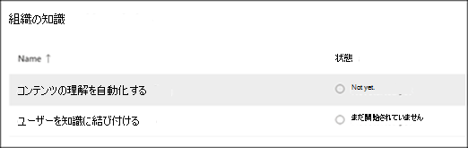
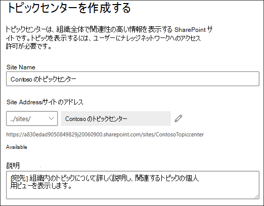

# ナレッジ管理をセットアップする (プレビュー)

> [!Note] 
> この記事の内容は、Project Cortex のプライベートプレビュー用です。 [詳細については、「Project Cortex](https://aka.ms/projectcortex)」を参照してください。

Microsoft 365 管理センターを使用して、[ナレッジ管理](knowledge-management-overview.md)をセットアップして構成することができます。 

> [!Important]
> 環境でナレッジマネジメントをセットアップして構成するための最善の方法を計画することが重要です。 たとえば、次の点について考慮する必要があります。
- トピックを分析する SharePoint サイト。
- トピックを表示するユーザーを指定します。
- トピックセンターのトピックを管理するためのアクセス許可を付与するユーザー。
- トピックセンターでトピックを作成または編集するためのアクセス許可を付与するユーザー。
- トピックセンターに付ける名前を指定します。

> [!Note]
> トピックの表示、トピックの管理、およびトピックの作成と編集に必要なアクセス許可をユーザーに割り当てるには、セキュリティグループを作成すると便利です。

管理者は、Microsoft 365 管理センターのナレッジ管理設定を使用して、[選択した設定をいつ](manage-knowledge-network.md)でも変更することができます。

## Requirements 
グローバル管理者または SharePoint 管理者のアクセス許可を持っている必要があります。これを行うには、Microsoft 365 管理センターにアクセスして、組織のナレッジタスクを設定する必要があります。

## ナレッジネットワークをセットアップする

ナレッジネットワークをセットアップするには、次の手順を実行します。

- トピック検出: 検出から除外するトピックソースとトピックを選択します。
- トピックの表示: [検索] および [トピックページ] で、トピックを強調表示できるユーザーを選択します。
- トピックのアクセス許可: トピックを作成、編集、および管理できるユーザーを選択します。
- トピックセンター: トピックセンターを作成します。
- レビュー: 設定を確認して適用します。

ナレッジネットワークをセットアップするには、次のようにします。

1. Microsoft 365 管理センター (admin.microsoft.com) で、[**セットアップ**] を選択し、[**組織ナレッジ**] セクションを表示します。
2. [**組織ナレッジ**] セクションで、[**ユーザーをナレッジに接続する**] をクリックします。 

      

3. [**ユーザーをナレッジに接続**する] ページで、[**開始**] をクリックして、セットアッププロセスを案内します。 

      

4. [**ナレッジネットワークでトピックを検索する方法を選択**してください] ページで、トピック検出を構成します。 **[Sharepoint トピックソースの選択**] セクションで、検出時にトピックのソースとしてクロールする sharepoint サイトを選択します。 保持されるデータには以下が含まれます。 
    a. **すべてのサイト**: テナント内のすべての SharePoint サイト。 これにより、現在および今後のサイトがキャプチャされます。 
    b. **[すべて]: 選択したサイトを除き、** 除外するサイトの名前を入力します。  また、探索対象から除外するサイトの一覧をアップロードすることもできます。 今後作成されるサイトは、トピック検出のソースとして含まれます。  
    c.  [**選択したサイトのみ**: 含めるサイトの名前を入力します。 サイトのリストをアップロードすることもできます。 今後作成されるサイトは、トピック検出のソースとしては含まれません。  

      
   
5. [**トピックを名前で除外**する] セクションで、検出された結果に含めるトピックの名前を含めることを選択できます。 この設定を使用して、機密性の高いトピックがナレッジネットワークの一部として含まれないようにします。 次のようなオプションがあります。 
    a. **トピックを除外しない**  
    b. **次の用語を含むトピックを除外**します。ユーザーに表示したくないトピックがある場合は、ナレッジネットワークの一部として表示されません。
   -提供されたテンプレートをダウンロードします。
   -除外するトピック名を入力します。 一致の種類を exact または partial として指定する必要があります。 完全一致の場合は、完全に一致する用語が除外されます。 部分一致は厳密であり、用語を含むトピックは除外されることを意味します。 たとえば、トピック名として「 *doc* 」と入力すると、 *Docker*ではなく、 *doc アセンブリ*が除外されます。 トピック名の大文字と小文字は区別されません。  
        -  **+**   完了した CSV ファイルをインポートする場合に選択します。 [**アップロード**] を選択します。 ファイルが正常に処理された場合は、緑色のチェックマークが表示されます。 [**次へ**] を選択します。 

6. [**トピックを見ることができるユーザー] および**それらのページが表示される場所については、トピックの表示を構成します。 [ナレッジネットワーク設定] の [**トピックを参照できるユーザー** ] で、強調表示されているトピック、トピックカード、トピックの回答、トピックページなど、トピックの詳細にアクセスできるユーザーを選択します。 次のものが選択できます。 
    a. **組織内のすべてのユーザー** 
    b. **選択したユーザーまたはセキュリティグループのみ** 
    c.  **だれも** 

       

 > [!Note] 
 > この設定では、組織内のユーザーを選択できますが、ナレッジ管理ライセンスが割り当てられているユーザーのみがトピックを表示できます。 

7. [**トピック管理のアクセス許可**] ページで、トピックを作成、編集、または管理できるユーザーを選択します。 [**トピックの作成と編集が可能なユーザー** ] セクションで、次の項目を選択できます。 
    a. **組織内のすべてのユーザー** 
    b. **選択したユーザーまたはセキュリティグループのみ** 
8. [**トピックを管理できるユーザー** ] セクションで、次の項目を選択できます。 
    a. **組織内のすべてのユーザー** 
    b. **選択されたユーザーまたはセキュリティグループ** 

      

    [**次へ**] を選択します。 
9. [**トピックセンターの作成**] ページでトピックセンターサイトを作成し、トピックページを表示したり、トピックを管理したりすることができます。  [**トピックセンター名**] ボックスに、トピックセンターの名前を入力します。 必要に応じて、簡単な説明を [**サイトの説明**] ボックスに入力できます。  

[**次へ**] を選択します。 

      

10. [**確認と完了**] ページで、選択した設定を確認して、変更を行うことができます。 選択内容に問題がなければ、[**アクティブ化**] を選択します。

       

11. [**ナレッジネットワークがアクティブ化**されました] ページが表示され、選択したサイトの分析が開始され、ナレッジセンターサイトが作成されることを確認できます。 [**完了**] を選択します。 

       

12. **ユーザーをナレッジに接続**するページに戻ります。 このページでは、[**管理**] を選択して構成設定に変更を加えることができます。 

         

> [!Note]
> セットアップ後、管理者はこのページに戻って、[選択したナレッジ管理設定を](manage-knowledge-network.md)いつでも変更できます。

## 関連項目

  

