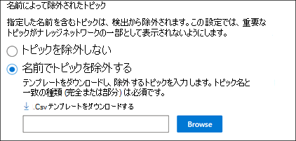

# ナレッジ管理をセットアップする (プレビュー)Set up Knowledge Management (Preview)

> [!Note] 
> この記事の内容は、Project Cortex のプライベートプレビュー用です。The content in this article is for Project Cortex Private Preview. [詳細については、「Project Cortex](https://aka.ms/projectcortex)」を参照してください。[Find out more about Project Cortex](https://aka.ms/projectcortex).

Microsoft 365 管理センターを使用して、 [ナレッジ管理](knowledge-management-overview.md)をセットアップして構成することができます。You can use the Microsoft 365 admin center to set up and configure [Knowledge Management](knowledge-management-overview.md). 

> [!Important]
> 環境でナレッジマネジメントをセットアップして構成するための最善の方法を計画することが重要です。It is important to plan the best way to set up and configure Knowledge Management in your environment. たとえば、次の点について考慮する必要があります。For example, you will need to make considerations about the following:
- トピックを分析する SharePoint サイト。Which SharePoint sites you want to analyze for topics.
- トピックを表示するユーザーを指定します。Which users you want to make topics visible to.
- トピックセンターのトピックを管理するためのアクセス許可を付与するユーザー。Which users you want to give permissions to manage topics in the topic center.
- トピックセンターでトピックを作成または編集するためのアクセス許可を付与するユーザー。Which users you want to give permissions to create or edit topics in the topic center.
- トピックセンターに付ける名前を指定します。What name you want to give your topic center.

> [!Note]
> トピックの表示、トピックの管理、およびトピックの作成と編集に必要なアクセス許可をユーザーに割り当てるには、セキュリティグループを作成すると便利です。You may find it useful to create security groups to assign your users the permissions needed to view topics, manage topic, and create and edit topics.

管理者は、Microsoft 365 管理センターのナレッジ管理設定を使用して、 [選択した設定をいつ](manage-knowledge-network.md) でも変更することができます。An admin can also [make changes to your selected settings anytime after setup](manage-knowledge-network.md) through the Knowledge Management settings in the Microsoft 365 admin center.

## RequirementsRequirements 
グローバル管理者または SharePoint 管理者のアクセス許可を持っている必要があります。これを行うには、Microsoft 365 管理センターにアクセスして、組織のナレッジタスクを設定する必要があります。You must have Global Admin or SharePoint admin permissions to be able to access the Microsoft 365 admin center and set up Organizational knowledge tasks.

## ナレッジネットワークをセットアップするSet up your knowledge network

ナレッジネットワークをセットアップするには、次の手順を実行します。Setting up your knowledge network walks you through the following:

- トピック検出: 検出から除外するトピックソースとトピックを選択します。Topic discovery: Selecting topic sources and topics to  exclude from discovery.
- トピックの表示: [検索] および [トピックページ] で、トピックを強調表示できるユーザーを選択します。Topic visibility: Selecting who can view topics as highlights, in search and topic pages.
- トピックのアクセス許可: トピックを作成、編集、および管理できるユーザーを選択します。Topic permissions: Selecting who can create, edit, and manage topics.
- トピックセンター: トピックセンターを作成します。Topic center: Create your topic center.
- レビュー: 設定を確認して適用します。Review: Check and apply your settings.

ナレッジネットワークをセットアップするには、次のようにします。To set up your knowledge network:

1. Microsoft 365 管理センター (admin.microsoft.com) で、[ **セットアップ**] を選択し、[ **組織ナレッジ** ] セクションを表示します。In the Microsoft 365 admin center (admin.microsoft.com), select **Setup**, and then view the **Organizational Knowledge** section.
2. [ **組織ナレッジ** ] セクションで、[ **ユーザーをナレッジに接続する**] をクリックします。In the **Organizational Knowledge** section, click **Connect people to knowledge**. 

      

3. [ **ユーザーをナレッジに接続** する] ページで、[ **開始** ] をクリックして、セットアッププロセスを案内します。On the **Connect people to knowledge** page, click **Get started** to walk you through the setup process. 

      

4. [ **ナレッジネットワークでトピックを検索する方法を選択** してください] ページで、トピック検出を構成します。On the **Choose how the knowledge network can find topics** page, you will configure topic discovery. **[Sharepoint トピックソースの選択**] セクションで、検出時にトピックのソースとしてクロールする sharepoint サイトを選択します。In the **Select SharePoint topic sources** section, select which SharePoint sites will be crawled as sources for your topics during discovery. 次のようなシナリオが考えられます。This includes: 
    a. a. **すべてのサイト**: テナント内のすべての SharePoint サイト。**All sites**: All SharePoint sites in your tenant. これにより、現在および今後のサイトがキャプチャされます。This captures current and future sites. 
    b. b. **[すべて]: 選択したサイトを除き、** 除外するサイトの名前を入力します。**All, except selected sites**: Type the names of the sites you want to exclude.  また、探索対象から除外するサイトの一覧をアップロードすることもできます。You can also upload a list of sites that you want to opt out from discovery. 今後作成されるサイトは、トピック検出のソースとして含まれます。Sites created in future will be included as sources for topic discovery.  
    c. c. [**選択したサイトのみ**: 含めるサイトの名前を入力します。**Only selected sites**: Type the names of the sites you want to include. サイトのリストをアップロードすることもできます。You can also upload a list of sites. 今後作成されるサイトは、トピック検出のソースとしては含まれません。Sites created in the future will not be included as sources for topic discovery.  

      
   
5. [ **トピックを名前で除外** する] セクションで、検出された結果に含めるトピックの名前を含めることを選択できます。In the **Exclude topics by name** section, you can choose to includes names of topics you don't want to be in the discovered results. この設定を使用して、機密性の高いトピックがナレッジネットワークの一部として含まれないようにします。Use this setting to prevent sensitive topics from being included as part of the knowledge network. 次のようなオプションがあります。Your options include: 
    a. a. **トピックを除外しない****Don't exclude any topics**  
    b. b. **トピックを名前で除外**する: ナレッジネットワークの一部としてユーザーに表示されないトピックがある場合。**Exclude topics by name**:  If you have topics you don’t want shown to users as part of the knowledge network. 

      

    #### 名前によってトピックを除外する方法How to exclude topics by name    

    トピックを除外する必要がある場合は、[ **名前でトピックを除外**する] を選択した後、[ **.Csv テンプレートをダウンロード**する] を選択します。If you need to exclude topics, after selecting **Exclude topics by name**, select **Download the .csv template**. Excel を使用します。CSV テンプレートを使用して、検出結果から除外するトピックの一覧を追加します。Use the Excel .CSV template to include a list of topics that you want to exclude from your discovery results.

      

    CSV テンプレートで、除外するトピックについて次の情報を入力します。In the CSV template, enter the following information about the topics you want to exclude:

    - [**名前**: 除外するトピックの名前を入力します。**Name**: Type the name of the topic you want to exclude. これを行うには 2 つの方法があります。There are two ways to do this: 
        - 完全一致: 完全に一致する名前または頭字語 (たとえば、 *Contoso* または *ATL*) を含めることができます。Exact match: You can include the exact name or acronym (for example, *Contoso* or *ATL*). 
        - 部分一致: 特定の単語が含まれるすべてのトピックを除外することができます。Partial match: You can exclude all topics that have a specific word in it.  たとえば、 *arc*は、円弧の*円*、*プラズマの円弧溶接*、*教育*用の円弧など *、弧が単語で*あるすべてのトピックを除外します。テキストが*アーキテクチャ*などの単語の一部として含まれるトピックは除外されないことに注意してください。For example, *arc* will exclude all topics with the word *arc* in it, such as *Arc circle*, *Plasma arc welding*, or *Training arc*. Note that it will not exclude topics in which the text is included as part of a word, such as *Architecture*. 
    - **拡張 (省略可能)**: 頭字語を除外する場合は、頭字語という単語を入力します。**Expansion (optional)**: If you want to exclude an acronym, type the words the acronym stands for. 
    - **MatchType-exact/partial**: 入力した名前が、 *完全* 一致または *一部* 一致の種類であるかどうかを入力します。**MatchType-Exact/Partial**: Type whether the name you entered was an *exact* or *partial* match type. 

    CSV テンプレートファイルが完成して保存されたら、[ **参照** ] を選択して、それを見つけて選択します。After you've completed and saved your CSV template file, select **Browse** to locate and select it.
    
    [**次へ**] を選択します。Select **Next**. 

6. [ **トピックを見ることができるユーザー] および** それらのページが表示される場所については、トピックの表示を構成します。On the **Who can see topics and where they can see them** page, you will configure topic visibility. [ナレッジネットワーク設定] の [ **トピックを参照できるユーザー** ] で、強調表示されているトピック、トピックカード、トピックの回答、トピックページなど、トピックの詳細にアクセスできるユーザーを選択します。In the **Who can see topics in the knowledge network** setting, you choose who will have access to topic details, such as highlighted topics, topic cards, topic answers in search, and topic pages. 次のものが選択できます。You can select: 
    a. a. **組織内のすべてのユーザー****Everyone in your organization** 
    b. b. **選択したユーザーまたはセキュリティグループのみ****Only selected people or security groups** 
    c. c. **だれも****No one** 

       

 > [!Note] 
 > この設定では、組織内のユーザーを選択できますが、ナレッジ管理ライセンスが割り当てられているユーザーのみがトピックを表示できます。While this setting allows you to select any user in your organization, only users who have knowledge management licenses assigned to them will be able to view topics. 

7. [ **トピック管理のアクセス許可** ] ページで、トピックを作成、編集、または管理できるユーザーを選択します。In the **Permissions for topic management** page, you choose who will be able to create, edit, or manage topics. [ **トピックの作成と編集が可能なユーザー** ] セクションで、次の項目を選択できます。In the **Who can create and edit topics** section, you can select: 
    a. a. **組織内のすべてのユーザー****Everyone in your organization** 
    b. b. **選択したユーザーまたはセキュリティグループのみ****Only selected people or security groups** 
8. [ **トピックを管理できるユーザー** ] セクションで、次の項目を選択できます。In the **Who can manage topics** section, you can select: 
    a. a. **組織内のすべてのユーザー****Everyone in your organization** 
    b. b. **選択されたユーザーまたはセキュリティグループ****Selected people or security groups** 

      

    [**次へ**] を選択します。Select **Next**. 
9. [ **トピックセンターの作成** ] ページでトピックセンターサイトを作成し、トピックページを表示したり、トピックを管理したりすることができます。On the **Create Topic  Center** page, you can create your topic center site in which topic pages can be viewed and topics can be managed.  [ **トピックセンター名** ] ボックスに、トピックセンターの名前を入力します。In the **Topic center name** box, type a name for your Topic center. 必要に応じて、簡単な説明を [ **サイトの説明** ] ボックスに入力できます。You can optionally type a short description in the **Site description** box.  

[**次へ**] を選択します。Select **Next**. 

      

10. [ **確認と完了** ] ページで、選択した設定を確認して、変更を行うことができます。On the **Review and finish** page, you can look at your selected setting and choose to make changes. 選択内容に問題がなければ、[ **アクティブ化**] を選択します。If you are satisfied with your selections, select **Activate**.

       

11. [ **ナレッジネットワークがアクティブ化** されました] ページが表示され、選択したサイトの分析が開始され、ナレッジセンターサイトが作成されることを確認できます。The **Knowledge network activated** page will display, confirming that the system will now start analyzing your selected sites for topics and creating the Knowledge Center site. [**完了**] を選択します。Select **Done**. 

       

12. **ユーザーをナレッジに接続**するページに戻ります。You'll be returned to your **Connect people to knowledge** page. このページでは、[ **管理** ] を選択して構成設定に変更を加えることができます。From this page, you can select **Manage** to make any changes to your configuration settings. 

         

> [!Note]
> セットアップ後、管理者はこのページに戻って、 [選択したナレッジ管理設定を](manage-knowledge-network.md) いつでも変更できます。After setup, an admin can [make changes to your selected knowledge management settings](manage-knowledge-network.md) any time by returning to this page.

## 関連項目See also

  

