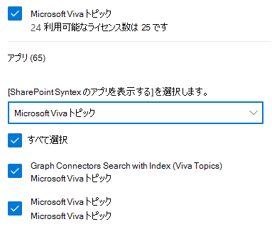
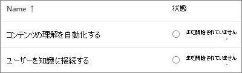
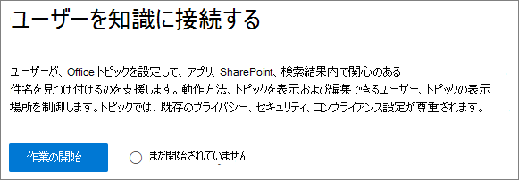
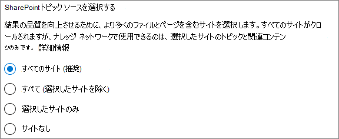
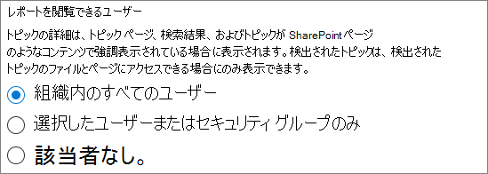
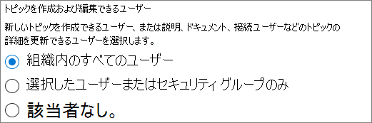
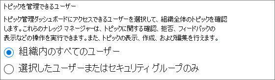
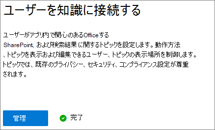

# 設定Microsoft Viva トピック

[トピック] セクションを使用Microsoft 365 管理センタートピックを設定および構成[できます](topic-experiences-overview.md)。 

環境内でトピックをセットアップおよび構成する最善の方法を計画することが重要です。 この記事の手順[を開始する前Microsoft Viva トピック](plan-topic-experiences.md)を必ずお読みください。

ビバ トピックに[アクセスして](https://www.microsoft.com/microsoft-viva/topics)トピックを設定するには、ビバ トピックにサブスクライブし、グローバル管理者または管理者SharePoint Microsoft 365 管理センター管理者である必要があります。

> [!IMPORTANT]
> 管理対象デバイスを要求SharePoint構成[している](/sharepoint/control-access-from-unmanaged-devices)場合は、管理対象デバイスから Topics を設定する必要があります。

## ビデオ デモンストレーション

このビデオでは、トピックを設定するプロセスをMicrosoft 365。

 

> [!VIDEO https://www.microsoft.com/videoplayer/embed/RE4Li0E]  

 

## ライセンスを割り当てる

トピックを使用するユーザーにライセンスを割り当てる必要があります。 ライセンスのあるユーザーのみが、ハイライト、トピック カード、トピック ページ、トピック センターなどのトピックの情報を見ることができます。 

ライセンスを割り当てる

1. Microsoft 365 管理センターで、**[ユーザー** ]、[**アクティブなユーザー**]の順にクリックします。

2. ライセンスを取得するユーザーを選択し、[ライセンスとアプリ] **をクリックします**。

3. [ライセンス **] で**、[ビバ トピック] **を選択します**。

4. [**アプリ]** で、[コネクタGraphインデックス付き検索 **(Viva Topics)** と **Viva Topics** の両方が選択されている必要があります。

   > [!div class="mx-imgBorder"]
   > 

5. **[変更の保存]** をクリックします。

ライセンスが割り当てられた後、ユーザーがトピックにアクセスするには、最大で 1 時間かかる場合があります。

## トピックを設定する

> [!Note]
> 初めてトピックの検出を有効にすると、[トピックの管理] ビューに提案されているトピックすべてが表示されるまで最大 2 週間かかる場合があります。 トピックの検出は、コンテンツの新しいコンテンツまたは更新が行われた後も継続されます。 Viva トピックが新しい情報を評価するため、組織内でのおすすめのトピック数が変動するのは普通のことです。

トピックを設定するには
1. [ファイル] [Microsoft 365 管理センター**セットアップ**] を選択し、[ファイルとコンテンツ]**セクションを表示** します。
2. [ファイルと **コンテンツ] セクションで**、[ユーザーに **Connect] をクリックします**。

     

3. [ユーザー **をConnect] ページで**、[スタート]**を** クリックしてセットアップ プロセスを説明します。

     

4. [ビバ **トピックの検索方法の選択] ページ** で、トピックの検出を構成します。 [トピック **ソースSharePoint選択**] セクションで、検出時にトピックSharePointとしてクロールするサイトを選択します。 次から選択します。
    - **すべてのサイト**: 組織内のすべての SharePoint サイト。 これには、現在と今後のサイトが含まれます。
    - **[すべて] (選択したサイトを** 除く): 除外するサイトの名前を入力します。  検出からオプトアウトするサイトの一覧をアップロードできます。 今後作成されるサイトは、トピック検出のソースとして含まれます。 
    - **選択したサイトのみ**: 含めるサイトの名前を入力します。 サイトのリストをアップロードできます。 今後作成されるサイトは、トピック検出のソースとして含められません。
    - **サイトなし**: SharePoint サイトを含めない。

     
   
5. [名前 **でトピックを除外する** ] セクションで、トピックの検出から除外するトピックの名前を追加できます。 機密情報がトピックとして含まれるのを防ぐには、この設定を使用します。 以下のオプションがあります:
    - **トピックを除外しない** 
    - **トピックを名前で除外する**

     

    (ナレッジ マネージャーは、検出後にトピック センターのトピックを除外できます)。

    #### トピックを名前で除外する方法    

    トピックを除外する必要がある場合は、[名前でトピックを除外する] を選択した後、.csv テンプレートをダウンロードし、検出結果から除外するトピックの一覧で更新します。

     

    CSV テンプレートで、除外するトピックに関する次の情報を入力します。

    - **Name**: 除外するトピックの名前を入力します。 これを行うには次に示す 2 つの方法があります。
        - 完全一致: 正確な名前または頭字語 (Contoso や ATL *など)**を含めできます*。
        - 部分一致: 特定の単語が含まれていますすべてのトピックを除外できます。  たとえば、*円弧は、* アーク円、プラズマアーク溶接、トレーニングアークなど、アークという単語を含むすべてのトピック *を除外します*。テキストが単語の一部として含まれているトピック (Architecture など) は除外されない点に *注意してください*。
    - **略語 (省略可能)**: 頭字語を除外する場合は、頭字語の略語を入力します。
    - **MatchType-Exact/Partial**: 入力した名前が完全一致型か部分一致型 *かを入力します*。

    ファイルを完了して保存したら、[参照] を.csv検索して選択します。
    
    [**次へ**] を選択します。

6. このページ **Whoトピックを表示し、** どこでトピックを表示できるのかページで、トピックの表示を構成します。 [トピック **Who** 表示] の設定で、強調表示されているトピック、トピック カード、検索のトピック回答、トピック ページなど、トピックの詳細にアクセスできるユーザーを選択します。 次のオプションを選択できます:
    - **組織内のすべてのユーザー**
    - **選択したユーザーまたはセキュリティ グループのみ**
    - **だれも**

      

    > [!Note] 
    > この設定では組織内の任意のユーザーを選択することができますが、トピック エクスペリエンス ライセンスが割り当てられているユーザーだけがトピックを表示できます。

7. [トピック **管理のアクセス許可] ページ** で、トピックを作成、編集、または管理できるユーザーを選択します。 [トピックを **Who編集できる]** セクションで、次の項目を選択できます。
    - **組織内のすべてのユーザー**
    - **選択したユーザーまたはセキュリティ グループのみ**
    - **だれも**

     

8. [トピックWho **管理する] セクションで**、次の項目を選択できます。
    - **組織内のすべてのユーザー**
    - **選択したユーザーまたはセキュリティ グループのみ**

     

    [**次へ**] を選択します。

9. [トピック **センターの作成** ] ページで、トピック ページを表示し、トピックを管理できるトピック センター サイトを作成できます。 [サイト **名] ボックス** に、トピック センターの名前を入力します。 URL を変更する場合は、鉛筆アイコンをクリックできます。 必要に応じて、[説明] ボックスに短い説明 **を入力** します。 

   > [!Important]
   > 後でサイト名を変更できますが、ウィザードの完了後は URL を変更できます。

   [**次へ**] を選択します。

     

10. [ **確認と完了**] ページで、選択した設定を確認して、変更を行うことができます。 選択内容に問題がない場合は、[**ライセンス認証**]を行います。

11. [ **ビバ トピック] が** アクティブ化されたページが表示され、選択したサイトのトピックの分析が開始され、トピック センター サイトが作成されます。 [**完了**] を選択します。

12. ユーザーからナレッジ ページにConnect **返** されます。 このページでは、[ **管理** ] を選択して、構成設定に変更を加えることができます。 

        

## トピック エクスペリエンスの管理

トピックの設定が完了したら、セットアップ時に選択した設定を [トピック] で変更[Microsoft 365 管理センター。](https://admin.microsoft.com/AdminPortal#/featureexplorer/csi/KnowledgeManagement) 次の参考資料を参照してください:

- [トピックの検出を管理Microsoft Viva トピック](topic-experiences-discovery.md)
- [トピックの表示を管理Microsoft Viva トピック](topic-experiences-knowledge-rules.md)
- [トピックのアクセス許可を管理Microsoft Viva トピック](topic-experiences-user-permissions.md)
- [トピック センターの名前を変更Microsoft Viva トピック](topic-experiences-administration.md)

## 関連項目

[トピック エクスペリエンスの概要](topic-experiences-overview.md)
