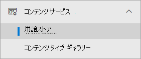
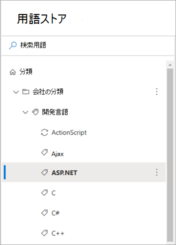
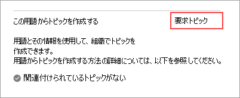
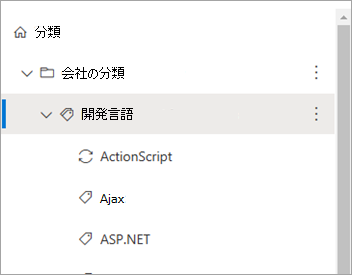
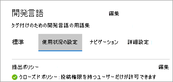
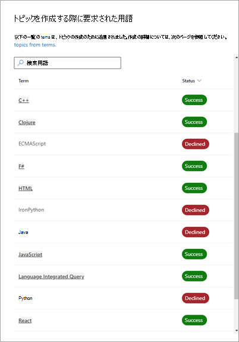

# 分類用語SharePoint使用して、分類用語でトピックを作成Microsoft Viva トピック

> [!Note] 
> この機能は、現在、早期導入プログラムに参加している参加者にのみ利用できます。 この機能は、後日世界中のユーザーが利用できます。

分類用語をSharePointして、人工知能 (AI) を使用して、ビバ トピックのトピックを作成できます。 分類SharePointサービスは、すべてのサイトで利用できるグローバルな用語を提供します。 ユーザーは、用語として表される概念に対応するトピックを作成できます。 

これらのタスクの実行に使用するグローバル用語に対する編集権限が必要です。

<!---
> [!Note]
> This feature is available only for users who are licensed for Viva Topics.
--->

## しくみ

用語からトピックの作成を要求すると、分類サービスは用語に関する情報を、対応するトピックの作成のためにビバ トピックに中継します。 この情報には、次の情報が含まれます。

- 名前 (既定のラベル)
- 類義語
- 説明
- 用語でタグ付けされたファイル

作成されるトピックは、用語の元の名前を使用し、同義語をトピックの代替名と見なし、トピックの説明の用語の説明を使用します。 分類用語でタグ付けされたファイルは、トピックの "推奨" ファイルと見なされます。 その後、AI はトピックの追加コンテンツを引き続き検出します。

> [!Note]
> トピックの作成が成功するには、分類用語に少なくとも 1 つのファイルがタグ付けされている必要があります。 要求が行わない場合、システムは要求を拒否します。

用語からトピックを作成すると、用語は引き続き用語ストアSharePoint存在し、トピックの作成の影響を受けません。 引き続き、リストとライブラリのSharePoint使用できます。

用語が削除された場合、削除してもトピックは自動的に削除されません。 ビバ トピックが、用語とそのタグ付きコンテンツからのみではないトピックに関連するコンテンツを識別する場合、トピックは引き続き存在します。

用語の既定のラベルまたは説明が変更された場合、Viva Topics は変更を評価し、変更が適切と判断された場合はトピック情報を更新します。 用語でタグ付けされたコンテンツも、定期的にビバ トピックに渡されます。 用語にタグ付けされたコンテンツが存在しなくなった場合に、そのトピックに関連付けられている他のコンテンツがビバ トピックで識別されていない場合は、トピックが削除される可能性があります。

トピックの更新は、元の用語には影響を与えかねない。

## トピック作成要求の開始

1 つの用語セットで 1 つの用語または複数の用語を要求できます。 トピック作成要求は、モダン 用語ストアSharePoint開始します。 用語セットを編集できるユーザーには、要求を開始するアクセス許可があります。 これらのユーザーには、用語ストア管理者、グループ 管理者、および投稿者が含まれます。

### 1 つの用語を要求する

1. 管理センター SharePoint左側のナビゲーションで、[用語ストア]**を選択します**。

     

2. [用語 **ストア] ページ** で、使用する用語を検索して選択します。

    

3. 用語ページで、[使用状況の設定] **タブを選択** します。

    ![管理センターの用語ページの [利用状況の設定] タブSharePoint単一の用語を示すスクリーンショットです。](../media/knowledge-management/taxonomy-single-term-03.png)

4. [この用語 **からトピックを作成する] セクションで、[** 要求] **トピックを選択します**。

    

### 用語セットで複数の用語を要求する

1. 管理センター SharePoint左側のナビゲーションで、[用語ストア]**を選択します**。

     

2. [用語 **ストア] ページ** で、使用する用語セットを検索して選択します。

    

3. 用語ページで、[使用状況の設定] **タブを選択** します。

    

4. [用語から **トピックを作成する] セクションで** 、[開始する] **を選択します**。 過去に要求を発生した場合、表示されるオプションは [作成用の用語の作成 **] です**。

    ![複数の用語の管理センターの [用語からトピックSharePoint要求する] セクションを示すスクリーンショット。](../media/knowledge-management/taxonomy-multi-term-04-new-set.png)

    [用語から **トピックを作成する] セクションで** 、[トピックの要求 **] を選択します**。

    ![複数の用語の管理センターの [この用語からトピックSharePointを作成する] ページを示すスクリーンショット。](../media/knowledge-management/taxonomy-multi-term-04-existing-set.png)

    1. [トピックを **作成する用語の選択]** ページで、この用語セット内の用語の階層を選択できます。

        ![複数の用語の管理センターで [トピックを作成するための用語SharePointを選択する] パネルを示すスクリーンショット。](../media/knowledge-management/taxonomy-multi-term-04a.png)

    2. 特定の用語を選択するには、各用語を個別に選択します。

    3. 階層内のノードのすべての即時子を選択することもできます。 

5. トピックを作成する用語を選択した後、[送信] を **選択します**。

    Viva Topics は要求を作成し、処理するキューに入れられます。 Viva Topics は、用語とその関連リソースを評価し、新しいトピックまたは既存のトピックとの結合を作成します。 最初の要求の後、トピックは 24 時間以内に作成されます。

## トピック作成要求の状態を表示する

分類用語からのトピック作成の要求は、要求、成功、または拒否の 3 つの状態に分類されます。

- **Request** – 要求がキューに入れ、サービスが必要なすべての用語情報を収集中です。 新しい要求は、2 つの最終状態の 1 つに移動する前に、数時間要求された状態に残る可能性があります。

- **成功** – 要求が必要なすべての用語情報を含むビバ トピックに正常に中継されたことを示します。 Viva Topics は、次の 24 時間以内に対応するトピックを作成します。

- **[拒否** ] – 用語にタグ付けされたファイルが一切ないので、要求を処理できないかどうかを示します。 要求が成功するためには、少なくとも 1 つのファイルがタグ付けされている必要があります。 後でファイルに用語のタグが付いた場合は、用語の新しい要求を手動で作成できます。

用語ストアでは、次の方法で要求の状態を表示できます。

- 個々の用語に行く。
- 特定の用語セットのすべての要求を表示する。

### 1 つの用語の状態を表示する

1. [用語 **ストア] ページ** で、状態を表示する用語を検索して選択します。

    ![単一の用語の状態を表示するSharePoint管理センターの [用語ストア] ページに用語の一覧を示すスクリーンショット。](../media/knowledge-management/taxonomy-status-single-term-01.png)

2. 用語ページで、[使用状況の設定] **タブを選択** します。

    ![単一の用語の状態を表示する管理センター SharePointの用語ページの [利用状況の設定] タブを示すスクリーンショット。](../media/knowledge-management/taxonomy-status-single-term-02.png)

3. [この **用語からトピックを作成する** ] セクションで、要求の状態を表示します。

    ![[この用語からトピックを作成する] ページと、1 つの用語の状態を表示SharePoint管理センターの要求状態を示すスクリーンショット。](../media/knowledge-management/taxonomy-status-single-term-03.png)

### 用語セット内の複数の用語の状態を表示する

1. [用語 **ストア] ページ** で、状態を表示する用語セットを検索して選択します。

    ![複数の用語の状態を表示するSharePoint管理センターの [用語ストア] ページに用語セットを示すスクリーンショット。](../media/knowledge-management/taxonomy-status-multi-term-01.png)

2. 用語ページで、[使用状況の設定] **タブを選択** します。

    ![複数の用語の状態を表示する管理センターの [利用状況の設定] タブと [用語SharePointトピックの作成] セクションを示すスクリーンショット。](../media/knowledge-management/taxonomy-status-multi-term-02.png)

    [用語 **からトピックを作成** する] セクションでは、要求の総数、トピックにリンクされている数、および拒否された数を確認できます。

3. [すべての **要求を表示する] を選択します**。

4. [すべての **要求されたトピック作成用語] パネルで** 、用語要求の状態を表示します。

    

5. 多数の要求がある場合は、[もっと読み込む] **を** 選択して、追加のアイテムを読み込み続ける必要があります。

    ![複数の用語の状態を表示SharePoint管理センターの [その他の読み込み] オプションを示すスクリーンショット。](../media/knowledge-management/taxonomy-status-multi-term-05.png)

6. 特定の状態にある要求を確認するには、[状態] 列で、[フィルター]**を選択します**。

    ![複数の用語の状態を表示SharePoint管理センターの [状態とフィルター] オプションを示すスクリーンショット。](../media/knowledge-management/taxonomy-status-multi-term-06a.png)

     フィルター処理する状態を [拒否済み **]、[成功]、** または [ **要求済み**] で選択 **します**。

    ![複数の用語の状態を表示するためのSharePoint管理センターの [状態によるフィルター] オプションを示すスクリーンショット。](../media/knowledge-management/taxonomy-status-multi-term-06b.png)

<!---

## Identify topics created from terms (feature not ready yet)

After Viva Topics processes a request and creates a topic, you can see a topic card when you hover over a term name in the list of requests for the term set.

    

Also, if you go to individual terms, and select the **Usage settings** tab, the **Create topic from this term** section shows a topic card when you hover over the name.

    

Topic pages also indicate that the taxonomy is one of the sources for the topic.

**--Insert screenshot from final UX - source string in topic page--**

--->
