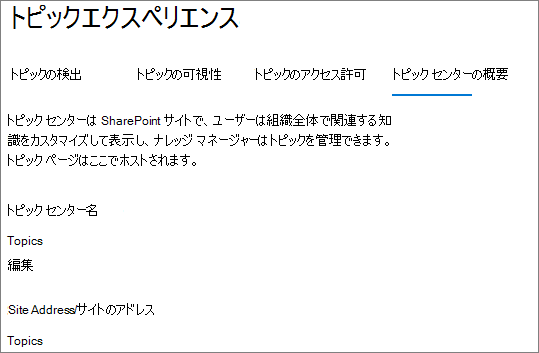
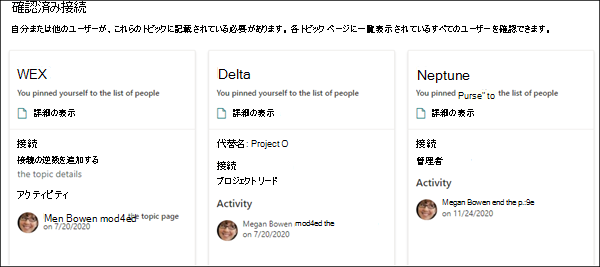

# トピック センターの概要 (Microsoft Viva トピック

このMicrosoft Viva トピックトピック センターは、組織SharePoint知識の中心として役立つ最新のサイトです。 このファイルは、ビバ[トピックのセットアップ中に](set-up-topic-experiences.md)作成Microsoft 365 管理センター。

トピック センターには、ライセンスを取得したユーザー全員が、接続先のトピックを表示できる Topics Web パーツを含む既定のホーム ページがあります。

トピックを表示できるライセンスを持つすべてのユーザーがトピック センターにアクセスできる一方で、ナレッジ マネージャーは [トピックの管理] ページを使用してトピック **を管理** することもできます。 [ **トピックの管理]** タブは、[トピックの管理] アクセス許可を持つユーザーにのみ表示されます。

## トピック センターの場所

トピック センターは、Viva Topics のセットアップ中に作成されます。 セットアップが完了すると、管理者は [トピック センターの管理] ページで URL [を検索できます](./topic-experiences-administration.md#to-access-topics-management-settings)。

1. [組織の設定Microsoft 365 管理センター] を選択 **設定、[** 組織の設定]**を選択します**。
2. [サービス] **タブで** 、[トピック エクスペリエンス] **を選択します**。

    

3. [トピック センター **] タブを選択** します。[ **サイト アドレス]** の下にトピック センターへのリンクがあります。

    

## ホーム ページ

 

> [!VIDEO https://www.microsoft.com/videoplayer/embed/RE4LAhZ]

 

トピック センターのホーム ページでは、接続している組織のトピックを確認できます。

- 推奨される接続 - [これらのトピックに関して一覧表示しました] の下に **トピックが表示されます。正しいと思いましたか?** これらは、トピックへの接続が AI を介して提案されているトピックです。 たとえば、関連するファイルまたはサイトの作成者である可能性があります。 トピックの関連人物としてリストを表示する必要がある場合は、確認を求めるメッセージが表示されます。

   

- 確認済み接続 - トピック ページにピン留めされているトピック、またはトピックへの推奨される接続を確認したトピックです。 推奨される接続を確認すると、トピックが [推奨] セクションから [確認済み] セクションに移動します。

   

ユーザーがトピックへの接続を確認すると、ユーザーはトピック ページを編集して接続を管理できます。 たとえば、トピックへの接続に関する詳細を提供できます。

## [トピックの管理] ページ

トピック センターの [トピック **の管理]** ページで作業するには、ナレッジ マネージャーの役割に必要な [トピックの管理] アクセス許可が必要です。 管理者は[、Viva Topics](set-up-topic-experiences.md)のセットアップ中にこれらのアクセス許可をユーザーに割り当て、新しいユーザーを管理者が後で追加Microsoft 365 管理センター。

[トピック **の管理]** ページで、トピック ダッシュボードには、指定したソースの場所から識別された、アクセス権を持つすべてのトピックが表示されます。 各トピックには、トピックが検出された日付が表示されます。 [トピックの管理] アクセス許可が割り当てられたユーザーは、未確認のトピックを確認し、次の項目を選択できます。

- トピックを確認する: AI が推奨するトピックが人間のキュレーターによって検証されたことをユーザーに示します。

- トピックを発行する: トピック情報を編集して、最初に特定されたトピックの品質を向上し、トピックへのビュー アクセス権を持つすべてのユーザーにトピックを強調表示します。

- トピックを削除する: トピックをエンド ユーザーに検出不可にする。 トピックは [削除済み] **タブに移動** され、必要に応じて後で確認できます。

トピックの管理ページでトピックを管理する方法の詳細 **については、「トピック** の管理」 [を参照してください](manage-topics.md)。

## トピックを作成または編集する

[トピックの作成と編集] 権限がある場合は、次の方法を実行できます。

- [既存のトピックを編集](edit-a-topic.md)する : 検出によって作成された既存のトピック ページを変更できます。

- [新しいトピックを作成](create-a-topic.md)する: 検出によって見つからなかったトピック、または AI ツールがトピックを作成するのに十分な証拠を見つけなかった場合に、新しいトピックを作成できます。

## 関連項目

[トピック センターでトピックを管理する](manage-topics.md)
