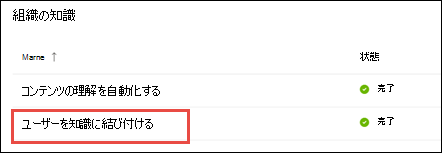

# トピックセンターの概要 (プレビュー)Topic center overview (Preview)

> [!Note] 
> この記事の内容は、Project Cortex のプライベートプレビュー用です。The content in this article is for Project Cortex Private Preview. [Project Cortexについてもっと理解しよう](https://aka.ms/projectcortex)[Find out more about Project Cortex](https://aka.ms/projectcortex).

トピックセンターは、組織のナレッジセンターとして機能する最新の SharePoint サイトです。The topic center is a Modern SharePoint site that serves as a center of knowledge for your organization. これは、Microsoft 365 管理センターの [ナレッジマネージメントのセットアップ](set-up-topic-experiences.md) 時に作成されます。It is created during [Knowledge Management setup](set-up-topic-experiences.md) in the Microsoft 365 admin center.

トピックセンターには、接続されている、または接続が提案されているトピックを確認できる既定のホームページがあります。The topic center has a default home page where you can see the topics to which you have been connected or suggested to be connected. 適切なアクセス許可を持つユーザーも、次のことを行うことができます。Users with the proper permissions can also:

- 新しいトピックページを作成するCreate a new topic page
- 提案されたトピックを確認または拒否するConfirm or reject suggested topics
- トピックページに対する変更を編集して発行するEdit and publish changes to a topic page

> [!Note] 
> 作業の各タスクの詳細については [、トピックセンターのトピックを](work-with-topics.md)参照してください。You can learn more about each task in [Work with topics in the topic center](work-with-topics.md).

## トピックセンターの場所Where is the topic center

トピックセンターは、ナレッジ管理のセットアップ時に作成されます。Your topic center is created during Knowledge Management setup. セットアップが完了すると、管理者は [ [ナレッジセンターの管理] ページ](topic-experiences-discovery.md)で URL を見つけることができます。After setup completes, an admin can find the URL on the [knowledge center management page](topic-experiences-discovery.md).

1. Microsoft 365 管理センターで、ナビゲーションウィンドウの [ **設定** ] を選択し、[ **組織ナレッジ** ] セクションで、[ **ユーザーをナレッジに接続する** ] を選択します。In the Microsoft 365 admin center, select **Setup** in the navigation pane, and in the **Organizational Knowledge** section, select **Connect people to knowledge**.

     

2. [ **ユーザーをナレッジに接続** ] ページの [ **概要** ] セクションで、「サイト URL の **トピックセンターアドレス** 」を参照してください。On the **Connect people to knowledge** page, in the **At a glance** section, see **Topic center address** for the site URL.

## ホーム ページHome page

トピックセンターを表示するには、トピックとトピックのエクスペリエンスを表示するためのアクセス許可を持っている必要があります。To see the topic center, you need to have permissions to view topics and the topic experiences. 管理者は、 [ナレッジマネージメントのセットアップ](set-up-topic-experiences.md)中にこれらのアクセス許可をユーザーに割り当てることができます。または、管理者が Microsoft 365 管理センターを使用して、新しいユーザーを [追加](give-user-permissions-to-the-topic-center.md) することもできます。Your admin can assign these permissions to users during [knowledge management setup](set-up-topic-experiences.md), or new users can be [added afterwards](give-user-permissions-to-the-topic-center.md) by an admin through the Microsoft 365 admin center.

[ホーム] ページOn the home page 
- **トピックを表示** する: トピックの表示エクスペリエンス。**View topics** : view topic experiences. そのため、組織内のトピックを参照し、接続されているトピックについてのフィードバックを提供できます。So you can see topics in the organization and give feedback on topics where you have been connected:
1. 推奨される接続。ここでは、接続が推奨されるトピックについて説明します。Suggested connections - these are topics where my connection has been suggested
2. 確認済み接続-提案された接続を確認したときに、「推奨事項」セクションから「接続を確認しました」というトピックにピン留めしたトピックがあります。Confirmed connections - these are topics where I am pinned on the topic or I've confirmed my connection Topics will move from the suggested to confirmed section when I confirm a suggested connection.
ピン留めすると、トピックページへの編集を行い、接続を設定することができます。Once I'm pinned, edits to the topic page can be done to curate my connection.

- **トピックを作成および編集** する: 新しいトピックを使用して、ページを編集できます。**Create and edit topics** : New topic is available and you can edit pages

## トピックの管理機能のトピックセンターを使用するためのアクセス許可Permissions to use the Manage Topics capability topic center

トピックセンターの [トピックの管理] セクションで作業するには、必要なアクセス許可を持っている必要があります。To work in the Manage Topics section of topic center, you need to have the required permissions. 管理者は、 [ナレッジマネージメントのセットアップ](set-up-topic-experiences.md)中にこれらのアクセス許可をユーザーに割り当てることができます。または、管理者が Microsoft 365 管理センターを使用して、新しいユーザーを [追加](give-user-permissions-to-the-topic-center.md) することもできます。Your admin can assign these permissions to users during [knowledge management setup](set-up-topic-experiences.md), or new users can be [added afterwards](give-user-permissions-to-the-topic-center.md) by an admin through the Microsoft 365 admin center.

トピックセンターのユーザーには、次の2つのアクセス許可のセットを与えることができます。Topic center users can be given two sets of permissions:

- **トピックの管理** : トピックダッシュボードを使用して、組織全体のトピックを確認します。**Manage topics** : Use the topic dashboard to review topics across the organization. ユーザーは未確認のトピックを確認して拒否するなどの操作を実行できます。Users can perform actions such as confirming and rejecting unconfirmed topics.

ユーザーには、両方のアクセス許可のセットを与えることも、必要に応じて1つだけを指定することもできます。A user can be given both sets of permissions, or only one if needed. 

## トピックダッシュボードのトピックを確認するReviewing topics in the topic dashboard

トピックダッシュボードには、指定したソースの場所からマイニングされたトピックが表示されます。The topic dashboard shows topics that were mined from your specified source locations. 各トピックには、トピックが検出された日付と、フィードバックが提供されているかどうかが表示されます。Each topic will show the date the topic was discovered and if any feedback has been provided on it. **トピックの管理** のアクセス許可が割り当てられているユーザーは、未確認のトピックを確認して、次のことを選択できます。A user who was assigned **Manage topics** permissions can review the unconfirmed topics and choose to:
- トピック「アクセス権を持つユーザーに対してトピックを強調表示し、関連するトピックカードとトピックページを表示する」を確認します。Confirm the topic: Highlights the topic to users who have access and lets them see the associated topic card and topic page.
- トピックを拒否する: ユーザーがトピックを使用できなくなります。Reject the topic: Makes the topic not available to users. トピックが [ **拒否** ] タブに移動され、必要に応じて後で確認できるようになります。The topic is moved to the **Rejected** tab and can be confirmed later if needed.

## トピックを作成または編集するCreate or edit a topic

**トピックの作成と編集** のアクセス許可がある場合は、次のいずれかを選択できます。If you have **Create and edit topics** permissions, you can choose to:

- 既存のトピックを編集する: 検出によって作成された既存のトピックページに変更を加えることができます。Edit existing topics: You can make changes to existing topic pages that were created through discovery.
- 新しいトピックの作成: 検出によって検出されなかったものに対して新しいトピックを作成できます。または、AI ツールがトピックを作成するのに十分な証拠を見つけられなかった場合。Create new topics: You can create new topics for ones that were not found through discovery, or if AI tools did not find enough evidence to create a topic.

## 関連項目See also

  

