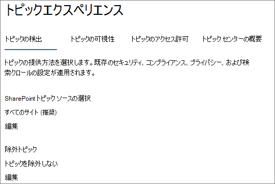
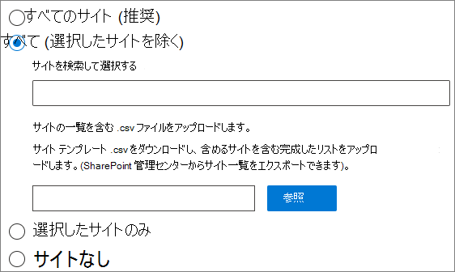
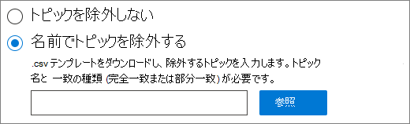

# <a name="manage-topic-discovery-in-microsoft-viva-topics"></a>トピックの検出を管理Microsoft Viva トピック

トピック検出の設定は、次のページ[でMicrosoft 365 管理センター。](https://admin.microsoft.com) これらのタスクを実行するには、グローバル管理者SharePoint管理者である必要があります。

## <a name="to-access-topics-management-settings"></a>トピック管理設定にアクセスするには:

1. [組織] Microsoft 365 管理センター、[組織の **設定]****の順にクリックします**。
2. [サービス] **タブで** 、[トピック エクスペリエンス] **をクリックします**。

     

3. [トピックの **検出] タブを** 選択します。各設定の詳細については、以下のセクションを参照してください。

     

## <a name="select-sharepoint-topic-sources"></a>トピックSharePointを選択する

トピックのクロールSharePoint組織のサイトを変更できます。

サイトの特定のリストを含めるか除外する場合は、次のテンプレートを使用.csvできます。

``` csv
Site name,URL
```

サイト ピッカーを使用してサイトを追加すると、サイトの既存のリストに追加され、含めるまたは除外することができます。 .csv ファイルをアップロードすると、既存のリストが上書きされます。 特定のサイトを以前に含めるか除外した場合は、リストを .csv ファイルとしてダウンロードし、変更を加え、新しいリストをアップロードします。

トピック検出用のサイトを選択するには

1. **[トピック検出]** タブの **[SharePoint トピック ソースの選択]** で、**[編集]** を選択します。
2. [トピック **ソースSharePoint選択**] ページで、検出中にトピックSharePointとしてクロールするサイトを選択します。 これには、次の内容が含まれます。
    - **すべてのサイト**: テナントSharePointサイトのすべてのサイト。 これにより、現在および将来のサイトがキャプチャされます。
    - **[すべて] (選択したサイトを** 除く): 除外するサイトの名前を入力します。  検出からオプトアウトするサイトの一覧をアップロードできます。 今後作成されるサイトは、トピック検出のソースとして含められます。 
    - **選択したサイトのみ**: 含めるサイトの名前を入力します。 サイトのリストをアップロードできます。 今後作成されるサイトは、トピック検出のソースとして含められません。
    - **サイトなし**: トピックは自動的に生成または更新され、コンテンツSharePointされません。 既存のトピックはトピック センターに残ります。

    
   
3. **[保存]** をクリックします。

## <a name="exclude-topics-by-name"></a>トピックを名前で除外する

.csv ファイルのリストをアップロードすることで、検出からトピックを除外することができます。 トピックを以前に除外した場合は、.csv をダウンロードし、変更を加え、もう一度アップロードできます。

1. **[トピックの検出]** タブの **[トピックの除外]** で、**[編集]** を選択します。
2. [名前 **でトピックを除外する] をクリックします**。
3. リストを作成する必要がある場合は、.csvテンプレートをダウンロードし、除外するトピックを追加します (以下の「.csv *を使用する」を参照* してください)。 ファイルの準備ができたら、[参照] を **クリックして** ファイルをアップロードします。 既存のリストがある場合は、リストを含む.csvダウンロードできます。
4. **[保存]** をクリックします。

    

### <a name="working-with-the-csv-template"></a>テンプレートの操作.csvする

csv テンプレートは、以下にコピーできます。

``` csv
Name (required),Expansion,MatchType- Exact/Partial (required)
```

CSV テンプレートで、除外するトピックに関する次の情報を入力します。

- **Name**: 除外するトピックの名前を入力します。 これを行うには次に示す 2 つの方法があります。
    - 完全一致: 厳密な名前または頭字語 *(Contoso* や ATL など) を *除外できます*。
    - 部分一致: 特定の単語が含まれていますすべてのトピックを除外できます。  たとえば、*円弧は、* アーク円、プラズマアーク溶接、トレーニングアークなど、アークという単語を含むすべてのトピック *を除外します*。テキストが単語の一部として含まれているトピック (Architecture など) は除外されない点に *注意してください*。
- **略語 (省略可能)**: 頭字語を除外する場合は、頭字語の略語を入力します。
- **MatchType-Exact/Partial**: 入力した名前が完全一致型か部分一致型 *かを入力します*。

     

## <a name="see-also"></a>関連項目

[トピックの表示を管理Microsoft 365](topic-experiences-knowledge-rules.md)

[トピックのアクセス許可を管理Microsoft 365](topic-experiences-user-permissions.md)

[トピック センターの名前を変更Microsoft 365](topic-experiences-administration.md)
