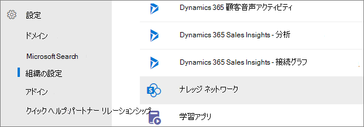
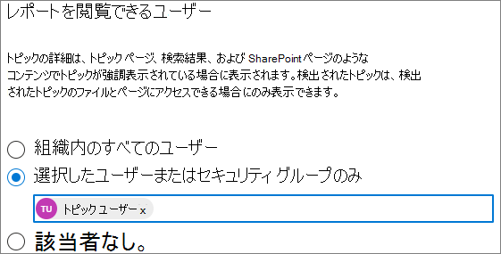

# トピックの表示を管理Microsoft Viva トピック

トピックのハイライト、トピック カード、トピック センターを表示できるユーザーは、このページで管理[Microsoft 365 管理センター。](https://admin.microsoft.com) これらのタスクを実行するには、グローバル管理者または管理者SharePointグループ管理者である必要があります。

## トピック管理設定にアクセスするには:

1. [組織] Microsoft 365 管理センター、[組織の **設定]****の順にクリックします**。
2. [サービス] **タブで** 、[トピック エクスペリエンス] **をクリックします**。

     

3. [トピックの **表示] タブを選択** します。各設定の詳細については、以下のセクションを参照してください。

     

##  組織内のトピックを表示できるユーザーを変更する

組織内のトピックを表示できるユーザーを変更できます。

1. [トピックの **表示] タブの**[トピックWho表示]**の下にある [** 編集] を **選択します**。
2. [トピック **Who** ページで、強調表示されているトピック、トピック カード、検索のトピック回答、トピック ページなど、トピックの詳細にアクセスできるユーザーを選択します。 次のものが選択できます。
    - **組織内のすべてのユーザー**
    - **選択したユーザーまたはセキュリティ グループのみ**
    - **だれも**

     

3. **[保存]** を選択します。  
 
> [!Note] 
> この設定では組織内の任意のユーザーを選択することができますが、トピック エクスペリエンス ライセンスが割り当てられているユーザーだけがトピックを表示できます。

## 関連項目

[トピックの検出を管理Microsoft Viva トピック](topic-experiences-discovery.md)

[トピックのアクセス許可を管理Microsoft Viva トピック](topic-experiences-user-permissions.md)

[トピック センターの名前を変更Microsoft Viva トピック](topic-experiences-administration.md)

