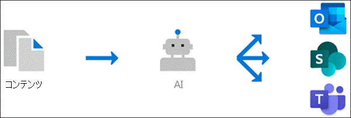

# トピック エクスペリエンスの概要 (プレビュー)

> [!Note] 
> この記事の内容は、Project の Private Preview 用です。 [Project Cortexについてもっと理解しよう](https://aka.ms/projectcortex)

トピック エクスペリエンスでは、Microsoft AI テクノロジ、Microsoft 365、Delve、Microsoft Graph、Search、その他のコンポーネントとサービスを使用して、Microsoft 365 環境でナレッジ ネットワークを構築します。 

      

その目的は、情報を知識に変換し、SharePoint のモダン ページや Microsoft Search など、日常的に使用するアプリでユーザーに提供します。

トピック エクスペリエンスは、多くの企業で重要なビジネス上の問題に対処するのに役立ちます。ユーザーは必要なときに情報を提供します。 たとえば、新入社員は多くの新しい情報をすばやく学習し、会社の情報を読むときに何も知らない用語に遭遇する必要があります。 詳細を確認するために、ユーザーは自分の活動から離れて、用語の内容、組織内の誰が対象分野の専門家か、その用語に関連するサイトやドキュメントなどの詳細を検索するために貴重な時間を費やす必要がある場合があります。

トピック エクスペリエンスでは、AI を使用して、組織内のトピックを自動的 **に** 検索して識別します。 簡単な説明、トピックの対象分野の専門家、関連するサイト、ファイル、ページなど、ユーザーに関する情報をまとめる。 ナレッジ マネージャーまたは投稿者は、必要に応じてトピック情報を更新できます。 トピックはユーザーが利用できます。つまり、最新の SharePoint サイトにニュースやページで表示されるトピックのすべてのインスタンスで、テキストが強調表示されます。 ユーザーは、トピックを選択してトピックの詳細を確認できます。 トピックは、SharePoint 検索でも確認できます。

## ユーザーに対するトピックの表示方法

トピックが SharePoint のニュースやページのコンテンツに記載されている場合、強調表示されます。 トピックの概要は、強調表示から開きます。 概要のタイトルからトピックの詳細を開きます。 このトピックは、自動的に識別するか、ページ作成者が直接参照してページに追加できます。 

      

## ナレッジ インデックス作成

トピック エクスペリエンスでは、Microsoft AIテクノロジを使用して、Microsoft 365 環境内のトピックを特定します。

トピックとは、組織的に重要または重要な語句または用語です。 組織に固有の意味を持ち、その意味を理解し、その詳細を見つけるのに役立つリソースが関連付けされています。

トピックが特定され、推奨されるトピックに十分な情報が含まれていると AI が判断すると、トピックページが作成されます。このページには、次のようなトピックのインデックス作成によって収集された情報が含まれるものがあります。

- 代替名または頭字語。
- トピックの簡単な説明。
- トピックに関する知識を持つ可能性があるユーザー。
- トピックに関連するファイル、ページ、およびサイト。

ナレッジ管理者は、テナント内のすべての SharePoint サイトをクロールしてトピックを検索するか、特定の SharePoint サイトを選択するかの選択を選択できます。

## ロール

Microsoft 365 環境でトピック エクスペリエンスを使用する場合、ユーザーには次の役割があります。

- トピック ビューアー: トピックを表示できるユーザーは、少なくとも読み取りアクセス権を持つ SharePoint モダン サイトと Microsoft Search で強調表示されます。 トピックのハイライトを選択して、トピック ページにトピックの詳細を表示できます。 トピック閲覧者は、トピックの役に立つ内容に関するフィードバックを提供できます。

- 共同作成者: 既存のトピックを編集したり、新しいトピックを作成したりする権限を持つユーザー。 ナレッジ管理者は、Microsoft 365 管理センターのトピック エクスペリエンス設定を通じて共同作成者のアクセス許可をユーザーに割り当てる。 また、トピックを編集および作成するアクセス許可をすべてのトピック閲覧者に付与して、表示されるトピックにも投稿できます。

- ナレッジ マネージャー: トピックのライフサイクルを通じてトピックをガイドするユーザー。 ナレッジ マネージャーは、トピック センターの [トピックの管理] ページを使用して、AI が提案するトピックを確認または削除したり、既存のトピックを編集したり、新しいトピックを作成したりします。これらのトピックにアクセスできるユーザーは 1 人のみです。 ナレッジ管理者は、Microsoft 365 管理センターのトピック エクスペリエンスの管理設定を通じて、ナレッジ マネージャーのアクセス許可をユーザーに割り当てる。 

- ナレッジ管理者: ナレッジ管理者は、Microsoft 365 管理センターの管理コントロールを使用してトピックエクスペリエンスをセットアップし、管理します。 現在、Microsoft 365 グローバル管理者または SharePoint 管理者は、ナレッジ管理者として機能できます。

詳細 [については、「トピック エクスペリエンスの役割](topic-experiences-roles.md) 」を参照してください。

## トピック管理

トピック管理は、組織のトピック **センターの** [トピックの管理] ページで **行います**。 トピック センターはセットアップ中に作成され、組織の知識の中心として機能します。 

ライセンスを取得しているすべてのユーザーは、関連付けされているトピックをトピック センターで表示することができますが、トピックの管理権限を持つユーザー (ナレッジ マネージャー) だけが [トピックの管理] ページを表示および使用できます。

ナレッジ マネージャーは、次の方法を使用できます。

- テナントで検出されたトピックを確認または拒否します。
- 必要に応じて手動で新しいトピックを作成します (たとえば、AI を通じて検出するのに十分な情報が提供されていない場合)。
- 既存のトピック ページを編集します。 

詳細 [については、トピック センターの「トピックの管理](manage-topics.md) 」を参照してください。  

## 管理コントロール

Microsoft 365 管理センターの管理コントロールを使用すると、ナレッジ ネットワークを管理できます。 Microsoft 365 グローバル管理者または SharePoint 管理者は、次の機能を使用できます。

- SharePoint のモダン ページまたは SharePoint 検索結果でトピックを表示できる組織内のユーザーを制御します。
- クロールしてトピックを検索する SharePoint サイトを制御します。
- トピックの検出を構成して、特定のトピックが見つからないか除外します。
- トピック センターでトピックを管理できるユーザーを制御します。
- トピック センターでトピックを作成および編集できるユーザーを制御します。
- トピックを表示できるユーザーを制御します。

管理[コントロールの詳細については、「ユーザーアクセス許可の割](https://docs.microsoft.com/microsoft-365/knowledge/plan-topic-experiences#user-permissions)り当て、トピックの表示の管理、トピックの検出の管理」を参照してください。 

## トピックの作成&フィードバック

AI は、環境内で変更が発生した場合にトピックを改善するための提案を提供するために継続的に取り組む必要があります。 

日常の作業でトピックの表示を許可するユーザーは、トピックが役に立ったか尋ねらえる可能性があります。 AI は、これらの応答を見て、トピックの概要とトピックの詳細に表示される内容を判断するのに役立ちます。

トピックを編集または作成する権限を持つユーザーは、修正を行う場合や追加情報を追加する場合は、トピック ページを直接更新できます。 

また、適切なアクセス許可を持つユーザーは、トピックに関連する Yammer 会話などのアイテムにタグを付け、それらを特定のトピックに追加できます。 

## 関連項目

