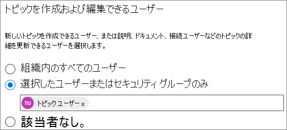
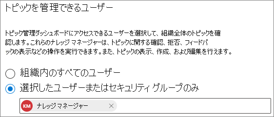

# トピックのアクセス許可を管理Microsoft Viva トピック

トピックのアクセス許可の設定は、次のページ[でMicrosoft 365 管理センター。](https://admin.microsoft.com) これらのタスクを実行するには、グローバル管理者SharePoint管理者である必要があります。

トピックのアクセス許可の設定では、次の項目を選択できます。

- トピックを作成および編集できるユーザー: 検出中に見つからなかった新しいトピックを作成するか、既存のトピックの詳細を編集します。
- トピックを管理できるユーザー: トピック管理センターにアクセスし、トピックに関するフィードバックを表示し、ライフサイクルを通じてトピックを移動します。

## トピック管理設定にアクセスするには:

1. [組織] Microsoft 365 管理センター、[組織の **設定]****の順にクリックします**。
2. [サービス] **タブで** 、[トピック エクスペリエンス] **をクリックします**。

     

3. [トピックの **アクセス許可] タブを選択** します。各設定の詳細については、以下のセクションを参照してください。

     

## トピックの詳細を更新するアクセス許可を持つユーザーを変更する

トピックを作成および編集するアクセス許可を持つユーザーを更新するには、次の方法を実行します。

1. [トピックの **アクセス許可] タブ** の [トピックWho編集できる]**の下** にある [編集] を **選択します**。
2. [トピックを **Who編集できる] ページ** で、次の項目を選択できます。
    - **組織内のすべてのユーザー**
    - **選択したユーザーまたはセキュリティ グループのみ**
    - **だれも**

      

3. **[保存]** を選択します。

トピックを管理するアクセス許可を持つユーザーを更新するには、次の方法を実行します。

1. [トピックの **アクセス許可] タブ** の [トピックWho **管理できる] の下にある [** 編集] を **選択します**。
2. [トピックWho **管理できる] ページで**、次の項目を選択できます。
    - **組織内のすべてのユーザー**
    - **選択したユーザーまたはセキュリティ グループ**

      

3. **[保存]** を選択します。

## 関連項目

[トピックの検出を管理Microsoft Viva トピック](topic-experiences-discovery.md)

[トピックの表示を管理Microsoft Viva トピック](topic-experiences-knowledge-rules.md)

[トピック センターの名前を変更Microsoft Viva トピック](topic-experiences-administration.md)
