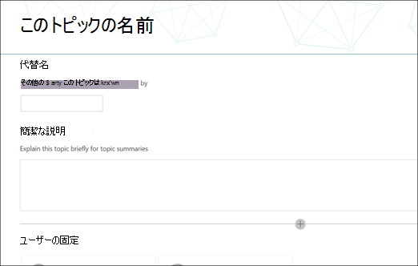
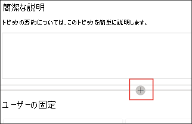

# トピックセンターのトピックを操作する (プレビュー)Work with topics in the topic center (Preview)

> [!Note] 
> この記事の内容は、Project Cortex のプライベートプレビュー用です。The content in this article is for Project Cortex Private Preview. [詳細については、「Project Cortex](https://aka.ms/projectcortex)」を参照してください。[Find out more about Project Cortex](https://aka.ms/projectcortex).

トピックセンターでは、指定した SharePoint ソースの場所でマイニングされ、検出されたトピックを確認または拒否することができます。In the topic center, a knowledge manager can review topics that have been mined and discovered in the SharePoint source locations you specified, and can either confirm or reject them. ナレッジマネージャーは、トピック探索で見つからなかった場合に新しいトピックページを作成して発行したり、更新する必要がある場合は既存のページを編集したりすることもできます。A knowledge manager can also create and publish new topic pages if one was not found in topic discovery, or edit existing ones if they need to be updated.

## RequirementsRequirements

トピックセンターで作業するには、必要なアクセス許可を持っている必要があります。In order to work in the topic center, you need to have the required permissions. 管理者は、 [ナレッジ管理のセットアップ](set-up-knowledge-network.md)時に、ユーザーを追加したり、 [後](give-user-permissions-to-the-topic-center.md)で新しいユーザーを追加したりできます。Your admin can add you during [knowledge management setup](set-up-knowledge-network.md), or new users can be [added afterwards](give-user-permissions-to-the-topic-center.md).

トピックセンターのユーザーには、次の2つのアクセス許可のセットを与えることができます。Topic center users can be given two sets of permissions:

- トピックを作成および編集する: 新しいトピックを作成するか、説明、ドキュメント、関連付けられた人物などのトピックコンテンツを更新するCreate and edit topics: Create new topics or update topic content such as the description, documents and associated persons
- トピックの管理: トピック管理ダッシュボードを使用して、組織全体のトピックをレビューします。Manage topics: Use the Topic management dashboard to review topics across the organization. ユーザーは、トピックの確認と拒否などの操作を実行できます。Users can perform actions such as confirm and reject topics

## 未確認のトピックを確認するReview unconfirmed topics

トピックセンターのホームページで、指定した SharePoint ソースの場所で検出されたトピックが [ **未確認** ] タブに一覧表示されます。トピックを管理するアクセス許可を持つユーザーは、未確認のトピックを確認して確認するか、拒否するかを選択できます。On the topic center home page, topics that were discovered in your specified SharePoint source locations will be listed in the **Unconfirmed** tab. A user with permissions to manage topics can review unconfirmed topics and choose to confirm or reject them.

未確認のトピックを確認するには、次のようにします。To review an unconfirmed topic:

1. [ **未確認** ] タブで、トピックを選択して [トピック] ページを開きます。On the **Unconfirmed** tab, select the topic to open the topic page. 

2. [トピック] ページで、トピックページを確認し、ページに変更を加える必要がある場合は [ **編集** ] を選択します。On the topic page, review the topic page, and select **Edit** if you need to make any changes to the page.
3. ナレッジセンターのホームページで、選択したトピックに対して、次のことを行うことができます。On the Knowledge Center home page, for the selected topic, you can: 
    a. a. トピックを保持することを確認するには、[確認] を選択します。Select the check to confirm that you want to keep the topic. 
    b. b. トピックを拒否する場合は、[ **x** ] を選択します。Select the **x** if you want to reject the topic. 

    確認されたトピックは **未確認** のリストから削除され、[ **確認** ] タブに表示されるようになります。Confirmed topics will be removed from the **Unconfirmed** list and will now display in the **Confirmed** tab. 

    却下されたトピックは **未確認** のリストから削除され、[ **拒否] または [除外** ] タブに表示されるようになります。Rejected topics will be removed from the **Unconfirmed** list and will now display in the **Rejected or Excluded** tab. 
    
   
## 新しいトピックを作成するCreate a new topic

[トピックの作成または編集のアクセス許可を持つユーザーは、必要に応じて新しいトピックを作成できます。A user with create or edit topic permissions can create a new topic if needed. この手順を実行する必要があるのは、トピックが検出されなかった場合、または AI テクノロジがトピックとして設定するのに十分な証拠を見つけられなかった場合です。You might need to do this if the topic was not discovered through discovery or if the AI technology did not find enough evidence to establish it as a topic.

新しいトピックを作成するには、次のようにします。To create a new topic:
1. [トピックセンター] ページで、[ **新規**] を選択し、[ **トピックページ**] を選択します。On the topic center page, select **New**, then select **Topic Page**. 

      

2. [新しいトピック] ページで、新しいトピックテンプレートの情報を入力できます。On the new topic page, you can fill in the information on the new topic template: 
    a. a. [ **このトピックの名前** ] セクションに、新しいトピックの名前を入力します。In the **Name this topic** section, type the name of the new topic. 
    b. b. [ **代替名** ] セクションで、トピックを参照するためにも使用される名前または頭字語を入力します。In the **Alternate names** section, type names or acronyms that are also used to refer to the topic. 
    c. c. [ **短い説明** ] セクションに、トピックの1つまたは2つの文の説明を入力します。In the **Short description** section, type a one or two sentence description of the topic. このテキストは、関連付けられたトピックカードに使用されます。This text will be used for the associated topic card. 
    d. d. [ **人** ] セクションで、トピックの該当分野の専門家の名前を入力します。In the **People** section, type the names of subject matter experts for the topic. 
    e. e. [ **ファイルとページ** ] セクションで、[ **追加** ] を選択し、次のページで、関連付けられた OneDrive ファイルまたは SharePoint Online ページを選択できます。In the **Files and pages** section, select **Add** and then on the next page you can select associated OneDrive files or SharePoint Online pages. 
    f.f. [ **サイト** ] セクションで、[ **追加**] を選択します。In the **Sites** section, select **Add**. 表示される [  **サイト** ] ウィンドウで、トピックに関連付けられているサイトを選択します。In the  **Sites** pane that displays, select the sites that are associated to the topic. 

      
3. テキスト、画像、web パーツ、リンクなど、他のコンポーネントをページに追加する必要がある場合は、ページの中央にあるキャンバスアイコンを選択して、それを見つけて追加します。If you need to add other components to the page, such as text, images, webparts, links, etc., select the canvas icon in the middle of the page to locate and add them.
       

4. 完了したら、[ **発行** ] を選択して、トピックページを発行します。When you are done, select **Publish** to publish the topic page. 公開したトピックページが [ **ページ** ] タブに表示されます。Published topic pages will display in the **Pages** tab.

> [!Note] 
> 新しいトピックページは、 *知識ネットワークに対応*した web パーツから構成されます。The new topic page is made up of web parts that are *knowledge network aware*. そのため、このトピックでは、AI が詳細な情報を収集することを意味します。これらの web パーツの情報は、ユーザーにとってより便利なページになるように、提案に基づいて更新されます。This means that as AI gathers more information on the topic, the information in these web parts will be updated with suggestions to make the page more useful to users.

## 既存のトピックページを編集するEdit an existing topic page

既存のトピックページは、[ **ページ** ] ページにあります。Existing topic pages can be found in the **Pages** page. 

1. [トピックセンター] ページで、[ **ページ**] を選択します。On the Topic Center page, select **Pages**. 
2. [ **ページ** ] ページに、トピックページの一覧が表示されます。On the **Pages** page, you will see a list of topic pages. 検索ボックスを使用して、更新するトピックページを検索します。Use the Search box to find the topic page you want to update. 編集するトピックページの名前をクリックします。Click on the name of the topic page that you want to edit. 
3. [トピック] ページで、[ **編集**] を選択します。On the topic page, select **Edit**.  
4. ページに対して必要な変更を行います。Make the changes you need to the page. これには、以下のフィールドの更新が含まれます。This includes updates to the following fields: 
    a. a. 代替名Alternate names 
    b. b. DescriptionDescription 
    c. c. ユーザーPeople 
    d. d. ファイルおよびページFiles and pages 
    e. e. サイトSites 
    f.f. また、キャンバスアイコンを選択して、テキスト、画像、リンクなどの静的アイテムをページに追加することもできます。You can also add static items to the page - such as text, images, or link - by selecting the canvas icon. 

5. [ **再発行** ] を選択して変更を保存します。Select **Republish** to save your changes.

## 関連項目See also

  

