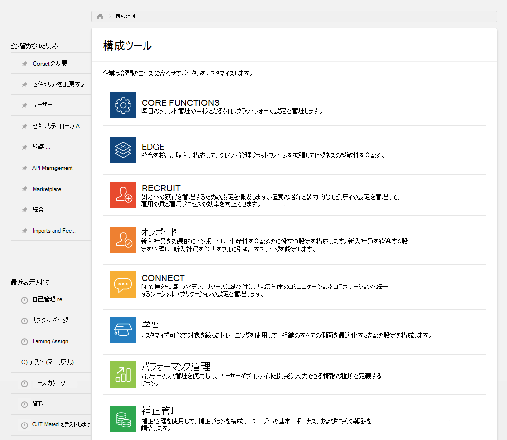
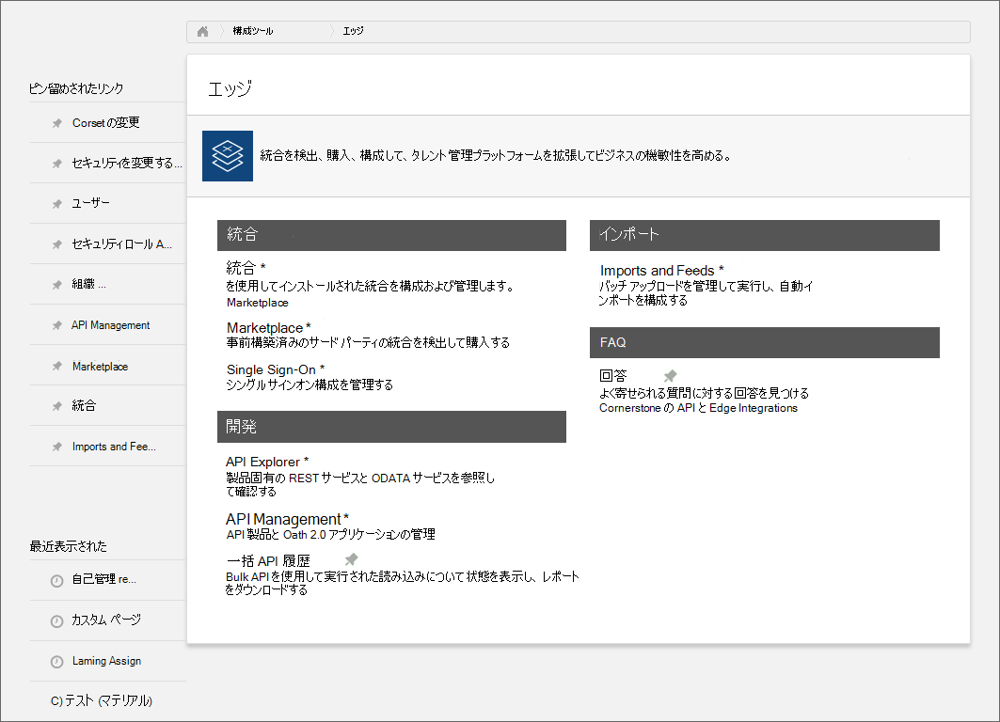
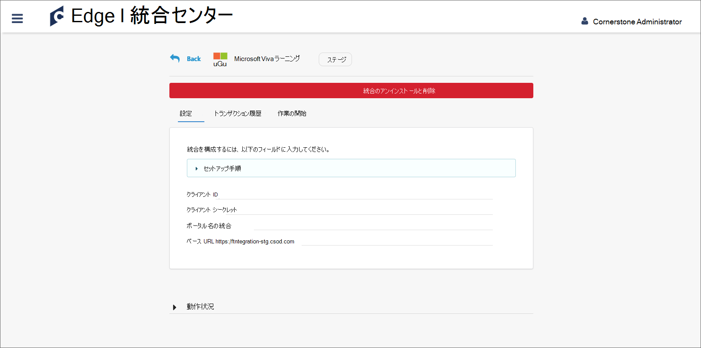
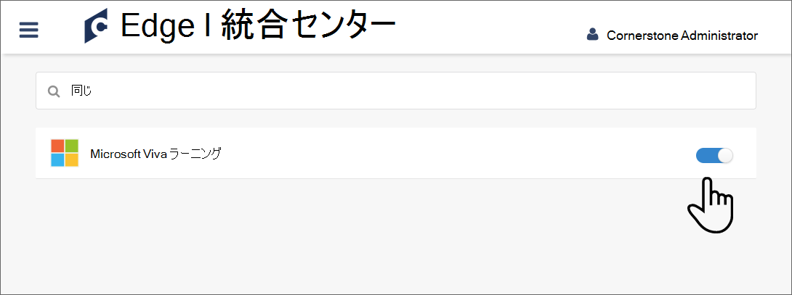

# Cornerstone OnDemand をコンテンツ ソースとして構成Microsoft Viva ラーニング

この記事では、Cornerstone OnDemand をサードパーティのラーニング コンテンツ ソースとしてビバ で構成する方法をラーニング。 まず、ビバ の設定を有効にしラーニング、コーナーストーン ポータルから詳細を取得する必要があります。 次に、サーバーで構成を完了する必要Microsoft 365 管理センター。

>[!NOTE]
>ビバ サービスからアクセスラーニングは、Microsoft 製品条項以外の条項に従います。 Cornerstone OnDemand コンテンツおよび関連するサービスは、Cornerstone OnDemand のプライバシーおよびサービス条件の対象です。

## コーナーストーン ポータルで構成する

1. コーナーストーン ポータルに管理者としてログインします。

    

2. [エッジ **] を選択します**。

    

3. [Marketplace] **に移動し** 、[ビバ] を検索します。

    

4. [ビバ] タイルラーニング選択します。

    ![Marketplace の [ビバ] タイルの上ラーニングカーソルのイメージ。](../media/learning/csod-4.png)

5. [ **インストール**] を選択します。

    ![[ビバ] タイルを選択した後、[インストール] ボタンの上にカーソルを置ラーニングイメージ。](../media/learning/csod-5.png)

6. ボックスをオンにして、利用規約に同意し、[インストール] を **選択します**。

    ![[利用規約] ボックスがオンの [インストール] 画面のイメージ。](../media/learning/csod-6.png)

7. [今 **すぐ構成] を選択します**。

    ![右側に [今すぐ構成] と表示されるボタンと、左側の [後で] というボタンが表示されたインストール ポップアップのイメージ。](../media/learning/csod-7.png)

8. クライアント ID、シークレット、ポータル名、および基本 URL をコピーします。 その後、戻ってビバを検索します。

    

9. 切り替えボタンをスライドして、ビバ ラーニング有効にします。

    

## サーバーで構成Microsoft 365 管理センター

1. 自分のアカウントに[ログインMicrosoft 365 管理センター。](https://admin.microsoft.com)
2. [組織の設定 **設定]** の順 **に移動します**。 [ビバ ラーニング] を選択し、パネルで Cornerstone OnDemand を有効にします。
3. コーナーストーン ポータルから取得した構成の詳細を入力します。

    >[!NOTE]
    >表示名はカルーセルの名前で、Viva ラーニング で組織の Cornerstone ラーニング コンテンツが表示されます。 名前を入力しない場合は、既定の名前 "Cornerstone OnDemand" が表示されます。

4. [保存 **] を選択** して、ビバ のコーナーストーン コンテンツをアクティブラーニング。 コンテンツがビバ アプリに表示されるのに最大 24 時間かかるラーニングがあります。

>[!NOTE]
>現在、組織内のすべてのユーザーは、テナント固有のすべてのコースを検出できますが、アクセスできるコースのみを使用できます。 ロールとアクセス許可に基づくユーザー固有のコンテンツ検出は、今後のリリースに向け計画されています。
