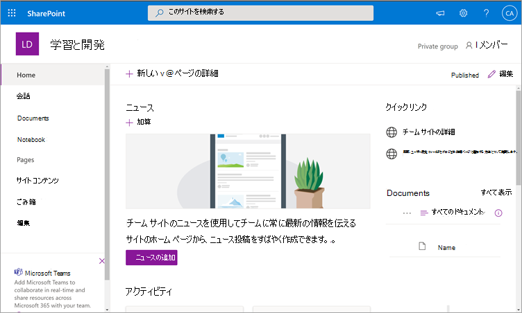
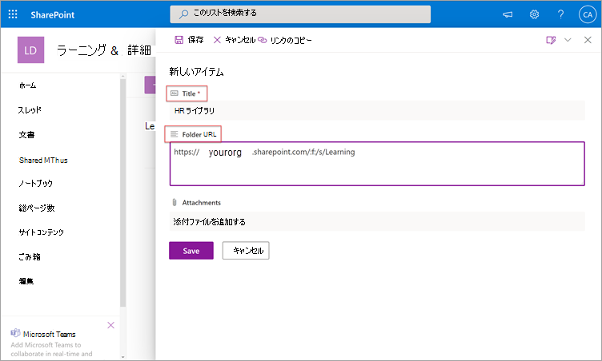
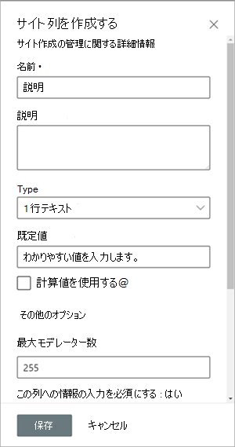

# 近日公開予定: SharePoint を Microsoft Viva Learning の学習コンテンツ ソースとして構成する (プレビュー)

> [!NOTE]
> この記事の情報は、商用リリース前に大幅に変更される可能性があるプレビュー製品に関連しています。 

SharePoint をラーニング コンテンツ ソースとして構成して、組織独自のコンテンツをビバ ラーニング (プレビュー) で利用できます。

## 概要

ナレッジ管理者 (またはグローバル管理者) は、ラーニング サービスが構造化された SharePoint リストの形式で空の一元化された場所 (Learning App Content Repository) を作成できるサイト URL を提供します。 このリストは、組織が学習コンテンツを含む会社間の SharePoint フォルダーへのリンクを格納するために使用できます。 管理者は、フォルダーの URL の一覧を収集およびキュレーションする責任があります。 これらのフォルダーには、ビバ ラーニング (プレビュー) で使用できるコンテンツのみを含める必要があります。

Viva Learning (プレビュー) では、次のドキュメントの種類がサポートされています。

- Word、PowerPoint、Excel、PDF
- オーディオ (.m4a)
- ビデオ (.mov、.mp4、.avi)

詳細については [、「SharePoint の制限」を参照してください](/office365/servicedescriptions/sharepoint-online-service-description/sharepoint-online-limits?redirectSourcePath=%252farticle%252fSharePoint-Online-limits-8f34ff47-b749-408b-abc0-b605e1f6d498)。 

## アクセス許可

ドキュメント ライブラリ フォルダー URL は、組織内の任意の SharePoint サイトから収集できます。 Viva Learning (プレビュー) は、既存のすべてのコンテンツアクセス許可に従います。 したがって、ユーザーがアクセス許可を持つコンテンツだけが検索可能で、ビバ ラーニング (プレビュー) 内で表示されます。 これらのフォルダー内のコンテンツは検索可能ですが、個々の従業員がアクセス許可を持つコンテンツのみを使用できます。

組織のリポジトリからのコンテンツの削除は現在サポートされていません。

意図せずに表示されたコンテンツを削除するには、次の手順を実行します。

1.  ドキュメント ライブラリへのアクセスを制限するには、[アクションの表示] オプション **を選択し** 、[アクセスの管理] **を選択します**。
     
     ![SharePoint のドキュメント ライブラリ ページで、[アクセスの管理] を使用して [アクションの表示] オプションを表示します。](../media/learning/learning-sharepoint-permissions2.png)

2.  ドキュメント ライブラリ内の元のドキュメントを削除します。

詳細については [、「SharePoint モダン エクスペリエンスでの共有とアクセス許可」を参照してください](/sharepoint/modern-experience-sharing-permissions)。 

## ラーニング サービス

ラーニング サービスは、指定されたフォルダー URL を使用して、それらのフォルダーに格納されているすべてのコンテンツからメタデータを取得します。 一元化されたリポジトリにフォルダー URL を指定して 24 時間以内に、従業員はビバ ラーニング (プレビュー) 内で組織のコンテンツを検索して使用できます。 更新されたメタデータやアクセス許可を含むコンテンツに対する変更はすべて、24 時間以内にラーニング サービスにも適用されます。

## ソースとして SharePoint を構成する

これらのタスクを実行するには、Microsoft 365 グローバル管理者、SharePoint 管理者、またはナレッジ管理者である必要があります。

ビバ ラーニング (プレビュー) の学習コンテンツ ソースとして SharePoint を構成するには、次の手順を実行します。

1.  Microsoft 365 管理センターの左側のナビゲーションで、[設定] [組織の設定]  >  **に移動します**。
 
2.  [組織の **設定] ページ** の [サービス] **タブで** 、[ビバ ラーニング **(プレビュー) ] を選択します**。

     ![リストされているビバ ラーニングを表示する Microsoft 365 管理センターの [設定] ページ。](../media/learning/learning-sharepoint-configure1.png)

3.  [ **ビバ ラーニング (プレビュー)]** パネルの [SharePoint] で、サイト URL を SharePoint サイトに提供し、このサイトでは、ビバ ラーニング (プレビュー) で一元的なリポジトリを作成します。

     

4.  SharePoint リストは、指定された SharePoint サイト内に自動的に作成されます。

     

     SharePoint サイトの左側のナビゲーションで、[サイト コンテンツ] **[** アプリ コンテンツ  >  **リポジトリ] を選択します**。 

     ![[サイト コンテンツ] ナビゲーションと [学習アプリ コンテンツ リポジトリ] セクションを示す SharePoint リスト。](../media/learning/learning-sharepoint-configure4.png) 

5. [アプリ **コンテンツ リポジトリの学習** ] ページで、SharePoint リストに URL を入力して、学習コンテンツ フォルダーに追加します。

   1. [新規 **] を** 選択して、[新しいアイテム] **パネルを表示** します。 

       ![[新しい] オプションを示す SharePoint の [コンテンツ リポジトリの学習] ページ。](../media/learning/learning-sharepoint-configure5.png)
 
   2. [新しい **アイテム]** パネルの [ **タイトル** ] フィールドに、選択したディレクトリ名を追加します。 [フォルダー **URL]** フィールドで、URL を学習コンテンツ フォルダーに追加します。 **[保存]** を選択します。

       

   3. [ **アプリコンテンツ リポジトリの学習]** ページが新しい学習コンテンツで更新されます。

       ![更新された情報を示す SharePoint の [コンテンツ リポジトリの学習] ページ。](../media/learning/learning-sharepoint-configure7.png)

> [!NOTE]
> Learning App Content Repository へのより広範なアクセスを可能にするために、リストへのリンクは、ユーザーがアクセスを要求し、最終的にリストを設定するのに役立つ、ビバ ラーニング (プレビュー) インターフェイスですぐに利用できます。 サイト所有者とグローバル管理者は、リストへのアクセスを許可する必要があります。 アクセスはリストにのみ固有であり、リストが保存されているサイトには適用されません。 詳細については、この記事の [後半の「自分の組織のコンテンツを提供](#provide-your-own-organizations-content) する」を参照してください。

### フォルダー URL ドキュメント ライブラリのキュレーション

既定のメタデータ (変更日、作成日、ドキュメント名、コンテンツ タイプ、組織名など) は、Microsoft Graph API によって自動的にビバ ラーニング (プレビュー) に引き込まれます。
 
コンテンツの全体的な検出と検索の関連性を向上させるために、[説明] 列を追加することをお **勧** めします。

ドキュメント ライブラリ ページに **[説明]** 列を追加するには、次の手順を実行します。

1.  [ドキュメント] **ページで、[** 列の追加] **を選択します**。

2. [アクションの **表示] オプションを** 選択し、[単一 **行のテキスト] を選択します**。

     ![[アクションの表示] オプションを表示する SharePoint の [ドキュメント] ページで、1 行のテキストが強調表示されます。](../media/learning/learning-sharepoint-curation1.png)

3. [列 **の作成] パネル** の [ **名前** ] フィールドに、列のわかりやすい名前を追加します。 **[保存]** を選択します。

     
 
4. [ドキュメント **] ページの** [説明] **列** で、アイテムごとにカスタム説明を追加します。 説明が指定されていない場合、Viva Learning (Preview) は、コンテンツを独自の SharePoint ライブラリからの内容として強調表示する既定のメッセージを提供します。 

     ![[説明] 列の説明を示す SharePoint の [ドキュメント] ページ。](../media/learning/learning-sharepoint-curation3.png)
 
### 独自の組織のコンテンツを提供する

ナレッジ管理者は、組織のラーニング アプリ コンテンツ リポジトリに SharePoint でアクセスし、組織間のドキュメント ライブラリへの参照を提供できます。 これらのライブラリ内のコンテンツは、ビバ ラーニング (プレビュー) で学習コンテンツとして表示されます。

1. [ビバ ラーニング (プレビュー)] で、[その他の **オプション** ]**(..) を選択し**、[設定] を **選択します**。

     ![[その他のオプションと設定] オプションを示す SharePoint ライブラリ ページ。](../media/learning/learning-sharepoint-library-1.png)
     
2. [設定 **] で**、[アクセス許可] **を選択します**。

     ![SharePoint の [アクセス許可] と [アクセスの確認] オプションを表示する [設定] オプション ページ。](../media/learning/learning-sharepoint-library-2.png)

3. [ **アクセスの確認]** を選択して、組織の一元化されたライブラリに接続します。
     
