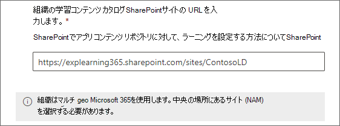
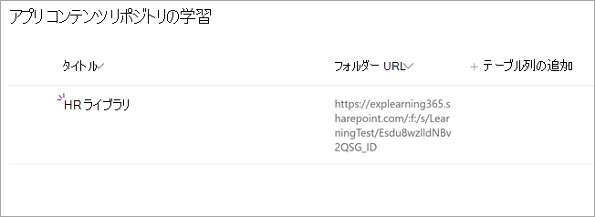
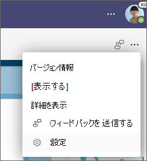

# ユーザー SharePointコンテンツ ソースとして追加Microsoft Viva ラーニング

組織独自のコンテンツSharePointビバ のコンテンツを利用できるよう、ラーニング コンテンツ ソースとして構成ラーニング。

>[!NOTE]
> ビバ サービスからアクセスラーニングは、Microsoft 製品条項以外の条項に従います。 ホストされるコンテンツなど、ビバ ラーニングにSharePointコンテンツは、そのコンテンツに関連付けられたプライバシーとサービスの条件に従います。

## 概要

ナレッジ管理者 (またはグローバル管理者) は[、ラーニング サービス](configure-sharepoint-content-source.md#learning-service)が構造化された一覧の形式で空の一元的な場所を作成できるサイト URL をSharePointします。 このリストは、アプリ コンテンツ リポジトリラーニング呼び出されます。 組織では、このリストを使用して、学習コンテンツを含むSharePointグループ間のリンクを作成できます。 管理者は、フォルダーの URL の一覧を収集およびキュレーションする責任があります。 これらのフォルダーには、ビバ で使用できるコンテンツのみを含める必要ラーニング。

Viva ラーニングは、次のドキュメントの種類をサポートしています。

- Word、PowerPoint、Excel、PDF
- オーディオ (.m4a)
- ビデオ (.mov、.mp4、.avi)

詳細については、「制限値[SharePoint参照してください](/office365/servicedescriptions/sharepoint-online-service-description/sharepoint-online-limits?redirectSourcePath=%252farticle%252fSharePoint-Online-limits-8f34ff47-b749-408b-abc0-b605e1f6d498)。

## Multi-Geo

[Microsoft 365 Multi-geo](/microsoft-365/enterprise/microsoft-365-multi-geo)を使用している場合は、ナレッジ管理者が提供するサイト URL (ラーニング アプリ コンテンツ リポジトリがある場所) は、Microsoft 365 サブスクリプションが最初にプロビジョニングされた中央の場所に属している必要があります。 リポジトリにリンクされているフォルダーも、中央の場所に属している必要があります。 データラーニング要件に準拠するために、この制限が追加されました。

[Microsoft 365複数地域は](/microsoft-365/enterprise/microsoft-365-multi-geo)、データ常駐の要件を満たして設計されています。 詳細については、「オンライン」の[「複数地域機能」をSharePointしてください](/microsoft-365/enterprise/multi-geo-capabilities-in-onedrive-and-sharepoint-online-in-microsoft-365)。

## アクセス許可

ドキュメント ライブラリ フォルダー URL は、組織内の任意のSharePointから収集できます。 Viva ラーニング既存のすべてのコンテンツアクセス許可に従います。 したがって、ユーザーがアクセス許可を持つコンテンツだけが検索可能で、ビバ グループ内ラーニング。 これらのフォルダー内のコンテンツは検索可能ですが、個々の従業員がアクセス許可を持つコンテンツのみを使用できます。

組織のリポジトリからのコンテンツの削除は現在サポートされていません。

意図せずに表示されたコンテンツを削除するには、次の手順を実行します。

1. ドキュメント ライブラリへのアクセスを制限するには、[アクションの表示] オプション **を選択し** 、[アクセスの管理] **を選択します**。

     ![[アクセスの管理] が強調表示SharePoint [アクションの表示] オプションを表示するドキュメント ライブラリ ページ。](../media/learning/learning-sharepoint-permissions2.png)

2. ドキュメント ライブラリ内の元のドキュメントを削除します。

詳細については、「最新のエクスペリエンス[での共有とアクセス許可SharePointを参照してください](/sharepoint/modern-experience-sharing-permissions)。

## ラーニング サービス

ラーニングサービスは、指定されたフォルダー URL を使用して、それらのフォルダーに格納されているすべてのコンテンツからメタデータを取得します。 一元化されたリポジトリにフォルダー URL を指定して 24 時間以内に、従業員はビバ グループ内で組織のコンテンツを検索して使用ラーニング。 更新されたメタデータやアクセス許可を含むコンテンツに対する変更はすべて、24 時間以内に ラーニングサービスに適用されます。

## ソースSharePoint構成する

これらのタスクを実行するにはMicrosoft 365管理者、SharePoint管理者である必要があります。

ビバ SharePointのラーニング コンテンツ ソースとして構成するには、次ラーニング手順を実行します。

1. [組織の設定] の左側Microsoft 365 管理センター[組織の設定]**設定**  >  **移動します**。

2. [組織の **設定] ページ** の [サービス] タブ **で**、[ビバ] を選択 **ラーニング。**

     ![設定の [ビバ] ページMicrosoft 365 管理センター一覧ラーニング表示されます。](../media/learning/clcs-services.png)

3. [**ビバ ラーニング]** パネルの [SharePoint] で、サイト URL を SharePoint サイトに提供し、そのサイトにビバ ラーニングを一元的なリポジトリを作成します。 サイトがSharePoint場合は、サイトの作成後 1 時間待ってここに追加する必要があります。 また、サイトの所有者SharePointがあります。

     

     組織で複数地域Microsoft 365[使用している](/microsoft-365/enterprise/microsoft-365-multi-geo)場合は、地域または国を複数地域Microsoft 365[で確認できます](/microsoft-365/enterprise/microsoft-365-multi-geo#microsoft-365-multi-geo-availability)。 [**ビバ ラーニング]** パネルには、この情報も表示されます。

     

4. 指定SharePointリストは、指定されたサイト内にSharePointされます。

     アプリ コンテンツ リポジトリの左側のナビゲーションSharePoint、[サイトコンテンツ] ラーニング  >  **選択します**。

     ![SharePointコンテンツ ナビゲーションと [アプリ コンテンツ リポジトリ] セクションをラーニング一覧を表示します。](../media/learning/learning-sharepoint-configure4.png)

5. [アプリ **ラーニングリポジトリ]** ページで、url を含むSharePointをラーニング コンテンツ フォルダーに設定します。

   1. [新規 **] を** 選択して、[新しいアイテム] **パネルを表示** します。

       ![ラーニングの [コンテンツ リポジトリ] ページSharePointを表示します。](../media/learning/learning-sharepoint-configure5.png)

   2. [新しい **アイテム]** パネルの [ **タイトル** ] フィールドに、選択したディレクトリ名を追加します。 [フォルダー **URL]** フィールドで、URL を学習コンテンツ フォルダーに追加します。 [**保存**] を選択します。 [フォルダー URL を作成する方法について学習します](#folder-url-document-library-curation)。

       ![[タイトル] フィールドと [SharePoint URL] フィールドが表示される新しいアイテム パネル。](../media/learning/learning-sharepoint-configure6.png)

   3. **[ラーニングコンテンツ リポジトリ] ページ** が新しい学習コンテンツで更新されます。

       

   4. 組織で[Microsoft 365複数](/microsoft-365/enterprise/microsoft-365-multi-geo)地域を使用し、中央の場所に属していないフォルダーへのリンクを追加しようとする場合は、エラー メッセージが表示されます。 すべてのフォルダーが中央の場所に属している必要があります。
       ![[新しいアイテム] パネルで、アップロードされたフォルダーすべてが中央の場所にある必要があるというエラー メッセージが表示されます。](../media/learning/learning-sharepoint-configure-geo2.png)

  > [!NOTE]
  > ラーニング App Content Repository へのより広範なアクセスを可能にするために、リストへのリンクは、ユーザーがアクセスを要求し、最終的にリストを設定するのに役立つ、ビバ ラーニング インターフェイスですぐに利用できます。 サイト所有者とグローバル管理者は、リストへのアクセスを許可する必要があります。 アクセスはリストにのみ固有であり、リストが保存されているサイトには適用されません。 詳細については、この記事の [後半の「自分の組織のコンテンツを提供](#provide-your-own-organizations-content) する」を参照してください。

### フォルダー URL ドキュメント ライブラリのキュレーション

組織の学習コンテンツを格納するフォルダーを作成します。

1. ドキュメント ライブラリに移動し、[+ 新規] **を選択します**。

    ![カーソルが [新規] と [フォルダー] を選択した空のドキュメント ライブラリのイメージ。](../media/learning/spfolder-3.png)

2. [フォルダー **] を** 選択し、フォルダー名を入力します。

    

3. **[作成]** を選択します。 これで、フォルダーがドキュメント ライブラリに表示されます。

    

4. アップロード学習コンテンツとして発行するファイルを作成します。
5. フォルダーの URL を取得するには、このフォルダーを選択し、[リンクのコピー] **を選択します**。

    ![[リンク] コピーされたポップアップのイメージ。](../media/learning/spfolder-8.png)

既定のメタデータ (変更日、作成日、ドキュメント名、コンテンツ タイプ、組織名など) は、Microsoft ラーニング API によって自動的Graphされます。

コンテンツの全体的な検出と検索の関連性を向上させるために、[説明] 列を追加することをお **勧** めします。 説明列が既に存在する場合は、以下の手順に従って削除して新しい列を追加できます。

ドキュメント ライブラリ ページに **[説明]** 列を追加するには、次の手順を実行します。

1. [ドキュメント] **ページで、[** 列の追加] **を選択します**。

2. [アクションの **表示] オプションを** 選択し、[単一 **行のテキスト] を選択します**。

    :::image type="content" alt-text="[ドキュメント] ページSharePoint[アクションの表示] オプションが表示され、1 行のテキストが強調表示されます。" source="../media/learning/learning-sharepoint-curation1.png":::

3. [列 **の作成] パネル** の [ **名前** ] フィールドに、列のわかりやすい名前を追加します。 [**保存**] を選択します。

    ![[名前] などのフィールドをSharePoint列パネルを作成します。](../media/learning/learning-sharepoint-curation2.png)

4. [ドキュメント **] ページの** [説明] **列** で、アイテムごとにカスタム説明を追加します。 説明が指定されていない場合、ビバ ラーニングは、コンテンツを独自のライブラリからの内容として強調表示する既定のSharePointします。

     ![[説明] 列SharePoint説明を表示するドキュメント ページ。](../media/learning/learning-sharepoint-curation3.png)

### 独自の組織のコンテンツを提供する

ナレッジ管理者は、ラーニング で組織の ラーニング App Content SharePoint Repository にアクセスし、組織間ドキュメント ライブラリへの参照を提供できます。 次に、これらのライブラリ内のコンテンツは、ビバ のコンテンツとして表示ラーニング。

1. [ビラーニング] で、省略記号 (**...**) を選択し、[省略 **記号]** を設定。

    
  
2. [アクセス **設定]** で、[アクセス許可]**を選択します**。

    ![設定アクセス許可とアクセスSharePointを表示するページの [オプション] ページを開きます。](../media/learning/learning-sharepoint-library-2.png)

3. [ **アクセスの確認]** を選択して、組織の一元化されたライブラリに接続します。

## 次の手順

[Viva ラーニングの学習管理システムを追加](configure-lms.md)[するかMicrosoft Viva ラーニング。](configure-other-content-sources.md)
