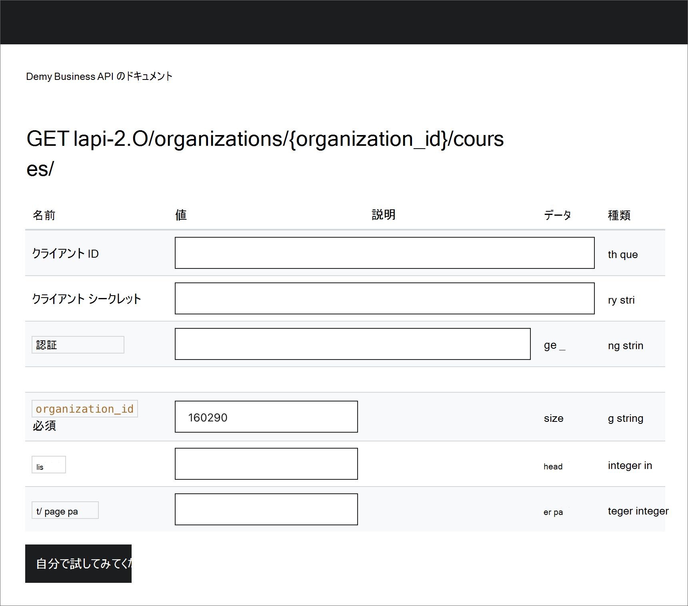

# Udemy をコンテンツ ソースとして構成Microsoft Viva ラーニング

この記事では、Udemy をサードパーティのラーニング コンテンツ ソースとして構成する方法についてMicrosoft Viva ラーニング。

>[!NOTE]
>ビバ サービスからアクセスラーニングは、Microsoft 製品条項以外の条項に従います。 Udemy コンテンツおよび関連するサービスは、Udemy のプライバシーとサービスの条件の対象です。

次の手順に従って、Udemy Business 環境で API を有効にし、LMS/LXP アプリケーションのクライアント資格情報を生成してアクセスします。

1. [管理]**に移動** し **、[設定** API] に **移動します**。 API の状態を確認します。 無効になっている場合は、サポートに連絡して有効にするか、以下の手順に従って有効にすることができます。

    <!---->

2. API が無効になっている場合は **、LMS/LXP** 統合に移動し、[セットアップの開始] 、次に **[その** 他] に **移動します**。

    <!---->

3. 次の画面で、カスタム LMS/LXP またはサード パーティ製アプリケーションの名前を入力します。 次に、[自動登録] オプションをオンまたはオフにし、[保存] を **選択します**。 自動登録オプションを使用すると、LMS/LXP を使用してコースを起動するユーザーは、自動的に Udemy に登録されます。

    <!---->

4. 保存すると、クライアント ID とクライアント シークレットが生成され、画面からコピーできます。 これで、指定されたクライアント資格情報を使用して API にアクセスできます。

    <!---->

5. API エンドポイントにアクセスするには、API エンドポイントとエンドポイントの URL ACCOUNT_ID必要があります。 この情報にアクセスし、[管理] 、次に [API]の順に移動して API **を** 試設定試 **します**。 API を有効にすると、API の状態が "有効" と表示されます。 [API ドキュメント] リンクを選択します。

    <!---->

6. 概要ページから API エンドポイントの URL ACCOUNT_IDを取得します。 サポートされているメソッドに移動して API 呼び出しを試します。 これで、すべてのユーザーが Udemy Business API を呼び出す設定が可能です。

    <!---->

    <!---->

## サーバーを構成Microsoft 365 管理センター

前の手順を使用して Udemy ポータルから必要な構成の詳細を受け取った後、テナント管理者は、次の手順を使用して、Microsoft 365 管理センター で Udemy をラーニング ソースとして構成する必要があります。

1. [Microsoft 365 管理センター](https://admin.microsoft.com)に移動します。

2. [組織の設定 **設定]** の順 **に移動します**。 [ビバ] ラーニングを検索し、オプションから Udemy を有効にします。

3. 次の必要な構成の詳細を入力します。

    - **クライアントのホスト URL**: 手順 6 の Udemy ポータルから収集された API エンドポイント URL です。
    - **組織 ID**: 手順 6 で Udemy ポータルACCOUNT_ID収集された組織 ID です。
    - **クライアント ID**: これは、手順 4 の Udemy ポータルから収集されたクライアント ID です。
    - **クライアント シークレット**: これは、手順 4 の Udemy ポータルから収集されたクライアント シークレットです。

      <!---->

4. [**保存] を** 選択して、ユーザー設定で Udemy Microsoft Viva ラーニング。 コンテンツがビバ で利用可能になるには、最大で 24 時間かかる場合ラーニング。
