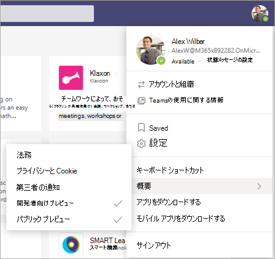
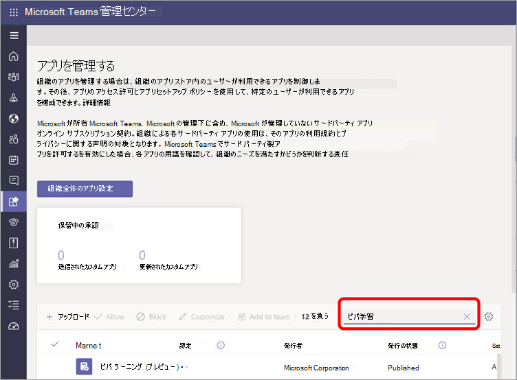
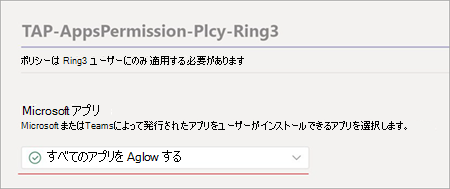

# 管理センター Microsoft Viva ラーニング (プレビュー) のTeams設定する

> [!NOTE]
> この記事の情報は、商用リリース前に大幅に変更される可能性があるプレビュー製品に関連しています。 

管理者Teams、テナント内のユーザーに対して Viva ラーニング (プレビュー) を有効にするには、特定の手順を実行する必要があります。 これらの手順は、テナントの有効化方法 (パブリック プレビューまたは [*プライベート* プレビュー (またはベータ) によって異なります](set-up-teams-admin-center.md#private-preview-tenants)。

## パブリック プレビュー テナント

### パブリック プレビュー テナントの管理者の手順

ビバ ラーニング (Preview) はまだ一般に利用できないので、特定のユーザーまたはグループの機能を有効にしてアクセス許可を設定するには、特定の手順が必要です。 

1. ビバ ユーザー (プレビュー) ユーザーラーニングパブリック プレビュー機能を有効にする。

    a. パブリック Teams機能を有効にするには、更新ポリシーを変更します。 「パブリック[Microsoft Teams」を参照してください](/microsoftteams/public-preview-doc-updates)。

    b. ビバ テスト (プレビュー) テストを実行するユーザーまたはラーニングポリシーを有効にする。 「ユーザー [とグループにポリシーを割り当てる」を参照してください](/microsoftteams/assign-policies-users-and-groups)。

2. Viva ユーザー (プレビュー) ユーザーのアプリラーニングポリシーを変更します。

    a. 現在グローバル ポリシーの一部である場合をしない限り、アプリのアクセス許可ポリシーですべての Microsoft アプリを許可します。 「[アプリのアクセス許可ポリシーを管理する」を参照Microsoft Teams。](/microsoftteams/teams-app-permission-policies) 

    b. ビバ テスト (プレビュー) テストを実行するユーザーまたはラーニングポリシーを有効にする。 「ユーザー [とグループにポリシーを割り当てる」を参照してください](/microsoftteams/assign-policies-users-and-groups)。

3. Viva ラーニング (Preview) をテストするユーザーに対して、ビルド クライアントをパブリック プレビューに切り替[Teams。](set-up-teams-admin-center.md#user-steps-for-public-preview-tenants)

> [!IMPORTANT]
> パブリック プレビュー テナントの場合ラーニング製品のリリースまで、Teams 管理センターの管理アプリにはビバ Teams (プレビュー) は表示されません。 ただし、有効になっているパブリック プレビュー ユーザーは、Teams アプリ ストアでビバ ラーニング (プレビュー) を検索し、適切なポリシーとアクセス許可が設定された後で使用できます。

### パブリック プレビュー テナントのユーザー手順

前に説明したポリシーを有効にすることで、パブリック プレビューテストを有効にしたユーザーは、クライアントでパブリック プレビューに切りTeamsがあります。

1. ユーザーは、[パブリック プレビューについて]でプロファイル >  >  **を選択する必要があります**。

    

2. ユーザーはパブリック プレビューの使用条件に同意する必要があります。

    

3. これで、ユーザーはアプリ ストアラーニングでビバ Teams ラーニング (プレビュー) を見つけて使用を開始できます。

## プライベート プレビュー テナント

### プライベート プレビュー (またはベータ) テナントの管理者の手順

プライベート プレビュー テナントの場合、有効にする必要がある追加のポリシーはありません。 ただし、組織内ラーニングで、ビバ ファイル (プレビュー) を使用できる必要があります。

1. 管理センターの左側のナビゲーションTeams、[アプリの管理 **Teams]**  >  <a href="https://go.microsoft.com/fwlink/?linkid=2172960" target="_blank">**に移動します**</a>。

   ![[アプリとアプリのTeams管理] セクションをTeams管理センターの左側のナビゲーション。](../media/learning/learning-app-teams-manage-apps-nav.png)

2. [アプリの **管理] ページ** の検索ボックスに *「Viva* ラーニング」と入力し、[ビバ ラーニング **(プレビュー) を選択します**。

   ![[アプリの管理] ページで、Teamsを表示する管理センターで管理します。](../media/learning/learning-app-teams-manage-apps-page.png)

3. [ビバ **ラーニング (プレビュー) ページ** の[状態]で、[ビバ モードを有効にする許可ラーニング (プレビュー) を選択します。

   ![ラーニングとアプリの設定] セクションTeams管理センターの [アプリの設定] ページを開きます。](../media/learning/learning-app-teams-learning-page.png)

<!---
The Teams admin installs Viva Learning (Preview) and applies permission policies through the <a href="https://go.microsoft.com/fwlink/p/?linkid=2066851" target="_blank">Teams admin center</a>.

1. For Viva Learning (Preview), you must first set the Update policy in Teams. For more information, see [Microsoft Teams Public Preview](/MicrosoftTeams/public-preview-doc-updates).

    1. Sign in to the Teams admin center > **Teams** > <a href="https://go.microsoft.com/fwlink/p/?linkid=2173206" target="_blank">**Update policies**</a>.

    3. Select **Add**. 

    4. Name the update policy, add a policy, and turn on **Show preview features**.

2. The admin must notify users of the policy update so that they move their build into the Public Preview for Teams. 

    1. Users must select their profile image > **About** > **Public Preview**.
   
        
    
    2. Users must accept the **Public preview** terms and conditions.

        
 
3. For organizations that have restrictive policies and need to enable Viva Learning (Preview), follow the process in the next section.

## Manage settings for Viva Learning (Preview)

You must be an administrator in the Teams admin center to perform these tasks.

To make Viva Learning (Preview) available for users in your organization, follow these steps:

1. In the left navigation of the Teams admin center, go to **Teams apps** > <a href="https://go.microsoft.com/fwlink/?linkid=2172960" target="_blank">**Manage apps**</a>.

   

2. On the **Manage apps** page, in the search box, type *Viva learning*, and then select **Viva Learning (Preview)**.

   

3. On the **Viva Learning (Preview)** page:

   1. Under **Status**, select **Allowed** to turn on Viva Learning (Preview).

   2. On the **Settings** tab, under **App settings**, go to the Microsoft 365 admin center to [configure learning content sources](content-sources-365-admin-center.md).

   

4. After **Manage app** settings, go to **Permission policies** and **Setup policies** to grant permission to employees who should have access to Viva Learning (Preview) as part of your organization's participation in the preview.

> [!NOTE]
>  If your organization is in Ring 4.0 as part of Teams TAP100 program, you might need to enable approved users in Ring 3.0 to access Viva Learning (Preview).   As part of the preview, Viva Learning (Preview) is released in Ring 3.0. If your organization is in Ring 4.0, you won’t see Viva Learning (Preview) on the **Manage apps** page. To test the app, you need to create a custom apps permission policy, set it to **Allow all apps**, and assign it to Ring 3.0 approved users.      

--->

## 次の手順

[ビデオ ウィンドウで、ビバ ラーニング (プレビュー) の学習コンテンツ ソースを構成Microsoft 365 管理センター](content-sources-365-admin-center.md)
