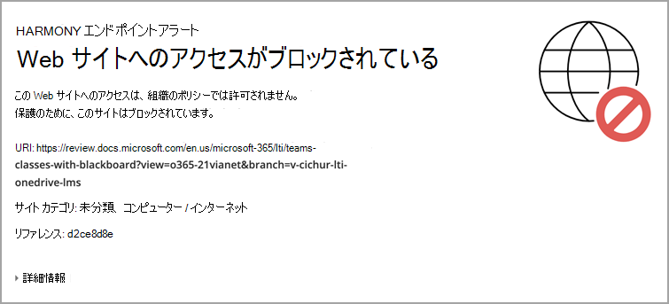

# Blackboard learn ultra Microsoft Teamsクラスを使用する

チームワークは、現代のすべての組織の中核をなしています。 コラボレーションを促進することで、成功した教育機関ごとに明確な特徴を持っています。 Blackboard Learn Ultra のすべての機能と機能を強化するために、それらを複数のクラスとMicrosoft Teamsできます。

クラスには、リアルタイムの会話、ビデオ会議、または非同期操作が含まれる場合があります。 学生のファイル共有と共同作成エクスペリエンスを 1 か所で追加できます。 Microsoft Teamsのクラスは、教育のダイナミクスと効果的な学習の意味を再定義します。

> [!IMPORTANT]
> 学生情報システム[(SIS)](https://help.blackboard.com/Learn/Administrator/SaaS/Integrations/Student_Information_System/SIS_Planning)で [教育機関のメール] フィールドが正常に設定されたことを確認する
>
>Microsoft Teams クラスの統合は、SIS の教育機関の電子メール フィールドに依存して、正しい Microsoft Azure Active Directory (AAD) ユーザー原則名[(UPN) にマップします](/azure/active-directory/hybrid/howto-troubleshoot-upn-changes)。 教育機関の電子メールがプロビジョニングされていない場合、これは既定で既存の電子メールに設定されます。 このフィールドは、データが正しく同期され、AAD と Blackboard Learn Ultra の間で電子メール データが競合しなかからなされるように、すべてのユーザーに対して設定をお勧めします。
>
> SIS マッピングでこのフィールドを適切に設定していない場合、統合は引き続き機能しますが、作成された Teams クラスにはユーザーが表示されない可能性があります。エラーが発生する可能性があります。

## 教育機関向けデータ マッピングのサポート – 教育機関の電子メール SIS フィールド

クラウド プロバイダー統合の進化の一環として、Blackboard Learn Ultra は、学生情報システム フレームワーク統合とパブリック REST API の両方で新しい教育機関メール フィールドを作成し、Blackboard Learn Ultra と AAD の間でデータ同期プロセスを効果的に管理できるようにしました。

### 教育機関の電子メールとは何を意味し、何をサポートしていますか?

[ **教育機関のメール]** フィールドを使用すると、クライアントの外部でサポートされているデータ ソースと Blackboard Learn Ultra の間のカスタマイズされたフィールド マッピングが可能です。 データ ソースが Microsoft などのクラウド プロバイダーである場合、ユーザー原則名 (UPN) は、UPN プレフィックス (ユーザーのアカウント名) と、@記号と共に結合された UPN サフィックス (DNS ドメイン 名) で構成される各ユーザーのプライマリ一意識別子です。 これにより、ユーザー内の特定のユーザーごとに一意のメール アドレスが作成Microsoft Azure Active Directory。

データが正確で、Blackboard Learn Ultra クラスと Microsoft Teams クラス間の登録またはメンバーシップが正しく達成されるようにするには、ユーザーの電子メール アドレスが両方のシステム間で一致している必要があります。 Blackboard Learn Ultra では、ユーザーはユーザー インターフェイスで既存のメール アドレスを変更または上書きできます。その結果、同期エラーが発生し、ユーザーがクラス チームに正しく追加されない可能性があります。 Institution **Email フィールド** マッピングを使用すると、ユーザーが Blackboard Learn Ultra 内で電子メールを変更した場合でも、このレベルのセキュリティと検証チェックを正しく管理できます。

 2 つの電子メール アドレスが異なる場合は、次のいずれかを実行します。

- どのソースが優先順位を持ち、人物と教育機関の両方の電子メールとして受け取られるかについて決定する必要があります。
  または、
- インスティテューションは、インスティテューションメールでユーザー設定フィールドマッピングを設定できます。これは潜在的な競合を解決できます。

教育機関 **のメール フィールド** マッピングは、Advanced Configuration 設定 ユーザーがオブジェクト型フィールド マッピングを学習するで、**既存のすべての** SIS 統合タイプ  >    >  **で使用できます**。

> [!NOTE]
> インスティテューションメールは、既定ではすべての SIS 形式の Person **Email** に設定され、各ユーザーに固有である必要があります。  セットアップおよび実行されている既存のすべての統合では、電子メールが重複している場合、SIS はユーザーのインポートに失敗しますので、このデータ マッピングが実行されます。 教育機関で教育機関のメールをカスタムに変更する機能が必要な場合は、SIS の [詳細構成] を使用して設定する必要があります。

## 要件

クラスMicrosoft Teams統合は **、Ultra Course View コースでのみ使用できます**。 教育機関が使用するには、次の要件を満たす必要があります。

- 超基本ナビゲーションを有効にした Blackboard Learn Ultra Learn SaaS を使用する

  

- コースで使用する LTI を有効にする。

  a. [管理者パネル **]**  >  **[LTI ツール プロバイダー] [グローバル プロパティ** の  >  **管理] に移動します**。

  b. [コース **で LTI が有効] を選択し**、必要に応じて [組織 **で有効] を選択します**。

  c. **[送信]** を選択します。

- LTI が構成されている必要があります

- Add Blackboard Learn Ultra Teams LTI Integration

- Add Microsoft Teams クラス LTI 1.3 ツール

- REST API ツールとクロスオリジン リソース共有の追加

- クラス統合を構成Microsoft Teams承認する

## Blackboard Learn Ultra Teams LTI 1.3 ツールを追加する

1. [管理者]**パネルで****、[LTI ツール プロバイダー] を選択します**。

2. **[LTI 1.3 ツールの登録] を選択します**。

3. [クライアント **ID] フィールド** に、次の ID を入力またはコピーして貼り付けます。

   `f1561daa-1b21-4693-ba90-6c55f1a0eb41`

4. 事前に設定され、[ツールの状態] ですべての設定を確認し、[有効] を **選択します**。

5. [**インスティテューション ポリシー] で**、[**コース内の役割]、[名前**]、および [メール アドレス] を選択し、両方に **[は** い] を選択します。 

6. [サービス **のグレード アクセスを許可する] と** [ **メンバーシップ サービス アクセスを許可する] を選択します**。

## [クラス LTI Microsoft Teams 1.3 ツールの追加]

1. [管理者]**パネルで****、[LTI ツール プロバイダー] を選択します**。

2. **[LTI 1.3 ツールの登録] を選択します**。

3. [クライアント **ID] フィールド** に、次の ID を入力またはコピーして貼り付けます。

   `027328b7-c2e3-4c9e-aaa1-07802dae6c89`

4. 事前設定済みのすべての設定を確認し、[ツールの状態] で *[有効* ] を選択 *します。*

5. イン **スティテューション ポリシーで、[****コース内の役割]、[名前]、および**[メール アドレス]**を選択します**。 両方に **対して [はい** ] を選択します。

6. [サービス **のグレード アクセスを許可する] と** [ **メンバーシップ サービス アクセスを許可する] を選択します**。

## REST API ツールの追加

1. [管理者パネル **] から [** 統合] に **移動し、[Rest** **API Integrations] を選択します**。

2. [統合 **の作成] を選択します**。

3. [アプリケーション **ID] フィールド** に、次の ID を入力またはコピーして貼り付けます。

   `f1561daa-1b21-4693-ba90-6c55f1a0eb41`

4. この統合のユーザーを入力します。

   このユーザーは、アプリケーションが関連付けられているホーム API アクセス権を持つユーザーです。

5. **[送信]** を選択します。

## クロスオリジン リソース共有の追加

1. [管理者] **パネルで、[** 統合] に **移動し、[*** クロスオリジン *リソース共有] を選択します*。

2. [構成 **の作成] を選択します**。

3. **[Origin] フィールド** にコピーの種類を入力し、次の URL を貼り付けます。

   `https://bb-ms-teams-ultra-ext.api.blackboard.com`

4. [許可する **ヘッダー] フィールドに「承認** 」と **入力します**。

5. [使用可能 **] を [はい** ] **に設定します**。

6. **[送信]** を選択します。

## グループ クラスの統合をMicrosoft Teamsおよび承認する

Blackboard Learn Ultra インスタンスを Microsoft Teams クラスと正常に統合するには、Blackboard Learn Ultra アプリケーションが Microsoft Azure テナント内でのアクセスが承認されたことを確認する必要があります。 これは、教育機関のグローバル管理者が完了する必要Microsoft 365プロセスです。

このプロセスは、Blackboard Learn Ultra Instance で LTI アプリケーションを構成する前または後に実行できます。

### LTI アプリケーションを構成する前に

LTI 統合を構成する前に Blackboard Learn Ultra Teams Classes Azure アプリを承認する場合は **、Microsoft Identity Platform** Admin Consent Endpoint にリダイレクトする必要があります。 URL が表示されます。

`https://login.microsoftonline.com/{tenant}/adminconsent?client\_id=2d94989f-457a-47c1-a637-e75acdb11568`

> [!NOTE]
> {Tenant} を **、特定** の組織の組織 ID Microsoft Azure置き換える。

Blackboard Learn Ultra にアクセスするためのアクセス許可を付与する権限を説明するアクセス許可ウィンドウが表示Microsoft Teams。

### LTI アプリケーションの構成後

1. [管理者 **] パネルで、[** ツールとユーティリティ] に移動 **し**、[統合管理者] **Microsoft Teamsを選択します**。

2. [有効 **にする] をMicrosoft Teams** します。

3. 使用可能な **テキスト フィールドに Microsoft テナント ID** を追加します。

4. 次のいずれかのオプションを選択します。

   - アプリに事前同意がある場合は、小さなチェックマークが表示されます。 チェックマークが表示された場合は、[送信] を **選択します**。

   - 同意が承認されていない場合は、説明されている手順に従って、同意の URL を生成し、承認のためにグローバル管理者Microsoft 365に送信します。

5. 承認の確認が完了したら、[再試行] を選択 **して** 確認し、[送信] を **選択します**。

   